# [ZED lab.] Raport z analizy danych
Tomasz Kaik  
`r Sys.Date()`  


1. Kod wyliczaj¹cy wykorzystane biblioteki;

```r
library(ggplot2)
library(dplyr)
library(knitr)
library(C50)

library(corrplot)
library(gridExtra)
library(reshape2)
library(caret)
```

2. Kod zapewniający powtarzalność wyników

```r
set.seed(23)
```

3. Kod pozwalający wczytać dane z pliku:

```r
file <- "all_summary.txt";

header <- read.table(file, header = FALSE, sep = ";", nrows = 1, stringsAsFactors = FALSE)
sample <- read.table(file, header = FALSE, sep = ";", col.names = unlist(header), nrows = 5000, skip = 11000, stringsAsFactors = TRUE)
classes <- sapply(sample, class)

dane <- read.table(file, header = TRUE, sep = ";", comment.char = "", colClasses = classes)
dane <- tbl_df(dane)

dane_yellow <- dane %>% select(TwoFoFc_mean, TwoFoFc_std, TwoFoFc_square_std, TwoFoFc_min, TwoFoFc_max,Fo_mean, Fo_std, Fo_square_std, Fo_min, Fo_max,FoFc_mean, FoFc_std, FoFc_square_std, FoFc_min, FoFc_max,Fc_mean, Fc_std, Fc_square_std, Fc_min, Fc_max,resolution, TwoFoFc_bulk_mean, TwoFoFc_bulk_std, TwoFoFc_void_mean, TwoFoFc_void_std, TwoFoFc_modeled_mean, TwoFoFc_modeled_std,Fo_bulk_mean, Fo_bulk_std, Fo_void_mean, Fo_void_std, Fo_modeled_mean, Fo_modeled_std,Fc_bulk_mean, Fc_bulk_std, Fc_void_mean, Fc_void_std, Fc_modeled_mean, Fc_modeled_std,FoFc_bulk_mean, FoFc_bulk_std, FoFc_void_mean, FoFc_void_std, FoFc_modeled_mean, FoFc_modeled_std,TwoFoFc_void_fit_binormal_mean1, TwoFoFc_void_fit_binormal_std1, TwoFoFc_void_fit_binormal_mean2, TwoFoFc_void_fit_binormal_std2, TwoFoFc_void_fit_binormal_scale, TwoFoFc_solvent_fit_normal_mean, TwoFoFc_solvent_fit_normal_std)
```

4. Kod usuwający z danych wiersze posiadające określoną wartość zmiennej res_name:

```r
res_name_filter <- c("DA","DC","DT","DU","DG","DI","UNK","UNX","UNL","PR","PD","Y1","EU","N","15P","UQ","PX4","SO4","NAN")

dane <- filter(dane, !(res_name %in% res_name_filter))

dane$res_name <- factor(dane$res_name)
```

5. Kod pozostawiający tylko unikatowe pary wartości (pdb_code, res_name):

```r
dane <- distinct(dane, pdb_code, res_name)
```

6. Krótkie podsumowanie wartości w każdej kolumnie:

```r
kable(summary(dane))
```

                title          pdb_code        res_name        res_id         chain_id      local_BAa       local_NPa        local_Ra       local_RGa       local_SRGa      local_CCSa      local_CCPa      local_ZOa       local_ZDa     local_ZD_minus_a   local_ZD_plus_a   local_res_atom_count   local_res_atom_non_h_count   local_res_atom_non_h_occupancy_sum   local_res_atom_non_h_electron_sum   local_res_atom_non_h_electron_occupancy_sum   local_res_atom_C_count   local_res_atom_N_count   local_res_atom_O_count   local_res_atom_S_count   dict_atom_non_h_count   dict_atom_non_h_electron_sum   dict_atom_C_count   dict_atom_N_count   dict_atom_O_count   dict_atom_S_count   part_00_blob_electron_sum   part_00_blob_volume_sum   part_00_blob_parts   part_00_shape_O3    part_00_shape_O4    part_00_shape_O5    part_00_shape_FL    part_00_shape_O3_norm   part_00_shape_O4_norm   part_00_shape_O5_norm   part_00_shape_FL_norm   part_00_shape_I1    part_00_shape_I2    part_00_shape_I3    part_00_shape_I4    part_00_shape_I5    part_00_shape_I6    part_00_shape_I1_norm   part_00_shape_I2_norm   part_00_shape_I3_norm   part_00_shape_I4_norm   part_00_shape_I5_norm   part_00_shape_I6_norm   part_00_shape_I1_scaled   part_00_shape_I2_scaled   part_00_shape_I3_scaled   part_00_shape_I4_scaled   part_00_shape_I5_scaled   part_00_shape_I6_scaled   part_00_shape_M000   part_00_shape_E3_E1   part_00_shape_E2_E1   part_00_shape_E3_E2   part_00_shape_sqrt_E1   part_00_shape_sqrt_E2   part_00_shape_sqrt_E3   part_00_density_O3   part_00_density_O4   part_00_density_O5   part_00_density_FL   part_00_density_O3_norm   part_00_density_O4_norm   part_00_density_O5_norm   part_00_density_FL_norm   part_00_density_I1   part_00_density_I2   part_00_density_I3   part_00_density_I4   part_00_density_I5   part_00_density_I6   part_00_density_I1_norm   part_00_density_I2_norm   part_00_density_I3_norm   part_00_density_I4_norm   part_00_density_I5_norm   part_00_density_I6_norm   part_00_density_I1_scaled   part_00_density_I2_scaled   part_00_density_I3_scaled   part_00_density_I4_scaled   part_00_density_I5_scaled   part_00_density_I6_scaled   part_00_density_M000   part_00_density_E3_E1   part_00_density_E2_E1   part_00_density_E3_E2   part_00_density_sqrt_E1   part_00_density_sqrt_E2   part_00_density_sqrt_E3   part_01_blob_electron_sum   part_01_blob_volume_sum   part_01_blob_parts   part_01_shape_O3    part_01_shape_O4    part_01_shape_O5    part_01_shape_FL    part_01_shape_O3_norm   part_01_shape_O4_norm   part_01_shape_O5_norm   part_01_shape_FL_norm   part_01_shape_I1    part_01_shape_I2    part_01_shape_I3    part_01_shape_I4    part_01_shape_I5    part_01_shape_I6    part_01_shape_I1_norm   part_01_shape_I2_norm   part_01_shape_I3_norm   part_01_shape_I4_norm   part_01_shape_I5_norm   part_01_shape_I6_norm   part_01_shape_I1_scaled   part_01_shape_I2_scaled   part_01_shape_I3_scaled   part_01_shape_I4_scaled   part_01_shape_I5_scaled   part_01_shape_I6_scaled   part_01_shape_M000   part_01_shape_E3_E1   part_01_shape_E2_E1   part_01_shape_E3_E2   part_01_shape_sqrt_E1   part_01_shape_sqrt_E2   part_01_shape_sqrt_E3   part_01_density_O3   part_01_density_O4   part_01_density_O5   part_01_density_FL   part_01_density_O3_norm   part_01_density_O4_norm   part_01_density_O5_norm   part_01_density_FL_norm   part_01_density_I1   part_01_density_I2   part_01_density_I3   part_01_density_I4   part_01_density_I5   part_01_density_I6   part_01_density_I1_norm   part_01_density_I2_norm   part_01_density_I3_norm   part_01_density_I4_norm   part_01_density_I5_norm   part_01_density_I6_norm   part_01_density_I1_scaled   part_01_density_I2_scaled   part_01_density_I3_scaled   part_01_density_I4_scaled   part_01_density_I5_scaled   part_01_density_I6_scaled   part_01_density_M000   part_01_density_E3_E1   part_01_density_E2_E1   part_01_density_E3_E2   part_01_density_sqrt_E1   part_01_density_sqrt_E2   part_01_density_sqrt_E3   part_02_blob_electron_sum   part_02_blob_volume_sum   part_02_blob_parts   part_02_shape_O3    part_02_shape_O4    part_02_shape_O5    part_02_shape_FL    part_02_shape_O3_norm   part_02_shape_O4_norm   part_02_shape_O5_norm   part_02_shape_FL_norm   part_02_shape_I1    part_02_shape_I2    part_02_shape_I3    part_02_shape_I4    part_02_shape_I5    part_02_shape_I6    part_02_shape_I1_norm   part_02_shape_I2_norm   part_02_shape_I3_norm   part_02_shape_I4_norm   part_02_shape_I5_norm   part_02_shape_I6_norm   part_02_shape_I1_scaled   part_02_shape_I2_scaled   part_02_shape_I3_scaled   part_02_shape_I4_scaled   part_02_shape_I5_scaled   part_02_shape_I6_scaled   part_02_shape_M000   part_02_shape_E3_E1   part_02_shape_E2_E1   part_02_shape_E3_E2   part_02_shape_sqrt_E1   part_02_shape_sqrt_E2   part_02_shape_sqrt_E3   part_02_density_O3   part_02_density_O4   part_02_density_O5   part_02_density_FL   part_02_density_O3_norm   part_02_density_O4_norm   part_02_density_O5_norm   part_02_density_FL_norm   part_02_density_I1   part_02_density_I2   part_02_density_I3   part_02_density_I4   part_02_density_I5   part_02_density_I6   part_02_density_I1_norm   part_02_density_I2_norm   part_02_density_I3_norm   part_02_density_I4_norm   part_02_density_I5_norm   part_02_density_I6_norm   part_02_density_I1_scaled   part_02_density_I2_scaled   part_02_density_I3_scaled   part_02_density_I4_scaled   part_02_density_I5_scaled   part_02_density_I6_scaled   part_02_density_M000   part_02_density_E3_E1   part_02_density_E2_E1   part_02_density_E3_E2   part_02_density_sqrt_E1   part_02_density_sqrt_E2   part_02_density_sqrt_E3   part_03_blob_electron_sum   part_03_blob_volume_sum   part_03_blob_parts   part_03_shape_O3    part_03_shape_O4    part_03_shape_O5    part_03_shape_FL    part_03_shape_O3_norm   part_03_shape_O4_norm   part_03_shape_O5_norm   part_03_shape_FL_norm   part_03_shape_I1    part_03_shape_I2    part_03_shape_I3    part_03_shape_I4    part_03_shape_I5    part_03_shape_I6    part_03_shape_I1_norm   part_03_shape_I2_norm   part_03_shape_I3_norm   part_03_shape_I4_norm   part_03_shape_I5_norm   part_03_shape_I6_norm   part_03_shape_I1_scaled   part_03_shape_I2_scaled   part_03_shape_I3_scaled   part_03_shape_I4_scaled   part_03_shape_I5_scaled   part_03_shape_I6_scaled   part_03_shape_M000   part_03_shape_E3_E1   part_03_shape_E2_E1   part_03_shape_E3_E2   part_03_shape_sqrt_E1   part_03_shape_sqrt_E2   part_03_shape_sqrt_E3   part_03_density_O3   part_03_density_O4   part_03_density_O5   part_03_density_FL   part_03_density_O3_norm   part_03_density_O4_norm   part_03_density_O5_norm   part_03_density_FL_norm   part_03_density_I1   part_03_density_I2   part_03_density_I3   part_03_density_I4   part_03_density_I5   part_03_density_I6   part_03_density_I1_norm   part_03_density_I2_norm   part_03_density_I3_norm   part_03_density_I4_norm   part_03_density_I5_norm   part_03_density_I6_norm   part_03_density_I1_scaled   part_03_density_I2_scaled   part_03_density_I3_scaled   part_03_density_I4_scaled   part_03_density_I5_scaled   part_03_density_I6_scaled   part_03_density_M000   part_03_density_E3_E1   part_03_density_E2_E1   part_03_density_E3_E2   part_03_density_sqrt_E1   part_03_density_sqrt_E2   part_03_density_sqrt_E3   part_04_blob_electron_sum   part_04_blob_volume_sum   part_04_blob_parts   part_04_shape_O3    part_04_shape_O4    part_04_shape_O5    part_04_shape_FL    part_04_shape_O3_norm   part_04_shape_O4_norm   part_04_shape_O5_norm   part_04_shape_FL_norm   part_04_shape_I1    part_04_shape_I2    part_04_shape_I3    part_04_shape_I4    part_04_shape_I5    part_04_shape_I6    part_04_shape_I1_norm   part_04_shape_I2_norm   part_04_shape_I3_norm   part_04_shape_I4_norm   part_04_shape_I5_norm   part_04_shape_I6_norm   part_04_shape_I1_scaled   part_04_shape_I2_scaled   part_04_shape_I3_scaled   part_04_shape_I4_scaled   part_04_shape_I5_scaled   part_04_shape_I6_scaled   part_04_shape_M000   part_04_shape_E3_E1   part_04_shape_E2_E1   part_04_shape_E3_E2   part_04_shape_sqrt_E1   part_04_shape_sqrt_E2   part_04_shape_sqrt_E3   part_04_density_O3   part_04_density_O4   part_04_density_O5   part_04_density_FL   part_04_density_O3_norm   part_04_density_O4_norm   part_04_density_O5_norm   part_04_density_FL_norm   part_04_density_I1   part_04_density_I2   part_04_density_I3   part_04_density_I4   part_04_density_I5   part_04_density_I6   part_04_density_I1_norm   part_04_density_I2_norm   part_04_density_I3_norm   part_04_density_I4_norm   part_04_density_I5_norm   part_04_density_I6_norm   part_04_density_I1_scaled   part_04_density_I2_scaled   part_04_density_I3_scaled   part_04_density_I4_scaled   part_04_density_I5_scaled   part_04_density_I6_scaled   part_04_density_M000   part_04_density_E3_E1   part_04_density_E2_E1   part_04_density_E3_E2   part_04_density_sqrt_E1   part_04_density_sqrt_E2   part_04_density_sqrt_E3   part_05_blob_electron_sum   part_05_blob_volume_sum   part_05_blob_parts   part_05_shape_O3    part_05_shape_O4    part_05_shape_O5    part_05_shape_FL    part_05_shape_O3_norm   part_05_shape_O4_norm   part_05_shape_O5_norm   part_05_shape_FL_norm   part_05_shape_I1    part_05_shape_I2    part_05_shape_I3    part_05_shape_I4    part_05_shape_I5    part_05_shape_I6    part_05_shape_I1_norm   part_05_shape_I2_norm   part_05_shape_I3_norm   part_05_shape_I4_norm   part_05_shape_I5_norm   part_05_shape_I6_norm   part_05_shape_I1_scaled   part_05_shape_I2_scaled   part_05_shape_I3_scaled   part_05_shape_I4_scaled   part_05_shape_I5_scaled   part_05_shape_I6_scaled   part_05_shape_M000   part_05_shape_E3_E1   part_05_shape_E2_E1   part_05_shape_E3_E2   part_05_shape_sqrt_E1   part_05_shape_sqrt_E2   part_05_shape_sqrt_E3   part_05_density_O3   part_05_density_O4   part_05_density_O5   part_05_density_FL   part_05_density_O3_norm   part_05_density_O4_norm   part_05_density_O5_norm   part_05_density_FL_norm   part_05_density_I1   part_05_density_I2   part_05_density_I3   part_05_density_I4   part_05_density_I5   part_05_density_I6   part_05_density_I1_norm   part_05_density_I2_norm   part_05_density_I3_norm   part_05_density_I4_norm   part_05_density_I5_norm   part_05_density_I6_norm   part_05_density_I1_scaled   part_05_density_I2_scaled   part_05_density_I3_scaled   part_05_density_I4_scaled   part_05_density_I5_scaled   part_05_density_I6_scaled   part_05_density_M000   part_05_density_E3_E1   part_05_density_E2_E1   part_05_density_E3_E2   part_05_density_sqrt_E1   part_05_density_sqrt_E2   part_05_density_sqrt_E3   part_06_blob_electron_sum   part_06_blob_volume_sum   part_06_blob_parts   part_06_shape_O3    part_06_shape_O4    part_06_shape_O5    part_06_shape_FL    part_06_shape_O3_norm   part_06_shape_O4_norm   part_06_shape_O5_norm   part_06_shape_FL_norm   part_06_shape_I1    part_06_shape_I2    part_06_shape_I3    part_06_shape_I4    part_06_shape_I5    part_06_shape_I6    part_06_shape_I1_norm   part_06_shape_I2_norm   part_06_shape_I3_norm   part_06_shape_I4_norm   part_06_shape_I5_norm   part_06_shape_I6_norm   part_06_shape_I1_scaled   part_06_shape_I2_scaled   part_06_shape_I3_scaled   part_06_shape_I4_scaled   part_06_shape_I5_scaled   part_06_shape_I6_scaled   part_06_shape_M000   part_06_shape_E3_E1   part_06_shape_E2_E1   part_06_shape_E3_E2   part_06_shape_sqrt_E1   part_06_shape_sqrt_E2   part_06_shape_sqrt_E3   part_06_density_O3   part_06_density_O4   part_06_density_O5   part_06_density_FL   part_06_density_O3_norm   part_06_density_O4_norm   part_06_density_O5_norm   part_06_density_FL_norm   part_06_density_I1   part_06_density_I2   part_06_density_I3   part_06_density_I4   part_06_density_I5   part_06_density_I6   part_06_density_I1_norm   part_06_density_I2_norm   part_06_density_I3_norm   part_06_density_I4_norm   part_06_density_I5_norm   part_06_density_I6_norm   part_06_density_I1_scaled   part_06_density_I2_scaled   part_06_density_I3_scaled   part_06_density_I4_scaled   part_06_density_I5_scaled   part_06_density_I6_scaled   part_06_density_M000   part_06_density_E3_E1   part_06_density_E2_E1   part_06_density_E3_E2   part_06_density_sqrt_E1   part_06_density_sqrt_E2   part_06_density_sqrt_E3   part_07_blob_electron_sum   part_07_blob_volume_sum   part_07_blob_parts   part_07_shape_O3    part_07_shape_O4    part_07_shape_O5    part_07_shape_FL    part_07_shape_O3_norm   part_07_shape_O4_norm   part_07_shape_O5_norm   part_07_shape_FL_norm   part_07_shape_I1    part_07_shape_I2    part_07_shape_I3    part_07_shape_I4    part_07_shape_I5    part_07_shape_I6    part_07_shape_I1_norm   part_07_shape_I2_norm   part_07_shape_I3_norm   part_07_shape_I4_norm   part_07_shape_I5_norm   part_07_shape_I6_norm   part_07_shape_I1_scaled   part_07_shape_I2_scaled   part_07_shape_I3_scaled   part_07_shape_I4_scaled   part_07_shape_I5_scaled   part_07_shape_I6_scaled   part_07_shape_M000   part_07_shape_E3_E1   part_07_shape_E2_E1   part_07_shape_E3_E2   part_07_shape_sqrt_E1   part_07_shape_sqrt_E2   part_07_shape_sqrt_E3   part_07_density_O3   part_07_density_O4   part_07_density_O5   part_07_density_FL   part_07_density_O3_norm   part_07_density_O4_norm   part_07_density_O5_norm   part_07_density_FL_norm   part_07_density_I1   part_07_density_I2   part_07_density_I3   part_07_density_I4   part_07_density_I5   part_07_density_I6   part_07_density_I1_norm   part_07_density_I2_norm   part_07_density_I3_norm   part_07_density_I4_norm   part_07_density_I5_norm   part_07_density_I6_norm   part_07_density_I1_scaled   part_07_density_I2_scaled   part_07_density_I3_scaled   part_07_density_I4_scaled   part_07_density_I5_scaled   part_07_density_I6_scaled   part_07_density_M000   part_07_density_E3_E1   part_07_density_E2_E1   part_07_density_E3_E2   part_07_density_sqrt_E1   part_07_density_sqrt_E2   part_07_density_sqrt_E3   part_08_blob_electron_sum   part_08_blob_volume_sum   part_08_blob_parts   part_08_shape_O3   part_08_shape_O4    part_08_shape_O5    part_08_shape_FL    part_08_shape_O3_norm   part_08_shape_O4_norm   part_08_shape_O5_norm   part_08_shape_FL_norm   part_08_shape_I1    part_08_shape_I2    part_08_shape_I3    part_08_shape_I4    part_08_shape_I5    part_08_shape_I6    part_08_shape_I1_norm   part_08_shape_I2_norm   part_08_shape_I3_norm   part_08_shape_I4_norm   part_08_shape_I5_norm   part_08_shape_I6_norm   part_08_shape_I1_scaled   part_08_shape_I2_scaled   part_08_shape_I3_scaled   part_08_shape_I4_scaled   part_08_shape_I5_scaled   part_08_shape_I6_scaled   part_08_shape_M000   part_08_shape_E3_E1   part_08_shape_E2_E1   part_08_shape_E3_E2   part_08_shape_sqrt_E1   part_08_shape_sqrt_E2   part_08_shape_sqrt_E3   part_08_density_O3   part_08_density_O4   part_08_density_O5   part_08_density_FL   part_08_density_O3_norm   part_08_density_O4_norm   part_08_density_O5_norm   part_08_density_FL_norm   part_08_density_I1   part_08_density_I2   part_08_density_I3   part_08_density_I4   part_08_density_I5   part_08_density_I6   part_08_density_I1_norm   part_08_density_I2_norm   part_08_density_I3_norm   part_08_density_I4_norm   part_08_density_I5_norm   part_08_density_I6_norm   part_08_density_I1_scaled   part_08_density_I2_scaled   part_08_density_I3_scaled   part_08_density_I4_scaled   part_08_density_I5_scaled   part_08_density_I6_scaled   part_08_density_M000   part_08_density_E3_E1   part_08_density_E2_E1   part_08_density_E3_E2   part_08_density_sqrt_E1   part_08_density_sqrt_E2   part_08_density_sqrt_E3   part_09_blob_electron_sum   part_09_blob_volume_sum   part_09_blob_parts   part_09_shape_O3   part_09_shape_O4    part_09_shape_O5    part_09_shape_FL    part_09_shape_O3_norm   part_09_shape_O4_norm   part_09_shape_O5_norm   part_09_shape_FL_norm   part_09_shape_I1    part_09_shape_I2    part_09_shape_I3    part_09_shape_I4    part_09_shape_I5    part_09_shape_I6    part_09_shape_I1_norm   part_09_shape_I2_norm   part_09_shape_I3_norm   part_09_shape_I4_norm   part_09_shape_I5_norm   part_09_shape_I6_norm   part_09_shape_I1_scaled   part_09_shape_I2_scaled   part_09_shape_I3_scaled   part_09_shape_I4_scaled   part_09_shape_I5_scaled   part_09_shape_I6_scaled   part_09_shape_M000   part_09_shape_E3_E1   part_09_shape_E2_E1   part_09_shape_E3_E2   part_09_shape_sqrt_E1   part_09_shape_sqrt_E2   part_09_shape_sqrt_E3   part_09_density_O3   part_09_density_O4   part_09_density_O5   part_09_density_FL   part_09_density_O3_norm   part_09_density_O4_norm   part_09_density_O5_norm   part_09_density_FL_norm   part_09_density_I1   part_09_density_I2   part_09_density_I3   part_09_density_I4   part_09_density_I5   part_09_density_I6   part_09_density_I1_norm   part_09_density_I2_norm   part_09_density_I3_norm   part_09_density_I4_norm   part_09_density_I5_norm   part_09_density_I6_norm   part_09_density_I1_scaled   part_09_density_I2_scaled   part_09_density_I3_scaled   part_09_density_I4_scaled   part_09_density_I5_scaled   part_09_density_I6_scaled   part_09_density_M000   part_09_density_E3_E1   part_09_density_E2_E1   part_09_density_E3_E2   part_09_density_sqrt_E1   part_09_density_sqrt_E2   part_09_density_sqrt_E3    local_volume      local_electrons     local_mean        local_std        local_min     local_max       local_skewness    local_parts        fo_col          fc_col      weight_col       grid_space   solvent_radius   solvent_opening_radius   resolution_max_limit     resolution     TwoFoFc_mean         TwoFoFc_std       TwoFoFc_square_std    TwoFoFc_min       TwoFoFc_max         Fo_mean               Fo_std        Fo_square_std          Fo_min            Fo_max          FoFc_mean             FoFc_std        FoFc_square_std        FoFc_min            FoFc_max           Fc_mean               Fc_std         Fc_square_std          Fc_min            Fc_max        solvent_mask_count   void_mask_count    modeled_mask_count   solvent_ratio    TwoFoFc_bulk_mean   TwoFoFc_bulk_std   TwoFoFc_void_mean    TwoFoFc_void_std   TwoFoFc_modeled_mean   TwoFoFc_modeled_std    Fo_bulk_mean       Fo_bulk_std       Fo_void_mean       Fo_void_std      Fo_modeled_mean     Fo_modeled_std    FoFc_bulk_mean     FoFc_bulk_std     FoFc_void_mean      FoFc_void_std     FoFc_modeled_mean   FoFc_modeled_std    Fc_bulk_mean       Fc_bulk_std       Fc_void_mean        Fc_void_std      Fc_modeled_mean     Fc_modeled_std    TwoFoFc_void_fit_binormal_mean1   TwoFoFc_void_fit_binormal_std1   TwoFoFc_void_fit_binormal_mean2   TwoFoFc_void_fit_binormal_std2   TwoFoFc_void_fit_binormal_scale   TwoFoFc_solvent_fit_normal_mean   TwoFoFc_solvent_fit_normal_std   part_step_FoFc_std_min   part_step_FoFc_std_max   part_step_FoFc_std_step 
---  ---------------------  --------------  -------------  --------------  -------------  --------------  --------------  --------------  --------------  --------------  --------------  --------------  --------------  --------------  -----------------  ----------------  ---------------------  ---------------------------  -----------------------------------  ----------------------------------  --------------------------------------------  -----------------------  -----------------------  -----------------------  -----------------------  ----------------------  -----------------------------  ------------------  ------------------  ------------------  ------------------  --------------------------  ------------------------  -------------------  ------------------  ------------------  ------------------  ------------------  ----------------------  ----------------------  ----------------------  ----------------------  ------------------  ------------------  ------------------  ------------------  ------------------  ------------------  ----------------------  ----------------------  ----------------------  ----------------------  ----------------------  ----------------------  ------------------------  ------------------------  ------------------------  ------------------------  ------------------------  ------------------------  -------------------  --------------------  --------------------  --------------------  ----------------------  ----------------------  ----------------------  -------------------  -------------------  -------------------  -------------------  ------------------------  ------------------------  ------------------------  ------------------------  -------------------  -------------------  -------------------  -------------------  -------------------  -------------------  ------------------------  ------------------------  ------------------------  ------------------------  ------------------------  ------------------------  --------------------------  --------------------------  --------------------------  --------------------------  --------------------------  --------------------------  ---------------------  ----------------------  ----------------------  ----------------------  ------------------------  ------------------------  ------------------------  --------------------------  ------------------------  -------------------  ------------------  ------------------  ------------------  ------------------  ----------------------  ----------------------  ----------------------  ----------------------  ------------------  ------------------  ------------------  ------------------  ------------------  ------------------  ----------------------  ----------------------  ----------------------  ----------------------  ----------------------  ----------------------  ------------------------  ------------------------  ------------------------  ------------------------  ------------------------  ------------------------  -------------------  --------------------  --------------------  --------------------  ----------------------  ----------------------  ----------------------  -------------------  -------------------  -------------------  -------------------  ------------------------  ------------------------  ------------------------  ------------------------  -------------------  -------------------  -------------------  -------------------  -------------------  -------------------  ------------------------  ------------------------  ------------------------  ------------------------  ------------------------  ------------------------  --------------------------  --------------------------  --------------------------  --------------------------  --------------------------  --------------------------  ---------------------  ----------------------  ----------------------  ----------------------  ------------------------  ------------------------  ------------------------  --------------------------  ------------------------  -------------------  ------------------  ------------------  ------------------  ------------------  ----------------------  ----------------------  ----------------------  ----------------------  ------------------  ------------------  ------------------  ------------------  ------------------  ------------------  ----------------------  ----------------------  ----------------------  ----------------------  ----------------------  ----------------------  ------------------------  ------------------------  ------------------------  ------------------------  ------------------------  ------------------------  -------------------  --------------------  --------------------  --------------------  ----------------------  ----------------------  ----------------------  -------------------  -------------------  -------------------  -------------------  ------------------------  ------------------------  ------------------------  ------------------------  -------------------  -------------------  -------------------  -------------------  -------------------  -------------------  ------------------------  ------------------------  ------------------------  ------------------------  ------------------------  ------------------------  --------------------------  --------------------------  --------------------------  --------------------------  --------------------------  --------------------------  ---------------------  ----------------------  ----------------------  ----------------------  ------------------------  ------------------------  ------------------------  --------------------------  ------------------------  -------------------  ------------------  ------------------  ------------------  ------------------  ----------------------  ----------------------  ----------------------  ----------------------  ------------------  ------------------  ------------------  ------------------  ------------------  ------------------  ----------------------  ----------------------  ----------------------  ----------------------  ----------------------  ----------------------  ------------------------  ------------------------  ------------------------  ------------------------  ------------------------  ------------------------  -------------------  --------------------  --------------------  --------------------  ----------------------  ----------------------  ----------------------  -------------------  -------------------  -------------------  -------------------  ------------------------  ------------------------  ------------------------  ------------------------  -------------------  -------------------  -------------------  -------------------  -------------------  -------------------  ------------------------  ------------------------  ------------------------  ------------------------  ------------------------  ------------------------  --------------------------  --------------------------  --------------------------  --------------------------  --------------------------  --------------------------  ---------------------  ----------------------  ----------------------  ----------------------  ------------------------  ------------------------  ------------------------  --------------------------  ------------------------  -------------------  ------------------  ------------------  ------------------  ------------------  ----------------------  ----------------------  ----------------------  ----------------------  ------------------  ------------------  ------------------  ------------------  ------------------  ------------------  ----------------------  ----------------------  ----------------------  ----------------------  ----------------------  ----------------------  ------------------------  ------------------------  ------------------------  ------------------------  ------------------------  ------------------------  -------------------  --------------------  --------------------  --------------------  ----------------------  ----------------------  ----------------------  -------------------  -------------------  -------------------  -------------------  ------------------------  ------------------------  ------------------------  ------------------------  -------------------  -------------------  -------------------  -------------------  -------------------  -------------------  ------------------------  ------------------------  ------------------------  ------------------------  ------------------------  ------------------------  --------------------------  --------------------------  --------------------------  --------------------------  --------------------------  --------------------------  ---------------------  ----------------------  ----------------------  ----------------------  ------------------------  ------------------------  ------------------------  --------------------------  ------------------------  -------------------  ------------------  ------------------  ------------------  ------------------  ----------------------  ----------------------  ----------------------  ----------------------  ------------------  ------------------  ------------------  ------------------  ------------------  ------------------  ----------------------  ----------------------  ----------------------  ----------------------  ----------------------  ----------------------  ------------------------  ------------------------  ------------------------  ------------------------  ------------------------  ------------------------  -------------------  --------------------  --------------------  --------------------  ----------------------  ----------------------  ----------------------  -------------------  -------------------  -------------------  -------------------  ------------------------  ------------------------  ------------------------  ------------------------  -------------------  -------------------  -------------------  -------------------  -------------------  -------------------  ------------------------  ------------------------  ------------------------  ------------------------  ------------------------  ------------------------  --------------------------  --------------------------  --------------------------  --------------------------  --------------------------  --------------------------  ---------------------  ----------------------  ----------------------  ----------------------  ------------------------  ------------------------  ------------------------  --------------------------  ------------------------  -------------------  ------------------  ------------------  ------------------  ------------------  ----------------------  ----------------------  ----------------------  ----------------------  ------------------  ------------------  ------------------  ------------------  ------------------  ------------------  ----------------------  ----------------------  ----------------------  ----------------------  ----------------------  ----------------------  ------------------------  ------------------------  ------------------------  ------------------------  ------------------------  ------------------------  -------------------  --------------------  --------------------  --------------------  ----------------------  ----------------------  ----------------------  -------------------  -------------------  -------------------  -------------------  ------------------------  ------------------------  ------------------------  ------------------------  -------------------  -------------------  -------------------  -------------------  -------------------  -------------------  ------------------------  ------------------------  ------------------------  ------------------------  ------------------------  ------------------------  --------------------------  --------------------------  --------------------------  --------------------------  --------------------------  --------------------------  ---------------------  ----------------------  ----------------------  ----------------------  ------------------------  ------------------------  ------------------------  --------------------------  ------------------------  -------------------  ------------------  ------------------  ------------------  ------------------  ----------------------  ----------------------  ----------------------  ----------------------  ------------------  ------------------  ------------------  ------------------  ------------------  ------------------  ----------------------  ----------------------  ----------------------  ----------------------  ----------------------  ----------------------  ------------------------  ------------------------  ------------------------  ------------------------  ------------------------  ------------------------  -------------------  --------------------  --------------------  --------------------  ----------------------  ----------------------  ----------------------  -------------------  -------------------  -------------------  -------------------  ------------------------  ------------------------  ------------------------  ------------------------  -------------------  -------------------  -------------------  -------------------  -------------------  -------------------  ------------------------  ------------------------  ------------------------  ------------------------  ------------------------  ------------------------  --------------------------  --------------------------  --------------------------  --------------------------  --------------------------  --------------------------  ---------------------  ----------------------  ----------------------  ----------------------  ------------------------  ------------------------  ------------------------  --------------------------  ------------------------  -------------------  -----------------  ------------------  ------------------  ------------------  ----------------------  ----------------------  ----------------------  ----------------------  ------------------  ------------------  ------------------  ------------------  ------------------  ------------------  ----------------------  ----------------------  ----------------------  ----------------------  ----------------------  ----------------------  ------------------------  ------------------------  ------------------------  ------------------------  ------------------------  ------------------------  -------------------  --------------------  --------------------  --------------------  ----------------------  ----------------------  ----------------------  -------------------  -------------------  -------------------  -------------------  ------------------------  ------------------------  ------------------------  ------------------------  -------------------  -------------------  -------------------  -------------------  -------------------  -------------------  ------------------------  ------------------------  ------------------------  ------------------------  ------------------------  ------------------------  --------------------------  --------------------------  --------------------------  --------------------------  --------------------------  --------------------------  ---------------------  ----------------------  ----------------------  ----------------------  ------------------------  ------------------------  ------------------------  --------------------------  ------------------------  -------------------  -----------------  ------------------  ------------------  ------------------  ----------------------  ----------------------  ----------------------  ----------------------  ------------------  ------------------  ------------------  ------------------  ------------------  ------------------  ----------------------  ----------------------  ----------------------  ----------------------  ----------------------  ----------------------  ------------------------  ------------------------  ------------------------  ------------------------  ------------------------  ------------------------  -------------------  --------------------  --------------------  --------------------  ----------------------  ----------------------  ----------------------  -------------------  -------------------  -------------------  -------------------  ------------------------  ------------------------  ------------------------  ------------------------  -------------------  -------------------  -------------------  -------------------  -------------------  -------------------  ------------------------  ------------------------  ------------------------  ------------------------  ------------------------  ------------------------  --------------------------  --------------------------  --------------------------  --------------------------  --------------------------  --------------------------  ---------------------  ----------------------  ----------------------  ----------------------  ------------------------  ------------------------  ------------------------  -----------------  ----------------  ----------------  ---------------  ------------  ----------------  ---------------  ---------------  -------------  --------------  -------------  -------------  ---------------  -----------------------  ---------------------  --------------  -------------------  -----------------  -------------------  ----------------  ----------------  -------------------  ----------------  -----------------  ----------------  ----------------  -------------------  -----------------  ------------------  ------------------  -----------------  -------------------  -----------------  -----------------  ----------------  ----------------  -------------------  -----------------  -------------------  ---------------  ------------------  -----------------  -------------------  -----------------  ---------------------  --------------------  -----------------  ----------------  -----------------  ----------------  ------------------  ----------------  -----------------  ----------------  ------------------  ----------------  ------------------  -----------------  -----------------  ----------------  ------------------  ----------------  ------------------  ----------------  --------------------------------  -------------------------------  --------------------------------  -------------------------------  --------------------------------  --------------------------------  -------------------------------  -----------------------  -----------------------  ------------------------
     110l BME 901 A:    1   3ag4   :   16   ZN     : 849   1      :  388   A      :7896   Min.   : NA     Min.   : NA     Min.   : NA     Min.   : NA     Min.   : NA     Min.   : NA     Min.   : NA     Min.   : NA     Min.   : NA     Min.   : NA        Min.   : NA       Min.   :  1.00         Min.   :  1.0                Min.   :  0.00                       Min.   :  3.0                       Min.   :  0.0                                 Min.   : 0.000           Min.   : 0.000           Min.   : 0.0             Min.   :0.0000           Min.   :  1.00          Min.   :  3.0                  Min.   : 0.000      Min.   : 0.000      Min.   : 0.000      Min.   :0.00        Min.   :  0.000             Min.   :   0.00           Min.   :0.0000       Min.   :    24253   Min.   :1.952e+08   Min.   :5.160e+11   Min.   :3.330e+06   Min.   :0.2312          Min.   :0.0178          Min.   :0.0005          Min.   :0.0000          Min.   :6.875e+05   Min.   :1.246e+11   Min.   :9.688e+10   Min.   :1.335e+06   Min.   :4.728e+03   Min.   :5.618e+09   Min.   : 0.0637         Min.   : 0.0011         Min.   :  0.0008        Min.   :0.0000          Min.   :0.0000          Min.   : 0.0049         Min.   :0.0001            Min.   :0.0000            Min.   :0.0000            Min.   :0.0000            Min.   :0e+00             Min.   :0                 Min.   :  1023       Min.   :0.0005        Min.   :0.0142        Min.   :0.0042        Min.   : 2.930          Min.   : 1.793          Min.   : 0.498          Min.   :     1527    Min.   :7.096e+05    Min.   :1.011e+08    Min.   :9.595e+05    Min.   :0.0593            Min.   :0.0012            Min.   :0.0000            Min.   : 0.0000           Min.   :6.548e+04    Min.   :9.611e+08    Min.   :1.275e+09    Min.   :4.130e+05    Min.   :2.366e+04    Min.   :3.899e+07    Min.   : 0.0048           Min.   :  0.0000          Min.   :   0.0000         Min.   : 0.0000           Min.   : 0.0000           Min.   :  0.0001          Min.   :0.0000              Min.   :0.0000              Min.   :0.0000              Min.   :0.0000              Min.   :0.0000              Min.   :0.0000              Min.   :   47          Min.   :0.0007          Min.   :0.0133          Min.   :0.0052          Min.   : 2.499            Min.   : 1.769            Min.   : 0.4972           Min.   :  0.000             Min.   :   0.00           Min.   :0.0000       Min.   :    24186   Min.   :1.947e+08   Min.   :5.217e+11   Min.   :2.023e+06   Min.   :0.2313          Min.   :0.0178          Min.   :0.0005          Min.   :0.0000          Min.   :6.807e+05   Min.   :1.231e+11   Min.   :9.354e+10   Min.   :8.184e+05   Min.   :3.360e+03   Min.   :5.502e+09   Min.   : 0.0637         Min.   : 0.0011         Min.   :  0.0008        Min.   :0.0000          Min.   :0.0000          Min.   : 0.0049         Min.   :0.0001            Min.   :0.0000            Min.   :0.000             Min.   :0.0000            Min.   :0.000             Min.   :0                 Min.   :  1023       Min.   :0.0005        Min.   :0.0127        Min.   :0.0044        Min.   : 2.898          Min.   : 1.947          Min.   : 0.4978         Min.   :    1038     Min.   :3.280e+05    Min.   :3.182e+07    Min.   :3.230e+05    Min.   :0.0592            Min.   :0.0012            Min.   :0.0000            Min.   : 0.0000           Min.   :3.748e+04    Min.   :3.151e+08    Min.   :4.195e+08    Min.   :1.414e+05    Min.   :1.786e+04    Min.   :1.512e+07    Min.   : 0.0048           Min.   :  0.0000          Min.   :   0.000          Min.   : 0.0000           Min.   : 0.0000           Min.   :  0.0001          Min.   :0.0000              Min.   :0.0000              Min.   :0.0000              Min.   :0.0000              Min.   :0.0000              Min.   :0.0000              Min.   :   37.76       Min.   :0.0007          Min.   :0.0122          Min.   :0.0054          Min.   : 2.496            Min.   : 1.877            Min.   : 0.4971           Min.   :  0.000             Min.   :   0.000          Min.   :0.0000       Min.   :    24331   Min.   :1.955e+08   Min.   :5.180e+11   Min.   :2.142e+06   Min.   :0.2312          Min.   :0.0178          Min.   :0.0005          Min.   : 0.0000         Min.   :6.937e+05   Min.   :1.254e+11   Min.   :1.013e+11   Min.   :8.662e+05   Min.   :3.121e+03   Min.   :5.751e+09   Min.   : 0.0637         Min.   : 0.0011         Min.   :  0.0008        Min.   : 0.0000         Min.   : 0.0000         Min.   : 0.0049         Min.   :0.0001            Min.   :0.0000            Min.   :0.0000            Min.   :0.0000            Min.   :0.0000            Min.   :0                 Min.   :  1023       Min.   :0.0006        Min.   :0.0138        Min.   :0.0047        Min.   : 2.917          Min.   : 1.914          Min.   : 0.4957         Min.   :    4269     Min.   :5.654e+06    Min.   :2.385e+09    Min.   :1.443e+06    Min.   :0.0588            Min.   :0.0011            Min.   :0.0000            Min.   :  0.0000          Min.   :1.324e+05    Min.   :3.851e+09    Min.   :4.897e+09    Min.   :6.988e+05    Min.   :1.294e+04    Min.   :2.080e+08    Min.   : 0.0047           Min.   :  0.0000          Min.   :   0.000          Min.   :  0.0000          Min.   :  0.0000          Min.   :  0.0001          Min.   :0.0000              Min.   :0.0000              Min.   :0.0000              Min.   :0.0000              Min.   :0.0000              Min.   :0.0000              Min.   :  177.5        Min.   :0.0008          Min.   :0.0138          Min.   :0.0058          Min.   : 2.487            Min.   : 1.857            Min.   : 0.4957           Min.   :  0.00              Min.   :  0.00            Min.   :0.0000       Min.   :    24164   Min.   :1.941e+08   Min.   :5.143e+11   Min.   :6.027e+06   Min.   :0.231           Min.   :0.018           Min.   :0.000           Min.   : 0.000          Min.   :6.790e+05   Min.   :1.225e+11   Min.   :9.315e+10   Min.   :2.433e+06   Min.   :1.301e+03   Min.   :5.484e+09   Min.   : 0.064          Min.   : 0.001          Min.   :  0.001         Min.   : 0.000          Min.   : 0.000          Min.   : 0.005          Min.   :0.000             Min.   :0.000             Min.   :0.00              Min.   :0.000             Min.   :0.000             Min.   :0                 Min.   :  1023       Min.   :0.001         Min.   :0.012         Min.   :0.005         Min.   : 2.884          Min.   : 1.817          Min.   : 0.493          Min.   :    4027     Min.   :5.262e+06    Min.   :2.243e+09    Min.   :1.389e+06    Min.   : 0.058            Min.   : 0.001            Min.   :0.000             Min.   :  0.000           Min.   :1.186e+05    Min.   :3.489e+09    Min.   :3.239e+09    Min.   :5.853e+05    Min.   :1.301e+04    Min.   :1.669e+08    Min.   :  0.005           Min.   :   0.000          Min.   :    0.00          Min.   :  0.000           Min.   :  0.000           Min.   :   0.000          Min.   :0.000               Min.   :0.000               Min.   : 0.000              Min.   :0.00                Min.   :0.000               Min.   :0.000               Min.   :  168          Min.   :0.001           Min.   :0.011           Min.   :0.006           Min.   : 2.473            Min.   : 1.773            Min.   : 0.494            Min.   :  0.00              Min.   :  0.00            Min.   :0.0000       Min.   :    24198   Min.   :1.946e+08   Min.   :5.198e+11   Min.   :7.913e+06   Min.   :0.231           Min.   :0.018           Min.   :0.000           Min.   : 0.000          Min.   :6.817e+05   Min.   :1.231e+11   Min.   :9.400e+10   Min.   :3.183e+06   Min.   :3.774e+03   Min.   :5.528e+09   Min.   : 0.064          Min.   :  0.001         Min.   :   0.001        Min.   : 0.000          Min.   : 0.000          Min.   :  0.005         Min.   :0.000             Min.   :0.000             Min.   :0.000             Min.   :0.000             Min.   :0.000             Min.   :0                 Min.   : 1023        Min.   :0.001         Min.   :0.009         Min.   :0.010         Min.   : 2.869          Min.   : 1.644          Min.   : 0.496          Min.   :    6632     Min.   :1.333e+07    Min.   :7.807e+09    Min.   :1.426e+06    Min.   : 0.058            Min.   : 0.001            Min.   :0.000             Min.   :   0.000          Min.   :2.208e+05    Min.   :1.088e+10    Min.   :1.331e+10    Min.   :5.746e+05    Min.   :3.000e+00    Min.   :5.871e+08    Min.   :  0.005           Min.   :   0.000          Min.   :     0.00         Min.   :   0.000          Min.   :   0.000          Min.   :   0.000          Min.   :0.000               Min.   :0.000               Min.   :0.000               Min.   :0.000               Min.   :0.000               Min.   :0.000               Min.   :  260.4        Min.   :0.001           Min.   :0.008           Min.   :0.011           Min.   : 2.577            Min.   : 1.617            Min.   : 0.497            Min.   :  0.000             Min.   :  0.000           Min.   :0.0000       Min.   :    24236   Min.   :1.956e+08   Min.   :5.224e+11   Min.   :4.696e+06   Min.   :0.231           Min.   :0.018           Min.   :0.000           Min.   :  0.000         Min.   :6.861e+05   Min.   :1.254e+11   Min.   :9.477e+10   Min.   :1.895e+06   Min.   :5.507e+03   Min.   :5.553e+09   Min.   : 0.064          Min.   : 0.001          Min.   :   0.001        Min.   :  0.000         Min.   :  0.000         Min.   :  0.005         Min.   :0.000             Min.   :0.000             Min.   :0.000             Min.   :0.000             Min.   :0.000             Min.   :0                 Min.   : 1023        Min.   :0.001         Min.   :0.008         Min.   :0.011         Min.   : 2.866          Min.   : 2.056          Min.   : 0.496          Min.   :    6155     Min.   :1.161e+07    Min.   :6.600e+09    Min.   :8.006e+05    Min.   : 0.058            Min.   :0.001             Min.   :0.000             Min.   :   0.000          Min.   :1.955e+05    Min.   :9.552e+09    Min.   :8.451e+09    Min.   :3.227e+05    Min.   :8.210e+02    Min.   :4.207e+08    Min.   :  0.005           Min.   :  0.000           Min.   :     0.0          Min.   :   0.000          Min.   :   0.000          Min.   :    0.000         Min.   :0.000               Min.   :0.000               Min.   : 0.00               Min.   :0.000               Min.   :0.000               Min.   :0.000               Min.   :  234.8        Min.   :0.001           Min.   :0.008           Min.   :0.013           Min.   : 2.538            Min.   : 1.980            Min.   : 0.496            Min.   :  0.00              Min.   :  0.00            Min.   :0.0000       Min.   :    24358   Min.   :1.971e+08   Min.   :5.295e+11   Min.   :7.396e+06   Min.   : 0.231          Min.   :0.018           Min.   :0.000           Min.   : 0.000          Min.   :6.850e+05   Min.   :1.250e+11   Min.   :9.408e+10   Min.   :2.975e+06   Min.   :4.763e+03   Min.   :5.566e+09   Min.   :  0.064         Min.   :   0.001        Min.   :    0.001       Min.   :  0.000         Min.   :  0.000         Min.   :   0.005        Min.   :0.000             Min.   :0.000             Min.   :0.000             Min.   :0.00              Min.   :0.000             Min.   :0                 Min.   : 1023        Min.   :0.001         Min.   :0.008         Min.   :0.012         Min.   : 2.853          Min.   : 2.037          Min.   : 0.496          Min.   :    8418     Min.   :2.204e+07    Min.   :1.748e+10    Min.   :2.231e+06    Min.   : 0.057            Min.   :0.001             Min.   :0.000             Min.   :  0.000           Min.   :2.610e+05    Min.   :1.659e+10    Min.   :1.413e+10    Min.   :8.939e+05    Min.   :2.507e+03    Min.   :8.271e+08    Min.   :  0.004           Min.   :    0.000         Min.   :     0.00         Min.   :  0.000           Min.   :  0.000           Min.   :   0.000          Min.   :0.000               Min.   :0.000               Min.   :0.000               Min.   :0.000               Min.   :0.00                Min.   :0.000               Min.   :  339.3        Min.   :0.001           Min.   :0.007           Min.   :0.014           Min.   : 2.523            Min.   : 1.955            Min.   : 0.496            Min.   :  0.000             Min.   :  0.000           Min.   :0.0000       Min.   :    24313   Min.   :1.960e+08   Min.   :5.149e+11   Min.   :5.901e+06   Min.   :0.231           Min.   :0.018           Min.   :0.000           Min.   :  0.000         Min.   :6.911e+05   Min.   :1.255e+11   Min.   :9.856e+10   Min.   :2.436e+06   Min.   :2.860e+03   Min.   :5.679e+09   Min.   :  0.064         Min.   :  0.001         Min.   :    0.001       Min.   :  0.000         Min.   :  0.000         Min.   :  0.005         Min.   :0.000             Min.   :0.000             Min.   :0.000             Min.   :0.000             Min.   :0.000             Min.   :0                 Min.   : 1023        Min.   :0.006         Min.   :0.007         Min.   :0.018         Min.   : 2.930          Min.   : 1.947          Min.   : 1.077          Min.   :    7722     Min.   :1.917e+07    Min.   :1.546e+10    Min.   :2.261e+06    Min.   :0.057             Min.   :0.001             Min.   :0.000             Min.   :  0.000           Min.   :2.348e+05    Min.   :1.442e+10    Min.   :1.161e+10    Min.   :9.168e+05    Min.   :6.445e+03    Min.   :6.453e+08    Min.   : 0.004            Min.   :  0.000           Min.   :   0.000          Min.   :  0.000           Min.   :  0.000           Min.   :  0.000           Min.   :0.000               Min.   :0.000               Min.   :0.000               Min.   :0.000               Min.   :0.000               Min.   :0                   Min.   :  291.9        Min.   :0.005           Min.   :0.007           Min.   :0.018           Min.   : 2.610            Min.   : 1.921            Min.   : 1.063            Min.   :  0.000             Min.   :  0.000           Min.   :0.0000       Min.   :   24284   Min.   :1.955e+08   Min.   :5.167e+11   Min.   :4.143e+06   Min.   :0.231           Min.   :0.018           Min.   :0.000           Min.   : 0.000          Min.   :6.883e+05   Min.   :1.246e+11   Min.   :9.780e+10   Min.   :1.767e+06   Min.   :5.470e+02   Min.   :5.625e+09   Min.   : 0.064          Min.   : 0.001          Min.   :  0.001         Min.   : 0.000          Min.   : 0.000          Min.   : 0.005          Min.   :0.000             Min.   :0.000             Min.   :0.000             Min.   :0.000             Min.   :0.000             Min.   :0                 Min.   : 1023        Min.   :0.005         Min.   :0.010         Min.   :0.020         Min.   : 2.942          Min.   : 2.154          Min.   : 1.051          Min.   :    6023     Min.   :1.180e+07    Min.   :7.555e+09    Min.   :1.376e+06    Min.   :0.057             Min.   :0.001             Min.   :0.000             Min.   : 0.000            Min.   :1.750e+05    Min.   :7.599e+09    Min.   :7.022e+09    Min.   :5.570e+05    Min.   :8.525e+03    Min.   :3.736e+08    Min.   : 0.004            Min.   :  0.000           Min.   :   0.000          Min.   : 0.000            Min.   : 0.000            Min.   :  0.000           Min.   :0.000               Min.   :0.000               Min.   :0.000               Min.   :0.000               Min.   :0.00                Min.   :0                   Min.   :  256.5        Min.   :0.004           Min.   :0.010           Min.   :0.020           Min.   : 2.620            Min.   : 2.106            Min.   : 1.041            Min.   :  0.000             Min.   :  0.000           Min.   :0.0000       Min.   :   24584   Min.   :1.970e+08   Min.   :5.129e+11   Min.   :4.052e+06   Min.   :0.231           Min.   :0.018           Min.   :0.000           Min.   : 0.000          Min.   :7.117e+05   Min.   :1.303e+11   Min.   :1.047e+11   Min.   :1.669e+06   Min.   :3.899e+03   Min.   :5.953e+09   Min.   : 0.064          Min.   :  0.001         Min.   :   0.001        Min.   : 0.000          Min.   : 0.000          Min.   :  0.005         Min.   :0.000             Min.   :0.000             Min.   :0.000             Min.   :0.000             Min.   :0.00              Min.   :0                 Min.   : 1023        Min.   :0.004         Min.   :0.011         Min.   :0.025         Min.   : 2.949          Min.   : 2.144          Min.   : 1.060          Min.   :    7987     Min.   :2.102e+07    Min.   :1.388e+10    Min.   :1.586e+06    Min.   : 0.056            Min.   : 0.001            Min.   :0.000             Min.   :  0.000           Min.   :2.621e+05    Min.   :1.642e+10    Min.   :1.529e+10    Min.   :6.442e+05    Min.   :1.606e+04    Min.   :7.249e+08    Min.   :  0.004           Min.   :   0.000          Min.   :    0.000         Min.   : 0.000            Min.   : 0.000            Min.   :  0.000           Min.   :0.000               Min.   :0.000               Min.   :0.000               Min.   :0.000               Min.   :0.000               Min.   :0.000               Min.   :  297.4        Min.   :0.004           Min.   :0.010           Min.   :0.025           Min.   : 2.598            Min.   : 2.108            Min.   : 1.045            Min.   :   64.77   Min.   :  0.000   Min.   :0.00000   Min.   :0.0000   Min.   :0     Min.   : 0.0000   Min.   :0.0000   Min.   :0.0000   DELFWT:12949   PHDELWT:12949   Mode:logical   Min.   :0.2    Min.   :1.9      Min.   :1.4              Min.   :2              Min.   :0.800   Min.   :-1.537e-06   Min.   :0.009962   Min.   :0.0003424    Min.   :-2.3692   Min.   : 0.2245   Min.   :-3.028e-06   Min.   :0.01847   Min.   :0.003589   Min.   :-3.3935   Min.   : 0.2999   Min.   :-1.426e-06   Min.   :0.009009   Min.   :0.0001201   Min.   :-26.24490   Min.   : 0.07625   Min.   :-2.823e-07   Min.   :0.005332   Min.   :0.000403   Min.   :-3.2550   Min.   : 0.2407   Min.   :       0     Min.   :    5472   Min.   :   15008     Min.   :0.0000   Min.   :-0.30666    Min.   :0.00930    Min.   :-0.2658500   Min.   :0.02783    Min.   :6.595e-05      Min.   :0.03485       Min.   :-0.08705   Min.   :0.01120   Min.   :-0.24222   Min.   :0.03827   Min.   :-0.003379   Min.   :0.05494   Min.   :-0.08982   Min.   :0.00893   Min.   :-0.074494   Min.   :0.01336   Min.   :-0.115587   Min.   :0.01705    Min.   :-0.21683   Min.   :0.00345   Min.   :-0.239831   Min.   :0.01529   Min.   :-0.005495   Min.   :0.02092   Min.   :-0.62751                  Min.   :0.01075                  Min.   :0.000e+00                 Min.   :0.00e+00                 Min.   :-1.4240                   Min.   :-0.31511                  Min.   :0.00918                  Min.   :2.5              Min.   :7.1              Min.   :0.5             
     111l CL 173 A :    1   3abl   :   15   GOL    : 778   301    :  385   B      :2651   1st Qu.: NA     1st Qu.: NA     1st Qu.: NA     1st Qu.: NA     1st Qu.: NA     1st Qu.: NA     1st Qu.: NA     1st Qu.: NA     1st Qu.: NA     1st Qu.: NA        1st Qu.: NA       1st Qu.:  1.00         1st Qu.:  1.0                1st Qu.:  1.00                       1st Qu.: 30.0                       1st Qu.: 29.0                                 1st Qu.: 0.000           1st Qu.: 0.000           1st Qu.: 0.0             1st Qu.:0.0000           1st Qu.:  1.00          1st Qu.: 30.0                  1st Qu.: 0.000      1st Qu.: 0.000      1st Qu.: 0.000      1st Qu.:0.00        1st Qu.:  9.446             1st Qu.:  14.57           1st Qu.:1.0000       1st Qu.:   117562   1st Qu.:3.341e+09   1st Qu.:2.439e+13   1st Qu.:6.683e+10   1st Qu.:0.3501          1st Qu.:0.0310          1st Qu.:0.0007          1st Qu.:0.0030          1st Qu.:1.059e+07   1st Qu.:1.641e+13   1st Qu.:4.655e+13   1st Qu.:3.731e+10   1st Qu.:1.142e+10   1st Qu.:5.851e+11   1st Qu.: 0.1842         1st Qu.: 0.0051         1st Qu.:  0.0133        1st Qu.:0.0016          1st Qu.:0.0004          1st Qu.: 0.0288         1st Qu.:0.0008            1st Qu.:0.0000            1st Qu.:0.0000            1st Qu.:0.0000            1st Qu.:0e+00             1st Qu.:0                 1st Qu.:  1925       1st Qu.:0.0676        1st Qu.:0.1886        1st Qu.:0.2881        1st Qu.: 6.106          1st Qu.: 3.588          1st Qu.: 2.627          1st Qu.:    68433    1st Qu.:1.164e+09    1st Qu.:5.389e+12    1st Qu.:2.167e+10    1st Qu.:0.4269            1st Qu.:0.0470            1st Qu.:0.0013            1st Qu.: 0.0057           1st Qu.:5.565e+06    1st Qu.:4.480e+12    1st Qu.:1.334e+13    1st Qu.:1.311e+10    1st Qu.:4.699e+09    1st Qu.:1.742e+11    1st Qu.: 0.2868           1st Qu.:  0.0130          1st Qu.:   0.0318         1st Qu.: 0.0035           1st Qu.: 0.0012           1st Qu.:  0.0540          1st Qu.:0.0017              1st Qu.:0.0000              1st Qu.:0.0000              1st Qu.:0.0000              1st Qu.:0.0000              1st Qu.:0.0000              1st Qu.: 1276          1st Qu.:0.0641          1st Qu.:0.1816          1st Qu.:0.2826          1st Qu.: 5.637            1st Qu.: 3.307            1st Qu.: 2.4419           1st Qu.:  8.514             1st Qu.:  12.82           1st Qu.:1.0000       1st Qu.:   110794   1st Qu.:2.924e+09   1st Qu.:2.069e+13   1st Qu.:5.671e+10   1st Qu.:0.3472          1st Qu.:0.0307          1st Qu.:0.0007          1st Qu.:0.0029          1st Qu.:9.696e+06   1st Qu.:1.374e+13   1st Qu.:3.927e+13   1st Qu.:3.122e+10   1st Qu.:9.481e+09   1st Qu.:5.034e+11   1st Qu.: 0.1807         1st Qu.: 0.0049         1st Qu.:  0.0128        1st Qu.:0.0015          1st Qu.:0.0004          1st Qu.: 0.0277         1st Qu.:0.0008            1st Qu.:0.0000            1st Qu.:0.000             1st Qu.:0.0000            1st Qu.:0.000             1st Qu.:0                 1st Qu.:  1863       1st Qu.:0.0648        1st Qu.:0.1844        1st Qu.:0.2824        1st Qu.: 6.003          1st Qu.: 3.542          1st Qu.: 2.6021         1st Qu.:   68091     1st Qu.:1.147e+09    1st Qu.:5.248e+12    1st Qu.:2.034e+10    1st Qu.:0.4159            1st Qu.:0.0448            1st Qu.:0.0012            1st Qu.: 0.0050           1st Qu.:5.412e+06    1st Qu.:4.183e+12    1st Qu.:1.247e+13    1st Qu.:1.195e+10    1st Qu.:4.216e+09    1st Qu.:1.672e+11    1st Qu.: 0.2682           1st Qu.:  0.0118          1st Qu.:   0.028          1st Qu.: 0.0030           1st Qu.: 0.0010           1st Qu.:  0.0490          1st Qu.:0.0016              1st Qu.:0.0000              1st Qu.:0.0000              1st Qu.:0.0000              1st Qu.:0.0000              1st Qu.:0.0000              1st Qu.: 1303.70       1st Qu.:0.0618          1st Qu.:0.1771          1st Qu.:0.2761          1st Qu.: 5.537            1st Qu.: 3.270            1st Qu.: 2.4265           1st Qu.:  5.721             1st Qu.:   9.376          1st Qu.:1.0000       1st Qu.:   102930   1st Qu.:2.479e+09   1st Qu.:1.624e+13   1st Qu.:4.562e+10   1st Qu.:0.3428          1st Qu.:0.0302          1st Qu.:0.0007          1st Qu.: 0.0028         1st Qu.:8.599e+06   1st Qu.:1.092e+13   1st Qu.:3.043e+13   1st Qu.:2.498e+10   1st Qu.:7.169e+09   1st Qu.:3.990e+11   1st Qu.: 0.1754         1st Qu.: 0.0047         1st Qu.:  0.0121        1st Qu.: 0.0015         1st Qu.: 0.0003         1st Qu.: 0.0266         1st Qu.:0.0009            1st Qu.:0.0000            1st Qu.:0.0000            1st Qu.:0.0000            1st Qu.:0.0000            1st Qu.:0                 1st Qu.:  1781       1st Qu.:0.0590        1st Qu.:0.1756        1st Qu.:0.2685        1st Qu.: 5.839          1st Qu.: 3.503          1st Qu.: 2.5941         1st Qu.:   69554     1st Qu.:1.228e+09    1st Qu.:5.956e+12    1st Qu.:1.854e+10    1st Qu.:0.3922            1st Qu.:0.0399            1st Qu.:0.0010            1st Qu.:  0.0039          1st Qu.:5.252e+06    1st Qu.:4.060e+12    1st Qu.:1.110e+13    1st Qu.:1.117e+10    1st Qu.:3.826e+09    1st Qu.:1.628e+11    1st Qu.: 0.2344           1st Qu.:  0.0091          1st Qu.:   0.021          1st Qu.:  0.0024          1st Qu.:  0.0008          1st Qu.:  0.0400          1st Qu.:0.0015              1st Qu.:0.0000              1st Qu.:0.0000              1st Qu.:0.0000              1st Qu.:0.0000              1st Qu.:0.0000              1st Qu.: 1396.9        1st Qu.:0.0568          1st Qu.:0.1694          1st Qu.:0.2625          1st Qu.: 5.388            1st Qu.: 3.237            1st Qu.: 2.4310           1st Qu.:  0.00              1st Qu.:  0.00            1st Qu.:0.0000       1st Qu.:    94450   1st Qu.:2.114e+09   1st Qu.:1.278e+13   1st Qu.:3.420e+10   1st Qu.:0.332           1st Qu.:0.029           1st Qu.:0.001           1st Qu.: 0.002          1st Qu.:7.551e+06   1st Qu.:8.608e+12   1st Qu.:2.301e+13   1st Qu.:1.884e+10   1st Qu.:5.136e+09   1st Qu.:3.299e+11   1st Qu.: 0.163          1st Qu.: 0.004          1st Qu.:  0.010         1st Qu.: 0.001          1st Qu.: 0.000          1st Qu.: 0.024          1st Qu.:0.001             1st Qu.:0.000             1st Qu.:0.00              1st Qu.:0.000             1st Qu.:0.000             1st Qu.:0                 1st Qu.:  1708       1st Qu.:0.055         1st Qu.:0.168         1st Qu.:0.260         1st Qu.: 5.638          1st Qu.: 3.436          1st Qu.: 2.587          1st Qu.:   70484     1st Qu.:1.278e+09    1st Qu.:6.399e+12    1st Qu.:1.661e+10    1st Qu.: 0.357            1st Qu.: 0.034            1st Qu.:0.001             1st Qu.:  0.003           1st Qu.:5.016e+06    1st Qu.:3.900e+12    1st Qu.:9.987e+12    1st Qu.:9.995e+09    1st Qu.:3.055e+09    1st Qu.:1.522e+11    1st Qu.:  0.194           1st Qu.:   0.006          1st Qu.:    0.01          1st Qu.:  0.002           1st Qu.:  0.000           1st Qu.:   0.029          1st Qu.:0.001               1st Qu.:0.000               1st Qu.: 0.000              1st Qu.:0.00                1st Qu.:0.000               1st Qu.:0.000               1st Qu.: 1490          1st Qu.:0.053           1st Qu.:0.162           1st Qu.:0.255           1st Qu.: 5.139            1st Qu.: 3.193            1st Qu.: 2.425            1st Qu.:  0.00              1st Qu.:  0.00            1st Qu.:0.0000       1st Qu.:    83035   1st Qu.:1.686e+09   1st Qu.:8.944e+12   1st Qu.:2.314e+10   1st Qu.:0.322           1st Qu.:0.028           1st Qu.:0.001           1st Qu.: 0.002          1st Qu.:6.154e+06   1st Qu.:5.652e+12   1st Qu.:1.558e+13   1st Qu.:1.221e+10   1st Qu.:3.174e+09   1st Qu.:2.321e+11   1st Qu.: 0.151          1st Qu.:  0.004         1st Qu.:   0.008        1st Qu.: 0.001          1st Qu.: 0.000          1st Qu.:  0.021         1st Qu.:0.001             1st Qu.:0.000             1st Qu.:0.000             1st Qu.:0.000             1st Qu.:0.000             1st Qu.:0                 1st Qu.: 1583        1st Qu.:0.052         1st Qu.:0.163         1st Qu.:0.253         1st Qu.: 5.375          1st Qu.: 3.358          1st Qu.: 2.544          1st Qu.:   68442     1st Qu.:1.223e+09    1st Qu.:6.201e+12    1st Qu.:1.318e+10    1st Qu.: 0.325            1st Qu.: 0.028            1st Qu.:0.001             1st Qu.:   0.002          1st Qu.:4.485e+06    1st Qu.:3.181e+12    1st Qu.:7.743e+12    1st Qu.:7.258e+09    1st Qu.:2.032e+09    1st Qu.:1.297e+11    1st Qu.:  0.160           1st Qu.:   0.004          1st Qu.:     0.01         1st Qu.:   0.001          1st Qu.:   0.000          1st Qu.:   0.022          1st Qu.:0.001               1st Qu.:0.000               1st Qu.:0.000               1st Qu.:0.000               1st Qu.:0.000               1st Qu.:0.000               1st Qu.: 1515.0        1st Qu.:0.051           1st Qu.:0.158           1st Qu.:0.249           1st Qu.: 4.914            1st Qu.: 3.132            1st Qu.: 2.398            1st Qu.:  0.000             1st Qu.:  0.000           1st Qu.:0.0000       1st Qu.:    73356   1st Qu.:1.385e+09   1st Qu.:6.859e+12   1st Qu.:1.529e+10   1st Qu.:0.306           1st Qu.:0.026           1st Qu.:0.001           1st Qu.:  0.001         1st Qu.:4.960e+06   1st Qu.:3.934e+12   1st Qu.:9.393e+12   1st Qu.:8.407e+09   1st Qu.:1.916e+09   1st Qu.:1.609e+11   1st Qu.: 0.134          1st Qu.: 0.003          1st Qu.:   0.006        1st Qu.:  0.001         1st Qu.:  0.000         1st Qu.:  0.017         1st Qu.:0.001             1st Qu.:0.000             1st Qu.:0.000             1st Qu.:0.000             1st Qu.:0.000             1st Qu.:0                 1st Qu.: 1498        1st Qu.:0.051         1st Qu.:0.160         1st Qu.:0.257         1st Qu.: 5.022          1st Qu.: 3.286          1st Qu.: 2.504          1st Qu.:   66878     1st Qu.:1.198e+09    1st Qu.:5.975e+12    1st Qu.:1.000e+10    1st Qu.: 0.289            1st Qu.:0.023             1st Qu.:0.001             1st Qu.:   0.001          1st Qu.:3.890e+06    1st Qu.:2.687e+12    1st Qu.:5.197e+12    1st Qu.:5.383e+09    1st Qu.:1.328e+09    1st Qu.:1.067e+11    1st Qu.:  0.126           1st Qu.:  0.003           1st Qu.:     0.0          1st Qu.:   0.001          1st Qu.:   0.000          1st Qu.:    0.015         1st Qu.:0.001               1st Qu.:0.000               1st Qu.: 0.00               1st Qu.:0.000               1st Qu.:0.000               1st Qu.:0.000               1st Qu.: 1544.5        1st Qu.:0.051           1st Qu.:0.154           1st Qu.:0.254           1st Qu.: 4.575            1st Qu.: 3.046            1st Qu.: 2.374            1st Qu.:  0.00              1st Qu.:  0.00            1st Qu.:0.0000       1st Qu.:    65141   1st Qu.:1.127e+09   1st Qu.:5.149e+12   1st Qu.:9.617e+09   1st Qu.: 0.290          1st Qu.:0.025           1st Qu.:0.001           1st Qu.: 0.001          1st Qu.:3.966e+06   1st Qu.:2.715e+12   1st Qu.:5.853e+12   1st Qu.:4.936e+09   1st Qu.:1.137e+09   1st Qu.:1.077e+11   1st Qu.:  0.117         1st Qu.:   0.003        1st Qu.:    0.004       1st Qu.:  0.000         1st Qu.:  0.000         1st Qu.:   0.013        1st Qu.:0.001             1st Qu.:0.000             1st Qu.:0.000             1st Qu.:0.00              1st Qu.:0.000             1st Qu.:0                 1st Qu.: 1441        1st Qu.:0.053         1st Qu.:0.157         1st Qu.:0.266         1st Qu.: 4.686          1st Qu.: 3.202          1st Qu.: 2.495          1st Qu.:   63878     1st Qu.:1.122e+09    1st Qu.:5.286e+12    1st Qu.:7.310e+09    1st Qu.: 0.256            1st Qu.:0.019             1st Qu.:0.000             1st Qu.:  0.001           1st Qu.:3.447e+06    1st Qu.:2.204e+12    1st Qu.:3.748e+12    1st Qu.:3.668e+09    1st Qu.:7.521e+08    1st Qu.:8.741e+10    1st Qu.:  0.100           1st Qu.:    0.002         1st Qu.:     0.00         1st Qu.:  0.000           1st Qu.:  0.000           1st Qu.:   0.010          1st Qu.:0.001               1st Qu.:0.000               1st Qu.:0.000               1st Qu.:0.000               1st Qu.:0.00                1st Qu.:0.000               1st Qu.: 1553.5        1st Qu.:0.053           1st Qu.:0.152           1st Qu.:0.263           1st Qu.: 4.272            1st Qu.: 2.988            1st Qu.: 2.365            1st Qu.:  0.000             1st Qu.:  0.000           1st Qu.:0.0000       1st Qu.:    57188   1st Qu.:8.881e+08   1st Qu.:3.945e+12   1st Qu.:5.783e+09   1st Qu.:0.277           1st Qu.:0.024           1st Qu.:0.001           1st Qu.:  0.001         1st Qu.:3.099e+06   1st Qu.:1.811e+12   1st Qu.:3.199e+12   1st Qu.:2.869e+09   1st Qu.:4.911e+08   1st Qu.:7.151e+10   1st Qu.:  0.103         1st Qu.:  0.002         1st Qu.:    0.003       1st Qu.:  0.000         1st Qu.:  0.000         1st Qu.:  0.011         1st Qu.:0.001             1st Qu.:0.000             1st Qu.:0.000             1st Qu.:0.000             1st Qu.:0.000             1st Qu.:0                 1st Qu.: 1379        1st Qu.:0.056         1st Qu.:0.163         1st Qu.:0.291         1st Qu.: 4.356          1st Qu.: 3.123          1st Qu.: 2.504          1st Qu.:   60158     1st Qu.:1.036e+09    1st Qu.:5.260e+12    1st Qu.:4.812e+09    1st Qu.:0.231             1st Qu.:0.016             1st Qu.:0.000             1st Qu.:  0.000           1st Qu.:2.823e+06    1st Qu.:1.614e+12    1st Qu.:2.356e+12    1st Qu.:2.333e+09    1st Qu.:3.265e+08    1st Qu.:6.546e+10    1st Qu.: 0.081            1st Qu.:  0.001           1st Qu.:   0.002          1st Qu.:  0.000           1st Qu.:  0.000           1st Qu.:  0.007           1st Qu.:0.001               1st Qu.:0.000               1st Qu.:0.000               1st Qu.:0.000               1st Qu.:0.000               1st Qu.:0                   1st Qu.: 1583.9        1st Qu.:0.057           1st Qu.:0.157           1st Qu.:0.294           1st Qu.: 3.988            1st Qu.: 2.909            1st Qu.: 2.370            1st Qu.:  0.000             1st Qu.:  0.000           1st Qu.:0.0000       1st Qu.:   50446   1st Qu.:7.216e+08   1st Qu.:2.867e+12   1st Qu.:3.307e+09   1st Qu.:0.268           1st Qu.:0.022           1st Qu.:0.001           1st Qu.: 0.000          1st Qu.:2.529e+06   1st Qu.:1.225e+12   1st Qu.:1.825e+12   1st Qu.:1.608e+09   1st Qu.:2.076e+08   1st Qu.:4.885e+10   1st Qu.: 0.095          1st Qu.: 0.002          1st Qu.:  0.002         1st Qu.: 0.000          1st Qu.: 0.000          1st Qu.: 0.009          1st Qu.:0.001             1st Qu.:0.000             1st Qu.:0.000             1st Qu.:0.000             1st Qu.:0.000             1st Qu.:0                 1st Qu.: 1323        1st Qu.:0.065         1st Qu.:0.162         1st Qu.:0.347         1st Qu.: 4.122          1st Qu.: 3.042          1st Qu.: 2.494          1st Qu.:   57515     1st Qu.:9.631e+08    1st Qu.:4.584e+12    1st Qu.:2.979e+09    1st Qu.:0.217             1st Qu.:0.014             1st Qu.:0.000             1st Qu.: 0.000            1st Qu.:2.467e+06    1st Qu.:1.325e+12    1st Qu.:1.688e+12    1st Qu.:1.388e+09    1st Qu.:1.595e+08    1st Qu.:5.362e+10    1st Qu.: 0.068            1st Qu.:  0.001           1st Qu.:   0.001          1st Qu.: 0.000            1st Qu.: 0.000            1st Qu.:  0.006           1st Qu.:0.000               1st Qu.:0.000               1st Qu.:0.000               1st Qu.:0.000               1st Qu.:0.00                1st Qu.:0                   1st Qu.: 1609.4        1st Qu.:0.066           1st Qu.:0.155           1st Qu.:0.341           1st Qu.: 3.788            1st Qu.: 2.840            1st Qu.: 2.365            1st Qu.:  0.000             1st Qu.:  0.000           1st Qu.:0.0000       1st Qu.:   48235   1st Qu.:6.746e+08   1st Qu.:2.637e+12   1st Qu.:2.497e+09   1st Qu.:0.261           1st Qu.:0.021           1st Qu.:0.001           1st Qu.: 0.000          1st Qu.:2.254e+06   1st Qu.:1.055e+12   1st Qu.:1.391e+12   1st Qu.:1.173e+09   1st Qu.:1.255e+08   1st Qu.:4.099e+10   1st Qu.: 0.089          1st Qu.:  0.002         1st Qu.:   0.002        1st Qu.: 0.000          1st Qu.: 0.000          1st Qu.:  0.008         1st Qu.:0.001             1st Qu.:0.000             1st Qu.:0.000             1st Qu.:0.000             1st Qu.:0.00              1st Qu.:0                 1st Qu.: 1300        1st Qu.:0.077         1st Qu.:0.159         1st Qu.:0.391         1st Qu.: 3.998          1st Qu.: 2.992          1st Qu.: 2.488          1st Qu.:   56353     1st Qu.:9.167e+08    1st Qu.:4.430e+12    1st Qu.:2.232e+09    1st Qu.: 0.212            1st Qu.: 0.013            1st Qu.:0.000             1st Qu.:  0.000           1st Qu.:2.380e+06    1st Qu.:1.177e+12    1st Qu.:1.464e+12    1st Qu.:1.036e+09    1st Qu.:1.124e+08    1st Qu.:4.979e+10    1st Qu.:  0.062           1st Qu.:   0.001          1st Qu.:    0.001         1st Qu.: 0.000            1st Qu.: 0.000            1st Qu.:  0.005           1st Qu.:0.000               1st Qu.:0.000               1st Qu.:0.000               1st Qu.:0.000               1st Qu.:0.000               1st Qu.:0.000               1st Qu.: 1639.2        1st Qu.:0.077           1st Qu.:0.149           1st Qu.:0.392           1st Qu.: 3.677            1st Qu.: 2.796            1st Qu.: 2.361            1st Qu.:  236.82   1st Qu.:  9.446   1st Qu.:0.02561   1st Qu.:0.1108   1st Qu.:0     1st Qu.: 0.8059   1st Qu.:0.1782   1st Qu.:1.0000   NA             NA              NA's:12949     1st Qu.:0.2    1st Qu.:1.9      1st Qu.:1.4              1st Qu.:2              1st Qu.:1.800   1st Qu.:-7.570e-11   1st Qu.:0.208859   1st Qu.:0.1009290    1st Qu.:-1.1332   1st Qu.: 1.7320   1st Qu.:-6.200e-11   1st Qu.:0.20103   1st Qu.:0.103263   1st Qu.:-1.0290   1st Qu.: 1.6641   1st Qu.:-1.084e-10   1st Qu.:0.099654   1st Qu.:0.0219478   1st Qu.: -0.90001   1st Qu.: 1.29115   1st Qu.:-3.310e-11   1st Qu.:0.188254   1st Qu.:0.094134   1st Qu.:-0.9032   1st Qu.: 1.5864   1st Qu.:  302879     1st Qu.:  316917   1st Qu.:  522748     1st Qu.:0.2305   1st Qu.:-0.00886    1st Qu.:0.08642    1st Qu.:-0.1687730   1st Qu.:0.16402    1st Qu.:7.882e-02      1st Qu.:0.28042       1st Qu.:-0.00775   1st Qu.:0.05663   1st Qu.:-0.15863   1st Qu.:0.14395   1st Qu.: 0.073892   1st Qu.:0.28042   1st Qu.:-0.00322   1st Qu.:0.08406   1st Qu.:-0.028523   1st Qu.:0.10349   1st Qu.: 0.006037   1st Qu.:0.11240    1st Qu.:-0.00687   1st Qu.:0.03233   1st Qu.:-0.143959   1st Qu.:0.12679   1st Qu.: 0.066228   1st Qu.:0.26634   1st Qu.:-0.33641                  1st Qu.:0.12746                  1st Qu.:0.000e+00                 1st Qu.:0.00e+00                 1st Qu.: 0.3841                   1st Qu.:-0.00801                  1st Qu.:0.08481                  1st Qu.:2.5              1st Qu.:7.1              1st Qu.:0.5             
     115l BME 901 A:    1   3abk   :   14   CA     : 661   501    :  384   C      : 738   Median : NA     Median : NA     Median : NA     Median : NA     Median : NA     Median : NA     Median : NA     Median : NA     Median : NA     Median : NA        Median : NA       Median :  9.00         Median :  9.0                Median :  8.00                       Median : 70.0                       Median : 67.0                                 Median : 5.000           Median : 0.000           Median : 3.0             Median :0.0000           Median : 10.00          Median : 73.0                  Median : 5.000      Median : 0.000      Median : 3.000      Median :0.00        Median : 20.071             Median :  29.93           Median :1.0000       Median :   511310   Median :5.462e+10   Median :1.352e+15   Median :3.554e+12   Median :0.5119          Median :0.0559          Median :0.0014          Median :0.0157          Median :1.018e+08   Median :1.278e+15   Median :4.900e+15   Median :2.013e+12   Median :7.373e+11   Median :2.581e+13   Median : 0.4101         Median : 0.0205         Median :  0.0827        Median :0.0092          Median :0.0033          Median : 0.1077         Median :0.0015            Median :0.0000            Median :0.0000            Median :0.0000            Median :0e+00             Median :0                 Median :  3932       Median :0.1213        Median :0.3192        Median :0.4724        Median : 9.364          Median : 5.010          Median : 3.276          Median :   273485    Median :1.569e+10    Median :2.021e+14    Median :1.029e+12    Median :0.7086            Median :0.1050            Median :0.0034            Median : 0.0414           Median :5.328e+07    Median :3.372e+14    Median :1.441e+15    Median :6.979e+11    Median :3.306e+11    Median :7.523e+12    Median : 0.8162           Median :  0.0785          Median :   0.3310         Median : 0.0272           Median : 0.0120           Median :  0.2945          Median :0.0039              Median :0.0000              Median :0.0000              Median :0.0000              Median :0.0000              Median :0.0000              Median : 2612          Median :0.1159          Median :0.3139          Median :0.4726          Median : 9.028            Median : 4.680            Median : 3.0393           Median : 18.829             Median :  26.44           Median :1.0000       Median :   497990   Median :4.881e+10   Median :1.212e+15   Median :3.209e+12   Median :0.5229          Median :0.0573          Median :0.0014          Median :0.0167          Median :9.796e+07   Median :1.147e+15   Median :4.491e+15   Median :1.850e+12   Median :6.924e+11   Median :2.451e+13   Median : 0.4235         Median : 0.0218         Median :  0.0904        Median :0.0097          Median :0.0036          Median : 0.1147         Median :0.0016            Median :0.0000            Median :0.000             Median :0.0000            Median :0.000             Median :0                 Median :  3796       Median :0.1173        Median :0.3154        Median :0.4711        Median : 9.419          Median : 4.959          Median : 3.2322         Median :  278523     Median :1.608e+10    Median :2.020e+14    Median :1.044e+12    Median :0.7064            Median :0.1042            Median :0.0033            Median : 0.0412           Median :5.560e+07    Median :3.477e+14    Median :1.515e+15    Median :6.810e+11    Median :3.342e+11    Median :8.235e+12    Median : 0.8144           Median :  0.0766          Median :   0.332          Median : 0.0270           Median : 0.0122           Median :  0.2928          Median :0.0039              Median :0.0000              Median :0.0000              Median :0.0000              Median :0.0000              Median :0.0000              Median : 2612.12       Median :0.1123          Median :0.3102          Median :0.4724          Median : 9.110            Median : 4.644            Median : 3.0075           Median : 15.862             Median :  19.704          Median :1.0000       Median :   491752   Median :4.819e+10   Median :1.049e+15   Median :3.060e+12   Median :0.5524          Median :0.0619          Median :0.0015          Median : 0.0197         Median :1.004e+08   Median :1.151e+15   Median :4.834e+15   Median :1.815e+12   Median :6.850e+11   Median :2.558e+13   Median : 0.4715         Median : 0.0258         Median :  0.1143        Median : 0.0116         Median : 0.0043         Median : 0.1364         Median :0.0018            Median :0.0000            Median :0.0000            Median :0.0000            Median :0.0000            Median :0                 Median :  3589       Median :0.1088        Median :0.3076        Median :0.4681        Median : 9.633          Median : 4.920          Median : 3.1652         Median :  307672     Median :1.835e+10    Median :2.446e+14    Median :1.346e+12    Median :0.7039            Median :0.1007            Median :0.0031            Median :  0.0430          Median :6.231e+07    Median :4.185e+14    Median :1.940e+15    Median :8.860e+11    Median :3.926e+11    Median :1.052e+13    Median : 0.8085           Median :  0.0727          Median :   0.337          Median :  0.0282          Median :  0.0122          Median :  0.2988          Median :0.0039              Median :0.0000              Median :0.0000              Median :0.0000              Median :0.0000              Median :0.0000              Median : 2720.7        Median :0.1049          Median :0.3049          Median :0.4717          Median : 9.363            Median : 4.634            Median : 2.9574           Median : 12.82              Median : 14.45            Median :1.0000       Median :   460319   Median :4.161e+10   Median :8.232e+14   Median :2.746e+12   Median :0.572           Median :0.065           Median :0.002           Median : 0.022          Median :9.134e+07   Median :9.536e+14   Median :4.089e+15   Median :1.648e+12   Median :6.383e+11   Median :2.163e+13   Median : 0.509          Median : 0.029          Median :  0.134         Median : 0.013          Median : 0.005          Median : 0.152          Median :0.002             Median :0.000             Median :0.00              Median :0.000             Median :0.000             Median :0                 Median :  3344       Median :0.105         Median :0.306         Median :0.474         Median : 9.695          Median : 4.839          Median : 3.104          Median :  324958     Median :1.901e+10    Median :2.523e+14    Median :1.358e+12    Median : 0.701            Median : 0.097            Median :0.003             Median :  0.042           Median :6.444e+07    Median :4.222e+14    Median :2.149e+15    Median :9.559e+11    Median :4.443e+11    Median :1.119e+13    Median :  0.787           Median :   0.067          Median :    0.32          Median :  0.028           Median :  0.012           Median :   0.281          Median :0.004               Median :0.000               Median : 0.000              Median :0.00                Median :0.000               Median :0.000               Median : 2775          Median :0.101           Median :0.306           Median :0.479           Median : 9.405            Median : 4.591            Median : 2.906            Median :  9.49              Median : 10.71            Median :1.0000       Median :   386866   Median :2.795e+10   Median :4.480e+14   Median :1.778e+12   Median :0.580           Median :0.066           Median :0.002           Median : 0.022          Median :7.169e+07   Median :5.677e+14   Median :2.576e+15   Median :1.069e+12   Median :4.054e+11   Median :1.435e+13   Median : 0.519          Median :  0.030         Median :   0.142        Median : 0.013          Median : 0.005          Median :  0.156         Median :0.002             Median :0.000             Median :0.000             Median :0.000             Median :0.000             Median :0                 Median : 2992        Median :0.103         Median :0.309         Median :0.483         Median : 9.318          Median : 4.675          Median : 3.019          Median :  293120     Median :1.587e+10    Median :1.860e+14    Median :9.653e+11    Median : 0.665            Median : 0.090            Median :0.003             Median :   0.037          Median :5.378e+07    Median :2.954e+14    Median :1.534e+15    Median :6.775e+11    Median :3.239e+11    Median :8.548e+12    Median :  0.724           Median :   0.059          Median :     0.27         Median :   0.024          Median :   0.010          Median :   0.249          Median :0.004               Median :0.000               Median :0.000               Median :0.000               Median :0.000               Median :0.000               Median : 2701.5        Median :0.100           Median :0.305           Median :0.487           Median : 9.067            Median : 4.427            Median : 2.837            Median :  3.884             Median :  8.256           Median :1.0000       Median :   311210   Median :1.855e+10   Median :2.375e+14   Median :1.016e+12   Median :0.568           Median :0.063           Median :0.001           Median :  0.020         Median :5.487e+07   Median :3.197e+14   Median :1.432e+15   Median :5.877e+11   Median :2.334e+11   Median :9.055e+12   Median : 0.502          Median : 0.028          Median :   0.132        Median :  0.013         Median :  0.005         Median :  0.150         Median :0.002             Median :0.000             Median :0.000             Median :0.000             Median :0.000             Median :0                 Median : 2671        Median :0.106         Median :0.309         Median :0.502         Median : 8.886          Median : 4.457          Median : 2.945          Median :  252254     Median :1.190e+10    Median :1.264e+14    Median :6.951e+11    Median : 0.613            Median :0.079             Median :0.002             Median :   0.029          Median :4.349e+07    Median :1.874e+14    Median :9.594e+14    Median :4.692e+11    Median :2.222e+11    Median :5.817e+12    Median :  0.628           Median :  0.045           Median :     0.2          Median :   0.019          Median :   0.009          Median :    0.198         Median :0.003               Median :0.000               Median : 0.00               Median :0.000               Median :0.000               Median :0.000               Median : 2620.7        Median :0.103           Median :0.310           Median :0.510           Median : 8.620            Median : 4.218            Median : 2.765            Median :  0.00              Median :  0.00            Median :0.0000       Median :   234271   Median :1.107e+10   Median :1.196e+14   Median :4.607e+11   Median : 0.532          Median :0.056           Median :0.001           Median : 0.015          Median :3.581e+07   Median :1.357e+14   Median :6.276e+14   Median :2.772e+11   Median :1.016e+11   Median :4.437e+12   Median :  0.423         Median :   0.021        Median :    0.091       Median :  0.009         Median :  0.004         Median :   0.118        Median :0.002             Median :0.000             Median :0.000             Median :0.00              Median :0.000             Median :0                 Median : 2423        Median :0.113         Median :0.320         Median :0.537         Median : 8.174          Median : 4.180          Median : 2.900          Median :  211536     Median :8.695e+09    Median :8.477e+13    Median :3.732e+11    Median : 0.534            Median :0.061             Median :0.002             Median :  0.017           Median :3.123e+07    Median :1.006e+14    Median :4.946e+14    Median :2.510e+11    Median :1.232e+11    Median :3.572e+12    Median :  0.457           Median :    0.026         Median :     0.10         Median :  0.010           Median :  0.005           Median :   0.121          Median :0.003               Median :0.000               Median :0.000               Median :0.000               Median :0.00                Median :0.000               Median : 2582.2        Median :0.110           Median :0.321           Median :0.544           Median : 7.981            Median : 3.948            Median : 2.716            Median :  0.000             Median :  0.000           Median :0.0000       Median :   181683   Median :6.864e+09   Median :6.299e+13   Median :1.774e+11   Median :0.486           Median :0.048           Median :0.001           Median :  0.009         Median :2.369e+07   Median :6.108e+13   Median :2.777e+14   Median :1.009e+11   Median :3.820e+10   Median :2.287e+12   Median :  0.351         Median :  0.014         Median :    0.062       Median :  0.005         Median :  0.002         Median :  0.088         Median :0.002             Median :0.000             Median :0.000             Median :0.000             Median :0.000             Median :0                 Median : 2202        Median :0.129         Median :0.341         Median :0.597         Median : 7.671          Median : 3.877          Median : 2.856          Median :  179278     Median :6.327e+09    Median :5.646e+13    Median :1.767e+11    Median :0.453             Median :0.046             Median :0.001             Median :  0.007           Median :2.229e+07    Median :5.079e+13    Median :2.615e+14    Median :1.254e+11    Median :6.145e+10    Median :2.208e+12    Median : 0.324            Median :  0.013           Median :   0.049          Median :  0.005           Median :  0.002           Median :  0.072           Median :0.002               Median :0.000               Median :0.000               Median :0.000               Median :0.000               Median :0                   Median : 2527.3        Median :0.124           Median :0.340           Median :0.608           Median : 7.527            Median : 3.645            Median : 2.681            Median :  0.000             Median :  0.000           Median :0.0000       Median :  149137   Median :4.667e+09   Median :3.729e+13   Median :6.860e+10   Median :0.446           Median :0.042           Median :0.001           Median : 0.005          Median :1.662e+07   Median :3.055e+13   Median :1.329e+14   Median :4.180e+10   Median :1.713e+10   Median :1.310e+12   Median : 0.298          Median : 0.010          Median :  0.043         Median : 0.003          Median : 0.001          Median : 0.067          Median :0.002             Median :0.000             Median :0.000             Median :0.000             Median :0.000             Median :0                 Median : 2033        Median :0.143         Median :0.349         Median :0.655         Median : 7.345          Median : 3.585          Median : 2.813          Median :  154773     Median :4.797e+09    Median :3.827e+13    Median :8.754e+10    Median :0.395             Median :0.034             Median :0.001             Median : 0.003            Median :1.761e+07    Median :3.059e+13    Median :1.600e+14    Median :5.765e+10    Median :3.183e+10    Median :1.482e+12    Median : 0.226            Median :  0.007           Median :   0.024          Median : 0.002            Median : 0.001            Median :  0.046           Median :0.001               Median :0.000               Median :0.000               Median :0.000               Median :0.00                Median :0                   Median : 2468.4        Median :0.137           Median :0.351           Median :0.667           Median : 7.161            Median : 3.363            Median : 2.645            Median :  0.000             Median :  0.000           Median :0.0000       Median :  132617   Median :3.518e+09   Median :2.450e+13   Median :3.674e+10   Median :0.425           Median :0.038           Median :0.001           Median : 0.003          Median :1.368e+07   Median :2.011e+13   Median :9.502e+13   Median :2.200e+10   Median :9.207e+09   Median :9.900e+11   Median : 0.275          Median :  0.008         Median :   0.036        Median : 0.002          Median : 0.001          Median :  0.060         Median :0.002             Median :0.000             Median :0.000             Median :0.000             Median :0.00              Median :0                 Median : 1926        Median :0.149         Median :0.348         Median :0.699         Median : 7.125          Median : 3.421          Median : 2.768          Median :  144629     Median :4.160e+09    Median :3.320e+13    Median :5.057e+10    Median : 0.366            Median : 0.028            Median :0.001             Median :  0.002           Median :1.482e+07    Median :2.064e+13    Median :1.228e+14    Median :3.419e+10    Median :1.982e+10    Median :1.197e+12    Median :  0.194           Median :   0.004          Median :    0.018         Median : 0.001            Median : 0.001            Median :  0.037           Median :0.001               Median :0.000               Median :0.000               Median :0.000               Median :0.000               Median :0.000               Median : 2390.6        Median :0.142           Median :0.351           Median :0.715           Median : 6.869            Median : 3.214            Median : 2.609            Median :  472.32   Median : 20.071   Median :0.03571   Median :0.1495   Median :0     Median : 1.2629   Median :0.2473   Median :1.0000   NA             NA              NA             Median :0.2    Median :1.9      Median :1.4              Median :2              Median :2.047   Median : 1.027e-10   Median :0.273145   Median :0.1714290    Median :-0.9348   Median : 2.5365   Median : 1.410e-10   Median :0.26260   Median :0.176799   Median :-0.8376   Median : 2.4145   Median : 6.400e-12   Median :0.130347   Median :0.0413683   Median : -0.70994   Median : 1.94501   Median : 1.390e-10   Median :0.245115   Median :0.163041   Median :-0.7243   Median : 2.3162   Median :  708784     Median :  515365   Median :  885984     Median :0.3293   Median :-0.00466    Median :0.11255    Median :-0.1453120   Median :0.19637    Median :8.667e-02      Median :0.35469       Median :-0.00389   Median :0.07333   Median :-0.13818   Median :0.17001   Median : 0.082257   Median :0.35526   Median :-0.00134   Median :0.10910   Median :-0.018284   Median :0.13035   Median : 0.011478   Median :0.14461    Median :-0.00310   Median :0.04182   Median :-0.126314   Median :0.15038   Median : 0.074632   Median :0.33854   Median :-0.30203                  Median :0.14707                  Median :0.000e+00                 Median :0.00e+00                 Median : 0.4404                   Median :-0.00379                  Median :0.11073                  Median :2.5              Median :7.1              Median :0.5             
     115l CL 173 A :    1   2afh   :   11   MG     : 402   401    :  372   D      : 490   Mean   :NaN     Mean   :NaN     Mean   :NaN     Mean   :NaN     Mean   :NaN     Mean   :NaN     Mean   :NaN     Mean   :NaN     Mean   :NaN     Mean   :NaN        Mean   :NaN       Mean   : 14.38         Mean   : 14.2                Mean   : 13.81                       Mean   :106.4                       Mean   :103.2                                 Mean   : 8.002           Mean   : 1.474           Mean   : 3.8             Mean   :0.1496           Mean   : 14.54          Mean   :108.9                  Mean   : 8.153      Mean   : 1.481      Mean   : 3.977      Mean   :0.15        Mean   : 33.110             Mean   :  54.09           Mean   :0.9713       Mean   :  3348200   Mean   :1.766e+13   Mean   :2.117e+20   Mean   :2.312e+16   Mean   :0.6016          Mean   :0.0831          Mean   :0.0027          Mean   :0.0706          Mean   :4.369e+09   Mean   :1.247e+20   Mean   :6.989e+20   Mean   :1.364e+16   Mean   :7.324e+15   Mean   :1.732e+17   Mean   : 0.7473         Mean   : 0.1261         Mean   :  1.0904        Mean   :0.0451          Mean   :0.0281          Mean   : 0.4634         Mean   :0.0023            Mean   :0.0000            Mean   :0.0000            Mean   :0.0000            Mean   :0e+00             Mean   :0                 Mean   :  6970       Mean   :0.1932        Mean   :0.3845        Mean   :0.4922        Mean   :11.371          Mean   : 5.984          Mean   : 3.716          Mean   :  1811602    Mean   :3.471e+12    Mean   :4.465e+18    Mean   :3.783e+15    Mean   :0.8058            Mean   :0.1564            Mean   :0.0076            Mean   : 0.2736           Mean   :2.212e+09    Mean   :1.117e+19    Mean   :8.474e+19    Mean   :2.384e+15    Mean   :1.452e+15    Mean   :2.671e+16    Mean   : 1.5586           Mean   :  0.6961          Mean   :   7.2144         Mean   : 0.2004           Mean   : 0.1516           Mean   :  1.5887          Mean   :0.0083              Mean   :0.0000              Mean   :0.0004              Mean   :0.0001              Mean   :0.0001              Mean   :0.0000              Mean   : 4267          Mean   :0.1956          Mean   :0.3834          Mean   :0.4936          Mean   :10.923            Mean   : 5.665            Mean   : 3.4867           Mean   : 31.233             Mean   :  49.06           Mean   :0.9512       Mean   :  3140500   Mean   :1.509e+13   Mean   :1.704e+20   Mean   :1.994e+16   Mean   :0.6194          Mean   :0.0878          Mean   :0.0030          Mean   :0.0822          Mean   :4.067e+09   Mean   :1.056e+20   Mean   :5.820e+20   Mean   :1.193e+16   Mean   :6.585e+15   Mean   :1.467e+17   Mean   : 0.8074         Mean   : 0.1473         Mean   :  1.3411        Mean   :0.0534          Mean   :0.0342          Mean   : 0.5350         Mean   :0.0026            Mean   :0.0000            Mean   :0.000             Mean   :0.0000            Mean   :0.000             Mean   :0                 Mean   :  6626       Mean   :0.1944        Mean   :0.3842        Mean   :0.4917        Mean   :11.372          Mean   : 5.935          Mean   : 3.6649         Mean   : 1768684     Mean   :3.202e+12    Mean   :3.893e+18    Mean   :3.520e+15    Mean   :0.8114            Mean   :0.1577            Mean   :0.0076            Mean   : 0.2975           Mean   :2.147e+09    Mean   :1.011e+19    Mean   :7.736e+19    Mean   :2.246e+15    Mean   :1.396e+15    Mean   :2.468e+16    Mean   : 1.6074           Mean   :  0.7289          Mean   :   8.344          Mean   : 0.2188           Mean   : 0.1663           Mean   :  1.7292          Mean   :0.0085              Mean   :0.0000              Mean   :0.0004              Mean   :0.0001              Mean   :0.0001              Mean   :0.0000              Mean   : 4217.81       Mean   :0.1970          Mean   :0.3834          Mean   :0.4933          Mean   :10.943            Mean   : 5.633            Mean   : 3.4489           Mean   : 26.544             Mean   :  38.133          Mean   :0.8795       Mean   :  2721221   Mean   :1.033e+13   Mean   :1.001e+20   Mean   :1.384e+16   Mean   :0.6648          Mean   :0.1011          Mean   :0.0036          Mean   : 0.1198         Mean   :3.447e+09   Mean   :6.975e+19   Mean   :3.593e+20   Mean   :8.546e+15   Mean   :5.017e+15   Mean   :9.636e+16   Mean   : 0.9718         Mean   : 0.2329         Mean   :  2.2227        Mean   : 0.0806         Mean   : 0.0545         Mean   : 0.7501         Mean   :0.0032            Mean   :0.0000            Mean   :0.0000            Mean   :0.0000            Mean   :0.0000            Mean   :0                 Mean   :  5948       Mean   :0.1975        Mean   :0.3839        Mean   :0.4899        Mean   :11.441          Mean   : 5.866          Mean   : 3.5810         Mean   : 1674736     Mean   :2.596e+12    Mean   :2.730e+18    Mean   :2.908e+15    Mean   :0.8230            Mean   :0.1618            Mean   :0.0077            Mean   :  0.3809          Mean   :1.998e+09    Mean   :7.707e+18    Mean   :6.047e+19    Mean   :1.909e+15    Mean   :1.243e+15    Mean   :2.009e+16    Mean   : 1.7225           Mean   :  0.9764          Mean   :  11.897          Mean   :  0.2934          Mean   :  0.2351          Mean   :  2.0695          Mean   :0.0088              Mean   :0.0000              Mean   :0.0006              Mean   :0.0001              Mean   :0.0001              Mean   :0.0000              Mean   : 4140.0        Mean   :0.2008          Mean   :0.3838          Mean   :0.4924          Mean   :11.039            Mean   : 5.589            Mean   : 3.3889           Mean   : 22.14              Mean   : 29.41            Mean   :0.7872       Mean   :  2336152   Mean   :7.080e+12   Mean   :5.712e+19   Mean   :9.993e+15   Mean   :0.704           Mean   :0.113           Mean   :0.004           Mean   : 0.162          Mean   :2.884e+09   Mean   :4.516e+19   Mean   :2.239e+20   Mean   :6.346e+15   Mean   :3.915e+15   Mean   :6.394e+16   Mean   : 1.135          Mean   : 0.351          Mean   :  3.388         Mean   : 0.109          Mean   : 0.074          Mean   : 1.017          Mean   :0.004             Mean   :0.000             Mean   :0.00              Mean   :0.000             Mean   :0.000             Mean   :0                 Mean   :  5334       Mean   :0.204         Mean   :0.388         Mean   :0.493         Mean   :11.396          Mean   : 5.761          Mean   : 3.499          Mean   : 1546074     Mean   :2.030e+12    Mean   :1.827e+18    Mean   :2.387e+15    Mean   : 0.829            Mean   : 0.165            Mean   :0.008             Mean   :  0.476           Mean   :1.803e+09    Mean   :5.585e+18    Mean   :4.599e+19    Mean   :1.622e+15    Mean   :1.113e+15    Mean   :1.582e+16    Mean   :  1.818           Mean   :   1.355          Mean   :   21.69          Mean   :  0.366           Mean   :  0.294           Mean   :   2.663          Mean   :0.009               Mean   :0.000               Mean   : 0.003              Mean   :0.00                Mean   :0.000               Mean   :0.000               Mean   : 4015          Mean   :0.207           Mean   :0.388           Mean   :0.496           Mean   :11.008            Mean   : 5.501            Mean   : 3.323            Mean   : 18.16              Mean   : 22.48            Mean   :0.6984       Mean   :  1944419   Mean   :4.786e+12   Mean   :3.202e+19   Mean   :7.082e+15   Mean   :0.729           Mean   :0.122           Mean   :0.005           Mean   : 0.208          Mean   :2.335e+09   Mean   :3.003e+19   Mean   :1.399e+20   Mean   :4.624e+15   Mean   :2.986e+15   Mean   :4.240e+16   Mean   : 1.276          Mean   :  0.504         Mean   :   5.481        Mean   : 0.148          Mean   : 0.109          Mean   :  1.354         Mean   :0.005             Mean   :0.000             Mean   :0.000             Mean   :0.000             Mean   :0.000             Mean   :0                 Mean   : 4713        Mean   :0.210         Mean   :0.393         Mean   :0.497         Mean   :11.133          Mean   : 5.570          Mean   : 3.385          Mean   : 1364176     Mean   :1.487e+12    Mean   :1.134e+18    Mean   :1.834e+15    Mean   : 0.818            Mean   : 0.159            Mean   :0.008             Mean   :   0.591          Mean   :1.547e+09    Mean   :3.943e+18    Mean   :3.284e+19    Mean   :1.307e+15    Mean   :9.562e+14    Mean   :1.170e+16    Mean   :  1.833           Mean   :   1.340          Mean   :    28.13         Mean   :   0.499          Mean   :   0.437          Mean   :   2.844          Mean   :0.009               Mean   :0.000               Mean   :0.001               Mean   :0.000               Mean   :0.000               Mean   :0.000               Mean   : 3807.3        Mean   :0.214           Mean   :0.393           Mean   :0.501           Mean   :10.756            Mean   : 5.324            Mean   : 3.223            Mean   : 14.552             Mean   : 16.904           Mean   :0.5987       Mean   :  1605932   Mean   :3.206e+12   Mean   :1.662e+19   Mean   :5.101e+15   Mean   :0.738           Mean   :0.124           Mean   :0.005           Mean   :  0.275         Mean   :1.860e+09   Mean   :1.992e+19   Mean   :9.169e+19   Mean   :3.446e+15   Mean   :2.343e+15   Mean   :2.859e+16   Mean   : 1.371          Mean   : 0.539          Mean   :   7.693        Mean   :  0.210         Mean   :  0.166         Mean   :  1.623         Mean   :0.005             Mean   :0.000             Mean   :0.000             Mean   :0.000             Mean   :0.000             Mean   :0                 Mean   : 4192        Mean   :0.219         Mean   :0.398         Mean   :0.508         Mean   :10.765          Mean   : 5.339          Mean   : 3.277          Mean   : 1179651     Mean   :1.067e+12    Mean   :6.757e+17    Mean   :1.438e+15    Mean   : 0.797            Mean   :0.151             Mean   :0.007             Mean   :   1.136          Mean   :1.290e+09    Mean   :2.693e+18    Mean   :2.297e+19    Mean   :1.067e+15    Mean   :8.197e+14    Mean   :8.492e+15    Mean   :  1.878           Mean   :  1.038           Mean   :    80.3          Mean   :   1.042          Mean   :   0.980          Mean   :    4.024         Mean   :0.010               Mean   :0.000               Mean   : 0.01               Mean   :0.001               Mean   :0.001               Mean   :0.000               Mean   : 3608.8        Mean   :0.224           Mean   :0.399           Mean   :0.513           Mean   :10.391            Mean   : 5.103            Mean   : 3.124            Mean   : 11.41              Mean   : 12.52            Mean   :0.4921       Mean   :  1316714   Mean   :2.179e+12   Mean   :9.032e+18   Mean   :3.640e+15   Mean   : 0.725          Mean   :0.120           Mean   :0.005           Mean   : 0.302          Mean   :1.450e+09   Mean   :1.374e+19   Mean   :6.122e+19   Mean   :2.476e+15   Mean   :1.700e+15   Mean   :1.964e+16   Mean   :  1.404         Mean   :   1.360        Mean   :   13.278       Mean   :  0.243         Mean   :  0.204         Mean   :   2.039        Mean   :0.006             Mean   :0.000             Mean   :0.000             Mean   :0.00              Mean   :0.000             Mean   :0                 Mean   : 3769        Mean   :0.234         Mean   :0.408         Mean   :0.527         Mean   :10.263          Mean   : 5.086          Mean   : 3.190          Mean   :  998954     Mean   :7.232e+11    Mean   :3.448e+17    Mean   :1.048e+15    Mean   : 0.757            Mean   :0.138             Mean   :0.006             Mean   :  0.519           Mean   :1.027e+09    Mean   :1.721e+18    Mean   :1.439e+19    Mean   :8.079e+14    Mean   :6.475e+14    Mean   :5.689e+15    Mean   :  1.758           Mean   :    4.210         Mean   :    34.07         Mean   :  0.450           Mean   :  0.404           Mean   :   3.248          Mean   :0.009               Mean   :0.000               Mean   :0.002               Mean   :0.000               Mean   :0.00                Mean   :0.000               Mean   : 3436.2        Mean   :0.239           Mean   :0.410           Mean   :0.532           Mean   : 9.897            Mean   : 4.858            Mean   : 3.040            Mean   :  8.908             Mean   :  9.234           Mean   :0.4034       Mean   :  1052418   Mean   :1.447e+12   Mean   :4.420e+18   Mean   :2.564e+15   Mean   :0.684           Mean   :0.110           Mean   :0.004           Mean   :  0.340         Mean   :1.109e+09   Mean   :9.131e+18   Mean   :4.186e+19   Mean   :1.771e+15   Mean   :1.243e+15   Mean   :1.354e+16   Mean   :  1.272         Mean   :  0.484         Mean   :   10.164       Mean   :  0.284         Mean   :  0.247         Mean   :  1.694         Mean   :0.005             Mean   :0.000             Mean   :0.000             Mean   :0.000             Mean   :0.000             Mean   :0                 Mean   : 3390        Mean   :0.255         Mean   :0.423         Mean   :0.556         Mean   : 9.583          Mean   : 4.807          Mean   : 3.112          Mean   :  818234     Mean   :4.799e+11    Mean   :1.844e+17    Mean   :7.399e+14    Mean   :0.694             Mean   :0.122             Mean   :0.005             Mean   :  0.437           Mean   :7.832e+08    Mean   :1.156e+18    Mean   :9.633e+18    Mean   :5.764e+14    Mean   :4.675e+14    Mean   :3.841e+15    Mean   : 1.512            Mean   :  0.744           Mean   :  12.810          Mean   :  0.369           Mean   :  0.323           Mean   :  2.155           Mean   :0.007               Mean   :0.000               Mean   :0.000               Mean   :0.000               Mean   :0.000               Mean   :0                   Mean   : 3270.2        Mean   :0.260           Mean   :0.425           Mean   :0.562           Mean   : 9.237            Mean   : 4.584            Mean   : 2.965            Mean   :  6.915             Mean   :  6.788           Mean   :0.3222       Mean   :  821546   Mean   :9.270e+11   Mean   :1.887e+18   Mean   :1.690e+15   Mean   :0.627           Mean   :0.093           Mean   :0.003           Mean   : 0.214          Mean   :8.124e+08   Mean   :5.755e+18   Mean   :2.632e+19   Mean   :1.187e+15   Mean   :8.507e+14   Mean   :8.827e+15   Mean   : 1.063          Mean   : 0.337          Mean   :  5.338         Mean   : 0.167          Mean   : 0.136          Mean   : 1.228          Mean   :0.005             Mean   :0.000             Mean   :0.000             Mean   :0.000             Mean   :0.000             Mean   :0                 Mean   : 3060        Mean   :0.273         Mean   :0.435         Mean   :0.587         Mean   : 8.847          Mean   : 4.485          Mean   : 3.023          Mean   :  649009     Mean   :3.107e+11    Mean   :9.337e+16    Mean   :4.664e+14    Mean   :0.624             Mean   :0.103             Mean   :0.005             Mean   : 0.343            Mean   :5.637e+08    Mean   :7.487e+17    Mean   :5.977e+18    Mean   :3.605e+14    Mean   :2.899e+14    Mean   :2.510e+15    Mean   : 1.286            Mean   :  0.673           Mean   :   9.489          Mean   : 0.281            Mean   : 0.240            Mean   :  1.746           Mean   :0.006               Mean   :0.000               Mean   :0.000               Mean   :0.000               Mean   :0.00                Mean   :0                   Mean   : 3117.8        Mean   :0.278           Mean   :0.436           Mean   :0.592           Mean   : 8.529            Mean   : 4.271            Mean   : 2.878            Mean   :  5.386             Mean   :  5.027           Mean   :0.2542       Mean   :  653855   Mean   :5.600e+11   Mean   :5.835e+17   Mean   :1.373e+15   Mean   :0.587           Mean   :0.081           Mean   :0.003           Mean   : 0.212          Mean   :6.135e+08   Mean   :3.272e+18   Mean   :1.716e+19   Mean   :9.460e+14   Mean   :6.611e+14   Mean   :5.736e+15   Mean   : 0.966          Mean   :  0.349         Mean   :   6.913        Mean   : 0.179          Mean   : 0.158          Mean   :  1.301         Mean   :0.004             Mean   :0.000             Mean   :0.000             Mean   :0.000             Mean   :0.00              Mean   :0                 Mean   : 2808        Mean   :0.287         Mean   :0.439         Mean   :0.616         Mean   : 8.276          Mean   : 4.224          Mean   : 2.959          Mean   :  530088     Mean   :2.082e+11    Mean   :4.288e+16    Mean   :3.724e+14    Mean   : 0.572            Mean   : 0.089            Mean   :0.005             Mean   :  0.374           Mean   :4.261e+08    Mean   :4.644e+17    Mean   :4.254e+18    Mean   :2.924e+14    Mean   :2.391e+14    Mean   :1.765e+15    Mean   :  1.187           Mean   :   1.124          Mean   :   16.071         Mean   : 0.319            Mean   : 0.282            Mean   :  2.058           Mean   :0.006               Mean   :0.000               Mean   :0.001               Mean   :0.000               Mean   :0.000               Mean   :0.000               Mean   : 3008.5        Mean   :0.292           Mean   :0.439           Mean   :0.622           Mean   : 7.981            Mean   : 4.018            Mean   : 2.816            Mean   :  998.49   Mean   : 33.110   Mean   :0.04343   Mean   :0.1788   Mean   :0     Mean   : 1.7048   Mean   :0.3014   Mean   :0.9713   NA             NA              NA             Mean   :0.2    Mean   :1.9      Mean   :1.4              Mean   :2              Mean   :2.133   Mean   : 1.202e-10   Mean   :0.274633   Mean   :0.1921983    Mean   :-0.9673   Mean   : 2.7941   Mean   : 3.420e-09   Mean   :0.26418   Mean   :0.196672   Mean   :-0.8718   Mean   : 2.5040   Mean   :-4.623e-10   Mean   :0.133806   Mean   :0.0579289   Mean   : -0.75031   Mean   : 2.39661   Mean   : 6.199e-10   Mean   :0.246742   Mean   :0.181842   Mean   :-0.7565   Mean   : 2.3994   Mean   : 1618576     Mean   :  747918   Mean   : 1370352     Mean   :0.3380   Mean   :-0.00607    Mean   :0.11496    Mean   :-0.1416328   Mean   :0.19437    Mean   :8.564e-02      Mean   :0.35243       Mean   :-0.00499   Mean   :0.07571   Mean   :-0.13482   Mean   :0.16782   Mean   : 0.081800   Mean   :0.35158   Mean   :-0.00194   Mean   :0.11141   Mean   :-0.018440   Mean   :0.13206   Mean   : 0.010730   Mean   :0.14782    Mean   :-0.00413   Mean   :0.04451   Mean   :-0.123193   Mean   :0.14757   Mean   : 0.074912   Mean   :0.33454   Mean   :-0.28411                  Mean   :0.15560                  Mean   :1.471e+73                 Mean   :7.45e+71                 Mean   : 0.4482                   Mean   :-0.00537                  Mean   :0.11328                  Mean   :2.5              Mean   :7.1              Mean   :0.5             
     123l BME 901 A:    1   3a0b   :   11   CL     : 400   201    :  273   E      : 202   3rd Qu.: NA     3rd Qu.: NA     3rd Qu.: NA     3rd Qu.: NA     3rd Qu.: NA     3rd Qu.: NA     3rd Qu.: NA     3rd Qu.: NA     3rd Qu.: NA     3rd Qu.: NA        3rd Qu.: NA       3rd Qu.: 23.00         3rd Qu.: 22.0                3rd Qu.: 21.10                       3rd Qu.:160.0                       3rd Qu.:154.0                                 3rd Qu.:10.000           3rd Qu.: 2.000           3rd Qu.: 5.0             3rd Qu.:0.0000           3rd Qu.: 23.00          3rd Qu.:162.0                  3rd Qu.:10.750      3rd Qu.: 2.000      3rd Qu.: 6.000      3rd Qu.:0.00        3rd Qu.: 44.991             3rd Qu.:  72.64           3rd Qu.:1.0000       3rd Qu.:  2978775   3rd Qu.:1.751e+12   3rd Qu.:2.034e+17   3rd Qu.:3.716e+14   3rd Qu.:0.7636          3rd Qu.:0.1053          3rd Qu.:0.0031          3rd Qu.:0.0586          3rd Qu.:1.488e+09   3rd Qu.:2.516e+17   3rd Qu.:1.178e+18   3rd Qu.:2.123e+14   3rd Qu.:7.780e+13   3rd Qu.:2.395e+15   3rd Qu.: 0.9110         3rd Qu.: 0.0830         3rd Qu.:  0.4697        3rd Qu.:0.0344          3rd Qu.:0.0168          3rd Qu.: 0.3856         3rd Qu.:0.0028            3rd Qu.:0.0000            3rd Qu.:0.0000            3rd Qu.:0.0000            3rd Qu.:0e+00             3rd Qu.:0                 3rd Qu.:  9318       3rd Qu.:0.2332        3rd Qu.:0.5549        3rd Qu.:0.6972        3rd Qu.:15.394          3rd Qu.: 7.763          3rd Qu.: 4.429          3rd Qu.:  1650256    3rd Qu.:5.282e+11    3rd Qu.:3.336e+16    3rd Qu.:1.214e+14    3rd Qu.:1.0495            3rd Qu.:0.2008            3rd Qu.:0.0081            3rd Qu.: 0.1849           3rd Qu.:7.976e+08    3rd Qu.:6.894e+16    3rd Qu.:3.403e+17    3rd Qu.:7.629e+13    3rd Qu.:3.482e+13    3rd Qu.:7.124e+14    3rd Qu.: 1.8189           3rd Qu.:  0.3269          3rd Qu.:   1.9244         3rd Qu.: 0.1210           3rd Qu.: 0.0691           3rd Qu.:  1.0764          3rd Qu.:0.0082              3rd Qu.:0.0000              3rd Qu.:0.0000              3rd Qu.:0.0000              3rd Qu.:0.0000              3rd Qu.:0.0000              3rd Qu.: 5793          3rd Qu.:0.2406          3rd Qu.:0.5594          3rd Qu.:0.7073          3rd Qu.:15.031            3rd Qu.: 7.410            3rd Qu.: 4.1316           3rd Qu.: 42.599             3rd Qu.:  66.10           3rd Qu.:1.0000       3rd Qu.:  2861549   3rd Qu.:1.582e+12   3rd Qu.:1.766e+17   3rd Qu.:3.485e+14   3rd Qu.:0.7930          3rd Qu.:0.1119          3rd Qu.:0.0032          3rd Qu.:0.0663          3rd Qu.:1.431e+09   3rd Qu.:2.272e+17   3rd Qu.:1.080e+18   3rd Qu.:1.967e+14   3rd Qu.:7.333e+13   3rd Qu.:2.190e+15   3rd Qu.: 0.9891         3rd Qu.: 0.0946         3rd Qu.:  0.5554        3rd Qu.:0.0389          3rd Qu.:0.0191          3rd Qu.: 0.4356         3rd Qu.:0.0030            3rd Qu.:0.0000            3rd Qu.:0.000             3rd Qu.:0.0000            3rd Qu.:0.000             3rd Qu.:0                 3rd Qu.:  8879       3rd Qu.:0.2359        3rd Qu.:0.5602        3rd Qu.:0.7037        3rd Qu.:15.512          3rd Qu.: 7.700          3rd Qu.: 4.3576         3rd Qu.: 1648036     3rd Qu.:5.183e+11    3rd Qu.:3.166e+16    3rd Qu.:1.221e+14    3rd Qu.:1.0640            3rd Qu.:0.2008            3rd Qu.:0.0079            3rd Qu.: 0.1912           3rd Qu.:7.985e+08    3rd Qu.:6.912e+16    3rd Qu.:3.475e+17    3rd Qu.:7.775e+13    3rd Qu.:3.552e+13    3rd Qu.:7.090e+14    3rd Qu.: 1.8673           3rd Qu.:  0.3318          3rd Qu.:   2.035          3rd Qu.: 0.1266           3rd Qu.: 0.0723           3rd Qu.:  1.1214          3rd Qu.:0.0083              3rd Qu.:0.0000              3rd Qu.:0.0000              3rd Qu.:0.0000              3rd Qu.:0.0000              3rd Qu.:0.0000              3rd Qu.: 5726.30       3rd Qu.:0.2455          3rd Qu.:0.5653          3rd Qu.:0.7122          3rd Qu.:15.098            3rd Qu.: 7.374            3rd Qu.: 4.0765           3rd Qu.: 36.901             3rd Qu.:  52.008          3rd Qu.:1.0000       3rd Qu.:  2609878   3rd Qu.:1.269e+12   3rd Qu.:1.201e+17   3rd Qu.:3.064e+14   3rd Qu.:0.8616          3rd Qu.:0.1289          3rd Qu.:0.0037          3rd Qu.: 0.0878         3rd Qu.:1.313e+09   3rd Qu.:1.818e+17   3rd Qu.:9.520e+17   3rd Qu.:1.756e+14   3rd Qu.:6.546e+13   3rd Qu.:1.837e+15   3rd Qu.: 1.1714         3rd Qu.: 0.1285         3rd Qu.:  0.8062        3rd Qu.: 0.0527         3rd Qu.: 0.0263         3rd Qu.: 0.5701         3rd Qu.:0.0038            3rd Qu.:0.0000            3rd Qu.:0.0000            3rd Qu.:0.0000            3rd Qu.:0.0000            3rd Qu.:0                 3rd Qu.:  7976       3rd Qu.:0.2450        3rd Qu.:0.5690        3rd Qu.:0.7132        3rd Qu.:15.738          3rd Qu.: 7.586          3rd Qu.: 4.2365         3rd Qu.: 1626872     3rd Qu.:4.833e+11    3rd Qu.:2.829e+16    3rd Qu.:1.250e+14    3rd Qu.:1.0936            3rd Qu.:0.2056            3rd Qu.:0.0076            3rd Qu.:  0.2122          3rd Qu.:8.023e+08    3rd Qu.:6.499e+16    3rd Qu.:3.731e+17    3rd Qu.:7.963e+13    3rd Qu.:3.868e+13    3rd Qu.:7.187e+14    3rd Qu.: 1.9580           3rd Qu.:  0.3443          3rd Qu.:   2.309          3rd Qu.:  0.1432          3rd Qu.:  0.0846          3rd Qu.:  1.2270          3rd Qu.:0.0085              3rd Qu.:0.0000              3rd Qu.:0.0000              3rd Qu.:0.0000              3rd Qu.:0.0000              3rd Qu.:0.0000              3rd Qu.: 5611.7        3rd Qu.:0.2554          3rd Qu.:0.5760          3rd Qu.:0.7237          3rd Qu.:15.348            3rd Qu.: 7.292            3rd Qu.: 3.9764           3rd Qu.: 30.95              3rd Qu.: 40.13            3rd Qu.:1.0000       3rd Qu.:  2341224   3rd Qu.:9.616e+11   3rd Qu.:7.843e+16   3rd Qu.:2.535e+14   3rd Qu.:0.922           3rd Qu.:0.144           3rd Qu.:0.004           3rd Qu.: 0.112          3rd Qu.:1.206e+09   3rd Qu.:1.377e+17   3rd Qu.:8.161e+17   3rd Qu.:1.524e+14   3rd Qu.:6.076e+13   3rd Qu.:1.562e+15   3rd Qu.: 1.334          3rd Qu.: 0.160          3rd Qu.:  1.074         3rd Qu.: 0.068          3rd Qu.: 0.035          3rd Qu.: 0.704          3rd Qu.:0.004             3rd Qu.:0.000             3rd Qu.:0.00              3rd Qu.:0.000             3rd Qu.:0.000             3rd Qu.:0                 3rd Qu.:  7074       3rd Qu.:0.265         3rd Qu.:0.590         3rd Qu.:0.730         3rd Qu.:15.737          3rd Qu.: 7.417          3rd Qu.: 4.088          3rd Qu.: 1575047     3rd Qu.:4.375e+11    3rd Qu.:2.343e+16    3rd Qu.:1.189e+14    3rd Qu.: 1.114            3rd Qu.: 0.205            3rd Qu.:0.008             3rd Qu.:  0.227           3rd Qu.:7.953e+08    3rd Qu.:5.581e+16    3rd Qu.:3.654e+17    3rd Qu.:7.753e+13    3rd Qu.:3.948e+13    3rd Qu.:6.796e+14    3rd Qu.:  2.032           3rd Qu.:   0.359          3rd Qu.:    2.53          3rd Qu.:  0.155           3rd Qu.:  0.093           3rd Qu.:   1.307          3rd Qu.:0.009               3rd Qu.:0.000               3rd Qu.: 0.000              3rd Qu.:0.00                3rd Qu.:0.000               3rd Qu.:0.000               3rd Qu.: 5389          3rd Qu.:0.281           3rd Qu.:0.598           3rd Qu.:0.743           3rd Qu.:15.353            3rd Qu.: 7.164            3rd Qu.: 3.872            3rd Qu.: 25.92              3rd Qu.: 29.93            3rd Qu.:1.0000       3rd Qu.:  1941240   3rd Qu.:6.468e+11   3rd Qu.:3.955e+16   3rd Qu.:1.568e+14   3rd Qu.:0.956           3rd Qu.:0.152           3rd Qu.:0.004           3rd Qu.: 0.128          3rd Qu.:9.317e+08   3rd Qu.:8.179e+16   3rd Qu.:5.010e+17   3rd Qu.:9.833e+13   3rd Qu.:4.141e+13   3rd Qu.:1.026e+15   3rd Qu.: 1.433          3rd Qu.:  0.180         3rd Qu.:   1.258        3rd Qu.: 0.082          3rd Qu.: 0.042          3rd Qu.:  0.793         3rd Qu.:0.005             3rd Qu.:0.000             3rd Qu.:0.000             3rd Qu.:0.000             3rd Qu.:0.000             3rd Qu.:0                 3rd Qu.: 6115        3rd Qu.:0.285         3rd Qu.:0.612         3rd Qu.:0.750         3rd Qu.:15.337          3rd Qu.: 7.112          3rd Qu.: 3.917          3rd Qu.: 1416118     3rd Qu.:3.390e+11    3rd Qu.:1.560e+16    3rd Qu.:8.272e+13    3rd Qu.: 1.124            3rd Qu.: 0.199            3rd Qu.:0.007             3rd Qu.:   0.233          3rd Qu.:6.683e+08    3rd Qu.:3.992e+16    3rd Qu.:2.511e+17    3rd Qu.:5.603e+13    3rd Qu.:3.064e+13    3rd Qu.:5.198e+14    3rd Qu.:  2.086           3rd Qu.:   0.343          3rd Qu.:     2.72         3rd Qu.:   0.163          3rd Qu.:   0.100          3rd Qu.:   1.381          3rd Qu.:0.009               3rd Qu.:0.000               3rd Qu.:0.000               3rd Qu.:0.000               3rd Qu.:0.000               3rd Qu.:0.000               3rd Qu.: 5052.0        3rd Qu.:0.302           3rd Qu.:0.621           3rd Qu.:0.760           3rd Qu.:15.009            3rd Qu.: 6.891            3rd Qu.: 3.717            3rd Qu.: 21.130             3rd Qu.: 21.600           3rd Qu.:1.0000       3rd Qu.:  1578627   3rd Qu.:4.119e+11   3rd Qu.:1.987e+16   3rd Qu.:8.641e+13   3rd Qu.:0.969           3rd Qu.:0.152           3rd Qu.:0.004           3rd Qu.:  0.134         3rd Qu.:7.232e+08   3rd Qu.:4.328e+16   3rd Qu.:2.988e+17   3rd Qu.:5.416e+13   3rd Qu.:2.483e+13   3rd Qu.:6.616e+14   3rd Qu.: 1.477          3rd Qu.: 0.190          3rd Qu.:   1.319        3rd Qu.:  0.091         3rd Qu.:  0.048         3rd Qu.:  0.819         3rd Qu.:0.006             3rd Qu.:0.000             3rd Qu.:0.000             3rd Qu.:0.000             3rd Qu.:0.000             3rd Qu.:0                 3rd Qu.: 5406        3rd Qu.:0.325         3rd Qu.:0.637         3rd Qu.:0.767         3rd Qu.:14.746          3rd Qu.: 6.773          3rd Qu.: 3.751          3rd Qu.: 1166135     3rd Qu.:2.425e+11    3rd Qu.:9.280e+15    3rd Qu.:5.021e+13    3rd Qu.: 1.100            3rd Qu.:0.189             3rd Qu.:0.006             3rd Qu.:   0.227          3rd Qu.:5.092e+08    3rd Qu.:2.286e+16    3rd Qu.:1.470e+17    3rd Qu.:3.596e+13    3rd Qu.:2.061e+13    3rd Qu.:3.207e+14    3rd Qu.:  2.010           3rd Qu.:  0.312           3rd Qu.:     2.5          3rd Qu.:   0.163          3rd Qu.:   0.107          3rd Qu.:    1.307         3rd Qu.:0.009               3rd Qu.:0.000               3rd Qu.: 0.00               3rd Qu.:0.000               3rd Qu.:0.000               3rd Qu.:0.000               3rd Qu.: 4794.3        3rd Qu.:0.348           3rd Qu.:0.645           3rd Qu.:0.777           3rd Qu.:14.431            3rd Qu.: 6.566            3rd Qu.: 3.558            3rd Qu.: 16.98              3rd Qu.: 15.24            3rd Qu.:1.0000       3rd Qu.:  1278994   3rd Qu.:2.631e+11   3rd Qu.:1.067e+16   3rd Qu.:4.532e+13   3rd Qu.: 0.935          3rd Qu.:0.140           3rd Qu.:0.004           3rd Qu.: 0.126          3rd Qu.:5.056e+08   3rd Qu.:2.183e+16   3rd Qu.:1.452e+17   3rd Qu.:2.917e+13   3rd Qu.:1.457e+13   3rd Qu.:3.688e+14   3rd Qu.:  1.404         3rd Qu.:   0.161        3rd Qu.:    1.202       3rd Qu.:  0.082         3rd Qu.:  0.046         3rd Qu.:   0.751        3rd Qu.:0.006             3rd Qu.:0.000             3rd Qu.:0.000             3rd Qu.:0.00              3rd Qu.:0.000             3rd Qu.:0                 3rd Qu.: 4855        3rd Qu.:0.373         3rd Qu.:0.665         3rd Qu.:0.790         3rd Qu.:13.973          3rd Qu.: 6.392          3rd Qu.: 3.621          3rd Qu.:  995494     3rd Qu.:1.715e+11    3rd Qu.:5.445e+15    3rd Qu.:3.130e+13    3rd Qu.: 1.054            3rd Qu.:0.173             3rd Qu.:0.006             3rd Qu.:  0.205           3rd Qu.:3.733e+08    3rd Qu.:1.201e+16    3rd Qu.:8.004e+16    3rd Qu.:2.168e+13    3rd Qu.:1.238e+13    3rd Qu.:2.030e+14    3rd Qu.:  1.890           3rd Qu.:    0.266         3rd Qu.:     2.16         3rd Qu.:  0.152           3rd Qu.:  0.098           3rd Qu.:   1.163          3rd Qu.:0.009               3rd Qu.:0.000               3rd Qu.:0.000               3rd Qu.:0.000               3rd Qu.:0.00                3rd Qu.:0.000               3rd Qu.: 4564.3        3rd Qu.:0.399           3rd Qu.:0.670           3rd Qu.:0.797           3rd Qu.:13.653            3rd Qu.: 6.189            3rd Qu.: 3.429            3rd Qu.: 13.102             3rd Qu.: 11.280           3rd Qu.:1.0000       3rd Qu.:   962766   3rd Qu.:1.551e+11   3rd Qu.:4.832e+15   3rd Qu.:2.003e+13   3rd Qu.:0.857           3rd Qu.:0.124           3rd Qu.:0.003           3rd Qu.:  0.099         3rd Qu.:3.143e+08   3rd Qu.:9.269e+15   3rd Qu.:5.558e+16   3rd Qu.:1.255e+13   3rd Qu.:5.809e+12   3rd Qu.:1.627e+14   3rd Qu.:  1.175         3rd Qu.:  0.121         3rd Qu.:    0.831       3rd Qu.:  0.065         3rd Qu.:  0.034         3rd Qu.:  0.585         3rd Qu.:0.005             3rd Qu.:0.000             3rd Qu.:0.000             3rd Qu.:0.000             3rd Qu.:0.000             3rd Qu.:0                 3rd Qu.: 4256        3rd Qu.:0.445         3rd Qu.:0.697         3rd Qu.:0.812         3rd Qu.:12.670          3rd Qu.: 6.008          3rd Qu.: 3.446          3rd Qu.:  787030     3rd Qu.:1.069e+11    3rd Qu.:2.682e+15    3rd Qu.:1.397e+13    3rd Qu.:0.969             3rd Qu.:0.151             3rd Qu.:0.005             3rd Qu.:  0.154           3rd Qu.:2.417e+08    3rd Qu.:5.504e+15    3rd Qu.:3.311e+16    3rd Qu.:9.531e+12    3rd Qu.:5.051e+12    3rd Qu.:9.984e+13    3rd Qu.: 1.582            3rd Qu.:  0.192           3rd Qu.:   1.567          3rd Qu.:  0.113           3rd Qu.:  0.066           3rd Qu.:  0.888           3rd Qu.:0.007               3rd Qu.:0.000               3rd Qu.:0.000               3rd Qu.:0.000               3rd Qu.:0.000               3rd Qu.:0                   3rd Qu.: 4245.2        3rd Qu.:0.464           3rd Qu.:0.706           3rd Qu.:0.819           3rd Qu.:12.432            3rd Qu.: 5.781            3rd Qu.: 3.262            3rd Qu.:  8.542             3rd Qu.:  8.928           3rd Qu.:1.0000       3rd Qu.:  668087   3rd Qu.:8.149e+10   3rd Qu.:2.052e+15   3rd Qu.:7.204e+12   3rd Qu.:0.743           3rd Qu.:0.096           3rd Qu.:0.002           3rd Qu.: 0.067          3rd Qu.:1.716e+08   3rd Qu.:2.868e+15   3rd Qu.:1.435e+16   3rd Qu.:4.133e+12   3rd Qu.:1.645e+12   3rd Qu.:5.967e+13   3rd Qu.: 0.891          3rd Qu.: 0.068          3rd Qu.:  0.474         3rd Qu.: 0.041          3rd Qu.: 0.021          3rd Qu.: 0.369          3rd Qu.:0.004             3rd Qu.:0.000             3rd Qu.:0.000             3rd Qu.:0.000             3rd Qu.:0.000             3rd Qu.:0                 3rd Qu.: 3709        3rd Qu.:0.490         3rd Qu.:0.723         3rd Qu.:0.827         3rd Qu.:10.973          3rd Qu.: 5.604          3rd Qu.: 3.268          3rd Qu.:  584461     3rd Qu.:6.085e+10    3rd Qu.:1.279e+15    3rd Qu.:5.857e+12    3rd Qu.:0.811             3rd Qu.:0.110             3rd Qu.:0.003             3rd Qu.: 0.091            3rd Qu.:1.375e+08    3rd Qu.:2.150e+15    3rd Qu.:9.830e+15    3rd Qu.:3.504e+12    3rd Qu.:1.642e+12    3rd Qu.:4.177e+13    3rd Qu.: 1.160            3rd Qu.:  0.101           3rd Qu.:   0.791          3rd Qu.: 0.064            3rd Qu.: 0.036            3rd Qu.:  0.517           3rd Qu.:0.006               3rd Qu.:0.000               3rd Qu.:0.000               3rd Qu.:0.000               3rd Qu.:0.00                3rd Qu.:0                   3rd Qu.: 3922.5        3rd Qu.:0.516           3rd Qu.:0.726           3rd Qu.:0.835           3rd Qu.:10.826            3rd Qu.: 5.381            3rd Qu.: 3.097            3rd Qu.:  0.000             3rd Qu.:  0.000           3rd Qu.:0.0000       3rd Qu.:  459247   3rd Qu.:4.404e+10   3rd Qu.:8.580e+14   3rd Qu.:2.871e+12   3rd Qu.:0.646           3rd Qu.:0.079           3rd Qu.:0.002           3rd Qu.: 0.039          3rd Qu.:9.396e+07   3rd Qu.:9.109e+14   3rd Qu.:4.128e+15   3rd Qu.:1.567e+12   3rd Qu.:5.164e+11   3rd Qu.:2.153e+13   3rd Qu.: 0.661          3rd Qu.:  0.042         3rd Qu.:   0.261        3rd Qu.: 0.023          3rd Qu.: 0.011          3rd Qu.:  0.244         3rd Qu.:0.004             3rd Qu.:0.000             3rd Qu.:0.000             3rd Qu.:0.000             3rd Qu.:0.00              3rd Qu.:0                 3rd Qu.: 3356        3rd Qu.:0.525         3rd Qu.:0.739         3rd Qu.:0.842         3rd Qu.: 9.885          3rd Qu.: 5.212          3rd Qu.: 3.149          3rd Qu.:  432856     3rd Qu.:3.746e+10    3rd Qu.:6.196e+14    3rd Qu.:2.858e+12    3rd Qu.: 0.658            3rd Qu.: 0.082            3rd Qu.:0.002             3rd Qu.:  0.042           3rd Qu.:8.422e+07    3rd Qu.:8.304e+14    3rd Qu.:2.944e+15    3rd Qu.:1.525e+12    3rd Qu.:6.380e+11    3rd Qu.:1.812e+13    3rd Qu.:  0.711           3rd Qu.:   0.049          3rd Qu.:    0.286         3rd Qu.: 0.027            3rd Qu.: 0.014            3rd Qu.:  0.252           3rd Qu.:0.004               3rd Qu.:0.000               3rd Qu.:0.000               3rd Qu.:0.000               3rd Qu.:0.000               3rd Qu.:0.000               3rd Qu.: 3720.5        3rd Qu.:0.542           3rd Qu.:0.740           3rd Qu.:0.850           3rd Qu.: 9.631            3rd Qu.: 4.970            3rd Qu.: 2.979            3rd Qu.: 1244.16   3rd Qu.: 44.991   3rd Qu.:0.05120   3rd Qu.:0.2050   3rd Qu.:0     3rd Qu.: 2.1166   3rd Qu.:0.3473   3rd Qu.:1.0000   NA             NA              NA             3rd Qu.:0.2    3rd Qu.:1.9      3rd Qu.:1.4              3rd Qu.:2              3rd Qu.:2.401   3rd Qu.: 4.624e-10   3rd Qu.:0.337333   3rd Qu.:0.2624140    3rd Qu.:-0.7776   3rd Qu.: 3.4326   3rd Qu.: 6.650e-10   3rd Qu.:0.32426   3rd Qu.:0.268605   3rd Qu.:-0.6866   3rd Qu.: 3.1592   3rd Qu.: 1.292e-10   3rd Qu.:0.164031   3rd Qu.:0.0716411   3rd Qu.: -0.55314   3rd Qu.: 2.99359   3rd Qu.: 4.804e-10   3rd Qu.:0.303781   3rd Qu.:0.250752   3rd Qu.:-0.5867   3rd Qu.: 3.0452   3rd Qu.: 1623088     3rd Qu.:  846481   3rd Qu.: 1573635     3rd Qu.:0.4344   3rd Qu.:-0.00178    3rd Qu.:0.14021    3rd Qu.:-0.1175470   3rd Qu.:0.22654    3rd Qu.:9.435e-02      3rd Qu.:0.42596       3rd Qu.:-0.00115   3rd Qu.:0.09062   3rd Qu.:-0.11378   3rd Qu.:0.19403   3rd Qu.: 0.091212   3rd Qu.:0.42407   3rd Qu.:-0.00014   3rd Qu.:0.13618   3rd Qu.:-0.007265   3rd Qu.:0.15843   3rd Qu.: 0.015803   3rd Qu.:0.17925    3rd Qu.:-0.00048   3rd Qu.:0.05316   3rd Qu.:-0.106009   3rd Qu.:0.17095   3rd Qu.: 0.084856   3rd Qu.:0.40435   3rd Qu.:-0.23645                  3rd Qu.:0.17639                  3rd Qu.:0.000e+00                 3rd Qu.:0.00e+00                 3rd Qu.: 0.5047                   3rd Qu.:-0.00099                  3rd Qu.:0.13844                  3rd Qu.:2.5              3rd Qu.:7.1              3rd Qu.:0.5             
     123l CL 173 A :    1   3g6e   :   11   (Other):9621   500    :  218   H      : 138   Max.   : NA     Max.   : NA     Max.   : NA     Max.   : NA     Max.   : NA     Max.   : NA     Max.   : NA     Max.   : NA     Max.   : NA     Max.   : NA        Max.   : NA       Max.   :178.00         Max.   :104.0                Max.   :104.00                       Max.   :800.0                       Max.   :800.0                                 Max.   :81.000           Max.   :15.000           Max.   :55.0             Max.   :9.0000           Max.   :128.00          Max.   :866.0                  Max.   :81.000      Max.   :20.000      Max.   :55.000      Max.   :9.00        Max.   :320.010             Max.   :1467.68           Max.   :3.0000       Max.   :531191023   Max.   :6.478e+16   Max.   :2.263e+24   Max.   :1.007e+20   Max.   :2.8594          Max.   :0.8164          Max.   :0.0560          Max.   :7.4135          Max.   :2.280e+12   Max.   :9.980e+23   Max.   :3.152e+24   Max.   :5.832e+19   Max.   :3.005e+19   Max.   :5.869e+20   Max.   :14.2814         Max.   :44.5807         Max.   :179.6831        Max.   :4.1117          Max.   :3.5597          Max.   :32.0411         Max.   :0.0778            Max.   :0.0014            Max.   :0.0056            Max.   :0.0014            Max.   :8e-04             Max.   :0                 Max.   :183460       Max.   :0.9517        Max.   :0.9949        Max.   :0.9974        Max.   :57.618          Max.   :23.513          Max.   :19.245          Max.   :103498612    Max.   :2.493e+15    Max.   :1.713e+22    Max.   :4.246e+18    Max.   :6.2210            Max.   :3.2789            Max.   :0.4408            Max.   :56.1583           Max.   :5.444e+11    Max.   :3.703e+22    Max.   :2.191e+23    Max.   :2.480e+18    Max.   :1.500e+18    Max.   :3.396e+19    Max.   :55.3711           Max.   :671.2784          Max.   :2712.8508         Max.   :54.3712           Max.   :53.1798           Max.   :257.4787          Max.   :1.0142              Max.   :0.0892              Max.   :0.9735              Max.   :0.1136              Max.   :0.1108              Max.   :0.0036              Max.   :40001          Max.   :0.9577          Max.   :0.9973          Max.   :0.9984          Max.   :57.158            Max.   :23.337            Max.   :18.8283           Max.   :308.854             Max.   :1364.02           Max.   :3.0000       Max.   :488904295   Max.   :5.504e+16   Max.   :1.774e+24   Max.   :8.822e+19   Max.   :3.2426          Max.   :0.8686          Max.   :0.0658          Max.   :8.7118          Max.   :2.080e+12   Max.   :8.316e+23   Max.   :2.328e+24   Max.   :5.101e+19   Max.   :2.620e+19   Max.   :4.918e+20   Max.   :15.7489         Max.   :17.9810         Max.   :216.0913        Max.   :5.7801          Max.   :4.1458          Max.   :35.0370         Max.   :0.0797            Max.   :0.0012            Max.   :0.005             Max.   :0.0016            Max.   :0.001             Max.   :0                 Max.   :170502       Max.   :0.9550        Max.   :0.9890        Max.   :0.9989        Max.   :57.498          Max.   :23.530          Max.   :19.1324         Max.   :98387452     Max.   :2.257e+15    Max.   :1.476e+22    Max.   :3.925e+18    Max.   :6.8569            Max.   :3.2948            Max.   :0.4961            Max.   :71.1604           Max.   :4.837e+11    Max.   :3.307e+22    Max.   :1.741e+23    Max.   :2.292e+18    Max.   :1.423e+18    Max.   :2.699e+19    Max.   :69.6222           Max.   :249.4129          Max.   :4234.377          Max.   :69.3275           Max.   :68.1055           Max.   :353.0231          Max.   :0.6962              Max.   :0.1087              Max.   :0.3068              Max.   :0.0309              Max.   :0.0301              Max.   :0.0052              Max.   :38606.79       Max.   :0.9601          Max.   :0.9942          Max.   :0.9994          Max.   :56.999            Max.   :23.302            Max.   :18.7365           Max.   :285.054             Max.   :1126.792          Max.   :6.0000       Max.   :393595202   Max.   :3.603e+16   Max.   :9.429e+23   Max.   :6.152e+19   Max.   :4.1657          Max.   :1.2761          Max.   :0.1188          Max.   :15.0771         Max.   :1.635e+12   Max.   :5.176e+23   Max.   :1.283e+24   Max.   :3.555e+19   Max.   :1.823e+19   Max.   :3.091e+20   Max.   :25.9777         Max.   :60.5935         Max.   :617.9170        Max.   :16.9693         Max.   :19.4099         Max.   :76.7622         Max.   :0.1386            Max.   :0.0017            Max.   :0.0176            Max.   :0.0066            Max.   :0.0076            Max.   :0                 Max.   :140849       Max.   :0.9656        Max.   :1.0000        Max.   :0.9975        Max.   :57.058          Max.   :23.104          Max.   :18.8476         Max.   :85505656     Max.   :1.717e+15    Max.   :9.809e+21    Max.   :3.126e+18    Max.   :8.0310            Max.   :5.9281            Max.   :0.7223            Max.   :175.3947          Max.   :3.525e+11    Max.   :2.426e+22    Max.   :8.098e+22    Max.   :1.825e+18    Max.   :1.225e+18    Max.   :1.436e+19    Max.   :93.9830           Max.   :662.4172          Max.   :8293.848          Max.   :174.6308          Max.   :174.1215          Max.   :562.7741          Max.   :0.7774              Max.   :0.0311              Max.   :0.5675              Max.   :0.0891              Max.   :0.0928              Max.   :0.0014              Max.   :35631.8        Max.   :0.9613          Max.   :1.0000          Max.   :0.9981          Max.   :56.374            Max.   :22.701            Max.   :18.4920           Max.   :259.25              Max.   :912.68            Max.   :8.0000       Max.   :308821123   Max.   :2.259e+16   Max.   :4.715e+23   Max.   :4.159e+19   Max.   :4.964           Max.   :2.782           Max.   :0.279           Max.   :16.600          Max.   :1.252e+12   Max.   :3.069e+23   Max.   :7.404e+23   Max.   :2.404e+19   Max.   :1.234e+19   Max.   :1.832e+20   Max.   :27.950          Max.   :87.376          Max.   :627.766         Max.   :12.672          Max.   :11.434          Max.   :92.899          Max.   :0.117             Max.   :0.002             Max.   :0.01              Max.   :0.004             Max.   :0.003             Max.   :0                 Max.   :114085       Max.   :0.963         Max.   :1.000         Max.   :0.997         Max.   :56.054          Max.   :22.190          Max.   :18.573          Max.   :72213243     Max.   :1.241e+15    Max.   :6.053e+21    Max.   :2.396e+18    Max.   :13.448            Max.   :19.719            Max.   :2.609             Max.   :611.380           Max.   :2.923e+11    Max.   :1.683e+22    Max.   :5.210e+22    Max.   :1.399e+18    Max.   :1.016e+18    Max.   :9.946e+18    Max.   :276.318           Max.   :2741.695          Max.   :63118.30          Max.   :466.450           Max.   :369.830           Max.   :2877.496          Max.   :4.533               Max.   :0.738               Max.   :16.988              Max.   :0.98                Max.   :0.777               Max.   :0.013               Max.   :32406          Max.   :0.965           Max.   :1.000           Max.   :0.999           Max.   :55.183            Max.   :22.311            Max.   :18.240            Max.   :242.29              Max.   :734.90            Max.   :6.0000       Max.   :243030424   Max.   :1.407e+16   Max.   :2.311e+23   Max.   :2.710e+19   Max.   :6.215           Max.   :2.838           Max.   :0.408           Max.   :50.977          Max.   :9.772e+11   Max.   :1.880e+23   Max.   :4.504e+23   Max.   :1.585e+19   Max.   :8.347e+18   Max.   :1.119e+20   Max.   :51.132          Max.   :191.662         Max.   :2122.910        Max.   :50.723          Max.   :50.553          Max.   :182.251         Max.   :0.199             Max.   :0.004             Max.   :0.031             Max.   :0.008             Max.   :0.008             Max.   :0                 Max.   :91862        Max.   :0.962         Max.   :1.000         Max.   :1.000         Max.   :50.403          Max.   :22.264          Max.   :18.180          Max.   :60618204     Max.   :8.775e+14    Max.   :3.583e+21    Max.   :1.761e+18    Max.   :14.157            Max.   :10.311            Max.   :2.323             Max.   :1309.539          Max.   :2.437e+11    Max.   :1.178e+22    Max.   :3.483e+22    Max.   :1.037e+18    Max.   :7.782e+17    Max.   :6.932e+18    Max.   :327.414           Max.   :2492.875          Max.   :103155.64         Max.   :1303.359          Max.   :1299.239          Max.   :3605.319          Max.   :2.772               Max.   :0.035               Max.   :7.392               Max.   :1.015               Max.   :1.012               Max.   :0.002               Max.   :30286.4        Max.   :0.966           Max.   :1.000           Max.   :1.000           Max.   :49.514            Max.   :22.358            Max.   :17.884            Max.   :240.712             Max.   :573.448           Max.   :6.0000       Max.   :184531954   Max.   :8.164e+15   Max.   :1.012e+23   Max.   :1.692e+19   Max.   :7.021           Max.   :3.351           Max.   :0.373           Max.   :193.305         Max.   :7.452e+11   Max.   :1.104e+23   Max.   :2.633e+23   Max.   :1.011e+19   Max.   :5.568e+18   Max.   :6.424e+19   Max.   :84.196          Max.   :88.967          Max.   :6898.659        Max.   :192.202         Max.   :191.467         Max.   :462.156         Max.   :0.354             Max.   :0.002             Max.   :0.122             Max.   :0.052             Max.   :0.052             Max.   :0                 Max.   :71681        Max.   :0.969         Max.   :1.000         Max.   :1.000         Max.   :41.957          Max.   :22.471          Max.   :17.579          Max.   :49064625     Max.   :5.773e+14    Max.   :1.892e+21    Max.   :1.231e+18    Max.   :19.611            Max.   :6.290             Max.   :0.719             Max.   :4345.452          Max.   :1.979e+11    Max.   :7.841e+21    Max.   :2.082e+22    Max.   :7.361e+17    Max.   :6.431e+17    Max.   :4.524e+18    Max.   :662.334           Max.   :473.929           Max.   :427358.8          Max.   :4322.121          Max.   :4306.567          Max.   :10158.080         Max.   :7.758               Max.   :0.016               Max.   :58.63               Max.   :5.479               Max.   :5.459               Max.   :0.016               Max.   :30089.0        Max.   :0.968           Max.   :1.000           Max.   :1.000           Max.   :41.755            Max.   :22.507            Max.   :17.352            Max.   :238.48              Max.   :450.09            Max.   :6.0000       Max.   :141422172   Max.   :4.800e+15   Max.   :4.536e+22   Max.   :1.039e+19   Max.   :12.078          Max.   :2.802           Max.   :0.231           Max.   :93.727          Max.   :5.683e+11   Max.   :6.499e+22   Max.   :1.532e+23   Max.   :6.245e+18   Max.   :3.483e+18   Max.   :3.737e+19   Max.   :157.219         Max.   :3703.779        Max.   :23597.343       Max.   :116.724         Max.   :132.056         Max.   :1460.896        Max.   :0.886             Max.   :0.118             Max.   :0.749             Max.   :0.03              Max.   :0.031             Max.   :0                 Max.   :56261        Max.   :0.970         Max.   :1.000         Max.   :1.000         Max.   :46.014          Max.   :22.362          Max.   :17.225          Max.   :39694362     Max.   :3.776e+14    Max.   :9.941e+20    Max.   :8.397e+17    Max.   :17.590            Max.   :6.303             Max.   :0.983             Max.   :274.406           Max.   :1.595e+11    Max.   :5.145e+21    Max.   :1.208e+22    Max.   :5.500e+17    Max.   :5.643e+17    Max.   :2.939e+18    Max.   :337.296           Max.   :17045.143         Max.   :108788.98         Max.   :285.981           Max.   :293.698           Max.   :4567.181          Max.   :2.779               Max.   :1.157               Max.   :7.385               Max.   :0.214               Max.   :0.22                Max.   :0.003               Max.   :29809.5        Max.   :0.966           Max.   :1.000           Max.   :1.000           Max.   :45.925            Max.   :22.399            Max.   :17.016            Max.   :236.349             Max.   :348.256           Max.   :7.0000       Max.   :103908616   Max.   :2.597e+15   Max.   :1.792e+22   Max.   :5.927e+18   Max.   :7.413           Max.   :3.909           Max.   :0.214           Max.   :394.221         Max.   :4.166e+11   Max.   :3.557e+22   Max.   :8.263e+22   Max.   :3.604e+18   Max.   :2.055e+18   Max.   :1.999e+19   Max.   :117.872         Max.   :109.662         Max.   :13570.728       Max.   :405.549         Max.   :413.101         Max.   :611.524         Max.   :0.445             Max.   :0.002             Max.   :0.193             Max.   :0.094             Max.   :0.096             Max.   :0                 Max.   :43532        Max.   :0.972         Max.   :1.000         Max.   :1.000         Max.   :42.733          Max.   :22.266          Max.   :16.773          Max.   :30747979     Max.   :2.265e+14    Max.   :4.576e+20    Max.   :5.324e+17    Max.   :8.417             Max.   :8.882             Max.   :1.425             Max.   :246.942           Max.   :1.233e+11    Max.   :3.127e+21    Max.   :7.267e+21    Max.   :3.467e+17    Max.   :3.558e+17    Max.   :1.752e+18    Max.   :83.135            Max.   :282.797           Max.   :6814.175          Max.   :257.105           Max.   :263.880           Max.   :417.867           Max.   :0.656               Max.   :0.023               Max.   :0.387               Max.   :0.042               Max.   :0.044               Max.   :0                   Max.   :29543.7        Max.   :0.967           Max.   :1.000           Max.   :1.000           Max.   :41.685            Max.   :22.301            Max.   :16.576            Max.   :234.397             Max.   :316.040           Max.   :6.0000       Max.   :73090459   Max.   :1.261e+15   Max.   :5.981e+21   Max.   :3.113e+18   Max.   :4.457           Max.   :2.474           Max.   :0.286           Max.   :29.382          Max.   :2.967e+11   Max.   :1.823e+22   Max.   :4.243e+22   Max.   :1.930e+18   Max.   :1.141e+18   Max.   :1.002e+19   Max.   :26.949          Max.   :49.871          Max.   :638.793         Max.   :17.530          Max.   :14.218          Max.   :92.492          Max.   :0.123             Max.   :0.001             Max.   :0.014             Max.   :0.005             Max.   :0.004             Max.   :0                 Max.   :39505        Max.   :0.970         Max.   :1.000         Max.   :1.000         Max.   :42.058          Max.   :21.703          Max.   :16.344          Max.   :23214720     Max.   :1.215e+14    Max.   :1.769e+20    Max.   :3.087e+17    Max.   :7.025             Max.   :6.600             Max.   :2.241             Max.   :42.231            Max.   :9.229e+10    Max.   :1.767e+21    Max.   :4.120e+21    Max.   :2.388e+17    Max.   :2.438e+17    Max.   :9.872e+17    Max.   :56.246            Max.   :474.557           Max.   :2820.646          Max.   :40.636            Max.   :39.572            Max.   :250.787           Max.   :0.532               Max.   :0.013               Max.   :0.252               Max.   :0.011               Max.   :0.01                Max.   :0                   Max.   :29299.6        Max.   :0.971           Max.   :1.000           Max.   :1.000           Max.   :41.788            Max.   :21.761            Max.   :16.156            Max.   :232.159             Max.   :283.688           Max.   :4.0000       Max.   :48013563   Max.   :5.045e+14   Max.   :1.345e+21   Max.   :2.072e+18   Max.   :6.653           Max.   :2.235           Max.   :0.397           Max.   :63.114          Max.   :1.992e+11   Max.   :8.237e+21   Max.   :2.055e+22   Max.   :1.195e+18   Max.   :7.140e+17   Max.   :4.573e+18   Max.   :54.351          Max.   :115.524         Max.   :2704.378        Max.   :58.872          Max.   :56.045          Max.   :304.055         Max.   :0.273             Max.   :0.003             Max.   :0.068             Max.   :0.021             Max.   :0.02              Max.   :0                 Max.   :35461        Max.   :0.972         Max.   :0.993         Max.   :1.000         Max.   :42.217          Max.   :21.431          Max.   :14.392          Max.   :20363317     Max.   :5.384e+13    Max.   :4.668e+19    Max.   :2.211e+17    Max.   :10.189            Max.   :10.013            Max.   :3.744             Max.   :116.909           Max.   :6.505e+10    Max.   :8.788e+20    Max.   :2.193e+21    Max.   :2.102e+17    Max.   :2.170e+17    Max.   :6.758e+17    Max.   :117.167           Max.   :1321.551          Max.   :12642.835         Max.   :67.944            Max.   :54.022            Max.   :767.723           Max.   :1.550               Max.   :0.109               Max.   :2.212               Max.   :0.043               Max.   :0.053               Max.   :0.002               Max.   :29019.9        Max.   :0.973           Max.   :0.999           Max.   :1.000           Max.   :41.755            Max.   :21.493            Max.   :14.349            Max.   :20509.63   Max.   :320.010   Max.   :0.51469   Max.   :1.7125   Max.   :0     Max.   :14.2247   Max.   :2.8667   Max.   :3.0000   NA             NA              NA             Max.   :0.2    Max.   :1.9      Max.   :1.4              Max.   :2              Max.   :4.601   Max.   : 1.245e-06   Max.   :0.635689   Max.   :1.2013200    Max.   :-0.1770   Max.   :16.1506   Max.   : 1.078e-05   Max.   :0.54166   Max.   :5.386880   Max.   :-0.1863   Max.   :47.9604   Max.   : 1.388e-06   Max.   :0.430955   Max.   :1.6430900   Max.   : -0.07612   Max.   :13.36110   Max.   : 1.299e-06   Max.   :0.492922   Max.   :4.222430   Max.   :-0.1056   Max.   :42.3955   Max.   :75081554     Max.   :14297165   Max.   :27645380     Max.   :0.9915   Max.   : 0.06003    Max.   :0.30144    Max.   :-0.0006912   Max.   :0.36990    Max.   :3.068e-01      Max.   :0.70524       Max.   : 0.05589   Max.   :0.30466   Max.   : 0.01291   Max.   :0.33391   Max.   : 0.249921   Max.   :0.67106   Max.   : 0.12699   Max.   :0.30686   Max.   : 0.058075   Max.   :0.33255   Max.   : 0.047538   Max.   :0.46476    Max.   : 0.03967   Max.   :0.17221   Max.   : 0.007429   Max.   :0.27081   Max.   : 0.259225   Max.   :0.61432   Max.   : 0.09531                  Max.   :0.39516                  Max.   :1.886e+77                 Max.   :9.55e+75                 Max.   : 0.9943                   Max.   : 0.06219                  Max.   :0.30440                  Max.   :2.5              Max.   :7.1              Max.   :0.5             
     (Other)       :12943   (Other):12871   NA's   : 238   (Other):10929   (Other): 834   NA's   :12949   NA's   :12949   NA's   :12949   NA's   :12949   NA's   :12949   NA's   :12949   NA's   :12949   NA's   :12949   NA's   :12949   NA's   :12949      NA's   :12949     NA                     NA                           NA                                   NA                                  NA                                            NA                       NA                       NA                       NA                       NA's   :19              NA's   :19                     NA's   :19          NA's   :19          NA's   :19          NA's   :19          NA                          NA                        NA                   NA's   :388         NA's   :388         NA's   :388         NA's   :388         NA's   :388             NA's   :388             NA's   :388             NA's   :388             NA's   :388         NA's   :388         NA's   :388         NA's   :388         NA's   :388         NA's   :388         NA's   :388             NA's   :388             NA's   :388             NA's   :388             NA's   :388             NA's   :388             NA's   :388               NA's   :388               NA's   :388               NA's   :388               NA's   :388               NA's   :388               NA's   :388          NA's   :388           NA's   :388           NA's   :388           NA's   :388             NA's   :388             NA's   :388             NA's   :388          NA's   :388          NA's   :388          NA's   :388          NA's   :388               NA's   :388               NA's   :388               NA's   :388               NA's   :388          NA's   :388          NA's   :388          NA's   :388          NA's   :388          NA's   :388          NA's   :388               NA's   :388               NA's   :388               NA's   :388               NA's   :388               NA's   :388               NA's   :388                 NA's   :388                 NA's   :388                 NA's   :388                 NA's   :388                 NA's   :388                 NA's   :388            NA's   :388             NA's   :388             NA's   :388             NA's   :388               NA's   :388               NA's   :388               NA                          NA                        NA                   NA's   :963         NA's   :963         NA's   :963         NA's   :963         NA's   :963             NA's   :963             NA's   :963             NA's   :963             NA's   :963         NA's   :963         NA's   :963         NA's   :963         NA's   :963         NA's   :963         NA's   :963             NA's   :963             NA's   :963             NA's   :963             NA's   :963             NA's   :963             NA's   :963               NA's   :963               NA's   :963               NA's   :963               NA's   :963               NA's   :963               NA's   :963          NA's   :963           NA's   :963           NA's   :963           NA's   :963             NA's   :963             NA's   :963             NA's   :963          NA's   :963          NA's   :963          NA's   :963          NA's   :963               NA's   :963               NA's   :963               NA's   :963               NA's   :963          NA's   :963          NA's   :963          NA's   :963          NA's   :963          NA's   :963          NA's   :963               NA's   :963               NA's   :963               NA's   :963               NA's   :963               NA's   :963               NA's   :963                 NA's   :963                 NA's   :963                 NA's   :963                 NA's   :963                 NA's   :963                 NA's   :963            NA's   :963             NA's   :963             NA's   :963             NA's   :963               NA's   :963               NA's   :963               NA                          NA                        NA                   NA's   :2571        NA's   :2571        NA's   :2571        NA's   :2571        NA's   :2571            NA's   :2571            NA's   :2571            NA's   :2571            NA's   :2571        NA's   :2571        NA's   :2571        NA's   :2571        NA's   :2571        NA's   :2571        NA's   :2571            NA's   :2571            NA's   :2571            NA's   :2571            NA's   :2571            NA's   :2571            NA's   :2571              NA's   :2571              NA's   :2571              NA's   :2571              NA's   :2571              NA's   :2571              NA's   :2571         NA's   :2571          NA's   :2571          NA's   :2571          NA's   :2571            NA's   :2571            NA's   :2571            NA's   :2571         NA's   :2571         NA's   :2571         NA's   :2571         NA's   :2571              NA's   :2571              NA's   :2571              NA's   :2571              NA's   :2571         NA's   :2571         NA's   :2571         NA's   :2571         NA's   :2571         NA's   :2571         NA's   :2571              NA's   :2571              NA's   :2571              NA's   :2571              NA's   :2571              NA's   :2571              NA's   :2571                NA's   :2571                NA's   :2571                NA's   :2571                NA's   :2571                NA's   :2571                NA's   :2571           NA's   :2571            NA's   :2571            NA's   :2571            NA's   :2571              NA's   :2571              NA's   :2571              NA                          NA                        NA                   NA's   :4024        NA's   :4024        NA's   :4024        NA's   :4024        NA's   :4024            NA's   :4024            NA's   :4024            NA's   :4024            NA's   :4024        NA's   :4024        NA's   :4024        NA's   :4024        NA's   :4024        NA's   :4024        NA's   :4024            NA's   :4024            NA's   :4024            NA's   :4024            NA's   :4024            NA's   :4024            NA's   :4024              NA's   :4024              NA's   :4024              NA's   :4024              NA's   :4024              NA's   :4024              NA's   :4024         NA's   :4024          NA's   :4024          NA's   :4024          NA's   :4024            NA's   :4024            NA's   :4024            NA's   :4024         NA's   :4024         NA's   :4024         NA's   :4024         NA's   :4024              NA's   :4024              NA's   :4024              NA's   :4024              NA's   :4024         NA's   :4024         NA's   :4024         NA's   :4024         NA's   :4024         NA's   :4024         NA's   :4024              NA's   :4024              NA's   :4024              NA's   :4024              NA's   :4024              NA's   :4024              NA's   :4024                NA's   :4024                NA's   :4024                NA's   :4024                NA's   :4024                NA's   :4024                NA's   :4024           NA's   :4024            NA's   :4024            NA's   :4024            NA's   :4024              NA's   :4024              NA's   :4024              NA                          NA                        NA                   NA's   :5229        NA's   :5229        NA's   :5229        NA's   :5229        NA's   :5229            NA's   :5229            NA's   :5229            NA's   :5229            NA's   :5229        NA's   :5229        NA's   :5229        NA's   :5229        NA's   :5229        NA's   :5229        NA's   :5229            NA's   :5229            NA's   :5229            NA's   :5229            NA's   :5229            NA's   :5229            NA's   :5229              NA's   :5229              NA's   :5229              NA's   :5229              NA's   :5229              NA's   :5229              NA's   :5229         NA's   :5229          NA's   :5229          NA's   :5229          NA's   :5229            NA's   :5229            NA's   :5229            NA's   :5229         NA's   :5229         NA's   :5229         NA's   :5229         NA's   :5229              NA's   :5229              NA's   :5229              NA's   :5229              NA's   :5229         NA's   :5229         NA's   :5229         NA's   :5229         NA's   :5229         NA's   :5229         NA's   :5229              NA's   :5229              NA's   :5229              NA's   :5229              NA's   :5229              NA's   :5229              NA's   :5229                NA's   :5229                NA's   :5229                NA's   :5229                NA's   :5229                NA's   :5229                NA's   :5229           NA's   :5229            NA's   :5229            NA's   :5229            NA's   :5229              NA's   :5229              NA's   :5229              NA                          NA                        NA                   NA's   :6422        NA's   :6422        NA's   :6422        NA's   :6422        NA's   :6422            NA's   :6422            NA's   :6422            NA's   :6422            NA's   :6422        NA's   :6422        NA's   :6422        NA's   :6422        NA's   :6422        NA's   :6422        NA's   :6422            NA's   :6422            NA's   :6422            NA's   :6422            NA's   :6422            NA's   :6422            NA's   :6422              NA's   :6422              NA's   :6422              NA's   :6422              NA's   :6422              NA's   :6422              NA's   :6422         NA's   :6422          NA's   :6422          NA's   :6422          NA's   :6422            NA's   :6422            NA's   :6422            NA's   :6422         NA's   :6422         NA's   :6422         NA's   :6422         NA's   :6422              NA's   :6422              NA's   :6422              NA's   :6422              NA's   :6422         NA's   :6422         NA's   :6422         NA's   :6422         NA's   :6422         NA's   :6422         NA's   :6422              NA's   :6422              NA's   :6422              NA's   :6422              NA's   :6422              NA's   :6422              NA's   :6422                NA's   :6422                NA's   :6422                NA's   :6422                NA's   :6422                NA's   :6422                NA's   :6422           NA's   :6422            NA's   :6422            NA's   :6422            NA's   :6422              NA's   :6422              NA's   :6422              NA                          NA                        NA                   NA's   :7574        NA's   :7574        NA's   :7574        NA's   :7574        NA's   :7574            NA's   :7574            NA's   :7574            NA's   :7574            NA's   :7574        NA's   :7574        NA's   :7574        NA's   :7574        NA's   :7574        NA's   :7574        NA's   :7574            NA's   :7574            NA's   :7574            NA's   :7574            NA's   :7574            NA's   :7574            NA's   :7574              NA's   :7574              NA's   :7574              NA's   :7574              NA's   :7574              NA's   :7574              NA's   :7574         NA's   :7574          NA's   :7574          NA's   :7574          NA's   :7574            NA's   :7574            NA's   :7574            NA's   :7574         NA's   :7574         NA's   :7574         NA's   :7574         NA's   :7574              NA's   :7574              NA's   :7574              NA's   :7574              NA's   :7574         NA's   :7574         NA's   :7574         NA's   :7574         NA's   :7574         NA's   :7574         NA's   :7574              NA's   :7574              NA's   :7574              NA's   :7574              NA's   :7574              NA's   :7574              NA's   :7574                NA's   :7574                NA's   :7574                NA's   :7574                NA's   :7574                NA's   :7574                NA's   :7574           NA's   :7574            NA's   :7574            NA's   :7574            NA's   :7574              NA's   :7574              NA's   :7574              NA                          NA                        NA                   NA's   :8540        NA's   :8540        NA's   :8540        NA's   :8540        NA's   :8540            NA's   :8540            NA's   :8540            NA's   :8540            NA's   :8540        NA's   :8540        NA's   :8540        NA's   :8540        NA's   :8540        NA's   :8540        NA's   :8540            NA's   :8540            NA's   :8540            NA's   :8540            NA's   :8540            NA's   :8540            NA's   :8540              NA's   :8540              NA's   :8540              NA's   :8540              NA's   :8540              NA's   :8540              NA's   :8540         NA's   :8540          NA's   :8540          NA's   :8540          NA's   :8540            NA's   :8540            NA's   :8540            NA's   :8540         NA's   :8540         NA's   :8540         NA's   :8540         NA's   :8540              NA's   :8540              NA's   :8540              NA's   :8540              NA's   :8540         NA's   :8540         NA's   :8540         NA's   :8540         NA's   :8540         NA's   :8540         NA's   :8540              NA's   :8540              NA's   :8540              NA's   :8540              NA's   :8540              NA's   :8540              NA's   :8540                NA's   :8540                NA's   :8540                NA's   :8540                NA's   :8540                NA's   :8540                NA's   :8540           NA's   :8540            NA's   :8540            NA's   :8540            NA's   :8540              NA's   :8540              NA's   :8540              NA                          NA                        NA                   NA's   :9359       NA's   :9359        NA's   :9359        NA's   :9359        NA's   :9359            NA's   :9359            NA's   :9359            NA's   :9359            NA's   :9359        NA's   :9359        NA's   :9359        NA's   :9359        NA's   :9359        NA's   :9359        NA's   :9359            NA's   :9359            NA's   :9359            NA's   :9359            NA's   :9359            NA's   :9359            NA's   :9359              NA's   :9359              NA's   :9359              NA's   :9359              NA's   :9359              NA's   :9359              NA's   :9359         NA's   :9359          NA's   :9359          NA's   :9359          NA's   :9359            NA's   :9359            NA's   :9359            NA's   :9359         NA's   :9359         NA's   :9359         NA's   :9359         NA's   :9359              NA's   :9359              NA's   :9359              NA's   :9359              NA's   :9359         NA's   :9359         NA's   :9359         NA's   :9359         NA's   :9359         NA's   :9359         NA's   :9359              NA's   :9359              NA's   :9359              NA's   :9359              NA's   :9359              NA's   :9359              NA's   :9359                NA's   :9359                NA's   :9359                NA's   :9359                NA's   :9359                NA's   :9359                NA's   :9359           NA's   :9359            NA's   :9359            NA's   :9359            NA's   :9359              NA's   :9359              NA's   :9359              NA                          NA                        NA                   NA's   :10051      NA's   :10051       NA's   :10051       NA's   :10051       NA's   :10051           NA's   :10051           NA's   :10051           NA's   :10051           NA's   :10051       NA's   :10051       NA's   :10051       NA's   :10051       NA's   :10051       NA's   :10051       NA's   :10051           NA's   :10051           NA's   :10051           NA's   :10051           NA's   :10051           NA's   :10051           NA's   :10051             NA's   :10051             NA's   :10051             NA's   :10051             NA's   :10051             NA's   :10051             NA's   :10051        NA's   :10051         NA's   :10051         NA's   :10051         NA's   :10051           NA's   :10051           NA's   :10051           NA's   :10051        NA's   :10051        NA's   :10051        NA's   :10051        NA's   :10051             NA's   :10051             NA's   :10051             NA's   :10051             NA's   :10051        NA's   :10051        NA's   :10051        NA's   :10051        NA's   :10051        NA's   :10051        NA's   :10051             NA's   :10051             NA's   :10051             NA's   :10051             NA's   :10051             NA's   :10051             NA's   :10051               NA's   :10051               NA's   :10051               NA's   :10051               NA's   :10051               NA's   :10051               NA's   :10051          NA's   :10051           NA's   :10051           NA's   :10051           NA's   :10051             NA's   :10051             NA's   :10051             NA                 NA                NA                NA               NA            NA                NA               NA               NA             NA              NA             NA             NA               NA                       NA                     NA              NA                   NA                 NA                   NA                NA                NA                   NA                NA                 NA                NA                NA                   NA                 NA                  NA                  NA                 NA                   NA                 NA                 NA                NA                NA                   NA                 NA                   NA               NA's   :63          NA's   :63         NA                   NA                 NA                     NA                    NA's   :63         NA's   :63        NA                 NA                NA                  NA                NA's   :63         NA's   :63        NA                  NA                NA                  NA                 NA's   :63         NA's   :63        NA                  NA                NA                  NA                NA's   :131                       NA's   :131                      NA's   :131                       NA's   :131                      NA's   :131                       NA's   :63                        NA's   :63                       NA                       NA                       NA                      

7. Sekcje sprawdzającą korelacje między zmiennymi; sekcja ta powinna zawierać jakąś formę graficznej prezentacji korelacji

```r
# Usuniecie kolumn o stałych wartościach
constCols <- colnames(dane)[sapply(dane, function(x) length(unique(na.omit(x)))) <= 1]
dane_7 <- dane %>% select(-one_of(constCols))

classes <- sapply(dane_7, class)
notNumeric <- classes[classes != "numeric"]

dane_7 <- select(dane_7, -one_of(labels(notNumeric)), -matches("part_0[1-9].*"))

dane_7_yellow <- dane_7 %>% select(one_of(colnames(dane_yellow)))
dane_7_yellow <- na.omit(dane_7_yellow)
  
dane_7_gr <- dane_7 %>% select(-one_of(colnames(dane_yellow)))
dane_7_gr <- na.omit(dane_7_gr)

corsMatrix_yellow <- cor(dane_7_yellow)
corsMatrix_gr <- cor(dane_7_gr)

corrplot(corsMatrix_gr, method="circle")
```

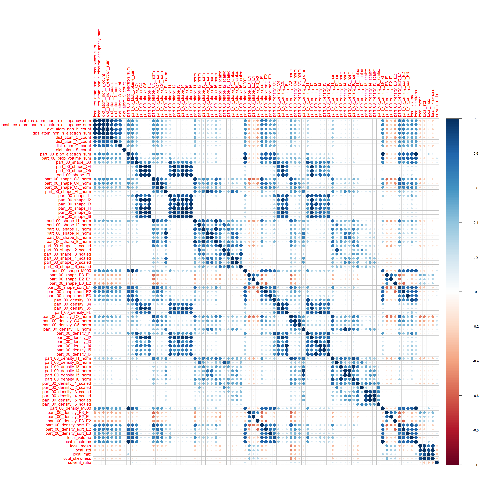 

```r
corrplot(corsMatrix_yellow, method="circle")
```

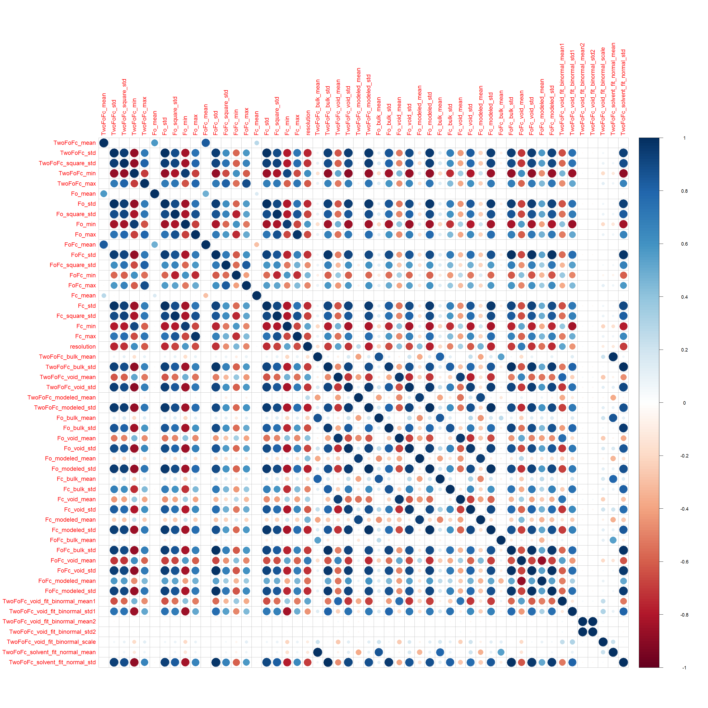 

8. Liczba przykładów dla każdej z klas:

```r
summary(dane$res_name)
```

```
##      ZN     GOL      CA      MG      CL     NAG     PO4     HEM     EDO 
##     849     778     661     402     400     396     301     296     274 
##      MN     ACT     FAD     ADP      FE       K     ATP      CU     PEG 
##     182     167     157     138     120     119     106     104      90 
##     NAP      CD     NAD     MES      NI     FMN     EPE     BME     PG4 
##      86      81      80      79      76      73      72      67      67 
##     TRS     MAN      CO     NDP     SEP     PLP     CIT     GDP     MPD 
##      63      62      61      61      61      59      56      55      55 
##     SAH     FE2     TPO     IOD     SF4     PGE     GLC     DMS     GNP 
##      54      52      50      49      49      48      46      42      41 
##     BOG     PCA     BGC     AMP     GTP     ACY     ANP     BMA     COA 
##      40      40      39      38      37      36      36      36      35 
##     CSD     FES     1PE     FMT      HG      BR     GAL     HEC     CME 
##      35      35      34      34      34      32      32      32      30 
##     UDP     PTR     CSO     NO3     P6G     FUC     H4B     MRD     ACE 
##      30      29      28      28      28      27      27      27      26 
##     FLC     IMD     SAM     SIA     MLI     NDG     LLP     MLY     IPA 
##      26      25      25      24      23      23      22      22      21 
##     KCX     TLA     MAL     PLM     POP     BEN     OCS     SCN     SUC 
##      21      21      19      19      18      17      17      17      17 
##     CAC     DTT     GSH     LMT     NAI     UMP     CRO     NCO (Other) 
##      16      16      16      16      16      16      15      15    4138 
##    NA's 
##     238
```


9. Rozkład liczby atomów (local_res_atom_non_h_count) i elektronów (local_res_atom_non_h_electron_sum):

```r
hist_atom <- ggplot(dane, aes(x=local_res_atom_non_h_count)) + geom_histogram(binwidth=1, fill="red", colour="black")
hist_atom
```

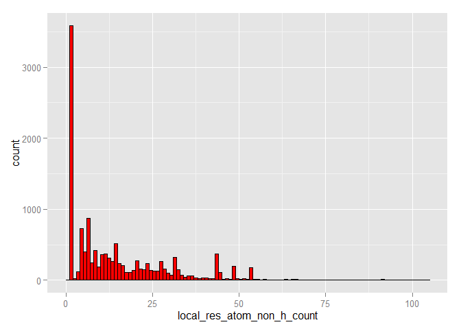 

```r
hist_electron <- ggplot(dane, aes(x=local_res_atom_non_h_electron_sum)) + geom_histogram(binwidth=6, fill="red", colour="black")
hist_electron
```

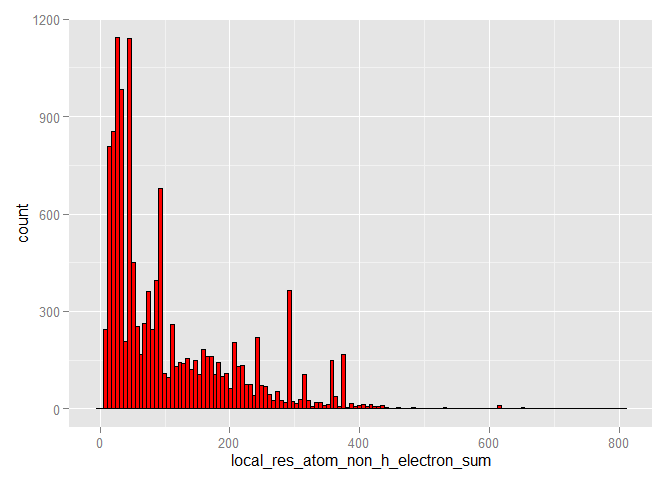 

10. Próba odtworzenia wykresu:

```r
theme_clear <- theme(axis.ticks=element_blank(),
                     panel.background=element_blank(),
                     panel.grid.minor=element_blank(), panel.grid.major=element_blank(), 
                     axis.text.x=element_blank(), axis.text.y=element_blank(),
                     axis.title.x=element_blank(), axis.title.y=element_blank())
               

empty <- ggplot() + geom_point(aes(1,1), colour='white') + theme_clear

scatter <- ggplot(dane, aes(local_res_atom_non_h_electron_sum, local_res_atom_non_h_count)) +
    stat_density2d(geom="tile", aes(fill = ..density..), contour = FALSE )+
    scale_fill_gradientn(colours=rev(rainbow(500, start=0, end=0.75, alpha=0.5))) +
    scale_x_continuous(expand = c(0, 0)) + scale_y_continuous(expand = c(0, 0))+
    theme(
        panel.grid.minor=element_blank(), panel.grid.major=element_blank(), 
        axis.title.x=element_blank(), axis.title.y=element_blank(),
        panel.background=element_rect(fill='white',colour='black'),legend.position = "none")

grid.arrange(
  hist_electron + scale_x_continuous(expand = c(0, 0)) + scale_y_continuous(expand = c(0, 0)) + theme_clear, 
  empty, scatter, 
  hist_atom + coord_flip() + scale_x_continuous(expand = c(0, 0)) + scale_y_continuous(expand = c(0, 0)) + theme_clear,
  ncol=2, nrow=2,widths=c(4,1), heights=c(1,4))
```

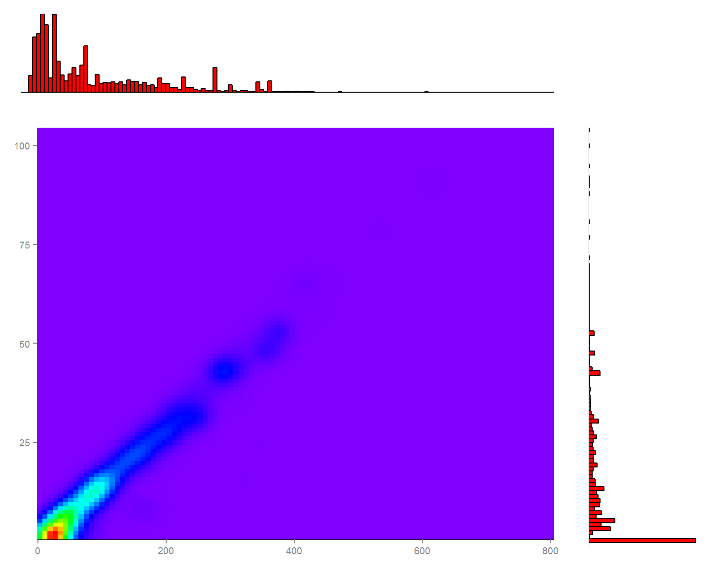 

11.1. 10 klas z największą niezgodnością liczby atomów:


```r
dane_11 <- dane %>% 
    mutate(diff_atom = abs(local_res_atom_non_h_count - dict_atom_non_h_count)) %>% 
    group_by(res_name) %>%
    summarize(
      mean_diff_atom = mean(diff_atom), 
      min_diff_atom = min(diff_atom),
      max_diff_atom = max(diff_atom)
    )
```

Wg średniej:

```r
dane_11 %>% arrange(desc(mean_diff_atom)) %>% select(res_name, mean_diff_atom) %>% head(10)
```

```
## Source: local data frame [10 x 2]
## 
##    res_name mean_diff_atom
##      (fctr)          (dbl)
## 1       PEU       66.50000
## 2       PC1       33.33333
## 3       CPQ       33.00000
## 4       JEF       33.00000
## 5       VV7       33.00000
## 6       M0E       32.00000
## 7       PTY       31.00000
## 8       LI1       29.50000
## 9       IP9       27.00000
## 10      PEF       27.00000
```

Wg min:

```r
dane_11 %>% arrange(desc(min_diff_atom)) %>% select(res_name, min_diff_atom) %>% head(10)
```

```
## Source: local data frame [10 x 2]
## 
##    res_name min_diff_atom
##      (fctr)         (dbl)
## 1       PEU            64
## 2       CPQ            33
## 3       JEF            33
## 4       VV7            33
## 5       M0E            32
## 6       PTY            31
## 7       IP9            27
## 8       LI1            27
## 9       PEF            27
## 10      LP5            26
```

Wg max:

```r
dane_11 %>% arrange(desc(max_diff_atom)) %>% select(res_name, max_diff_atom) %>% head(10)
```

```
## Source: local data frame [10 x 2]
## 
##    res_name max_diff_atom
##      (fctr)         (dbl)
## 1       PEU            69
## 2       CDL            60
## 3       PC1            43
## 4       3TL            33
## 5       CPQ            33
## 6       JEF            33
## 7       PE3            33
## 8       PEE            33
## 9       VV7            33
## 10      LI1            32
```

11.2. 10 klas z największą niezgodnością liczby elektronów:

```r
dane_11 <- dane %>% 
    mutate(diff_electron = abs(local_res_atom_non_h_electron_sum - dict_atom_non_h_electron_sum)) %>%
    group_by(res_name) %>%
    summarize(
      mean_diff_electron = mean(diff_electron), 
      min_diff_electron = min(diff_electron),
      max_diff_electron = max(diff_electron)
    )
```

Wg średniej:

```r
dane_11 %>% arrange(desc(mean_diff_electron)) %>% select(res_name, mean_diff_electron) %>% head(10)
```

```
## Source: local data frame [10 x 2]
## 
##    res_name mean_diff_electron
##      (fctr)              (dbl)
## 1       PEU           443.0000
## 2       CPQ           225.0000
## 3       VV7           224.0000
## 4       JEF           213.0000
## 5       PC1           211.6667
## 6       M0E           196.0000
## 7       PEF           188.0000
## 8       PTY           186.0000
## 9       IP9           185.0000
## 10      LI1           183.0000
```

Wg min:

```r
dane_11 %>% arrange(desc(min_diff_electron)) %>% select(res_name, min_diff_electron) %>% head(10)
```

```
## Source: local data frame [10 x 2]
## 
##    res_name min_diff_electron
##      (fctr)             (dbl)
## 1       PEU               426
## 2       CPQ               225
## 3       VV7               224
## 4       JEF               213
## 5       M0E               196
## 6       PEF               188
## 7       PTY               186
## 8       IP9               185
## 9       LI1               168
## 10      NKP               161
```

Wg max:

```r
dane_11 %>% arrange(desc(max_diff_electron)) %>% select(res_name, max_diff_electron) %>% head(10)
```

```
## Source: local data frame [10 x 2]
## 
##    res_name max_diff_electron
##      (fctr)             (dbl)
## 1       PEU               460
## 2       CDL               360
## 3       PC1               284
## 4       CPQ               225
## 5       PEE               224
## 6       VV7               224
## 7       PE3               222
## 8       B4P               220
## 9       JEF               213
## 10      3TL               211
```

12. Rozkład wartości wszystkich kolumn zaczynających się od part_01 z zaznaczeniem średniej wartości:


```r
cols_part_01 <- select(dane, matches("part_01.*"))

par(mfrow=c(1,3), las=1)

for(i in 1:ncol(cols_part_01)) {
  mx <- mean(cols_part_01[[i]], na.rm = TRUE)
  hist(cols_part_01[[i]], main = paste(colnames(cols_part_01)[i], "\n(avg:", mx, ")", sep=""))
  abline(v = mx, col = "blue", lwd = 2)
}
```

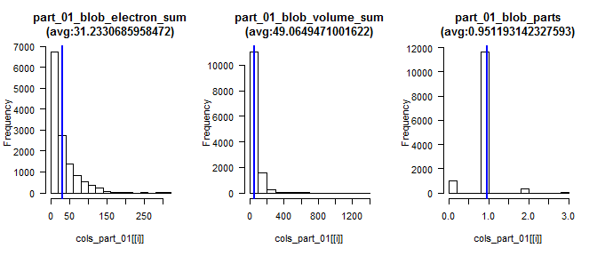 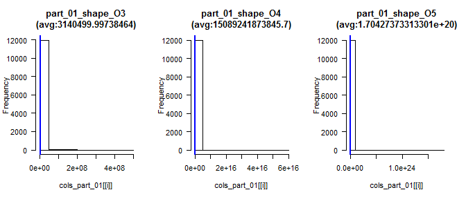 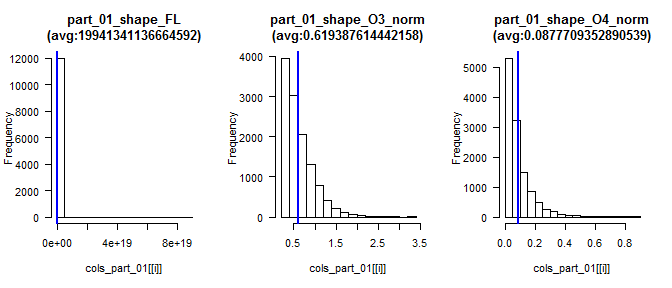 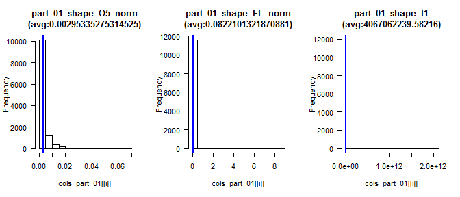 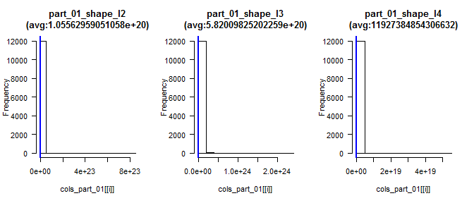 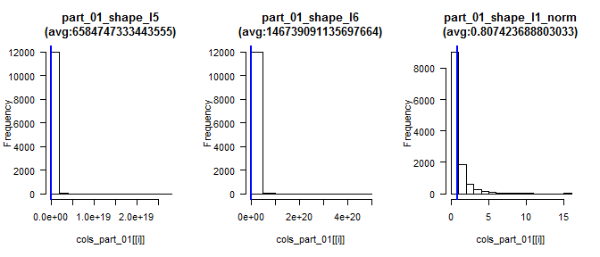 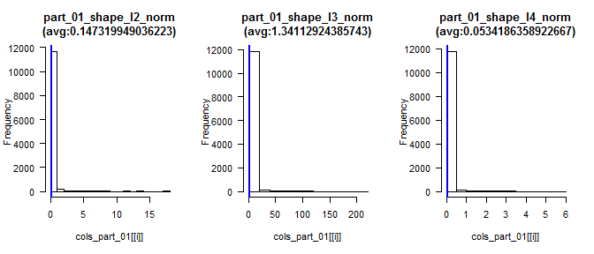 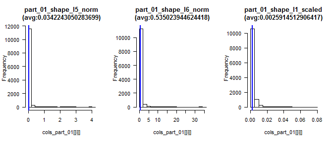 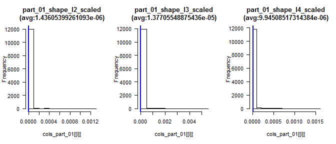 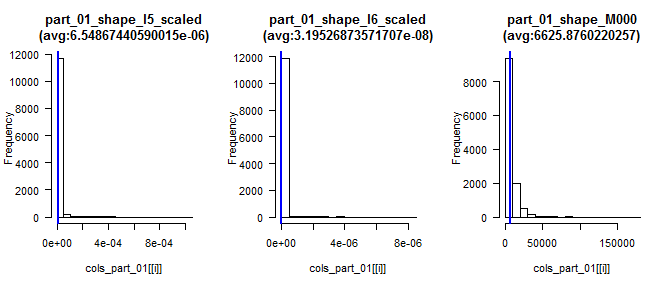 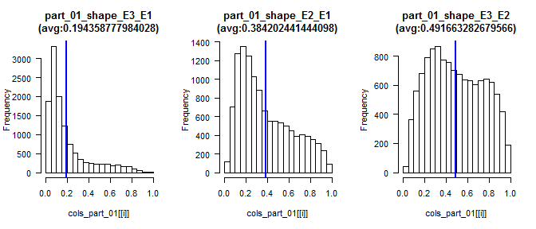 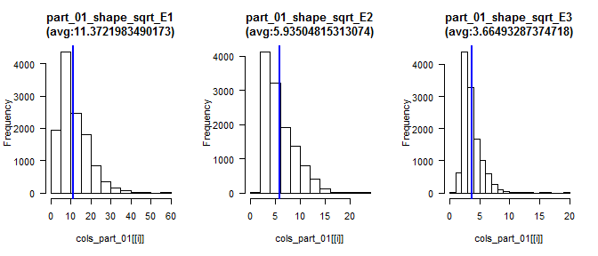 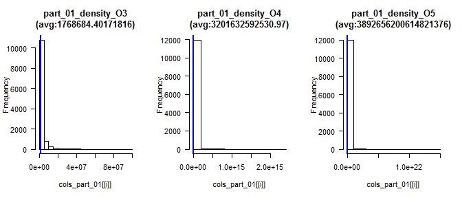 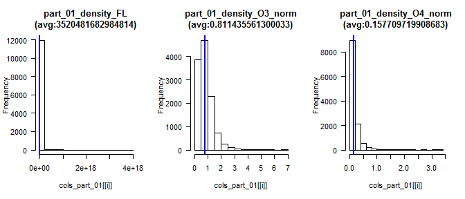 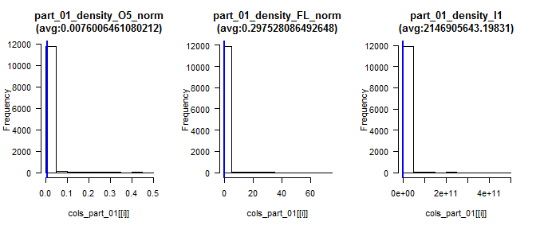 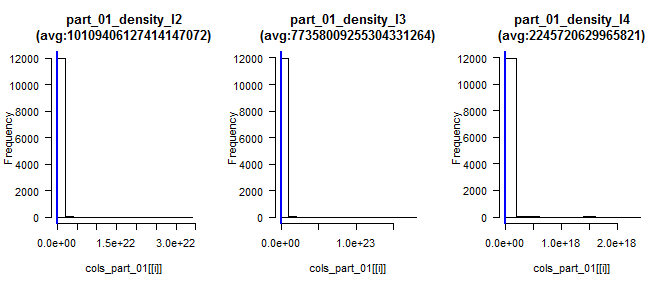 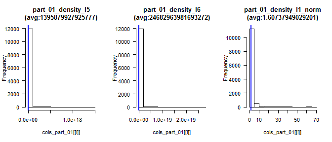 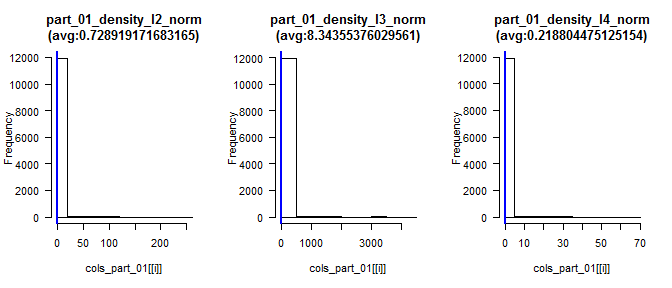 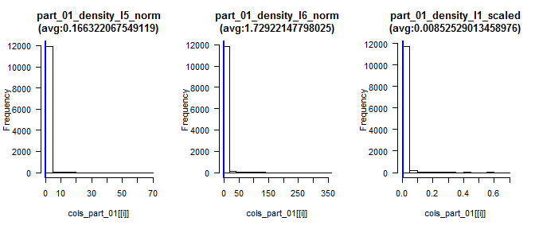 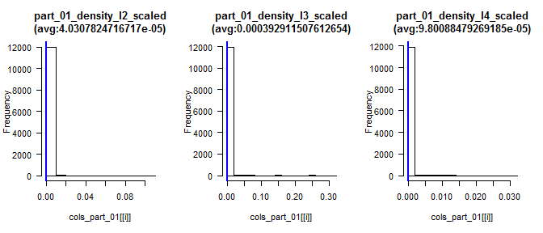 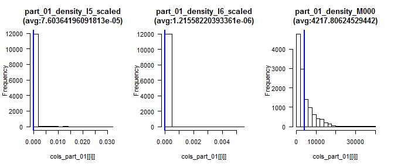 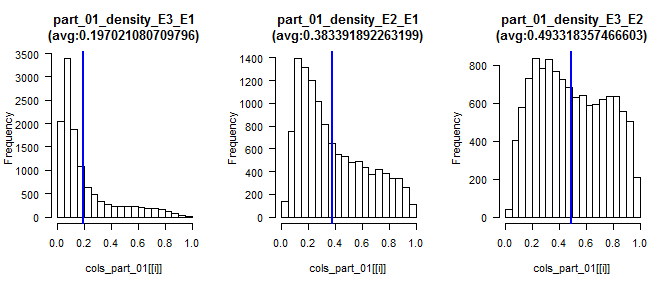 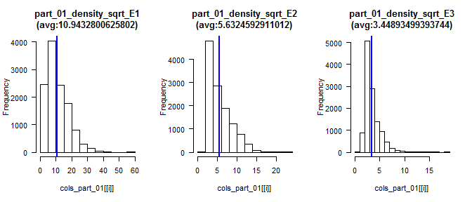 

13. Sekcja sprawdzająca czy na podstawie wartości innych kolumn można przewidzieć liczbę elektronów i atomów oraz z jaką dokładnością można dokonać takiej predykcji; trafność regresji powinna zostać oszacowana na podstawie miar R^2 i RMSE.

13.1 Przewidywanie liczby atomow


```r
dane_13 <- dane %>% dplyr::select(
  local_res_atom_non_h_count, 
  
  local_volume, local_electrons, local_mean, local_std, local_max, local_skewness, local_parts, #green
  solvent_mask_count, void_mask_count, modeled_mask_count, solvent_ratio, #green
  matches("part_00_.*"), #green
  
  #yellow
  TwoFoFc_mean, TwoFoFc_std, TwoFoFc_square_std, TwoFoFc_min, TwoFoFc_max,Fo_mean, Fo_std, Fo_square_std, Fo_min, Fo_max,FoFc_mean, FoFc_std, FoFc_square_std, FoFc_min, FoFc_max,Fc_mean, Fc_std, Fc_square_std, Fc_min, Fc_max,resolution, TwoFoFc_bulk_mean, TwoFoFc_bulk_std, TwoFoFc_void_mean, TwoFoFc_void_std, TwoFoFc_modeled_mean, TwoFoFc_modeled_std,Fo_bulk_mean, Fo_bulk_std, Fo_void_mean, Fo_void_std, Fo_modeled_mean, Fo_modeled_std,Fc_bulk_mean, Fc_bulk_std, Fc_void_mean, Fc_void_std, Fc_modeled_mean, Fc_modeled_std,FoFc_bulk_mean, FoFc_bulk_std, FoFc_void_mean, FoFc_void_std, FoFc_modeled_mean, FoFc_modeled_std,TwoFoFc_void_fit_binormal_mean1, TwoFoFc_void_fit_binormal_std1, TwoFoFc_void_fit_binormal_mean2, TwoFoFc_void_fit_binormal_std2, TwoFoFc_void_fit_binormal_scale, TwoFoFc_solvent_fit_normal_mean, TwoFoFc_solvent_fit_normal_std 
)

dane_13 <- na.omit(dane_13)

inTraining <- 
  createDataPartition(
    y = dane_13$local_res_atom_non_h_count,
    p = .70,
    list = FALSE)

trainingDescr <- select(dane_13[ inTraining,], -local_res_atom_non_h_count)
testingDescr <-  select(dane_13[ -inTraining,], -local_res_atom_non_h_count)
trainingClass <- select(dane_13[ inTraining,], local_res_atom_non_h_count)
testingClass <-  select(dane_13[ -inTraining,], local_res_atom_non_h_count)

gridCtrl <- trainControl(
  method = "repeatedcv",
  number = 10,
  repeats = 3)

rfFit <- train(trainingDescr, 
               trainingClass$local_res_atom_non_h_count, 
               method="rf", 
               metric = "RMSE",
               minimize = TRUE,
               trControl = gridCtrl,
               ntree=20)
```

```
## Loading required package: randomForest
## randomForest 4.6-12
## Type rfNews() to see new features/changes/bug fixes.
## 
## Attaching package: 'randomForest'
## 
## Następujący obiekt został zakryty z 'package:dplyr':
## 
##     combine
```

```r
getTrainPerf(rfFit)
```

```
##   TrainRMSE TrainRsquared method
## 1  9.174351     0.6227195     rf
```

```r
predictedValues <- predict(rfFit, newdata = testingDescr)

plot(testingClass$local_res_atom_non_h_count, predictedValues)
```

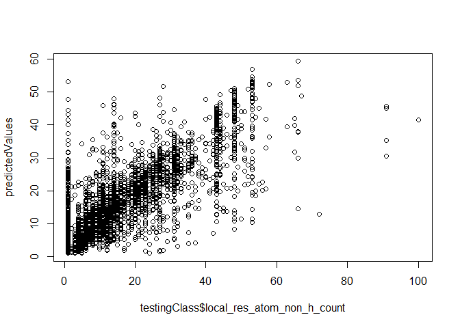 

13.2 Przewidywanie liczby elektronow


```r
dane_13 <- dane %>% dplyr::select(
  local_res_atom_non_h_electron_sum, 
  
  local_volume, local_electrons, local_mean, local_std, local_max, local_skewness, local_parts, #green
  solvent_mask_count, void_mask_count, modeled_mask_count, solvent_ratio, #green
  matches("part_00_.*"), #green
  
  #yellow
  TwoFoFc_mean, TwoFoFc_std, TwoFoFc_square_std, TwoFoFc_min, TwoFoFc_max,Fo_mean, Fo_std, Fo_square_std, Fo_min, Fo_max,FoFc_mean, FoFc_std, FoFc_square_std, FoFc_min, FoFc_max,Fc_mean, Fc_std, Fc_square_std, Fc_min, Fc_max,resolution, TwoFoFc_bulk_mean, TwoFoFc_bulk_std, TwoFoFc_void_mean, TwoFoFc_void_std, TwoFoFc_modeled_mean, TwoFoFc_modeled_std,Fo_bulk_mean, Fo_bulk_std, Fo_void_mean, Fo_void_std, Fo_modeled_mean, Fo_modeled_std,Fc_bulk_mean, Fc_bulk_std, Fc_void_mean, Fc_void_std, Fc_modeled_mean, Fc_modeled_std,FoFc_bulk_mean, FoFc_bulk_std, FoFc_void_mean, FoFc_void_std, FoFc_modeled_mean, FoFc_modeled_std,TwoFoFc_void_fit_binormal_mean1, TwoFoFc_void_fit_binormal_std1, TwoFoFc_void_fit_binormal_mean2, TwoFoFc_void_fit_binormal_std2, TwoFoFc_void_fit_binormal_scale, TwoFoFc_solvent_fit_normal_mean, TwoFoFc_solvent_fit_normal_std 
)

dane_13 <- na.omit(dane_13)

inTraining <- 
  createDataPartition(
    y = dane_13$local_res_atom_non_h_electron_sum,
    p = .70,
    list = FALSE)

trainingDescr <- select(dane_13[ inTraining,], -local_res_atom_non_h_electron_sum)
testingDescr <-  select(dane_13[ -inTraining,], -local_res_atom_non_h_electron_sum)
trainingClass <- select(dane_13[ inTraining,], local_res_atom_non_h_electron_sum)
testingClass <-  select(dane_13[ -inTraining,], local_res_atom_non_h_electron_sum)

gridCtrl <- trainControl(
  method = "repeatedcv",
  number = 10,
  repeats = 3)

rfFit <- train(trainingDescr, 
               trainingClass$local_res_atom_non_h_electron_sum, 
               method="rf", 
               metric = "RMSE",
               minimize = TRUE,
               trControl = gridCtrl,
               ntree=20)

getTrainPerf(rfFit)
```

```
##   TrainRMSE TrainRsquared method
## 1  62.28124     0.6132152     rf
```

```r
predictedValues <- predict(rfFit, newdata = testingDescr)

plot(testingClass$local_res_atom_non_h_electron_sum, predictedValues)
```

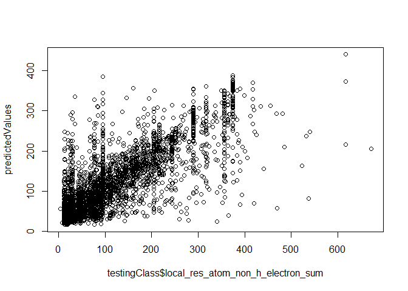 

14. Sekcję próbującą stworzyć klasyfikator przewidujący wartość atrybutu res_name (w tej sekcji należy wykorzystać wiedzę z pozostałych punktów oraz wykonać dodatkowe czynności, które mogą poprawić trafność klasyfikacji); trafność klasyfikacji powinna zostać oszacowana na danych inne niż uczące za pomocą mechanizmu (stratyfikowanej!) oceny krzyżowej lub (stratyfikowanego!) zbioru testowego.


```r
dane_14 <- dane %>% dplyr::select(res_name,
  local_volume, local_electrons, local_mean, local_std, 
  local_max, local_skewness, local_parts,
  solvent_mask_count, void_mask_count, modeled_mask_count, solvent_ratio,
  matches("part_00_.*")
)

dane_14 <- na.omit(dane_14)

# odfiltrowanie rzadkich klas
dane_14 %>% group_by(res_name) %>% summarize(length(local_volume))
```

```
## Source: local data frame [2,641 x 2]
## 
##    res_name length(local_volume)
##      (fctr)                (int)
## 1       006                    1
## 2       010                    1
## 3       017                    3
## 4       01K                    1
## 5       027                    1
## 6       02P                    1
## 7       031                    1
## 8       03P                    1
## 9       03Q                    1
## 10      03R                    1
## ..      ...                  ...
```

```r
df <- (as.data.frame(table(dane_14$res_name)) %>% filter(Freq >= 5))$Var1
df <- as.character(df)
dane_14 <- dane_14 %>% filter(res_name %in% df)

dane_14$res_name <- factor(dane_14$res_name)

inTraining <- 
  createDataPartition(
    y = dane_14$res_name,
    p = .70,
    list = FALSE)

training <- dane_14[ inTraining,]
testing <- dane_14[ -inTraining,]


gridCtrl <- trainControl(
  method = "repeatedcv",
  number = 10,
  repeats = 1)

rfFit <- train(res_name~., 
               data=training, 
               method="rf", 
               trControl = gridCtrl,
               ntree=20)

rfClasses <- predict(rfFit, newdata = testing)

confusionMatrix(data = rfClasses, testing$res_name)
```

```
## Confusion Matrix and Statistics
## 
##           Reference
## Prediction 1PE 2HP 2NC 3DR 5CM 5GP 8OG A23 A2G A3P A8S ABA ACE ACO ACP ACT
##        1PE   2   0   0   0   0   0   0   0   0   0   0   0   0   0   0   0
##        2HP   0   0   0   0   0   0   0   0   0   0   0   0   0   0   0   0
##        2NC   0   0   0   0   0   0   0   0   0   0   0   0   0   0   0   0
##        3DR   0   0   0   0   0   0   0   0   0   0   0   0   0   0   0   0
##        5CM   0   0   0   0   0   0   0   0   0   0   0   0   0   0   0   0
##        5GP   0   0   0   0   0   0   0   0   0   0   0   0   0   0   0   0
##        8OG   0   0   0   0   0   0   0   0   0   0   0   0   0   0   0   0
##        A23   0   0   0   0   0   0   0   0   0   0   0   0   0   0   0   0
##        A2G   0   0   0   0   0   0   0   0   0   0   0   0   0   0   0   0
##        A3P   0   0   0   0   0   0   0   0   0   1   0   0   0   0   0   0
##        A8S   0   0   0   0   0   0   0   0   0   0   1   0   0   0   0   0
##        ABA   0   0   0   0   0   0   0   0   0   0   0   2   0   0   0   0
##        ACE   0   0   0   0   0   0   0   0   0   0   0   0   0   0   0   0
##        ACO   0   0   0   0   0   0   0   0   0   0   0   0   0   0   0   0
##        ACP   0   0   0   0   0   0   0   0   0   0   0   0   0   0   0   0
##        ACT   0   0   0   0   0   0   0   0   0   0   0   0   1   0   0   9
##        ACY   0   0   0   0   0   0   0   0   0   0   0   0   0   0   0   0
##        ADE   0   0   0   0   0   0   0   0   0   0   0   0   0   0   0   0
##        ADN   0   0   0   0   0   0   0   0   0   0   0   0   0   0   0   0
##        ADP   0   0   0   0   0   0   0   0   0   0   0   0   0   0   1   0
##        AGS   0   0   0   0   0   0   0   0   0   0   0   0   0   0   0   0
##        ALY   0   0   0   0   0   0   0   0   0   0   0   0   0   0   0   0
##        AMP   0   0   0   0   0   0   0   0   0   0   0   0   0   0   0   0
##        ANP   0   0   0   0   0   0   0   0   0   0   0   0   0   0   0   0
##        APC   0   0   0   0   0   0   0   0   0   0   0   0   0   0   0   0
##        ATP   0   0   0   0   0   0   0   0   0   0   0   0   0   0   1   1
##        AU    0   0   0   0   0   0   0   0   0   0   0   0   0   0   0   0
##        B12   0   0   0   0   0   0   0   0   0   0   0   0   0   0   0   0
##        BA    0   0   0   0   0   0   0   0   0   0   0   0   0   0   0   0
##        BCL   0   0   0   0   0   0   0   0   0   0   0   0   0   0   0   0
##        BCT   0   0   0   0   0   0   0   0   0   0   0   0   0   0   0   0
##        BDP   0   0   0   0   0   0   0   0   0   0   0   0   0   0   0   0
##        BEN   0   0   0   0   0   0   0   0   0   0   0   0   0   0   0   0
##        BEZ   0   0   0   0   0   0   0   0   0   0   0   0   0   0   0   0
##        BGC   1   0   0   0   0   0   0   0   0   0   0   0   0   0   0   0
##        BHG   0   0   0   0   0   0   0   0   0   0   0   0   0   0   0   0
##        BMA   0   0   0   0   0   0   0   0   0   0   0   0   0   0   0   0
##        BME   0   0   0   0   0   0   0   0   0   0   0   0   0   0   0   0
##        BOG   0   0   0   0   0   0   0   0   0   0   0   0   0   0   0   0
##        BPH   0   0   0   0   0   0   0   0   0   0   0   0   0   0   0   0
##        BR    0   0   0   0   0   0   0   0   0   0   0   0   0   0   0   0
##        BRU   0   0   0   0   0   0   0   0   0   0   0   0   0   0   0   0
##        BTB   0   0   0   0   0   0   0   0   0   0   0   0   0   0   0   0
##        BTN   0   0   0   0   0   0   0   0   0   0   0   0   0   0   0   0
##        C2E   0   0   0   0   0   0   0   0   0   0   0   0   0   0   0   0
##        C2F   0   0   0   0   0   0   0   0   0   0   0   0   0   0   0   0
##        C5P   0   0   0   0   0   0   0   0   0   0   0   0   0   0   0   0
##        C8E   0   0   0   0   0   0   0   0   0   0   0   0   0   0   0   0
##        CA    0   0   0   1   0   0   0   0   0   0   0   0   0   0   0   1
##        CAC   0   0   0   0   0   0   0   0   0   0   0   0   0   0   0   0
##        CAD   0   0   0   0   0   0   0   0   0   0   0   0   0   0   0   0
##        CAM   0   0   0   0   0   0   0   0   0   0   0   0   0   0   0   0
##        CAS   0   0   0   0   0   0   0   0   0   0   0   0   0   0   0   0
##        CB3   0   0   0   0   0   0   0   0   0   0   0   0   0   0   0   0
##        CCC   0   0   0   0   0   0   0   0   0   0   0   0   0   0   0   0
##        CD    0   0   0   0   0   0   0   0   0   0   0   0   0   0   0   0
##        CDL   0   0   0   0   0   0   0   0   0   0   0   0   0   0   0   0
##        CIR   0   0   0   0   0   0   0   0   0   0   0   0   0   0   0   0
##        CIT   0   0   0   0   0   0   0   0   0   0   0   0   0   0   0   0
##        CL    0   0   0   0   0   0   0   0   0   0   0   0   1   0   0   8
##        CME   0   0   0   0   0   0   0   0   0   0   0   0   0   0   0   0
##        CMP   0   0   0   0   0   0   0   0   0   0   0   0   0   0   0   0
##        CO    0   0   0   0   0   0   0   0   0   0   0   0   0   0   0   0
##        CO3   0   0   0   0   0   0   0   0   0   0   0   0   0   0   0   0
##        COA   0   0   0   0   0   0   0   0   0   0   0   0   0   0   0   0
##        CPT   0   0   0   0   0   0   0   0   0   0   0   0   0   0   0   0
##        CR2   0   0   0   0   0   0   0   0   0   0   0   0   0   0   0   0
##        CRO   0   0   0   0   0   0   0   0   0   0   0   0   0   0   0   0
##        CS    0   0   0   0   0   0   0   0   0   0   0   0   0   0   0   0
##        CSD   0   0   0   0   0   0   0   0   0   0   0   0   0   0   0   0
##        CSO   0   0   0   0   0   0   0   0   0   0   0   0   0   0   0   0
##        CSS   0   0   0   0   0   0   0   0   0   0   0   0   0   0   0   0
##        CSX   0   0   0   0   0   0   0   0   0   0   0   0   0   0   0   0
##        CTP   0   0   0   0   0   0   1   0   0   0   0   0   0   0   0   0
##        CU    0   0   0   0   1   0   0   0   0   0   0   0   0   0   0   0
##        CU1   0   0   0   0   0   0   0   0   0   0   0   0   0   0   0   0
##        CUA   0   0   0   0   0   0   0   0   0   0   0   0   0   0   0   0
##        DAL   0   0   0   0   0   0   0   0   0   0   0   0   0   0   0   0
##        DCP   0   0   0   0   0   0   0   0   0   0   0   0   0   0   0   0
##        DGT   0   0   0   0   0   0   0   0   0   0   0   0   0   0   0   0
##        DHE   0   0   0   0   0   0   0   0   0   0   0   0   0   0   0   0
##        DHT   0   0   0   0   0   0   0   0   0   0   0   0   0   0   0   0
##        DIO   0   0   0   0   0   0   0   0   0   0   0   0   0   0   0   0
##        DMS   0   0   0   0   0   0   0   0   0   0   0   0   0   0   0   1
##        DMU   0   0   0   0   0   0   0   0   0   0   0   0   0   0   0   0
##        DOC   0   0   0   0   0   0   0   0   0   0   0   0   0   0   0   0
##        DTP   0   0   0   0   0   0   0   0   0   0   0   0   0   0   0   0
##        DTT   0   0   0   0   0   0   0   0   0   0   0   0   0   0   0   0
##        EDO   0   0   0   0   0   0   0   0   0   0   0   0   0   0   0   7
##        EPE   0   0   0   0   0   0   0   0   0   0   0   0   0   0   0   0
##        F3S   0   0   0   0   0   0   0   0   0   0   0   0   0   0   0   0
##        F6P   0   0   0   0   0   0   0   0   0   0   0   0   0   0   0   0
##        FAD   0   0   0   0   0   0   0   0   0   0   0   0   0   1   0   0
##        FBP   0   0   0   0   0   0   0   0   0   0   0   0   0   0   0   0
##        FE    0   0   0   0   0   0   0   0   0   0   0   0   0   0   0   0
##        FE2   0   0   0   0   0   0   0   0   0   0   0   0   0   0   0   0
##        FES   0   0   0   0   0   0   0   0   0   0   0   0   0   0   0   0
##        FLC   0   0   0   0   0   0   0   0   0   0   0   0   0   0   0   0
##        FME   0   0   0   0   0   0   0   0   0   0   0   0   0   0   0   0
##        FMN   0   0   0   0   0   1   1   0   0   0   0   0   0   0   0   0
##        FMT   0   0   0   0   0   0   0   0   0   0   0   0   0   0   0   0
##        FOL   0   0   0   0   0   0   0   0   0   0   0   0   0   0   0   0
##        FUC   0   0   0   0   0   0   0   0   0   0   0   0   0   0   0   0
##        GAL   0   0   0   0   0   0   0   0   0   0   0   0   0   0   0   0
##        GDP   0   0   0   0   0   0   0   0   0   0   0   0   0   0   0   0
##        GLA   0   0   0   0   0   0   0   0   0   0   0   0   0   0   0   0
##        GLC   0   0   0   0   0   0   0   0   0   0   0   0   0   0   0   0
##        GNP   0   0   0   0   0   0   0   0   0   0   0   0   0   0   0   0
##        GOL   1   0   0   0   0   0   0   0   0   0   0   1   2   0   0  13
##        GPP   0   0   0   0   0   0   0   0   0   0   0   0   0   0   0   0
##        GSH   0   0   0   0   0   0   0   0   0   0   0   0   0   0   0   0
##        GSP   0   0   0   0   0   0   0   0   0   0   0   0   0   0   0   0
##        GSW   0   0   0   0   0   0   0   0   0   0   0   0   0   0   0   0
##        GTP   0   0   0   0   0   0   0   0   0   0   0   0   0   0   0   0
##        GTT   1   0   0   0   0   0   0   0   0   0   0   0   0   0   0   0
##        GTX   0   0   0   0   0   0   0   0   0   0   0   0   0   0   0   0
##        H4B   0   0   0   0   0   0   0   0   0   0   0   0   0   0   0   0
##        HC4   0   0   0   0   0   0   0   0   0   0   0   0   0   0   0   0
##        HEC   0   0   0   0   0   0   0   0   0   0   0   0   0   0   0   0
##        HED   0   0   0   0   0   0   0   0   0   0   0   0   0   0   0   0
##        HEM   0   0   0   0   0   0   0   1   0   0   0   0   0   0   0   0
##        HEZ   0   0   0   0   0   0   0   0   0   0   0   0   0   0   0   0
##        HG    0   0   0   0   0   0   0   0   0   0   0   0   0   0   0   0
##        HIC   0   0   0   0   0   0   0   0   0   0   0   0   0   0   0   0
##        HYP   0   0   0   0   0   0   0   0   0   0   0   0   0   0   0   0
##        IDS   0   0   0   0   0   0   0   0   0   0   0   0   0   0   0   0
##        IHP   0   0   0   0   0   0   0   0   0   0   0   0   0   0   0   0
##        IMD   0   0   0   0   0   0   0   0   0   0   0   0   0   0   0   0
##        IMP   0   0   0   0   0   0   0   0   0   0   0   0   0   0   0   0
##        IOD   0   0   0   0   0   0   0   0   0   0   0   0   0   0   0   0
##        IPA   0   0   0   0   0   0   0   0   0   0   0   0   0   0   0   0
##        IPH   0   0   0   0   0   0   0   0   0   0   0   0   0   0   0   0
##        K     0   0   0   0   0   0   0   0   0   0   0   0   0   0   0   0
##        KAI   0   0   0   0   0   0   0   0   0   0   0   0   0   0   0   0
##        KCX   0   0   0   0   0   0   0   0   0   0   0   0   0   0   0   0
##        LAT   0   0   0   0   0   0   0   0   0   0   0   0   0   0   0   0
##        LDA   0   0   0   0   0   0   0   0   0   0   0   0   0   0   0   0
##        LLP   0   0   0   0   0   0   0   0   0   0   0   0   0   0   0   0
##        LMT   0   0   0   0   0   0   0   0   0   0   0   0   0   0   0   0
##        M3L   0   0   0   0   0   0   0   0   0   0   0   0   0   0   0   0
##        MAL   0   0   0   0   0   0   0   0   0   0   0   0   0   0   0   0
##        MAN   0   0   0   0   0   0   0   0   0   0   0   0   0   0   0   0
##        MBO   0   0   0   0   0   0   0   0   0   0   0   0   0   0   0   0
##        MES   0   0   0   0   0   0   0   0   0   0   0   0   0   0   0   0
##        MG    1   0   0   0   0   0   0   0   1   0   0   0   1   0   0   2
##        MLA   0   0   0   0   0   0   0   0   0   0   0   0   0   0   0   0
##        MLE   0   0   0   0   0   0   0   0   0   0   0   0   0   0   0   0
##        MLI   0   0   0   0   0   0   0   0   0   0   0   0   0   0   0   0
##        MLY   0   0   0   0   0   0   0   0   0   0   0   0   0   0   0   0
##        MLZ   0   0   0   0   0   0   0   0   0   0   0   0   0   0   0   0
##        MN    0   0   0   0   0   0   0   0   0   0   0   0   0   0   0   0
##        MPD   0   0   0   0   0   0   0   0   0   0   0   0   0   0   0   1
##        MRD   0   0   0   0   0   0   0   0   0   0   0   0   0   0   0   0
##        MRG   0   0   0   0   0   0   0   0   0   0   0   0   0   0   0   0
##        MTX   0   0   0   0   0   0   0   0   0   0   0   0   0   0   0   0
##        NAD   0   0   0   0   0   0   0   0   0   0   0   0   0   0   0   0
##        NAG   0   0   1   0   0   0   2   0   1   0   0   0   0   0   0   0
##        NAI   0   0   0   0   0   0   0   0   0   0   0   0   0   0   0   0
##        NAP   0   0   0   0   0   0   0   0   1   0   0   0   0   1   0   0
##        NCO   0   0   0   0   0   0   0   0   0   0   0   0   0   0   0   0
##        NDG   0   0   0   0   0   0   0   0   0   0   0   0   0   0   0   0
##        NDP   0   0   0   0   0   0   0   0   0   0   0   0   0   1   0   0
##        NGT   0   0   0   0   0   0   0   0   0   0   0   0   0   0   0   0
##        NHE   0   0   0   0   0   0   0   0   0   0   0   0   0   0   0   1
##        NI    0   0   0   0   0   0   0   0   0   0   0   0   0   0   0   0
##        NLE   0   0   0   0   0   0   0   0   0   0   0   0   0   0   0   0
##        NO3   0   0   0   0   0   0   0   0   0   0   0   0   0   0   0   1
##        NRQ   0   0   0   0   0   0   0   0   0   0   0   0   0   0   0   0
##        OCS   0   0   0   0   0   0   0   0   0   0   0   0   0   0   0   0
##        OLC   0   0   0   0   0   0   0   0   0   0   0   0   0   0   0   0
##        P6G   1   0   0   0   0   0   0   0   0   0   0   0   0   0   0   0
##        PCA   0   0   0   0   0   0   0   0   0   0   0   0   0   0   0   0
##        PE4   0   0   0   0   0   0   0   0   0   0   0   0   0   0   0   0
##        PEG   1   0   0   0   0   0   0   0   0   0   0   0   0   0   0   1
##        PEP   0   0   0   0   0   0   0   0   0   0   0   0   0   0   0   0
##        PG4   1   0   0   0   0   0   0   0   0   0   0   0   0   0   0   0
##        PGA   0   0   0   0   0   0   0   0   0   0   0   0   0   0   0   0
##        PGE   0   0   0   0   0   0   0   0   0   0   0   0   0   0   0   0
##        PGV   0   0   0   0   0   0   0   0   0   0   0   0   0   0   0   0
##        PLM   0   0   0   0   0   0   0   0   0   0   0   0   0   0   0   0
##        PLP   0   0   0   0   0   0   0   0   0   0   0   0   0   0   0   0
##        PO4   0   1   0   0   0   0   0   0   0   0   0   0   0   0   0   0
##        POP   0   0   0   0   0   0   0   0   0   0   0   0   0   0   0   0
##        PSU   0   0   0   0   0   0   0   0   0   0   0   0   0   0   0   0
##        PT    0   0   0   0   0   0   0   0   0   0   0   0   0   0   0   0
##        PTR   0   0   0   0   0   0   0   0   0   0   0   0   0   0   0   0
##        PYR   0   0   0   0   0   0   0   0   0   0   0   0   0   0   0   0
##        RET   0   0   0   0   0   0   0   0   0   0   0   0   0   0   0   0
##        S9L   0   0   0   0   0   0   0   0   0   0   0   0   0   0   0   0
##        SAH   0   0   0   0   0   0   0   0   0   0   0   0   0   0   0   0
##        SAM   0   0   0   0   0   0   0   0   0   0   0   0   0   0   0   0
##        SCN   0   0   0   0   0   0   0   0   0   0   0   0   0   0   0   0
##        SEP   0   0   0   0   0   0   0   0   0   0   0   0   0   0   0   0
##        SF4   0   0   0   0   0   0   0   0   0   0   0   0   0   0   0   0
##        SGN   0   0   0   0   0   0   0   0   0   0   0   0   0   0   0   0
##        SIA   0   0   0   0   0   0   0   0   0   0   0   0   0   0   0   0
##        SIN   0   0   0   0   0   0   0   0   0   0   0   0   0   0   0   0
##        SNC   0   0   0   0   0   0   0   0   0   0   0   0   0   0   0   0
##        SR    0   0   0   0   0   0   0   0   0   0   0   0   0   0   0   0
##        SRM   0   0   0   0   0   0   0   0   0   0   0   0   0   0   0   0
##        SRT   0   0   0   0   0   0   0   0   0   0   0   0   0   0   0   0
##        STU   0   0   0   0   0   0   0   0   0   0   0   0   0   0   0   0
##        SUC   0   0   0   0   0   0   0   0   0   0   0   0   0   0   0   0
##        TAM   0   0   0   0   0   0   0   0   0   0   0   0   0   0   0   0
##        TAR   0   0   0   0   0   0   0   0   0   0   0   0   0   0   0   0
##        TES   0   0   0   0   0   0   0   0   0   0   0   0   0   0   0   0
##        THP   0   0   0   0   0   0   0   0   0   0   0   0   0   0   0   0
##        TL    0   0   0   0   0   0   0   0   0   0   0   0   0   0   0   0
##        TLA   0   0   0   0   0   0   0   0   0   0   0   0   0   0   0   0
##        TPO   0   0   0   0   0   0   0   0   0   0   0   0   0   0   0   0
##        TPP   0   0   0   0   0   0   0   0   0   0   0   0   0   0   0   0
##        TRS   0   0   0   0   0   0   0   0   0   0   0   0   0   0   0   0
##        TTP   0   0   0   0   0   0   0   0   0   0   0   0   0   0   0   0
##        TYS   0   0   0   0   0   0   0   0   0   0   0   0   0   0   0   0
##        U10   0   0   0   0   0   0   0   0   0   0   0   0   0   0   0   0
##        U5P   0   0   0   0   0   0   0   0   0   0   0   0   0   0   0   0
##        UDP   0   0   0   0   0   0   0   0   0   0   0   0   0   0   0   0
##        UMP   0   0   0   0   0   0   0   0   0   0   0   0   0   0   0   0
##        UMQ   0   0   0   0   0   0   0   0   0   0   0   0   0   0   0   0
##        UPG   0   0   0   0   0   0   0   0   0   0   0   0   0   0   0   0
##        UTP   0   0   0   0   0   0   0   0   0   0   0   0   0   0   0   0
##        VO4   0   0   0   0   0   0   0   0   0   0   0   0   0   0   0   0
##        XE    0   0   0   0   0   0   0   0   0   0   0   0   0   0   0   0
##        XYP   0   0   0   0   0   0   0   0   0   0   0   0   0   0   0   0
##        XYS   0   0   0   0   0   0   0   0   0   0   0   0   0   0   0   0
##        YB    0   0   0   0   0   0   0   0   0   0   0   0   0   0   0   0
##        YCM   0   0   0   0   0   0   0   0   0   0   0   0   0   0   0   0
##        ZN    0   0   0   1   1   0   0   0   0   0   0   0   0   0   0   0
##           Reference
## Prediction ACY ADE ADN ADP AGS ALY AMP ANP APC ATP  AU B12  BA BCL BCT BDP
##        1PE   0   0   0   0   0   0   0   0   0   0   0   0   0   0   0   0
##        2HP   0   0   0   0   0   0   0   0   0   0   0   0   0   0   0   0
##        2NC   0   0   0   0   0   0   0   0   0   0   0   0   0   0   0   0
##        3DR   0   0   0   0   0   0   0   0   0   0   0   0   0   0   0   0
##        5CM   0   0   0   0   0   0   0   0   0   0   0   0   0   0   0   0
##        5GP   0   0   0   0   0   0   0   0   0   0   0   0   0   0   0   0
##        8OG   0   0   0   0   0   0   0   0   0   0   0   0   0   0   0   0
##        A23   0   0   0   0   0   0   0   0   0   0   0   0   0   0   0   0
##        A2G   0   0   0   0   0   0   0   0   0   0   0   0   0   0   0   0
##        A3P   0   0   0   0   0   0   0   0   0   0   0   0   0   0   0   0
##        A8S   0   0   0   0   0   0   0   0   0   0   0   0   0   0   0   0
##        ABA   0   1   0   0   0   0   0   0   0   0   0   0   0   0   0   0
##        ACE   0   0   0   0   0   0   0   0   0   0   0   0   0   0   0   0
##        ACO   0   0   0   0   0   0   0   0   0   0   0   0   0   0   0   0
##        ACP   0   0   0   0   0   0   0   0   0   0   0   0   0   0   0   0
##        ACT   1   0   0   0   0   0   0   0   0   0   0   0   0   0   1   0
##        ACY   0   0   0   0   0   0   0   0   0   0   0   0   0   0   0   0
##        ADE   0   0   0   0   0   0   0   0   0   0   0   0   0   0   0   0
##        ADN   0   0   0   0   0   0   0   0   0   0   0   0   0   0   0   0
##        ADP   0   0   0   9   1   0   0   1   0   6   0   0   0   0   0   0
##        AGS   0   0   0   0   0   0   0   0   0   0   0   0   0   0   0   0
##        ALY   0   0   0   0   0   1   0   0   0   0   0   0   0   0   0   0
##        AMP   0   0   0   1   0   0   1   1   0   0   0   0   0   0   0   0
##        ANP   0   0   0   1   0   0   0   0   0   1   0   0   0   0   0   0
##        APC   0   0   0   0   0   0   0   0   0   0   0   0   0   0   0   0
##        ATP   0   0   0   4   0   0   0   1   0   8   0   0   0   0   0   0
##        AU    0   0   0   0   0   0   0   0   0   0   0   0   0   0   0   0
##        B12   0   0   0   0   0   0   0   0   0   0   0   1   0   0   0   0
##        BA    0   0   0   0   0   0   0   0   0   0   0   0   0   0   0   0
##        BCL   0   0   0   0   0   0   0   0   0   0   0   0   0   2   0   0
##        BCT   0   0   0   0   0   0   0   0   0   0   0   0   0   0   0   0
##        BDP   0   0   0   0   0   0   0   0   0   0   0   0   0   0   0   0
##        BEN   0   0   0   0   0   0   0   0   0   0   0   0   0   0   0   0
##        BEZ   0   0   0   0   0   0   0   0   0   0   0   0   0   0   0   0
##        BGC   0   0   0   0   0   0   0   0   0   0   0   0   0   0   0   0
##        BHG   0   0   0   0   0   0   0   0   0   0   0   0   0   0   0   0
##        BMA   0   0   0   0   0   0   0   0   0   0   0   0   0   0   0   0
##        BME   0   0   0   0   0   0   0   0   0   0   0   0   0   0   0   0
##        BOG   0   0   0   1   0   0   0   0   0   0   0   0   0   0   0   0
##        BPH   0   0   0   0   0   0   0   0   0   0   0   0   0   0   0   0
##        BR    0   0   0   0   0   0   0   0   0   0   0   0   0   0   0   0
##        BRU   0   0   0   0   0   0   0   0   0   0   0   0   0   0   0   0
##        BTB   0   0   0   0   0   0   0   0   0   0   0   0   0   0   0   0
##        BTN   0   0   0   0   0   0   0   0   0   0   0   0   0   0   0   0
##        C2E   0   0   0   0   0   0   0   0   0   0   0   0   0   0   0   0
##        C2F   0   0   0   0   0   0   0   0   0   0   0   0   0   0   0   0
##        C5P   0   0   0   0   0   0   0   0   0   0   0   0   0   0   0   0
##        C8E   0   0   0   0   0   0   0   0   0   0   0   0   0   0   0   0
##        CA    0   0   1   0   0   0   0   0   0   1   0   0   0   0   0   0
##        CAC   0   0   0   0   0   0   0   0   0   0   0   0   0   0   0   0
##        CAD   0   0   0   0   0   0   0   0   0   0   0   0   0   0   0   0
##        CAM   0   0   0   0   0   0   0   0   0   0   0   0   0   0   0   0
##        CAS   0   0   0   0   0   0   0   0   0   0   0   0   0   0   0   0
##        CB3   0   0   0   0   0   0   0   0   0   0   0   0   0   0   0   0
##        CCC   0   0   0   0   0   0   0   0   0   0   0   0   0   0   0   0
##        CD    0   0   0   0   0   0   0   0   0   0   0   0   0   0   0   0
##        CDL   0   0   0   0   0   0   0   0   0   0   0   0   0   0   0   0
##        CIR   0   0   0   0   0   0   0   0   0   0   0   0   0   0   0   0
##        CIT   0   0   0   0   0   0   0   0   0   0   0   0   0   0   0   0
##        CL    1   0   0   1   0   0   0   0   0   0   0   0   0   0   0   0
##        CME   0   0   0   0   0   0   0   0   0   0   0   0   0   0   0   0
##        CMP   0   0   0   0   0   0   0   0   0   0   0   0   0   0   0   0
##        CO    0   0   0   0   0   0   0   0   0   0   0   0   0   0   0   0
##        CO3   0   0   0   0   0   0   0   0   0   0   0   0   0   0   0   0
##        COA   0   0   0   0   0   0   0   1   0   0   0   0   0   0   0   0
##        CPT   0   0   0   0   0   0   0   0   0   0   0   0   0   0   0   0
##        CR2   0   0   0   0   0   0   0   0   0   0   0   0   0   0   0   0
##        CRO   0   0   0   0   0   0   0   1   0   0   0   0   0   0   0   0
##        CS    0   0   0   0   0   0   0   0   0   0   0   0   0   0   0   0
##        CSD   0   0   0   0   0   0   0   0   0   0   0   0   0   0   0   0
##        CSO   0   0   0   0   0   0   0   0   0   0   0   0   0   0   0   0
##        CSS   0   0   0   0   0   0   0   0   0   0   0   0   0   0   0   0
##        CSX   0   0   0   0   0   0   0   0   0   0   0   0   0   0   0   0
##        CTP   0   0   0   0   0   0   0   0   0   0   0   0   0   0   0   0
##        CU    0   0   0   0   0   0   0   0   0   0   0   0   0   0   0   0
##        CU1   0   0   0   0   0   0   0   0   0   0   0   0   0   0   0   0
##        CUA   0   0   0   0   0   0   0   0   0   0   0   0   0   0   0   0
##        DAL   0   0   0   0   0   0   0   0   0   0   0   0   0   0   0   0
##        DCP   0   0   0   0   0   0   0   0   0   0   0   0   0   0   0   0
##        DGT   0   0   0   0   0   0   0   0   0   0   0   0   0   0   0   0
##        DHE   0   0   0   0   0   0   0   0   0   0   0   0   0   0   0   0
##        DHT   0   0   0   0   0   0   0   0   0   0   0   0   0   0   0   0
##        DIO   0   0   0   0   0   0   0   0   0   0   0   0   0   0   0   0
##        DMS   0   0   0   0   0   0   0   0   0   0   0   0   0   0   0   0
##        DMU   0   0   0   0   0   0   0   0   0   0   0   0   0   0   0   0
##        DOC   0   0   0   0   0   0   0   0   0   0   0   0   0   0   0   0
##        DTP   0   0   0   0   0   0   0   0   0   0   0   0   0   0   0   0
##        DTT   0   0   0   0   0   0   0   0   0   0   0   0   0   0   0   0
##        EDO   2   0   0   0   0   0   0   0   0   0   0   0   0   0   0   0
##        EPE   0   0   0   0   0   0   0   0   0   0   0   0   0   0   0   0
##        F3S   0   0   0   0   0   0   0   0   0   0   0   0   0   0   0   0
##        F6P   0   0   0   0   0   0   0   0   0   0   0   0   0   0   0   0
##        FAD   0   0   0   0   0   0   0   0   0   0   0   0   0   0   0   0
##        FBP   0   0   0   0   0   0   0   0   0   0   0   0   0   0   0   0
##        FE    0   0   0   0   0   0   0   0   1   0   0   0   0   0   0   0
##        FE2   0   0   0   0   0   0   0   0   0   0   0   0   0   0   0   0
##        FES   0   0   0   0   0   0   0   0   0   0   0   0   0   0   0   0
##        FLC   0   0   0   0   0   0   0   1   0   0   0   0   0   0   0   0
##        FME   0   0   0   0   0   0   0   0   0   0   0   0   0   0   0   0
##        FMN   0   0   0   1   0   0   0   0   0   1   0   0   0   0   0   0
##        FMT   0   0   0   0   0   0   0   0   0   0   0   0   0   0   0   0
##        FOL   0   0   0   0   0   0   0   0   0   0   0   0   0   0   0   0
##        FUC   0   0   0   0   0   0   0   0   0   0   0   0   0   0   0   0
##        GAL   0   0   0   0   0   0   0   0   0   0   0   0   0   0   0   0
##        GDP   0   0   0   4   0   0   0   2   0   0   0   0   0   0   0   0
##        GLA   0   0   0   0   0   0   1   0   0   0   0   0   0   0   0   0
##        GLC   0   0   0   1   0   0   0   0   0   0   0   0   0   0   0   0
##        GNP   0   0   0   1   0   0   0   0   0   1   0   0   0   0   0   0
##        GOL   3   0   0   4   0   0   1   0   0   0   0   0   0   0   0   0
##        GPP   0   0   0   0   0   0   0   0   0   0   0   0   0   0   0   0
##        GSH   0   0   0   0   0   0   0   0   0   0   0   0   0   0   0   0
##        GSP   0   0   0   0   0   0   0   0   0   0   0   0   0   0   0   0
##        GSW   0   0   0   0   0   0   0   0   0   0   0   0   0   0   0   0
##        GTP   0   0   0   1   0   0   0   0   0   0   0   0   0   0   0   0
##        GTT   0   0   0   0   0   0   0   0   0   0   0   0   0   0   0   0
##        GTX   0   0   0   0   0   0   0   0   0   0   0   0   0   0   0   0
##        H4B   0   0   0   0   0   0   0   0   0   0   0   0   0   0   0   0
##        HC4   0   0   0   0   0   0   0   0   0   0   0   0   0   0   0   0
##        HEC   0   0   0   0   0   0   0   0   0   0   0   0   0   0   0   0
##        HED   0   0   0   0   0   0   0   0   0   0   0   0   0   0   0   0
##        HEM   0   0   0   0   0   0   0   0   0   3   0   1   0   0   0   0
##        HEZ   0   0   0   0   0   0   0   0   0   0   0   0   0   0   0   0
##        HG    0   0   0   0   0   0   0   0   0   0   0   0   0   0   0   0
##        HIC   0   0   0   0   0   0   0   0   0   0   0   0   0   0   0   0
##        HYP   0   0   0   0   0   0   0   0   0   0   0   0   0   0   0   0
##        IDS   0   0   0   0   0   0   0   0   0   0   0   0   0   0   0   0
##        IHP   0   0   0   0   0   0   0   0   0   0   0   0   0   0   0   0
##        IMD   0   0   0   0   0   0   0   0   0   0   0   0   0   0   0   0
##        IMP   0   0   0   0   0   0   0   0   0   0   0   0   0   0   0   0
##        IOD   0   0   0   0   0   0   0   0   0   0   0   0   0   0   0   0
##        IPA   0   0   0   0   0   0   0   0   0   0   0   0   0   0   0   0
##        IPH   0   0   0   0   0   0   0   0   0   0   0   0   0   0   0   0
##        K     0   0   0   0   0   0   0   0   0   0   0   0   0   0   0   0
##        KAI   0   0   0   0   0   0   0   0   0   0   0   0   0   0   0   0
##        KCX   0   0   0   0   0   0   0   0   0   0   0   0   0   0   0   0
##        LAT   0   0   0   0   0   0   0   0   0   0   0   0   0   0   0   0
##        LDA   0   0   0   0   0   0   0   0   0   0   0   0   0   0   0   0
##        LLP   0   0   0   0   0   0   0   0   0   0   0   0   0   0   0   0
##        LMT   0   0   0   0   0   0   0   0   0   0   0   0   0   0   0   0
##        M3L   0   0   0   0   0   0   0   0   0   0   0   0   0   0   0   0
##        MAL   0   0   0   0   0   0   0   0   0   0   0   0   0   0   0   0
##        MAN   0   0   0   1   0   0   0   0   0   0   0   0   0   0   0   0
##        MBO   0   0   0   0   0   0   0   0   0   0   0   0   0   0   0   0
##        MES   0   0   0   0   0   0   0   0   0   0   0   0   0   0   0   0
##        MG    0   1   0   0   0   0   0   0   0   0   0   0   1   0   0   0
##        MLA   0   0   0   0   0   0   0   0   0   0   0   0   0   0   0   0
##        MLE   0   0   0   0   0   0   0   0   0   0   0   0   0   0   0   0
##        MLI   0   0   0   0   0   0   0   0   0   0   0   0   0   0   0   0
##        MLY   0   0   0   0   0   0   0   0   0   0   0   0   0   0   0   0
##        MLZ   0   0   0   0   0   0   0   0   0   0   0   0   0   0   0   0
##        MN    0   0   0   0   0   0   0   1   0   1   1   0   1   0   0   1
##        MPD   0   0   0   0   0   0   0   0   0   0   0   0   0   0   0   0
##        MRD   0   0   0   0   0   0   0   0   0   0   0   0   0   0   0   0
##        MRG   0   0   0   0   0   0   0   0   0   0   0   0   0   0   0   0
##        MTX   0   0   0   0   0   0   0   0   0   0   0   0   0   0   0   0
##        NAD   0   0   0   0   0   0   0   0   0   2   0   0   0   0   0   0
##        NAG   0   0   2   2   0   1   2   1   1   1   0   0   0   0   0   0
##        NAI   0   0   0   0   0   0   0   0   0   0   0   0   0   0   0   0
##        NAP   0   0   0   3   0   0   0   0   1   1   0   0   0   0   0   0
##        NCO   0   0   0   0   0   0   0   0   0   0   0   0   0   0   0   0
##        NDG   0   0   0   0   0   0   0   0   0   0   0   0   0   0   0   0
##        NDP   0   0   0   0   0   0   0   0   0   0   0   0   0   0   0   0
##        NGT   0   0   0   0   0   0   0   0   0   0   0   0   0   0   0   0
##        NHE   0   0   0   0   0   0   0   0   0   0   1   0   0   0   0   0
##        NI    0   0   0   0   0   0   0   0   0   0   0   0   0   0   0   0
##        NLE   0   0   0   0   0   0   0   0   0   0   0   0   0   0   0   0
##        NO3   2   0   0   0   0   0   0   0   0   0   0   0   0   0   0   0
##        NRQ   0   0   0   0   0   0   1   0   0   0   0   0   0   0   0   0
##        OCS   0   0   0   0   0   0   0   0   0   0   0   0   0   0   0   0
##        OLC   0   0   0   0   0   0   0   0   0   0   0   0   0   0   0   0
##        P6G   0   0   0   0   0   0   0   0   0   0   0   0   0   0   0   0
##        PCA   0   0   0   0   0   0   0   0   0   0   0   0   0   0   0   0
##        PE4   0   0   0   0   0   0   0   0   0   0   0   0   0   0   0   0
##        PEG   0   0   0   1   0   0   0   0   0   0   0   0   0   0   0   0
##        PEP   0   0   0   0   0   0   0   0   0   0   0   0   0   0   0   0
##        PG4   0   0   0   0   0   1   0   0   0   0   0   0   0   0   0   0
##        PGA   0   0   0   0   0   0   0   0   0   0   0   0   0   0   0   0
##        PGE   0   0   0   0   0   0   0   0   0   0   0   0   0   0   0   0
##        PGV   0   0   0   0   0   0   0   0   0   0   0   0   0   0   0   0
##        PLM   0   0   0   0   0   0   0   0   0   0   0   0   0   0   0   0
##        PLP   0   0   0   0   0   0   1   0   0   0   0   0   0   0   0   0
##        PO4   1   0   0   0   0   0   1   0   0   1   0   0   0   0   0   0
##        POP   0   0   0   0   0   0   0   0   0   0   0   0   0   0   0   0
##        PSU   0   0   0   0   0   0   0   0   0   0   0   0   0   0   0   0
##        PT    0   0   0   0   0   0   0   0   0   0   0   0   0   0   0   0
##        PTR   0   0   0   0   0   0   1   0   0   0   0   0   0   0   0   0
##        PYR   0   0   0   0   0   0   0   0   0   0   0   0   0   0   0   0
##        RET   0   0   0   0   0   0   0   0   0   0   0   0   0   0   0   0
##        S9L   0   0   0   0   0   0   0   0   0   0   0   0   0   0   0   0
##        SAH   0   0   0   3   0   0   0   0   0   3   0   0   0   0   0   0
##        SAM   0   0   0   0   0   0   0   0   0   0   0   0   0   0   0   0
##        SCN   0   0   0   0   0   0   0   0   0   0   0   0   0   0   0   0
##        SEP   0   0   0   0   0   0   0   0   0   0   0   0   0   0   0   0
##        SF4   0   0   0   0   0   0   0   0   0   0   0   0   0   0   0   0
##        SGN   0   0   0   0   0   0   0   0   0   0   0   0   0   0   0   0
##        SIA   0   0   0   0   0   0   0   0   0   0   0   0   0   0   0   0
##        SIN   0   0   0   0   0   0   0   0   0   0   0   0   0   0   0   0
##        SNC   0   0   0   0   0   0   0   0   0   0   0   0   0   0   0   0
##        SR    0   0   0   0   0   0   0   0   0   0   0   0   0   0   0   0
##        SRM   0   0   0   0   0   0   0   0   0   0   0   0   0   0   0   0
##        SRT   0   0   0   0   0   0   0   0   0   0   0   0   0   0   0   0
##        STU   0   0   0   0   0   0   0   0   0   0   0   0   0   0   0   0
##        SUC   0   0   0   0   0   0   0   0   0   0   0   0   0   0   0   0
##        TAM   0   0   0   0   0   0   0   0   0   0   0   0   0   0   0   0
##        TAR   0   0   0   0   0   0   0   0   0   0   0   0   0   0   0   0
##        TES   0   0   0   0   0   0   0   0   0   0   0   0   0   0   0   0
##        THP   0   0   0   0   0   0   0   0   0   0   0   0   0   0   0   0
##        TL    0   0   0   0   0   0   0   0   0   0   0   0   0   0   0   0
##        TLA   0   0   0   0   0   0   0   0   0   0   0   0   0   0   0   0
##        TPO   0   0   0   0   0   0   0   0   0   0   0   0   0   0   0   0
##        TPP   0   0   0   0   0   0   0   0   0   0   0   0   0   0   0   0
##        TRS   0   0   0   0   0   0   0   0   0   0   0   0   0   0   0   0
##        TTP   0   0   0   0   0   0   0   0   0   0   0   0   0   0   0   0
##        TYS   0   0   0   0   0   0   0   0   0   0   0   0   0   0   0   0
##        U10   0   0   0   0   0   0   0   0   0   0   0   0   0   0   0   0
##        U5P   0   0   0   0   0   0   2   0   0   0   0   0   0   0   0   0
##        UDP   0   0   0   0   0   0   0   0   0   0   0   0   0   0   0   0
##        UMP   0   0   0   0   0   0   0   0   0   0   0   0   0   0   0   0
##        UMQ   0   0   0   0   0   0   0   0   0   0   0   0   0   0   0   0
##        UPG   0   0   0   0   0   0   0   0   0   0   0   0   0   0   0   0
##        UTP   0   0   0   0   0   0   0   0   0   0   0   0   0   0   0   0
##        VO4   0   0   0   0   0   0   0   0   0   0   0   0   0   0   0   0
##        XE    0   0   0   0   0   0   0   0   0   0   0   0   0   0   0   0
##        XYP   0   0   0   0   0   0   0   0   0   0   0   0   0   0   0   0
##        XYS   0   0   0   0   0   0   0   0   0   0   0   0   0   0   0   0
##        YB    0   0   0   0   0   0   0   0   0   0   0   0   0   0   0   0
##        YCM   0   0   0   0   0   0   0   0   0   0   0   0   0   0   0   0
##        ZN    0   0   0   1   0   0   0   0   0   1   0   0   1   0   0   0
##           Reference
## Prediction BEN BEZ BGC BHG BMA BME BOG BPH  BR BRU BTB BTN C2E C2F C5P C8E
##        1PE   0   0   0   0   0   0   0   0   0   0   0   0   0   0   0   0
##        2HP   0   0   0   0   0   0   0   0   0   0   0   0   0   0   0   0
##        2NC   0   0   0   0   0   0   0   0   0   0   0   0   0   0   0   0
##        3DR   0   0   0   0   0   0   0   0   0   0   0   0   0   0   0   0
##        5CM   0   0   0   0   0   0   0   0   0   0   0   0   0   0   0   0
##        5GP   0   0   0   0   0   0   0   0   0   0   0   0   0   0   0   0
##        8OG   0   0   0   0   0   0   0   0   0   0   0   0   0   0   0   0
##        A23   0   0   0   0   0   0   0   0   0   0   0   0   0   0   0   0
##        A2G   0   0   0   0   0   0   0   0   0   0   0   0   0   0   0   0
##        A3P   0   0   0   0   0   0   0   0   0   0   0   0   0   0   0   0
##        A8S   0   0   0   0   0   0   0   0   0   0   0   0   0   0   0   0
##        ABA   0   0   0   0   0   0   0   0   0   0   0   0   0   0   0   0
##        ACE   0   0   0   0   0   0   0   0   0   0   0   0   0   0   0   0
##        ACO   0   0   0   0   0   0   0   0   0   0   0   0   0   0   0   0
##        ACP   0   0   0   0   0   0   0   0   0   0   0   0   0   0   0   0
##        ACT   0   0   1   0   0   0   1   0   0   0   0   0   0   0   0   0
##        ACY   0   0   0   0   0   0   0   0   0   0   0   0   0   0   0   0
##        ADE   0   0   0   0   0   0   0   0   0   0   0   0   0   0   0   0
##        ADN   0   0   0   0   0   0   0   0   0   0   0   0   0   0   0   0
##        ADP   0   0   0   0   0   0   0   0   0   0   0   0   0   0   0   0
##        AGS   0   0   0   0   0   0   0   0   0   0   0   0   0   0   0   0
##        ALY   0   0   0   0   0   0   0   0   0   0   0   0   0   0   0   0
##        AMP   0   0   0   0   0   0   0   0   0   0   0   0   0   0   0   0
##        ANP   0   0   0   0   0   0   0   0   0   0   0   0   0   0   0   0
##        APC   0   0   0   0   0   0   0   0   0   0   0   0   0   0   0   0
##        ATP   0   0   0   0   0   0   0   0   0   0   0   0   0   0   0   0
##        AU    0   0   0   0   0   0   0   0   0   0   0   0   0   0   0   0
##        B12   0   0   0   0   0   0   0   0   0   0   0   0   0   0   0   0
##        BA    0   0   0   0   0   0   0   0   0   0   0   0   0   0   0   0
##        BCL   0   0   0   0   0   0   0   0   0   0   0   0   0   0   0   0
##        BCT   0   0   0   0   0   0   0   0   0   0   0   0   0   0   0   0
##        BDP   0   0   0   0   0   0   0   0   0   0   0   0   0   0   0   0
##        BEN   1   0   0   0   0   0   0   0   0   0   0   0   0   0   0   0
##        BEZ   0   0   0   0   0   0   0   0   0   0   0   0   0   0   0   0
##        BGC   0   0   1   0   1   0   0   0   0   0   0   0   0   0   0   0
##        BHG   0   0   0   0   0   0   0   0   0   0   0   0   0   0   0   0
##        BMA   0   0   0   0   0   0   0   0   0   0   0   0   0   0   0   0
##        BME   0   0   0   0   0   6   0   0   0   0   0   0   0   0   0   0
##        BOG   0   0   1   0   0   0   0   0   0   0   0   0   0   1   0   1
##        BPH   0   0   0   0   0   0   0   0   0   0   0   0   0   0   0   0
##        BR    0   0   0   0   0   0   0   0   1   0   0   0   0   0   0   0
##        BRU   0   0   0   0   0   0   0   0   0   0   0   0   0   0   0   0
##        BTB   0   0   0   0   0   0   0   0   0   0   0   0   0   0   0   0
##        BTN   0   0   0   0   0   0   0   0   0   0   0   2   0   0   0   0
##        C2E   0   0   0   0   0   0   0   0   0   0   0   0   0   0   0   0
##        C2F   0   0   0   0   0   0   0   0   0   0   0   0   0   0   0   0
##        C5P   0   0   0   0   0   0   0   0   0   0   0   0   0   0   0   0
##        C8E   0   0   0   0   0   0   0   0   0   0   0   0   0   0   0   0
##        CA    0   0   1   0   1   0   0   0   0   0   0   0   0   0   1   0
##        CAC   0   0   0   0   0   0   0   0   0   0   0   0   0   0   0   0
##        CAD   0   0   0   0   0   0   0   0   0   0   0   0   0   0   0   0
##        CAM   0   0   0   0   0   0   0   0   0   0   0   0   0   0   0   0
##        CAS   0   0   0   0   0   0   0   0   0   0   0   0   0   0   0   0
##        CB3   0   0   0   0   0   0   0   0   0   0   0   0   0   0   0   0
##        CCC   0   0   0   0   0   0   0   0   0   0   0   0   0   0   0   0
##        CD    0   0   0   0   0   0   0   0   0   0   0   0   0   0   0   0
##        CDL   0   0   0   0   0   0   0   0   0   0   0   0   0   0   0   0
##        CIR   0   0   0   0   0   0   0   0   0   0   0   0   0   0   0   0
##        CIT   0   0   0   0   1   0   0   0   0   0   0   0   0   0   0   0
##        CL    0   0   0   0   2   1   0   0   3   0   0   0   0   0   0   0
##        CME   0   0   0   0   0   0   0   0   0   0   0   0   0   0   0   0
##        CMP   0   0   0   0   0   0   0   0   0   0   0   0   0   0   0   0
##        CO    0   0   0   0   0   0   0   0   0   0   0   0   0   0   0   0
##        CO3   0   0   0   0   0   0   0   0   0   0   0   0   0   0   0   0
##        COA   0   0   1   0   0   0   0   0   0   0   0   0   0   0   0   0
##        CPT   0   0   0   0   0   0   0   0   0   0   0   0   0   0   0   0
##        CR2   0   0   0   0   0   0   0   0   0   0   0   0   0   0   0   0
##        CRO   0   0   0   0   0   0   0   0   0   0   0   0   0   0   0   0
##        CS    0   0   0   0   0   0   0   0   0   0   0   0   0   0   0   0
##        CSD   0   0   0   0   0   0   0   0   0   0   0   0   0   0   0   0
##        CSO   0   0   0   0   0   0   0   0   0   0   0   1   0   0   0   0
##        CSS   0   0   0   0   0   0   0   0   0   0   0   0   0   0   0   0
##        CSX   0   0   0   0   0   0   0   0   0   0   0   0   0   0   0   0
##        CTP   0   0   0   0   0   0   0   0   0   0   0   0   0   0   0   0
##        CU    0   0   0   0   0   0   0   0   0   0   0   0   0   0   0   0
##        CU1   0   0   0   0   0   0   0   0   0   0   0   0   0   0   0   0
##        CUA   0   0   0   0   0   0   0   0   0   0   0   0   0   0   0   0
##        DAL   0   0   0   0   0   0   0   0   0   0   0   0   0   0   0   0
##        DCP   0   0   0   0   0   0   0   0   0   0   0   0   0   0   0   0
##        DGT   0   0   0   0   0   0   0   0   0   0   0   0   0   0   0   0
##        DHE   0   0   0   0   0   0   0   0   0   0   0   0   0   0   0   0
##        DHT   0   0   0   0   0   0   0   0   0   0   0   0   0   0   0   0
##        DIO   0   0   0   0   0   0   0   0   0   0   0   0   0   0   0   0
##        DMS   0   0   0   0   0   0   0   0   0   0   0   0   0   0   0   0
##        DMU   0   0   0   0   0   0   0   0   0   0   0   0   0   0   0   0
##        DOC   0   0   0   0   0   0   0   0   0   0   0   0   0   0   0   0
##        DTP   0   0   0   0   0   0   0   0   0   0   0   0   0   0   0   0
##        DTT   0   0   0   0   0   0   0   0   0   0   0   0   0   0   0   0
##        EDO   0   0   0   0   2   1   0   0   0   0   0   0   0   0   0   0
##        EPE   0   0   0   0   0   0   0   0   0   0   0   0   0   0   0   0
##        F3S   0   0   0   0   0   0   0   0   0   0   0   0   0   0   0   0
##        F6P   0   0   0   0   0   0   0   0   0   0   0   0   0   0   0   0
##        FAD   0   0   0   0   0   0   0   0   0   0   0   0   0   0   0   0
##        FBP   0   0   0   0   0   0   0   0   0   0   0   0   0   0   0   0
##        FE    0   0   0   0   0   0   0   0   0   0   0   0   0   0   0   0
##        FE2   0   0   0   0   0   0   0   0   0   0   0   0   0   0   0   0
##        FES   0   0   0   0   0   0   0   0   0   0   0   0   0   0   0   0
##        FLC   0   0   0   0   0   0   0   0   0   0   0   0   0   0   0   0
##        FME   0   0   0   0   0   0   0   0   0   0   0   0   0   0   0   0
##        FMN   0   0   1   0   0   0   0   0   0   0   0   0   0   0   0   0
##        FMT   0   0   0   0   0   0   0   0   0   0   0   0   0   0   0   0
##        FOL   0   0   0   0   0   0   0   0   0   0   0   0   0   0   0   0
##        FUC   0   0   0   0   0   0   0   0   0   0   0   0   0   0   0   0
##        GAL   0   0   0   0   0   0   0   0   0   0   0   0   0   0   0   0
##        GDP   0   0   0   0   0   0   0   0   0   0   0   0   0   0   0   0
##        GLA   0   0   0   0   0   0   0   0   0   0   0   0   0   0   0   0
##        GLC   0   0   0   0   0   0   0   0   0   0   0   0   0   0   1   0
##        GNP   0   0   0   0   0   0   0   0   0   0   0   0   0   0   0   0
##        GOL   3   3   2   0   2   9   5   0   1   0   0   0   0   0   0   0
##        GPP   0   0   0   0   0   0   0   0   0   0   0   0   0   0   0   0
##        GSH   0   0   0   0   0   0   0   0   0   0   0   0   0   0   0   0
##        GSP   0   0   0   0   0   0   0   0   0   0   0   0   0   0   0   0
##        GSW   0   0   0   0   0   0   0   0   0   0   0   0   0   0   0   0
##        GTP   0   0   0   0   0   0   0   0   0   0   0   0   0   0   0   0
##        GTT   0   0   0   0   0   0   0   0   0   0   0   0   0   0   0   0
##        GTX   0   0   0   0   0   0   0   0   0   0   0   0   0   0   0   0
##        H4B   0   0   0   0   0   0   0   0   0   0   0   0   0   0   0   0
##        HC4   0   0   0   0   0   0   0   0   0   0   0   0   0   0   0   0
##        HEC   0   0   0   0   0   0   0   0   0   0   0   0   0   0   0   0
##        HED   0   0   0   0   0   0   0   0   0   0   0   0   0   0   0   0
##        HEM   0   0   0   0   0   0   0   0   0   0   0   0   1   0   0   0
##        HEZ   0   0   0   0   0   0   0   0   0   0   0   0   0   0   0   0
##        HG    0   0   0   0   0   0   0   0   0   0   0   0   0   0   0   0
##        HIC   0   0   0   0   0   0   0   0   0   0   0   0   0   0   0   0
##        HYP   0   0   0   0   0   0   0   0   0   0   0   0   0   0   0   0
##        IDS   0   0   0   0   0   0   0   0   0   0   0   0   0   0   0   0
##        IHP   0   0   0   0   0   0   0   0   0   0   0   0   0   0   0   0
##        IMD   0   0   0   0   0   0   0   0   0   0   0   0   0   0   0   0
##        IMP   0   0   0   0   0   0   0   0   0   0   0   0   0   0   0   0
##        IOD   0   0   0   0   0   0   0   0   3   0   0   0   0   0   0   0
##        IPA   0   0   0   0   0   0   0   0   0   0   0   0   0   0   0   0
##        IPH   0   0   0   0   0   0   0   0   0   0   0   0   0   0   0   0
##        K     0   0   0   0   0   0   0   0   0   0   0   0   0   0   0   0
##        KAI   0   0   0   0   0   0   0   0   0   0   0   0   0   0   0   0
##        KCX   0   0   0   0   0   0   0   0   0   0   0   0   0   0   0   0
##        LAT   0   0   0   0   0   0   0   0   0   0   0   0   0   0   0   0
##        LDA   0   0   0   0   0   0   0   0   0   0   0   0   0   0   0   0
##        LLP   0   0   0   0   0   0   0   0   0   0   0   0   0   0   0   0
##        LMT   0   0   0   0   0   0   0   0   0   0   0   0   0   0   0   0
##        M3L   0   0   0   0   0   0   0   0   0   0   0   0   0   0   0   0
##        MAL   0   0   0   0   0   0   0   0   0   0   0   0   0   0   0   0
##        MAN   0   0   0   0   0   0   0   0   0   0   0   0   0   0   0   0
##        MBO   0   0   0   0   0   0   0   0   0   0   0   0   0   0   0   0
##        MES   0   0   0   0   0   1   0   0   0   0   0   0   0   0   0   0
##        MG    0   0   0   0   0   0   0   0   0   1   2   0   0   0   0   0
##        MLA   0   0   0   0   0   0   0   0   0   0   0   0   0   0   0   0
##        MLE   0   0   0   0   0   0   0   0   0   0   0   0   0   0   0   0
##        MLI   0   0   0   0   0   0   0   0   0   0   0   0   0   0   0   0
##        MLY   0   0   0   0   0   0   0   0   0   0   0   0   0   0   0   0
##        MLZ   0   0   0   0   0   0   0   0   0   0   0   0   0   0   0   0
##        MN    0   0   0   0   0   0   0   0   0   0   0   0   0   0   0   0
##        MPD   0   0   0   0   0   0   0   0   0   0   0   0   0   0   0   0
##        MRD   0   0   0   0   0   0   0   0   0   0   0   0   0   0   0   0
##        MRG   0   0   0   0   0   0   0   0   0   0   0   0   0   0   0   0
##        MTX   0   0   0   0   0   0   0   0   0   0   0   0   0   0   0   0
##        NAD   0   0   0   0   0   0   0   0   0   0   0   0   0   0   0   0
##        NAG   1   0   3   1   0   0   4   2   1   0   0   0   0   0   0   0
##        NAI   0   0   0   0   0   0   0   0   0   0   0   0   0   0   0   0
##        NAP   0   0   0   0   0   0   0   0   0   0   0   0   0   0   0   0
##        NCO   0   0   0   0   0   0   0   0   0   0   0   0   0   0   0   0
##        NDG   0   0   0   0   0   0   0   0   0   0   0   0   0   0   0   0
##        NDP   0   0   0   0   0   0   0   0   0   0   0   0   0   0   0   0
##        NGT   0   0   0   0   0   0   0   0   0   0   0   0   0   0   0   0
##        NHE   0   0   0   0   0   0   0   0   0   0   0   0   0   0   0   0
##        NI    0   0   0   0   0   0   0   0   0   0   0   0   0   0   0   0
##        NLE   0   0   0   0   0   0   0   0   0   0   0   0   0   0   0   0
##        NO3   0   0   0   0   0   0   0   0   0   1   0   0   0   0   0   0
##        NRQ   0   0   0   0   0   0   0   0   0   0   0   0   0   0   0   0
##        OCS   0   0   0   0   0   0   0   0   0   0   0   0   0   0   0   0
##        OLC   0   0   0   0   0   0   0   0   0   0   0   0   0   0   0   0
##        P6G   0   0   0   0   0   0   1   0   0   0   0   0   0   0   0   0
##        PCA   0   0   0   0   0   0   0   0   0   0   0   0   0   0   0   0
##        PE4   0   0   0   0   0   0   0   0   0   0   0   0   0   0   0   0
##        PEG   0   0   0   0   0   0   0   0   0   0   0   0   0   0   0   0
##        PEP   0   0   0   0   0   0   0   0   0   0   0   0   0   0   0   0
##        PG4   0   0   0   0   1   0   1   0   0   0   0   0   0   0   0   1
##        PGA   0   0   0   0   0   0   0   0   0   0   0   0   0   0   0   0
##        PGE   0   0   0   0   0   0   0   0   0   0   0   0   0   0   0   1
##        PGV   0   0   0   0   0   0   0   0   0   0   0   0   0   0   0   0
##        PLM   0   0   0   0   0   0   0   0   0   0   0   0   0   0   0   0
##        PLP   0   0   0   0   0   0   0   0   0   0   0   0   0   0   0   0
##        PO4   0   0   0   0   0   0   0   0   0   0   0   0   0   0   0   0
##        POP   0   0   0   0   0   0   0   0   0   0   0   0   0   0   0   0
##        PSU   0   0   0   0   0   0   0   0   0   0   0   0   0   0   0   0
##        PT    0   0   0   0   0   0   0   0   0   0   0   0   0   0   0   0
##        PTR   0   0   0   0   0   0   0   0   0   0   0   0   0   0   0   0
##        PYR   0   0   0   0   0   0   0   0   0   0   0   0   0   0   0   0
##        RET   0   0   0   0   0   0   0   0   0   0   0   0   0   0   0   0
##        S9L   0   0   0   0   0   0   0   0   0   0   0   0   0   0   0   0
##        SAH   0   0   0   0   0   0   0   0   0   0   0   0   0   0   0   0
##        SAM   0   0   0   0   0   0   0   0   0   0   0   0   0   0   0   0
##        SCN   0   0   0   0   0   0   0   0   0   0   0   0   0   0   0   0
##        SEP   0   0   0   0   0   0   0   0   0   0   0   0   0   0   0   0
##        SF4   0   0   0   0   0   0   0   0   0   0   0   0   0   0   0   0
##        SGN   0   0   0   0   0   0   0   0   0   0   0   0   0   0   0   0
##        SIA   0   0   0   0   0   0   0   0   0   0   0   0   0   0   0   0
##        SIN   0   0   0   0   0   0   0   0   0   0   0   0   0   0   0   0
##        SNC   0   0   0   0   0   0   0   0   0   0   0   0   0   0   0   0
##        SR    0   0   0   0   0   0   0   0   0   0   0   0   0   0   0   0
##        SRM   0   0   0   0   0   0   0   0   0   0   0   0   0   0   0   0
##        SRT   0   0   0   0   0   0   0   0   0   0   0   0   0   0   0   0
##        STU   0   0   0   0   0   0   0   0   0   0   0   0   0   0   0   0
##        SUC   0   0   0   0   0   0   0   0   0   0   0   0   0   0   0   0
##        TAM   0   0   0   0   0   0   0   0   0   0   0   0   0   0   0   0
##        TAR   0   0   0   0   0   0   0   0   0   0   0   0   0   0   0   0
##        TES   0   0   0   0   0   0   0   0   0   0   0   0   0   0   0   0
##        THP   0   0   0   0   0   0   0   0   0   0   0   0   0   0   0   0
##        TL    0   0   0   0   0   0   0   0   0   0   0   0   0   0   0   0
##        TLA   0   0   0   0   0   0   0   0   0   0   0   0   0   0   0   0
##        TPO   0   0   0   0   0   0   0   0   0   0   0   0   0   0   0   0
##        TPP   0   0   0   0   0   0   0   0   0   0   0   0   0   0   0   0
##        TRS   0   0   0   0   0   0   0   0   0   0   0   0   0   0   0   0
##        TTP   0   0   0   0   0   0   0   0   0   0   0   0   0   0   0   0
##        TYS   0   0   0   0   0   0   0   0   0   0   0   0   0   0   0   0
##        U10   0   0   0   0   0   0   0   0   0   0   0   0   0   0   0   0
##        U5P   0   0   0   0   0   0   0   0   0   0   0   0   0   0   0   0
##        UDP   0   0   0   0   0   0   0   0   0   0   0   0   0   0   0   0
##        UMP   0   0   0   0   0   0   0   0   0   0   0   0   0   0   0   0
##        UMQ   0   0   0   0   0   0   0   0   0   0   0   0   0   0   0   0
##        UPG   0   0   0   0   0   0   0   0   0   0   0   0   0   0   0   0
##        UTP   0   0   0   0   0   0   0   0   0   0   0   0   0   0   0   0
##        VO4   0   0   0   0   0   0   0   0   0   0   0   0   0   0   0   0
##        XE    0   0   0   0   0   0   0   0   0   0   0   0   0   0   0   0
##        XYP   0   0   0   0   0   0   0   0   0   0   0   0   0   0   0   0
##        XYS   0   0   0   0   0   0   0   0   0   0   0   0   0   0   0   0
##        YB    0   0   0   0   0   0   0   0   0   0   0   0   0   0   0   0
##        YCM   0   0   0   0   0   0   0   0   0   0   0   0   0   0   0   0
##        ZN    0   0   0   0   0   0   0   0   0   0   0   0   0   0   0   0
##           Reference
## Prediction  CA CAC CAD CAM CAS CB3 CCC  CD CDL CIR CIT  CL CME CMP  CO CO3
##        1PE   0   0   0   0   0   0   0   0   0   0   0   0   0   0   0   0
##        2HP   0   0   0   0   0   0   0   0   0   0   0   0   0   0   0   0
##        2NC   0   0   0   0   0   0   0   0   0   1   0   0   0   0   0   0
##        3DR   0   0   0   0   0   0   0   0   0   0   0   0   0   0   0   0
##        5CM   0   0   0   0   0   0   0   0   0   0   0   0   0   0   0   0
##        5GP   0   0   0   0   0   0   0   0   0   0   0   0   0   0   0   0
##        8OG   0   0   0   0   0   0   0   0   0   0   0   0   0   0   0   0
##        A23   0   0   0   0   0   0   0   0   0   0   0   0   0   0   0   0
##        A2G   0   0   0   0   0   0   0   0   0   0   0   0   0   0   0   0
##        A3P   0   0   0   0   0   0   0   0   0   0   0   0   0   0   0   0
##        A8S   0   0   0   0   0   0   0   0   0   0   0   0   0   0   0   0
##        ABA   0   0   0   0   0   0   0   0   0   0   0   0   0   0   0   0
##        ACE   0   0   0   0   0   0   0   0   0   0   1   0   0   0   0   0
##        ACO   0   0   0   0   0   0   0   0   0   0   0   0   0   0   0   0
##        ACP   0   0   0   0   0   0   0   0   0   0   0   0   0   0   0   0
##        ACT   0   1   0   0   0   0   0   0   0   0   0   3   0   0   0   0
##        ACY   0   0   0   0   0   0   0   0   0   0   0   0   0   0   0   0
##        ADE   0   0   0   0   0   0   0   0   0   0   0   0   0   0   0   0
##        ADN   0   0   0   0   0   0   0   0   0   0   0   0   0   0   0   0
##        ADP   1   0   0   0   0   0   0   0   0   0   0   0   0   1   0   0
##        AGS   0   0   0   0   0   0   0   0   0   0   0   0   0   0   0   0
##        ALY   0   0   0   0   0   0   0   0   0   0   0   0   0   0   0   0
##        AMP   1   0   0   0   0   0   0   0   0   0   0   0   0   0   0   0
##        ANP   0   0   0   0   0   0   0   0   0   0   0   0   0   0   0   0
##        APC   0   0   0   0   0   0   0   0   0   0   0   0   0   0   0   0
##        ATP   2   0   0   0   0   0   0   0   0   0   0   0   0   0   0   0
##        AU    0   0   0   0   0   0   0   0   0   0   0   0   0   0   0   0
##        B12   0   0   0   0   0   0   0   0   0   0   0   0   0   0   0   0
##        BA    0   0   0   0   0   0   0   0   0   0   0   0   0   0   0   0
##        BCL   0   0   0   0   0   0   0   0   0   0   0   0   0   0   0   0
##        BCT   0   0   0   0   0   0   0   0   0   0   0   0   0   0   0   0
##        BDP   0   0   0   0   0   0   0   0   0   0   0   0   0   0   0   0
##        BEN   0   0   0   0   0   0   0   0   0   0   0   0   0   0   0   0
##        BEZ   0   0   0   0   0   0   0   0   0   0   0   0   0   0   0   0
##        BGC   0   0   0   0   0   0   0   0   0   0   0   0   0   0   0   0
##        BHG   0   0   0   0   0   0   0   0   0   0   0   0   0   0   0   0
##        BMA   0   0   0   0   0   0   0   0   0   0   0   0   0   0   0   0
##        BME   3   0   0   0   0   0   0   0   0   0   0   0   0   0   0   0
##        BOG   0   0   0   0   0   0   0   0   0   0   0   0   0   0   0   0
##        BPH   0   0   0   0   0   0   0   0   0   0   0   0   0   0   0   0
##        BR    1   0   0   0   0   0   0   0   0   0   0   1   0   0   0   0
##        BRU   0   0   0   0   0   0   0   0   0   0   0   0   0   0   0   0
##        BTB   0   0   0   0   0   0   0   0   0   0   0   0   0   0   0   0
##        BTN   0   0   0   0   0   0   0   0   0   0   0   0   0   0   0   0
##        C2E   0   0   0   0   0   0   0   0   0   0   0   0   0   0   0   0
##        C2F   0   0   0   0   0   0   0   0   0   0   0   0   0   0   0   0
##        C5P   0   0   0   0   0   0   0   0   0   0   0   0   0   0   0   0
##        C8E   0   0   0   0   0   0   0   0   0   0   0   0   0   0   0   0
##        CA   98   1   0   0   0   0   0   0   0   0   1   6   1   0   5   1
##        CAC   0   0   0   0   0   0   0   0   0   0   0   0   0   0   0   0
##        CAD   0   0   0   0   0   0   0   0   0   0   0   0   0   0   0   0
##        CAM   0   0   0   0   0   0   0   0   0   0   0   0   0   0   0   0
##        CAS   0   0   0   0   0   0   0   0   0   0   0   0   0   0   0   0
##        CB3   0   0   0   0   0   0   0   0   0   0   0   0   0   0   0   0
##        CCC   0   0   0   0   0   0   0   0   0   0   0   0   0   0   0   0
##        CD    0   0   0   0   0   0   0   5   0   0   0   0   0   0   0   0
##        CDL   0   0   0   0   0   0   0   0   0   0   0   0   0   0   0   0
##        CIR   0   0   0   0   0   0   0   0   0   0   0   0   0   0   0   0
##        CIT   0   0   0   0   0   0   0   0   0   0   3   0   0   0   0   0
##        CL    7   0   0   0   0   0   0   1   0   0   0  64   0   0   1   0
##        CME   1   0   0   0   0   0   0   0   0   0   0   0   2   0   0   0
##        CMP   0   0   0   0   0   0   0   0   0   0   0   0   0   0   0   0
##        CO    0   0   0   0   0   0   0   1   0   0   0   0   0   0   0   0
##        CO3   0   0   0   0   0   0   0   0   0   0   0   0   0   0   0   0
##        COA   0   0   0   0   0   0   0   0   0   0   0   0   0   0   0   0
##        CPT   0   0   0   0   0   0   0   0   0   0   0   0   0   0   0   0
##        CR2   1   0   0   0   0   0   0   0   0   0   0   0   0   0   0   0
##        CRO   0   0   0   0   0   0   0   0   0   0   0   0   0   0   0   0
##        CS    0   0   0   0   0   0   0   0   0   0   0   0   0   0   0   0
##        CSD   0   0   0   0   0   0   0   0   0   0   0   0   0   0   0   0
##        CSO   0   0   0   0   0   0   0   0   0   0   0   0   0   0   0   0
##        CSS   0   0   0   0   0   0   0   0   0   0   0   0   0   0   0   0
##        CSX   0   0   0   0   0   0   0   0   0   0   0   0   0   0   0   0
##        CTP   0   0   0   0   0   0   0   0   0   0   0   0   0   0   0   0
##        CU    0   0   0   0   0   0   0   2   0   0   0   0   0   0   1   0
##        CU1   0   0   0   0   0   0   0   0   0   0   0   0   0   0   0   0
##        CUA   0   0   0   0   0   0   0   0   0   0   0   0   0   0   0   0
##        DAL   0   0   0   0   0   0   0   0   0   0   0   0   0   0   0   0
##        DCP   0   0   0   0   0   0   0   0   0   0   0   0   0   0   0   0
##        DGT   0   0   0   0   0   0   0   0   0   0   0   0   0   0   0   0
##        DHE   0   0   0   0   0   0   0   0   0   0   0   0   0   0   0   0
##        DHT   0   0   0   0   0   0   0   0   0   0   0   0   0   0   0   0
##        DIO   0   0   0   0   0   0   0   0   0   0   0   0   0   0   0   0
##        DMS   0   0   0   0   0   0   0   0   0   0   0   1   0   0   0   0
##        DMU   0   0   0   0   0   0   0   0   0   0   0   0   0   0   0   0
##        DOC   0   0   0   0   0   0   0   0   0   0   0   0   0   0   0   0
##        DTP   0   0   0   0   0   0   0   0   0   0   0   0   0   0   0   0
##        DTT   0   0   0   0   0   0   0   0   0   0   0   0   0   0   0   0
##        EDO   2   0   0   0   0   0   0   0   0   0   0   7   0   0   0   0
##        EPE   0   0   0   0   0   0   0   0   0   0   0   1   0   0   0   0
##        F3S   0   0   0   0   0   0   0   0   0   0   0   0   0   0   0   0
##        F6P   0   0   0   0   0   0   0   0   0   0   0   0   0   0   0   0
##        FAD   0   0   0   0   0   0   0   0   0   0   0   0   0   0   0   0
##        FBP   0   0   0   0   0   0   0   0   0   0   0   0   0   0   0   0
##        FE    2   0   0   0   0   0   0   1   0   0   0   0   0   0   0   0
##        FE2   0   0   0   0   0   0   0   0   0   0   0   0   0   0   0   0
##        FES   0   0   0   0   0   0   0   0   0   0   0   0   0   0   0   0
##        FLC   0   0   0   0   0   0   0   0   0   0   1   0   0   0   0   0
##        FME   0   0   0   0   0   0   0   0   0   0   0   0   0   0   0   0
##        FMN   1   0   0   0   0   0   0   0   0   0   0   0   0   0   0   0
##        FMT   0   0   0   0   0   0   0   0   0   0   0   0   0   0   0   0
##        FOL   0   0   0   0   0   0   0   0   0   0   0   0   0   0   0   0
##        FUC   0   0   0   0   0   0   0   0   0   0   0   0   0   0   0   0
##        GAL   0   0   0   0   0   0   0   0   0   0   0   0   0   0   0   0
##        GDP   0   0   0   0   0   0   0   0   0   0   0   0   0   0   0   0
##        GLA   0   0   0   0   0   0   0   0   0   0   0   0   0   0   0   0
##        GLC   0   0   0   0   0   0   0   0   0   0   0   0   0   0   0   0
##        GNP   0   0   0   0   0   0   0   0   0   0   0   0   0   0   0   0
##        GOL   6   1   0   0   0   0   1   0   0   0   3   8   1   0   0   0
##        GPP   0   0   0   0   0   0   0   0   0   0   0   0   0   0   0   0
##        GSH   0   0   0   0   0   0   0   0   0   0   0   0   0   0   0   0
##        GSP   0   0   0   0   0   0   0   0   0   0   0   0   0   0   0   0
##        GSW   0   0   0   0   0   0   0   0   0   0   0   0   0   0   0   0
##        GTP   0   0   0   0   0   0   0   0   0   0   0   0   0   0   0   0
##        GTT   0   0   0   0   0   0   0   0   0   0   0   0   0   0   0   0
##        GTX   0   0   0   0   0   0   0   0   0   0   0   0   0   0   0   0
##        H4B   0   0   0   0   0   0   0   0   0   0   0   0   0   0   0   0
##        HC4   0   0   0   0   0   0   0   0   0   0   0   0   0   0   0   0
##        HEC   1   0   0   0   0   0   0   0   0   0   0   0   0   0   0   0
##        HED   0   0   0   0   0   0   0   0   0   0   0   0   0   0   0   0
##        HEM   0   1   0   0   0   0   0   0   0   0   0   0   0   0   0   0
##        HEZ   0   0   0   0   0   0   0   0   0   0   0   0   0   0   0   0
##        HG    0   0   0   0   0   0   0   3   0   0   0   0   0   0   0   0
##        HIC   0   0   0   0   0   0   0   0   0   0   0   0   0   0   0   0
##        HYP   0   0   0   0   0   0   0   0   0   0   0   0   0   0   0   0
##        IDS   0   0   0   0   0   0   0   0   0   0   0   0   0   0   0   0
##        IHP   0   0   0   0   0   0   0   0   0   0   0   0   0   0   0   0
##        IMD   0   0   0   0   0   0   0   0   0   0   0   0   0   0   0   0
##        IMP   0   0   0   0   0   0   0   0   0   0   0   0   0   0   0   0
##        IOD   1   0   0   0   0   0   0   1   0   0   0   0   0   0   0   0
##        IPA   0   0   0   0   0   0   0   0   0   0   0   0   0   0   0   0
##        IPH   0   0   0   0   0   0   0   0   0   0   0   0   0   0   0   0
##        K     1   0   0   0   0   0   0   0   0   0   0   0   0   0   0   0
##        KAI   0   0   0   0   0   0   0   0   0   0   1   0   0   0   0   0
##        KCX   0   0   0   0   0   0   0   0   0   0   0   0   0   0   0   0
##        LAT   0   0   0   0   0   0   0   0   0   0   0   0   0   0   0   0
##        LDA   0   0   0   0   0   0   0   0   0   0   0   0   0   0   0   0
##        LLP   0   0   0   0   0   0   0   0   0   0   0   0   0   0   0   0
##        LMT   0   0   0   0   0   0   0   0   0   0   0   0   0   0   0   0
##        M3L   0   0   0   0   0   0   0   0   0   0   0   0   0   0   0   0
##        MAL   0   0   0   0   0   0   0   0   0   0   0   0   0   0   0   0
##        MAN   2   0   0   0   0   0   0   0   0   0   0   0   0   0   0   0
##        MBO   0   0   0   0   0   0   0   0   0   0   0   0   0   0   0   0
##        MES   1   0   0   0   0   0   0   0   0   0   0   1   0   0   0   0
##        MG    9   0   1   1   0   0   0   1   0   0   1   3   1   0   2   0
##        MLA   0   0   0   0   0   0   0   0   0   0   0   0   0   0   0   0
##        MLE   0   0   0   0   0   0   0   0   0   0   0   0   0   0   0   0
##        MLI   0   0   0   0   0   0   0   0   0   0   0   0   0   0   0   0
##        MLY   0   0   0   0   0   0   0   0   0   0   0   0   0   0   0   0
##        MLZ   0   0   0   0   0   0   0   0   0   0   0   0   0   0   0   0
##        MN    4   0   0   0   0   0   0   0   0   0   0   0   0   0   0   0
##        MPD   0   0   0   0   0   0   0   0   0   0   0   1   0   0   0   0
##        MRD   0   0   0   0   0   0   0   0   0   0   0   0   0   0   0   0
##        MRG   0   0   0   0   0   0   0   0   0   0   0   0   0   0   0   0
##        MTX   0   0   0   0   0   0   0   0   0   0   0   0   1   0   0   0
##        NAD   1   0   0   0   0   0   0   0   0   0   0   0   0   0   0   0
##        NAG   4   0   0   0   0   1   1   0   1   0   1   0   1   0   0   0
##        NAI   0   0   0   0   0   0   0   0   0   0   0   0   0   0   0   0
##        NAP   1   0   0   0   0   0   0   0   0   0   0   0   0   0   0   0
##        NCO   0   0   0   0   0   0   0   0   0   0   0   0   0   0   0   0
##        NDG   0   0   0   0   0   0   0   0   0   0   1   0   0   0   0   0
##        NDP   1   0   0   0   0   0   0   0   0   0   0   0   0   0   0   0
##        NGT   1   0   0   0   0   0   0   0   0   0   0   0   0   0   0   0
##        NHE   0   0   0   0   0   0   0   0   0   0   0   0   0   0   0   0
##        NI    0   0   0   0   0   0   0   0   0   0   0   0   0   0   0   0
##        NLE   0   0   0   0   0   0   0   0   0   0   0   0   0   0   0   0
##        NO3   1   0   0   0   0   0   0   0   0   0   0   0   0   0   0   0
##        NRQ   0   0   0   0   0   0   0   0   0   0   0   0   0   0   0   0
##        OCS   1   0   0   0   0   0   0   0   0   0   0   0   0   0   0   0
##        OLC   0   0   0   0   0   0   0   0   0   0   0   0   0   0   0   0
##        P6G   0   0   0   0   0   0   0   0   0   0   0   0   0   0   0   0
##        PCA   0   0   0   0   0   0   0   0   0   0   0   1   0   0   0   0
##        PE4   0   0   0   0   0   0   0   0   0   0   0   0   0   0   0   0
##        PEG   0   0   0   0   0   0   0   0   0   0   0   0   0   0   0   0
##        PEP   0   0   0   0   0   0   0   0   0   0   0   0   0   0   0   0
##        PG4   0   0   0   0   0   0   0   0   0   0   0   0   0   0   0   0
##        PGA   0   0   0   0   0   0   0   0   0   0   0   0   0   0   0   0
##        PGE   0   0   0   0   0   0   0   0   0   0   0   0   0   0   0   0
##        PGV   0   0   0   0   0   0   0   0   0   0   0   0   0   0   0   0
##        PLM   0   0   0   0   0   0   0   0   0   0   0   0   0   0   0   0
##        PLP   2   0   0   0   1   0   0   0   0   0   0   0   0   0   0   0
##        PO4  10   0   0   0   0   0   0   1   1   0   0   9   0   0   0   0
##        POP   0   0   0   0   0   0   0   0   0   0   0   0   0   0   0   0
##        PSU   0   0   0   0   0   0   0   0   0   0   0   0   0   0   0   0
##        PT    0   0   0   0   0   0   0   0   0   0   0   0   0   0   0   0
##        PTR   0   0   0   0   0   0   0   0   0   0   1   0   0   0   0   0
##        PYR   0   0   0   0   0   0   0   0   0   0   0   0   0   0   0   0
##        RET   0   0   0   0   0   0   0   0   0   0   0   0   0   0   0   0
##        S9L   0   0   0   0   0   0   0   0   0   0   0   0   0   0   0   0
##        SAH   0   0   0   0   0   0   0   0   0   0   0   0   0   0   0   0
##        SAM   0   0   0   0   0   0   0   0   0   0   0   0   0   0   0   0
##        SCN   1   0   0   0   0   0   0   0   0   0   0   0   0   0   0   0
##        SEP   0   0   0   0   0   0   0   0   0   0   0   0   0   0   0   0
##        SF4   0   0   0   0   0   0   0   0   0   0   0   0   0   0   0   0
##        SGN   0   0   0   0   0   0   0   0   0   0   0   0   0   0   0   0
##        SIA   0   0   0   0   0   0   0   0   0   0   0   0   0   0   0   0
##        SIN   0   0   0   0   0   0   0   0   0   0   0   0   0   0   0   0
##        SNC   0   0   0   0   0   0   0   0   0   0   0   0   0   0   0   0
##        SR    0   0   0   0   0   0   0   0   0   0   0   0   0   0   0   0
##        SRM   0   0   0   0   0   0   0   0   0   0   0   0   0   0   0   0
##        SRT   0   0   0   0   0   0   0   0   0   0   0   0   0   0   0   0
##        STU   0   0   0   0   0   0   0   0   0   0   0   0   0   0   0   0
##        SUC   1   0   0   0   0   0   0   0   0   0   1   0   0   0   0   0
##        TAM   0   0   0   0   0   0   0   0   0   0   0   0   0   0   0   0
##        TAR   0   0   0   0   0   0   0   0   0   0   0   0   0   0   0   0
##        TES   0   0   0   0   0   0   0   0   0   0   0   0   0   0   0   0
##        THP   0   0   0   0   0   0   0   0   0   0   0   0   0   0   0   0
##        TL    0   0   0   0   0   0   0   0   0   0   0   0   0   0   0   0
##        TLA   0   0   0   0   0   0   0   0   0   0   0   0   0   0   0   0
##        TPO   1   0   0   0   0   0   0   0   0   0   0   0   0   0   0   0
##        TPP   0   0   0   0   0   0   0   0   0   0   0   0   0   0   0   0
##        TRS   0   0   0   0   0   0   0   0   0   0   0   1   0   0   0   0
##        TTP   0   0   0   0   0   0   0   0   0   0   0   0   0   0   0   0
##        TYS   0   0   0   0   0   0   0   0   0   0   0   0   0   0   0   0
##        U10   0   0   0   0   0   0   0   0   0   0   0   0   0   0   0   0
##        U5P   0   0   0   0   0   0   0   0   0   0   0   0   0   0   0   0
##        UDP   0   0   0   0   0   0   0   0   0   0   0   0   0   0   0   0
##        UMP   0   0   0   0   0   0   0   0   0   0   0   0   0   0   0   0
##        UMQ   0   0   0   0   0   0   0   0   0   0   0   0   0   0   0   0
##        UPG   0   0   0   0   0   0   0   0   0   0   0   0   0   0   0   0
##        UTP   0   0   0   0   0   0   0   0   0   0   0   0   0   0   0   0
##        VO4   0   0   0   0   0   0   0   0   0   0   0   0   0   0   0   0
##        XE    0   0   0   0   0   0   0   0   0   0   0   0   0   0   0   0
##        XYP   0   0   0   0   0   0   0   0   0   0   0   0   0   0   0   0
##        XYS   0   0   0   0   0   0   0   0   0   0   0   0   0   0   0   0
##        YB    0   0   0   0   0   0   0   0   0   0   0   0   0   0   0   0
##        YCM   0   0   0   0   0   0   0   0   0   0   0   0   0   0   0   0
##        ZN   22   0   0   0   1   0   0   7   0   0   0   3   2   0   9   0
##           Reference
## Prediction COA CPT CR2 CRO  CS CSD CSO CSS CSX CTP  CU CU1 CUA DAL DCP DGT
##        1PE   1   0   0   0   0   0   0   0   0   0   0   0   0   0   0   0
##        2HP   0   0   0   0   0   0   0   0   0   0   0   0   0   0   0   0
##        2NC   0   0   0   0   0   0   0   0   0   0   0   0   0   0   0   0
##        3DR   0   0   0   0   0   0   0   0   0   0   0   0   0   0   0   0
##        5CM   0   0   0   0   0   0   0   0   0   0   0   0   0   0   0   0
##        5GP   0   0   0   0   0   0   0   0   0   0   0   0   0   0   0   0
##        8OG   0   0   0   0   0   0   0   0   0   0   0   0   0   0   0   0
##        A23   0   0   0   0   0   0   0   0   0   0   0   0   0   0   0   0
##        A2G   0   0   0   0   0   0   0   0   0   0   0   0   0   0   0   0
##        A3P   0   0   0   0   0   0   0   0   0   0   0   0   0   0   0   0
##        A8S   0   0   0   0   0   0   0   0   0   0   0   0   0   0   0   0
##        ABA   0   0   0   0   0   0   0   0   0   0   0   0   0   0   0   0
##        ACE   0   0   0   0   0   0   0   0   0   0   0   0   0   0   0   0
##        ACO   0   0   0   0   0   0   0   0   0   0   0   0   0   0   0   0
##        ACP   0   0   0   0   0   0   0   0   0   0   0   0   0   0   0   0
##        ACT   0   0   0   0   0   0   0   0   0   0   1   0   0   0   0   0
##        ACY   0   0   0   0   0   0   0   0   0   0   0   0   0   0   0   0
##        ADE   0   0   0   0   0   0   0   0   0   0   0   0   0   0   0   0
##        ADN   0   0   0   0   0   0   0   0   0   0   0   1   0   0   0   0
##        ADP   0   0   1   0   0   0   1   0   0   1   0   0   0   0   0   1
##        AGS   0   0   0   0   0   0   0   0   0   0   0   0   0   0   0   0
##        ALY   0   0   0   0   0   0   0   0   0   0   0   0   0   0   0   0
##        AMP   0   0   0   0   0   0   0   0   0   0   0   0   0   0   0   0
##        ANP   0   0   0   0   0   0   0   0   0   0   0   0   0   0   0   0
##        APC   0   0   0   0   0   0   0   0   0   0   0   0   0   0   0   0
##        ATP   0   0   0   0   0   0   0   0   0   0   0   0   0   0   2   0
##        AU    0   0   0   0   0   0   0   0   0   0   0   0   0   0   0   0
##        B12   0   0   0   0   0   0   0   0   0   0   0   0   0   0   0   0
##        BA    0   0   0   0   0   0   0   0   0   0   0   0   0   0   0   0
##        BCL   0   0   0   0   0   0   0   0   0   0   0   0   0   0   0   0
##        BCT   0   0   0   0   0   0   0   0   0   0   0   0   0   0   0   0
##        BDP   0   0   0   0   0   0   0   0   0   0   0   0   0   0   0   0
##        BEN   0   0   0   0   0   0   0   0   0   0   0   0   0   0   0   0
##        BEZ   0   0   0   0   0   0   0   0   0   0   0   0   0   0   0   0
##        BGC   0   0   0   0   0   0   0   0   0   0   0   0   0   0   0   0
##        BHG   0   0   0   0   0   0   0   0   0   0   0   0   0   0   0   0
##        BMA   0   0   0   0   0   0   0   0   0   0   0   0   0   0   0   0
##        BME   0   0   0   0   0   0   0   0   0   0   0   0   0   0   0   0
##        BOG   0   0   0   0   0   0   0   0   0   0   0   0   0   0   0   0
##        BPH   0   0   0   0   0   0   0   0   0   0   0   0   0   0   0   0
##        BR    0   0   0   0   0   0   0   0   0   0   0   0   0   0   0   0
##        BRU   0   0   0   0   0   0   0   0   0   0   0   0   0   0   0   0
##        BTB   0   0   0   0   0   0   0   0   0   1   0   0   0   0   0   0
##        BTN   0   0   0   0   0   0   0   0   0   0   0   0   0   0   0   0
##        C2E   0   0   0   0   0   0   0   0   0   0   0   0   0   0   0   0
##        C2F   0   0   0   0   0   0   0   0   0   0   0   0   0   0   0   0
##        C5P   0   0   0   0   0   0   0   0   0   0   0   0   0   0   0   0
##        C8E   0   0   0   0   0   0   0   0   0   0   0   0   0   0   0   0
##        CA    2   0   0   0   0   2   1   0   0   0   0   0   0   1   0   0
##        CAC   0   0   0   0   0   0   0   0   0   0   0   0   0   0   0   0
##        CAD   0   0   0   0   0   0   0   0   0   0   0   0   0   0   0   0
##        CAM   0   0   0   0   0   0   0   0   0   0   0   0   0   0   0   0
##        CAS   0   0   0   0   0   0   0   0   0   0   0   0   0   0   0   0
##        CB3   0   0   0   0   0   0   0   0   0   0   0   0   0   0   0   0
##        CCC   0   0   0   0   0   0   0   0   0   0   0   0   0   0   0   0
##        CD    0   0   0   0   1   0   0   0   0   0   0   0   0   0   0   0
##        CDL   0   0   0   0   0   0   0   0   0   0   0   0   0   0   0   0
##        CIR   0   0   0   0   0   0   0   0   0   0   0   0   0   0   0   0
##        CIT   0   0   0   0   0   0   0   0   0   0   0   0   0   0   0   0
##        CL    0   0   0   0   0   0   0   0   0   0   1   1   0   0   0   0
##        CME   0   0   0   0   0   0   0   0   0   0   0   0   0   0   0   0
##        CMP   0   0   0   0   0   0   0   0   0   0   0   0   0   0   0   0
##        CO    0   0   0   0   0   0   0   0   0   0   1   0   0   0   0   0
##        CO3   0   0   0   0   0   0   0   0   0   0   0   0   0   0   0   0
##        COA   0   0   0   0   0   0   0   0   0   0   2   0   0   0   0   0
##        CPT   0   0   0   0   0   0   0   0   0   0   0   0   0   0   0   0
##        CR2   0   0   1   0   0   0   0   0   0   0   0   0   0   0   0   0
##        CRO   0   0   0   2   0   0   0   0   0   0   0   0   0   0   0   0
##        CS    0   0   0   0   0   0   0   0   0   0   0   0   0   0   0   0
##        CSD   0   0   0   0   0   1   1   0   0   0   0   0   0   0   0   0
##        CSO   0   0   0   0   0   2   0   0   0   0   0   0   0   0   0   0
##        CSS   0   0   0   0   0   0   0   0   0   0   0   0   0   0   0   0
##        CSX   0   0   0   0   0   0   0   0   0   0   0   0   0   0   0   0
##        CTP   0   0   0   0   0   1   0   0   0   0   0   0   0   0   0   0
##        CU    0   0   0   0   0   0   0   0   0   0   1   0   0   0   0   0
##        CU1   0   0   0   0   0   0   0   0   0   0   0   0   0   0   0   0
##        CUA   0   0   0   0   0   0   0   0   0   0   0   0   0   0   0   0
##        DAL   0   0   0   0   0   0   0   0   0   0   0   0   0   0   0   0
##        DCP   0   0   0   0   0   0   0   0   0   0   0   0   0   0   0   0
##        DGT   0   0   0   0   0   0   0   0   0   0   0   0   0   0   0   0
##        DHE   0   0   0   0   0   0   0   0   0   0   1   0   0   0   0   0
##        DHT   0   0   0   0   0   0   0   0   0   0   0   0   0   0   0   0
##        DIO   0   0   0   0   0   0   0   0   0   0   0   0   0   0   0   0
##        DMS   0   0   0   0   0   1   0   0   0   0   0   0   0   0   0   0
##        DMU   0   0   0   0   0   0   0   0   0   0   0   0   0   0   0   0
##        DOC   0   0   0   0   0   0   0   0   0   0   0   0   0   0   0   0
##        DTP   0   0   0   0   0   0   0   0   0   0   0   0   0   0   0   0
##        DTT   0   0   0   0   0   0   0   0   0   0   0   0   0   0   0   0
##        EDO   0   0   0   0   0   0   1   0   0   0   0   0   0   0   0   0
##        EPE   0   0   0   0   0   0   0   0   0   0   0   0   0   0   0   0
##        F3S   0   0   0   0   0   0   0   0   0   0   0   0   0   0   0   0
##        F6P   0   0   0   0   0   0   0   0   0   0   0   0   0   0   0   0
##        FAD   2   0   0   0   0   0   0   0   0   0   0   0   0   0   0   0
##        FBP   0   0   0   0   0   0   0   0   0   0   0   0   0   0   0   0
##        FE    0   0   0   0   0   0   0   0   0   0   0   0   1   0   0   0
##        FE2   0   0   0   0   0   0   0   0   0   0   0   0   0   0   0   0
##        FES   0   0   0   0   0   0   0   0   0   0   0   0   0   0   0   0
##        FLC   0   0   0   0   0   0   0   0   0   0   0   0   0   0   0   0
##        FME   0   0   0   0   0   0   0   0   0   0   0   0   0   0   0   0
##        FMN   0   0   0   0   0   0   0   0   0   0   1   0   0   0   0   0
##        FMT   0   0   0   0   0   0   0   0   0   0   0   0   0   0   0   0
##        FOL   0   0   0   0   0   0   0   0   0   0   0   0   0   0   0   0
##        FUC   0   0   0   0   0   0   0   0   0   0   0   0   0   0   0   0
##        GAL   0   0   0   0   0   0   0   0   0   0   0   0   0   0   0   0
##        GDP   0   0   0   0   0   0   0   0   0   0   0   0   0   0   0   0
##        GLA   0   0   0   0   0   0   0   0   0   0   0   0   0   0   0   0
##        GLC   0   0   0   0   0   0   0   0   0   0   0   0   0   0   0   0
##        GNP   0   0   0   0   0   0   0   0   0   0   0   0   0   0   0   0
##        GOL   0   0   0   0   0   0   1   0   1   0   1   0   0   0   0   0
##        GPP   0   0   0   0   0   0   0   0   0   0   0   0   0   0   0   0
##        GSH   0   0   0   0   0   0   0   0   0   0   0   0   0   0   0   0
##        GSP   0   0   0   0   0   0   0   0   0   0   0   0   0   0   0   0
##        GSW   0   0   0   0   0   0   0   0   0   0   0   0   0   0   0   0
##        GTP   0   0   0   0   0   0   0   0   0   0   0   0   0   0   0   0
##        GTT   0   0   0   0   0   0   0   0   0   0   0   0   0   0   0   0
##        GTX   0   0   0   0   0   0   0   0   0   0   0   0   0   0   0   0
##        H4B   0   0   0   0   0   0   0   0   0   0   0   0   0   0   0   0
##        HC4   0   0   0   0   0   0   0   0   0   0   0   0   0   0   0   0
##        HEC   0   0   0   0   0   0   0   0   0   0   0   0   0   0   0   0
##        HED   0   0   0   0   0   0   0   0   0   0   0   0   0   0   0   0
##        HEM   1   0   0   1   0   0   0   0   0   0   2   0   0   0   0   0
##        HEZ   0   0   0   0   0   0   0   0   0   0   0   0   0   0   0   0
##        HG    0   1   0   0   0   0   0   0   0   0   0   0   0   0   0   0
##        HIC   0   0   0   0   0   0   0   0   0   0   0   0   0   0   0   0
##        HYP   0   0   0   0   0   0   0   1   0   0   0   0   0   0   0   0
##        IDS   0   0   0   0   0   0   0   0   0   0   0   0   0   0   0   0
##        IHP   0   0   0   0   0   0   0   0   0   0   0   0   0   0   0   0
##        IMD   0   0   0   0   0   0   0   0   0   0   0   0   0   0   0   0
##        IMP   0   0   0   0   0   0   0   0   0   0   0   0   0   0   0   0
##        IOD   0   0   0   0   1   0   0   0   0   0   0   0   0   0   0   0
##        IPA   0   0   0   0   0   0   0   0   0   0   0   0   0   0   0   0
##        IPH   0   0   0   0   0   0   0   0   0   0   0   0   0   0   0   0
##        K     0   0   0   0   0   0   0   0   0   0   0   0   0   0   0   0
##        KAI   0   0   0   0   0   0   0   0   0   0   0   0   0   0   0   0
##        KCX   0   0   0   0   0   0   0   0   0   0   0   0   0   0   0   0
##        LAT   0   0   0   0   0   0   0   0   0   0   0   0   0   0   0   0
##        LDA   0   0   0   0   0   0   0   0   0   0   0   0   0   0   0   0
##        LLP   0   0   0   0   0   0   0   0   0   0   0   0   0   0   0   0
##        LMT   0   0   0   0   0   0   0   0   0   0   0   0   0   0   0   0
##        M3L   0   0   0   0   0   0   0   0   0   0   0   0   0   0   0   0
##        MAL   0   0   0   0   0   0   0   0   0   0   0   0   0   0   0   0
##        MAN   1   0   0   0   0   0   0   0   0   0   0   0   0   0   0   0
##        MBO   0   0   0   0   0   0   0   0   0   0   0   0   0   0   0   0
##        MES   0   0   0   0   0   0   0   0   0   0   0   0   0   0   0   0
##        MG    0   0   0   0   0   2   1   0   0   0   1   0   1   0   0   0
##        MLA   0   0   0   0   0   1   1   0   0   0   0   0   0   0   0   0
##        MLE   0   0   0   0   0   0   0   0   0   0   0   0   0   0   0   0
##        MLI   0   0   0   0   0   0   0   0   0   0   0   0   0   0   0   0
##        MLY   0   0   0   0   0   0   0   0   0   0   0   0   0   0   0   0
##        MLZ   0   0   0   0   0   0   0   0   0   0   0   0   0   0   0   0
##        MN    0   0   0   0   0   0   0   0   0   0   0   0   0   0   0   0
##        MPD   0   0   0   0   0   0   0   0   0   0   0   0   0   0   0   0
##        MRD   0   0   0   0   0   0   0   0   0   0   0   0   0   0   0   0
##        MRG   0   0   0   0   0   0   0   0   0   0   0   0   0   0   0   0
##        MTX   0   0   0   0   0   0   0   0   0   0   0   0   0   0   0   0
##        NAD   0   0   0   0   0   0   0   0   0   0   0   0   0   0   0   0
##        NAG   0   0   0   1   0   0   1   1   0   1   0   0   0   0   0   0
##        NAI   0   0   0   0   0   0   0   0   0   0   0   0   0   0   0   0
##        NAP   0   0   0   0   0   0   0   0   0   0   0   0   0   0   0   0
##        NCO   0   0   0   0   0   0   0   0   0   0   0   0   0   0   0   0
##        NDG   0   0   0   0   0   0   0   0   0   0   0   0   0   0   0   0
##        NDP   0   0   0   0   0   0   0   0   0   0   0   0   0   0   0   0
##        NGT   0   0   0   0   0   0   0   0   0   0   0   0   0   0   0   0
##        NHE   0   0   0   0   0   0   0   0   0   0   0   0   0   0   0   0
##        NI    0   0   0   0   0   0   0   0   0   0   0   0   0   0   0   0
##        NLE   0   0   0   0   0   0   0   0   0   0   0   0   0   0   0   0
##        NO3   0   0   0   0   0   0   0   0   0   0   0   0   0   0   0   0
##        NRQ   0   0   0   0   0   0   0   0   0   0   0   0   0   0   0   0
##        OCS   0   0   0   0   0   0   0   0   0   0   0   0   0   0   0   0
##        OLC   0   0   0   0   0   0   0   0   0   0   0   0   0   0   0   0
##        P6G   0   0   0   0   0   0   0   0   0   0   0   0   0   0   0   0
##        PCA   0   0   0   0   0   0   0   0   1   0   0   0   0   0   0   0
##        PE4   0   0   0   0   0   0   0   0   0   0   0   0   0   0   0   0
##        PEG   2   0   0   0   0   0   0   0   0   0   0   0   0   0   0   0
##        PEP   0   0   0   0   0   0   0   0   0   0   0   0   0   0   0   0
##        PG4   0   0   0   0   0   0   0   0   0   0   0   0   0   0   0   0
##        PGA   0   0   0   0   0   0   0   0   0   0   0   0   0   0   0   0
##        PGE   0   0   0   0   0   0   0   0   0   0   0   0   0   0   0   0
##        PGV   0   0   0   0   0   0   0   0   0   0   0   0   0   0   0   0
##        PLM   0   0   0   0   0   0   0   0   0   0   0   0   0   0   0   0
##        PLP   0   0   0   0   0   0   0   0   0   0   0   0   0   0   0   0
##        PO4   0   0   0   0   0   0   0   0   0   0   0   0   0   0   0   0
##        POP   0   0   0   0   0   0   0   0   0   0   0   0   0   0   0   0
##        PSU   0   0   0   0   0   0   0   0   0   0   0   0   0   0   0   0
##        PT    0   0   0   0   0   0   0   0   0   0   0   0   0   0   0   0
##        PTR   1   0   0   0   0   0   0   0   0   0   0   0   0   0   0   0
##        PYR   0   0   0   0   0   0   0   0   0   0   0   0   0   0   0   0
##        RET   0   0   0   0   0   0   0   0   0   0   0   0   0   0   0   0
##        S9L   0   0   0   0   0   0   0   0   0   0   0   0   0   0   0   0
##        SAH   0   0   0   0   0   0   0   0   0   0   0   0   0   0   0   0
##        SAM   0   0   0   0   0   0   0   0   0   0   0   0   0   0   0   0
##        SCN   0   0   0   0   0   0   0   0   0   0   0   0   0   0   0   0
##        SEP   0   0   0   0   0   0   0   0   0   0   0   0   0   0   0   0
##        SF4   0   0   0   0   0   0   0   0   0   0   0   0   0   0   0   0
##        SGN   0   0   0   0   0   0   0   0   0   0   0   0   0   0   0   0
##        SIA   0   0   0   0   0   0   0   0   0   0   0   0   0   0   0   0
##        SIN   0   0   0   0   0   0   0   0   0   0   0   0   0   0   0   0
##        SNC   0   0   0   0   0   0   0   0   0   0   0   0   0   0   0   0
##        SR    0   0   0   0   0   0   0   0   0   0   0   0   0   0   0   0
##        SRM   0   0   0   0   0   0   0   0   0   0   0   0   0   0   0   0
##        SRT   0   0   0   0   0   0   0   0   0   0   0   0   0   0   0   0
##        STU   0   0   0   0   0   0   0   0   0   0   0   0   0   0   0   0
##        SUC   0   0   0   0   0   0   0   0   0   0   0   0   0   0   0   0
##        TAM   0   0   0   0   0   0   0   0   0   0   0   0   0   0   0   0
##        TAR   0   0   0   0   0   0   0   0   0   0   0   0   0   0   0   0
##        TES   0   0   0   0   0   0   0   0   0   0   0   0   0   0   0   0
##        THP   0   0   0   0   0   0   0   0   0   0   0   0   0   0   0   0
##        TL    0   0   0   0   0   0   0   0   0   0   0   0   0   0   0   0
##        TLA   0   0   0   0   0   0   0   0   0   0   0   0   0   0   0   0
##        TPO   0   0   0   0   0   0   0   0   0   0   0   0   0   0   0   0
##        TPP   0   0   0   0   0   0   0   0   0   0   0   0   0   0   0   0
##        TRS   0   0   0   0   0   0   0   0   0   0   0   0   0   0   0   0
##        TTP   0   0   0   0   0   0   0   0   0   0   0   0   0   0   0   0
##        TYS   0   0   0   0   0   0   0   0   0   0   0   0   0   0   0   0
##        U10   0   0   0   0   0   0   0   0   0   0   0   0   0   0   0   0
##        U5P   0   0   0   0   0   0   0   0   0   0   0   0   0   0   0   0
##        UDP   0   0   0   0   0   0   0   0   0   0   0   0   0   0   0   0
##        UMP   0   0   0   0   0   0   0   0   0   0   0   0   0   0   0   0
##        UMQ   0   0   0   0   0   0   0   0   0   0   0   0   0   0   0   0
##        UPG   0   0   0   0   0   0   0   0   0   0   0   0   0   0   0   0
##        UTP   0   0   0   0   0   0   0   0   0   0   0   0   0   0   0   0
##        VO4   0   0   0   0   0   0   0   0   0   0   0   0   0   0   0   0
##        XE    0   0   0   0   0   0   0   0   0   0   0   0   0   0   0   0
##        XYP   0   0   0   0   0   0   0   0   0   0   0   0   0   0   0   0
##        XYS   0   0   0   0   0   0   0   0   0   0   0   0   0   0   0   0
##        YB    0   0   0   0   0   0   0   0   0   0   0   0   0   0   0   0
##        YCM   0   0   0   0   0   0   0   0   0   0   0   0   0   0   0   0
##        ZN    0   0   0   0   0   0   0   0   0   0  18   0   0   0   0   0
##           Reference
## Prediction DHE DHT DIO DMS DMU DOC DTP DTT EDO EPE F3S F6P FAD FBP  FE FE2
##        1PE   0   0   0   0   0   0   0   0   0   1   0   0   0   0   0   0
##        2HP   0   0   0   0   0   0   0   0   0   0   0   0   0   0   0   0
##        2NC   0   0   0   0   0   0   0   0   0   0   0   0   0   0   0   0
##        3DR   0   0   0   0   0   0   0   0   0   0   0   0   0   0   0   0
##        5CM   0   0   0   0   0   0   0   0   0   0   0   0   0   0   0   0
##        5GP   0   0   0   0   0   0   0   0   0   0   0   0   0   0   0   0
##        8OG   0   0   0   0   0   0   0   0   0   0   0   0   0   0   0   0
##        A23   0   0   0   0   0   0   0   0   0   0   0   0   0   0   0   0
##        A2G   0   0   0   0   0   0   0   0   0   0   0   0   0   0   0   0
##        A3P   0   0   0   0   0   0   0   0   0   0   0   0   0   0   0   0
##        A8S   0   0   0   0   0   0   0   0   0   0   0   0   0   0   0   0
##        ABA   0   0   0   0   0   0   0   0   0   0   0   0   0   0   0   0
##        ACE   0   0   0   0   0   0   0   0   0   0   0   0   0   0   0   0
##        ACO   0   0   0   0   0   0   0   0   0   0   0   0   0   0   0   0
##        ACP   0   0   0   0   0   0   0   0   0   0   0   0   0   0   0   0
##        ACT   0   0   0   0   0   0   0   0   6   0   0   0   0   0   0   0
##        ACY   0   0   0   0   0   0   0   0   0   0   0   0   0   0   0   0
##        ADE   0   0   0   0   0   0   0   0   0   0   0   0   0   0   0   0
##        ADN   0   0   0   0   0   0   0   0   0   0   0   0   0   0   0   0
##        ADP   0   0   0   0   0   0   1   0   0   0   0   0   0   0   0   0
##        AGS   0   0   0   0   0   0   0   0   0   0   0   0   0   0   0   0
##        ALY   0   0   0   0   0   0   0   0   0   0   0   0   0   0   0   0
##        AMP   0   0   0   0   0   0   0   0   0   0   0   0   0   1   0   0
##        ANP   0   0   0   0   0   0   0   0   0   0   0   0   0   0   0   0
##        APC   0   0   0   0   0   0   0   0   0   0   0   0   0   0   0   0
##        ATP   0   0   0   0   0   0   0   0   0   0   0   0   0   0   0   0
##        AU    0   0   0   0   0   0   0   0   0   0   0   0   0   0   0   0
##        B12   0   0   0   0   0   0   0   0   0   0   0   0   0   0   0   0
##        BA    0   0   0   0   0   0   0   0   0   0   0   0   0   0   0   0
##        BCL   0   0   0   0   0   0   0   0   0   0   0   0   0   0   0   0
##        BCT   0   0   0   0   0   0   0   0   0   0   0   0   0   0   0   0
##        BDP   0   0   0   0   0   0   0   0   0   0   0   0   0   0   0   0
##        BEN   0   0   0   0   0   0   0   0   0   0   0   0   1   0   0   0
##        BEZ   0   0   0   0   0   0   0   0   0   0   0   0   0   0   0   0
##        BGC   0   0   0   0   0   0   0   0   0   0   0   0   0   0   0   0
##        BHG   0   0   0   0   0   0   0   0   0   0   0   0   0   0   0   0
##        BMA   0   0   0   0   0   0   0   0   0   0   0   0   0   0   0   0
##        BME   0   0   0   0   0   0   0   0   0   2   0   0   0   0   0   0
##        BOG   0   0   0   0   0   0   0   0   0   0   0   0   0   0   0   0
##        BPH   0   0   0   0   0   0   0   0   0   0   0   0   0   0   0   0
##        BR    0   0   0   0   0   0   0   0   0   0   0   0   0   0   0   0
##        BRU   0   0   0   0   0   0   0   0   0   0   0   0   0   0   0   0
##        BTB   0   0   0   0   0   0   0   0   0   0   0   0   0   0   0   0
##        BTN   0   0   0   0   0   0   0   0   0   0   0   0   0   0   0   0
##        C2E   0   0   0   0   0   0   0   0   0   0   0   0   0   0   0   0
##        C2F   0   0   0   0   0   0   0   0   0   0   0   0   0   0   0   0
##        C5P   0   0   0   0   0   1   0   0   0   0   0   0   0   0   0   0
##        C8E   0   0   0   0   0   0   0   0   0   0   0   0   0   0   0   0
##        CA    0   0   0   3   0   0   0   0   1   0   0   0   1   0   3   2
##        CAC   0   0   0   0   0   0   0   0   0   0   0   0   0   0   0   0
##        CAD   0   0   0   0   0   0   0   0   0   0   0   0   0   0   0   0
##        CAM   0   0   0   0   0   0   0   0   0   0   0   0   0   0   0   0
##        CAS   0   0   0   0   0   0   0   0   0   0   0   0   0   0   0   0
##        CB3   0   0   0   0   0   0   0   0   0   0   0   0   0   0   0   0
##        CCC   0   0   0   0   0   0   0   0   0   0   0   0   0   0   0   0
##        CD    0   0   0   0   0   0   0   0   0   0   0   0   0   0   0   1
##        CDL   0   0   0   0   0   0   0   0   0   0   0   0   0   0   0   0
##        CIR   0   0   0   0   0   0   0   0   0   0   0   0   0   0   0   0
##        CIT   0   0   0   0   0   0   0   0   0   0   0   0   0   0   0   0
##        CL    0   0   0   4   0   0   0   0   4   2   0   0   0   0   2   0
##        CME   0   0   0   0   0   0   0   0   0   0   0   0   0   0   0   0
##        CMP   0   0   0   0   0   0   0   0   0   0   0   0   0   0   0   0
##        CO    0   0   0   0   0   0   0   0   0   0   0   0   0   0   1   0
##        CO3   0   0   0   0   0   0   0   0   0   0   0   0   0   0   0   0
##        COA   0   0   0   0   0   0   0   0   0   0   0   0   0   0   0   0
##        CPT   0   0   0   0   0   0   0   0   0   0   0   0   0   0   0   0
##        CR2   0   0   0   0   0   0   0   0   0   0   0   0   0   0   0   0
##        CRO   0   0   0   0   0   0   0   0   0   0   0   0   0   0   0   0
##        CS    0   0   0   0   0   0   0   0   0   0   0   0   0   0   0   0
##        CSD   0   0   0   0   0   0   0   0   0   0   0   0   0   0   0   0
##        CSO   0   0   0   0   0   0   0   0   0   0   0   0   0   0   0   0
##        CSS   0   0   0   0   0   0   0   0   0   0   0   0   0   0   0   0
##        CSX   0   0   0   0   0   0   0   0   0   0   0   0   0   0   0   0
##        CTP   0   0   0   0   0   0   0   0   0   0   0   0   0   0   0   0
##        CU    0   0   0   0   0   1   0   0   0   0   0   0   0   0   0   0
##        CU1   0   0   0   0   0   0   0   0   0   0   0   0   0   0   0   0
##        CUA   0   0   0   0   0   0   0   0   0   0   0   0   0   0   0   0
##        DAL   0   0   0   0   0   0   0   0   0   0   0   0   0   0   0   0
##        DCP   0   0   0   0   0   0   1   0   0   0   0   0   0   0   0   0
##        DGT   0   0   0   0   0   0   0   0   0   0   0   0   0   0   0   0
##        DHE   1   0   0   0   0   0   0   0   0   0   0   0   0   0   0   0
##        DHT   0   1   0   0   0   0   0   0   0   0   0   0   0   0   0   0
##        DIO   0   0   0   0   0   0   0   0   0   0   0   0   0   0   1   0
##        DMS   0   0   0   1   0   0   0   0   0   0   0   0   0   0   0   0
##        DMU   0   0   0   0   0   0   0   0   0   0   0   0   0   0   0   0
##        DOC   0   0   0   0   0   0   0   0   0   0   0   0   0   0   0   0
##        DTP   0   0   0   0   0   0   0   0   0   0   0   0   0   0   0   0
##        DTT   0   0   0   0   0   0   0   0   0   0   0   0   0   0   0   0
##        EDO   0   0   0   1   0   0   0   0  22   0   0   0   0   0   0   0
##        EPE   0   0   0   0   0   0   0   0   0   5   0   0   0   0   0   0
##        F3S   0   0   0   0   0   0   0   0   0   0   3   0   0   0   0   0
##        F6P   0   0   0   0   0   0   0   0   0   0   0   0   0   0   0   0
##        FAD   0   0   0   0   0   0   0   0   0   0   0   0  31   0   0   0
##        FBP   0   0   0   0   0   0   0   0   0   0   0   0   0   0   0   0
##        FE    0   0   0   0   0   0   0   0   0   0   0   0   0   0   2   0
##        FE2   0   0   0   0   0   0   0   0   0   0   0   0   0   0   0   0
##        FES   0   0   0   0   0   0   0   0   0   0   0   0   0   0   0   0
##        FLC   0   0   0   0   0   0   0   0   0   0   0   0   0   0   0   0
##        FME   0   0   0   0   0   0   0   0   0   0   0   0   0   0   0   0
##        FMN   0   0   0   0   0   0   0   0   1   0   0   0   1   0   0   0
##        FMT   0   0   0   0   0   0   0   0   1   0   0   0   0   0   0   0
##        FOL   0   0   0   0   0   0   0   0   0   0   0   0   0   0   0   0
##        FUC   0   0   0   0   0   0   0   0   0   0   0   0   0   0   0   0
##        GAL   0   0   0   0   0   0   0   0   0   0   0   0   0   0   0   0
##        GDP   0   0   0   0   0   0   0   0   0   0   0   0   1   0   0   0
##        GLA   0   0   0   0   0   0   0   0   0   0   0   0   0   0   0   0
##        GLC   0   0   0   0   0   0   0   0   0   0   0   0   0   0   0   0
##        GNP   0   0   0   0   0   0   0   0   0   0   0   0   1   0   0   0
##        GOL   0   0   1   2   0   0   0   1  31   2   0   0   1   0   1   0
##        GPP   0   0   0   0   0   0   0   0   0   0   0   0   0   0   1   0
##        GSH   0   0   0   0   0   0   0   0   1   0   0   0   0   0   0   0
##        GSP   0   0   0   0   0   0   0   0   0   0   0   0   0   0   0   0
##        GSW   0   0   0   0   0   0   0   0   0   0   0   0   0   0   0   0
##        GTP   0   0   0   0   0   0   0   0   0   0   0   0   0   0   0   0
##        GTT   0   0   0   0   0   0   0   0   0   0   0   0   0   0   0   0
##        GTX   0   0   0   0   0   0   0   0   0   0   0   0   0   0   0   0
##        H4B   0   0   0   0   0   0   0   0   0   0   0   0   0   0   0   0
##        HC4   0   0   0   0   0   0   0   0   0   0   0   0   0   0   0   0
##        HEC   0   0   0   0   0   0   0   0   0   0   0   0   0   0   0   0
##        HED   0   0   0   0   0   0   0   0   0   0   0   0   0   0   0   0
##        HEM   0   0   0   0   0   0   0   0   0   0   0   0   0   0   0   1
##        HEZ   0   0   0   0   0   0   0   0   0   0   0   0   0   0   0   0
##        HG    0   0   0   0   0   0   0   0   0   0   0   0   0   0   0   0
##        HIC   0   0   0   0   0   0   0   0   0   0   0   0   0   0   0   0
##        HYP   0   0   0   0   0   0   0   0   0   0   0   0   0   0   0   0
##        IDS   0   0   0   0   0   0   0   0   0   0   0   0   0   0   0   0
##        IHP   0   0   0   0   0   0   0   0   0   0   0   0   0   0   0   0
##        IMD   0   0   0   0   0   0   0   0   0   0   0   0   0   0   0   0
##        IMP   0   0   0   0   0   0   0   0   0   0   0   0   0   0   0   0
##        IOD   0   0   0   0   0   0   0   0   0   0   0   0   0   0   0   0
##        IPA   0   0   0   0   0   0   0   0   0   0   0   0   0   0   0   0
##        IPH   0   0   0   0   0   0   0   0   0   0   0   0   0   0   0   0
##        K     0   0   0   0   0   0   0   0   0   1   0   0   0   0   0   0
##        KAI   0   0   0   0   0   0   0   0   0   0   0   0   0   0   0   0
##        KCX   0   0   0   0   0   0   0   0   0   0   0   0   0   0   0   0
##        LAT   0   0   0   0   0   0   0   0   0   0   0   0   0   0   0   0
##        LDA   0   0   0   0   0   0   0   0   0   0   0   0   0   0   0   0
##        LLP   0   0   0   0   0   0   0   0   0   0   0   0   0   0   0   0
##        LMT   0   0   0   0   0   0   0   0   0   0   0   0   0   0   0   0
##        M3L   0   0   0   0   0   0   0   0   0   0   0   0   0   0   0   0
##        MAL   0   0   0   0   0   0   0   0   0   0   0   0   0   0   0   0
##        MAN   0   0   0   0   0   0   0   0   0   0   0   0   0   0   1   0
##        MBO   0   0   0   0   0   0   0   0   0   0   0   0   0   0   0   0
##        MES   0   0   0   0   0   0   0   1   0   3   0   0   0   0   0   0
##        MG    0   0   0   1   0   0   0   0   2   0   0   0   0   0   1   0
##        MLA   0   0   0   0   0   0   0   0   0   0   0   0   0   0   0   0
##        MLE   0   0   0   0   0   0   0   0   0   0   0   0   0   0   0   0
##        MLI   0   0   0   0   0   0   0   0   0   0   0   0   0   0   0   0
##        MLY   0   0   0   0   0   0   0   0   0   0   0   0   0   0   0   0
##        MLZ   0   0   0   0   0   0   0   0   0   0   0   0   0   0   0   0
##        MN    0   0   0   0   0   0   0   0   0   0   1   0   0   0   2   1
##        MPD   0   0   0   0   0   0   0   0   0   0   0   0   0   0   0   0
##        MRD   0   0   0   0   0   0   0   0   0   0   0   0   0   0   0   0
##        MRG   0   0   0   0   0   0   0   0   0   0   0   0   0   0   0   0
##        MTX   0   0   0   0   0   0   0   0   0   0   0   0   0   0   0   0
##        NAD   0   0   0   0   0   0   0   0   0   0   0   0   1   0   0   0
##        NAG   1   0   0   0   0   0   0   0   1   0   0   0   1   0   0   0
##        NAI   0   0   0   0   0   0   0   0   0   0   0   0   1   0   0   0
##        NAP   0   0   0   0   0   0   0   0   0   0   0   0   3   0   0   0
##        NCO   0   0   0   0   0   0   0   0   0   0   0   0   0   0   0   0
##        NDG   0   0   0   0   0   0   0   0   0   0   0   0   0   0   0   0
##        NDP   0   0   0   0   0   0   0   0   0   0   0   0   1   0   0   0
##        NGT   0   0   0   0   0   0   0   0   0   0   0   0   0   0   0   0
##        NHE   0   0   0   0   0   0   0   0   0   0   0   0   0   0   0   0
##        NI    0   0   0   0   0   0   0   0   0   0   0   0   0   0   2   1
##        NLE   0   0   0   0   0   0   0   0   0   0   0   0   0   0   0   0
##        NO3   0   0   0   0   0   0   0   0   0   0   0   0   0   0   0   0
##        NRQ   0   0   0   0   0   0   0   0   0   0   0   0   0   0   0   0
##        OCS   0   0   0   0   0   0   0   0   0   0   0   0   0   0   1   0
##        OLC   0   0   0   0   0   0   0   0   0   0   0   0   0   0   0   0
##        P6G   0   0   0   0   0   0   0   0   0   0   0   0   0   0   0   0
##        PCA   0   0   0   0   0   0   0   1   0   0   0   0   0   0   0   0
##        PE4   0   0   0   0   0   0   0   0   0   0   0   0   0   0   0   0
##        PEG   0   0   0   0   0   0   0   0   0   1   0   0   0   0   0   0
##        PEP   0   0   0   0   0   0   0   0   0   0   0   0   0   0   0   0
##        PG4   0   0   0   0   0   0   0   0   0   1   0   0   0   0   0   0
##        PGA   0   0   0   0   0   0   0   0   0   0   0   0   0   0   0   0
##        PGE   0   0   0   0   0   0   0   0   0   0   0   0   0   0   0   0
##        PGV   0   0   0   0   0   0   0   0   0   0   0   0   0   0   0   0
##        PLM   0   0   0   0   0   0   0   0   0   0   0   0   0   0   0   0
##        PLP   0   0   0   0   0   1   0   0   0   0   0   2   0   0   0   0
##        PO4   0   0   1   0   0   0   0   0   5   1   0   0   0   0   0   3
##        POP   0   0   0   0   0   0   0   0   0   0   0   0   0   0   0   0
##        PSU   0   0   0   0   0   0   0   0   0   0   0   0   0   0   0   0
##        PT    0   0   0   0   0   0   0   0   0   0   0   0   0   0   0   0
##        PTR   0   0   0   0   0   0   0   0   0   2   0   0   0   0   0   0
##        PYR   0   0   0   0   0   0   0   0   1   0   0   0   0   0   0   0
##        RET   0   0   0   0   0   0   0   0   0   0   0   0   0   0   0   0
##        S9L   0   0   0   0   0   0   0   0   0   0   0   0   0   0   0   0
##        SAH   0   0   0   0   0   0   0   0   0   0   0   0   0   0   0   0
##        SAM   0   0   0   0   0   0   0   0   0   0   0   0   0   0   0   0
##        SCN   0   0   0   0   0   0   0   0   0   0   0   0   0   0   0   0
##        SEP   0   0   1   0   0   0   0   0   0   0   0   0   0   0   0   1
##        SF4   0   0   0   0   0   0   0   0   0   0   0   0   0   0   0   0
##        SGN   0   0   0   0   0   0   0   0   0   0   0   0   0   0   0   0
##        SIA   0   0   0   0   0   0   0   0   0   0   0   0   0   0   0   0
##        SIN   0   0   0   0   0   0   0   1   0   0   0   0   0   0   0   0
##        SNC   0   0   0   0   0   0   0   0   0   0   0   0   0   0   0   0
##        SR    0   0   0   0   0   0   0   0   0   0   0   0   0   0   0   0
##        SRM   0   0   0   0   0   0   0   0   0   0   0   0   0   0   0   0
##        SRT   0   0   0   0   0   0   0   0   0   0   0   0   0   0   0   0
##        STU   0   0   0   0   0   0   0   0   0   0   0   0   0   0   0   0
##        SUC   0   0   0   0   0   0   0   0   0   0   0   0   0   0   0   0
##        TAM   0   0   0   0   0   0   0   0   0   0   0   0   0   0   0   0
##        TAR   0   0   0   0   0   0   0   0   0   0   0   0   0   0   0   0
##        TES   0   0   0   0   0   0   0   0   0   0   0   0   0   0   0   0
##        THP   0   0   0   0   0   0   0   0   0   0   0   0   0   0   0   0
##        TL    0   0   0   0   0   0   0   0   0   0   0   0   0   0   0   0
##        TLA   0   0   0   0   0   0   0   0   0   0   0   0   0   0   0   0
##        TPO   0   0   0   0   0   0   0   0   0   0   0   0   0   0   0   0
##        TPP   0   0   0   0   0   0   0   0   0   0   0   0   0   0   0   0
##        TRS   0   0   0   0   0   0   0   0   0   0   0   0   0   0   0   0
##        TTP   0   0   0   0   0   0   0   0   0   0   0   0   0   0   0   0
##        TYS   0   0   0   0   0   0   0   0   0   0   0   0   0   0   0   0
##        U10   0   0   0   0   1   0   0   0   0   0   0   0   0   0   0   0
##        U5P   0   0   0   0   0   0   0   0   0   0   0   0   0   0   0   0
##        UDP   0   0   0   0   0   0   0   0   0   0   0   0   0   0   0   0
##        UMP   0   0   0   0   0   0   0   0   0   0   0   0   1   0   0   0
##        UMQ   0   0   0   0   0   0   0   0   0   0   0   0   0   0   0   0
##        UPG   0   0   0   0   0   0   0   0   0   0   0   0   0   0   0   0
##        UTP   0   0   0   0   0   0   0   0   0   0   0   0   0   0   0   0
##        VO4   0   0   0   0   0   0   0   0   0   0   0   0   0   0   0   0
##        XE    0   0   0   0   0   0   0   0   0   0   0   0   0   0   0   0
##        XYP   0   0   0   0   0   0   0   0   0   0   0   0   0   0   0   0
##        XYS   0   0   0   0   0   0   0   0   0   0   0   0   0   0   0   0
##        YB    0   0   0   0   0   0   0   0   0   0   0   0   0   0   0   0
##        YCM   0   0   0   0   0   0   0   0   0   0   0   0   0   0   0   0
##        ZN    0   0   0   0   0   0   0   0   0   0   0   0   0   0  17   5
##           Reference
## Prediction FES FLC FME FMN FMT FOL FUC GAL GDP GLA GLC GNP GOL GPP GSH GSP
##        1PE   0   0   0   0   0   0   0   0   0   0   0   0   0   0   0   0
##        2HP   0   0   0   0   0   0   0   0   0   0   0   0   0   0   0   0
##        2NC   0   0   0   0   0   0   0   1   0   0   0   0   0   0   0   0
##        3DR   0   0   0   0   0   0   0   0   0   0   0   0   0   0   0   0
##        5CM   0   0   0   0   0   0   0   0   0   0   0   0   0   0   0   0
##        5GP   0   0   0   0   0   0   0   0   0   0   0   0   0   0   0   0
##        8OG   0   0   0   0   0   0   0   0   0   0   0   0   0   0   0   0
##        A23   0   0   0   0   0   0   0   0   0   0   0   0   0   0   0   0
##        A2G   0   0   0   0   0   0   0   0   0   0   0   0   0   0   0   0
##        A3P   0   0   0   0   0   0   0   0   0   0   0   0   0   0   0   0
##        A8S   0   0   0   0   0   0   0   0   0   0   0   0   0   0   0   0
##        ABA   0   0   0   0   0   0   0   0   0   0   0   0   0   0   0   0
##        ACE   0   0   0   0   0   0   0   0   0   0   0   0   0   0   0   0
##        ACO   0   0   0   0   0   0   0   0   0   0   0   0   0   0   0   0
##        ACP   0   0   0   0   0   0   0   0   0   0   0   0   0   0   0   0
##        ACT   0   0   0   0   0   0   0   0   0   0   0   0   5   0   0   0
##        ACY   0   0   0   0   1   0   0   0   0   0   0   0   0   0   0   0
##        ADE   0   0   0   0   0   0   0   0   0   0   0   0   1   0   0   0
##        ADN   0   0   0   0   0   0   0   0   0   0   0   0   0   0   0   0
##        ADP   0   0   0   2   0   0   0   0   5   0   2   0   0   0   1   0
##        AGS   0   0   0   0   0   0   0   0   0   0   0   0   0   0   0   0
##        ALY   0   0   0   0   0   0   0   0   0   0   0   0   0   0   0   0
##        AMP   0   0   0   0   0   0   0   0   0   0   0   0   0   0   0   0
##        ANP   0   0   0   0   0   0   0   0   0   0   0   0   0   0   0   0
##        APC   0   0   0   0   0   0   0   0   0   0   0   0   0   0   0   0
##        ATP   0   0   0   0   0   0   0   0   0   0   0   2   0   0   0   0
##        AU    0   0   0   0   0   0   0   0   0   0   0   0   0   0   0   0
##        B12   0   0   0   0   0   0   0   0   0   0   0   0   0   0   0   0
##        BA    0   0   0   0   0   0   0   0   0   0   0   0   0   0   0   0
##        BCL   0   0   0   0   0   0   0   0   0   0   0   0   0   0   0   0
##        BCT   0   0   0   0   0   0   0   0   0   0   0   0   0   0   0   0
##        BDP   0   0   0   0   0   1   0   0   0   0   0   0   0   0   0   0
##        BEN   0   0   0   0   0   0   0   0   0   0   0   0   1   0   0   0
##        BEZ   0   0   0   0   0   0   0   0   0   0   0   0   0   0   0   0
##        BGC   0   0   0   1   0   0   0   0   0   0   0   0   0   0   0   0
##        BHG   0   0   0   0   0   0   0   0   0   0   0   0   0   0   0   0
##        BMA   0   0   0   0   0   0   0   0   0   0   0   0   0   0   0   0
##        BME   0   0   0   0   0   0   0   0   0   0   0   0   1   0   0   0
##        BOG   0   0   0   0   0   0   0   0   0   0   0   0   1   0   0   0
##        BPH   0   0   0   0   0   0   0   0   0   0   0   0   0   0   0   0
##        BR    0   0   0   0   0   0   0   0   0   0   0   0   0   0   0   0
##        BRU   0   0   0   0   0   0   0   0   0   0   0   0   0   0   0   0
##        BTB   0   0   0   0   0   0   0   0   0   0   0   0   0   0   0   0
##        BTN   0   0   0   0   0   0   0   0   0   0   0   0   0   1   0   0
##        C2E   0   0   0   0   0   0   0   0   0   0   0   0   0   0   0   0
##        C2F   0   0   0   0   0   0   0   0   0   0   0   0   0   0   0   0
##        C5P   0   0   0   0   0   0   0   0   0   0   0   0   0   0   0   0
##        C8E   0   0   0   0   0   0   0   0   0   0   0   0   0   0   0   0
##        CA    0   0   0   1   1   0   0   0   0   0   1   0   5   0   0   0
##        CAC   0   0   0   0   0   0   0   0   0   0   0   0   0   0   0   0
##        CAD   0   0   0   0   0   0   0   0   0   0   0   0   0   0   0   0
##        CAM   0   0   0   0   0   0   0   0   0   0   0   0   0   0   0   0
##        CAS   0   0   0   0   0   0   0   0   0   0   0   0   0   0   0   0
##        CB3   0   0   0   0   0   0   0   0   0   0   0   0   0   0   0   0
##        CCC   0   0   0   0   0   0   0   0   0   0   0   0   0   0   0   0
##        CD    0   0   0   0   0   0   0   0   0   0   0   0   0   0   0   0
##        CDL   0   0   0   0   0   0   0   0   0   0   0   0   0   0   0   0
##        CIR   0   0   0   0   0   0   0   0   0   0   0   0   0   0   0   0
##        CIT   0   1   0   0   0   0   0   0   0   0   0   0   0   0   0   0
##        CL    0   0   0   0   0   0   0   0   0   0   0   0   4   0   0   0
##        CME   0   0   0   0   0   0   0   0   0   0   0   0   0   0   0   0
##        CMP   0   0   0   0   0   0   0   0   0   0   0   0   0   0   0   0
##        CO    0   0   0   0   0   0   0   0   0   0   0   0   0   0   0   0
##        CO3   0   0   0   0   0   0   0   0   0   0   0   0   0   0   0   0
##        COA   0   0   0   0   0   0   0   0   0   0   1   0   0   0   0   0
##        CPT   0   0   0   0   0   0   0   0   0   0   0   0   0   0   0   0
##        CR2   0   0   0   0   0   0   0   0   0   0   0   0   0   0   0   0
##        CRO   0   0   0   0   0   0   0   0   0   0   0   0   0   0   0   0
##        CS    0   0   0   0   0   0   0   0   0   0   0   0   0   0   0   0
##        CSD   0   0   0   0   0   0   0   0   0   0   0   0   0   0   0   0
##        CSO   0   0   0   0   0   0   0   0   0   0   0   0   1   0   0   0
##        CSS   0   0   0   0   0   0   0   0   0   0   0   0   0   0   0   0
##        CSX   0   0   0   0   0   0   0   0   0   0   0   0   0   0   0   0
##        CTP   0   0   0   0   0   0   0   0   0   0   0   0   0   0   0   0
##        CU    0   0   0   0   0   0   0   0   0   0   0   0   0   0   0   0
##        CU1   0   0   0   0   0   0   0   0   0   0   0   0   0   0   0   0
##        CUA   0   0   0   0   0   0   0   0   0   0   0   0   0   0   0   0
##        DAL   0   0   0   0   0   0   0   0   0   0   0   0   0   0   0   0
##        DCP   0   0   0   0   0   0   0   0   0   0   0   0   0   0   0   0
##        DGT   0   0   0   0   0   0   0   0   0   0   0   0   0   0   0   0
##        DHE   0   0   0   0   0   0   0   0   0   0   0   0   0   0   0   0
##        DHT   0   0   0   0   0   0   0   0   0   0   0   0   0   0   0   0
##        DIO   0   0   0   0   0   0   0   0   0   0   0   0   0   0   0   0
##        DMS   0   0   0   0   0   0   0   0   0   0   0   0   0   0   0   0
##        DMU   0   0   0   0   0   0   0   0   0   0   0   0   0   0   0   0
##        DOC   0   0   0   0   0   0   0   0   0   0   0   0   0   0   0   0
##        DTP   0   0   0   0   0   0   0   0   0   0   0   0   0   0   0   0
##        DTT   0   0   0   0   0   0   0   0   0   0   0   0   0   0   0   0
##        EDO   0   0   0   0   2   0   0   0   0   0   0   0  16   0   0   0
##        EPE   0   0   0   0   1   0   0   0   0   0   0   0   2   0   0   0
##        F3S   1   0   0   0   0   0   0   0   0   0   0   0   0   0   0   0
##        F6P   0   0   0   0   0   0   0   0   0   0   0   0   0   0   0   0
##        FAD   0   0   0   0   0   0   1   0   0   0   1   1   0   0   0   0
##        FBP   0   0   0   0   0   0   0   0   0   0   0   0   0   0   0   0
##        FE    0   0   0   0   0   0   0   0   0   0   0   0   0   0   0   0
##        FE2   0   0   0   0   0   0   0   0   0   0   0   0   0   0   0   0
##        FES   7   0   0   0   0   0   0   0   0   0   0   0   0   0   0   0
##        FLC   0   0   0   0   0   0   0   0   0   0   0   0   0   0   0   0
##        FME   0   0   1   0   0   0   0   0   0   0   0   0   0   0   0   0
##        FMN   0   0   0  12   0   0   0   0   0   0   0   0   0   0   0   0
##        FMT   0   0   0   0   1   0   0   0   0   0   0   0   1   0   0   0
##        FOL   0   0   0   0   0   0   0   0   0   0   0   0   0   0   0   0
##        FUC   0   0   0   0   0   0   0   0   0   0   0   0   0   0   0   0
##        GAL   0   0   0   0   0   0   1   0   0   0   0   0   0   0   0   0
##        GDP   0   0   0   0   0   0   0   0   5   0   0   0   1   0   0   1
##        GLA   0   0   0   0   0   0   0   0   0   0   0   0   0   0   0   0
##        GLC   0   1   0   1   0   0   0   1   0   0   0   0   0   0   0   0
##        GNP   0   0   0   0   0   0   0   0   0   0   0   7   0   0   0   1
##        GOL   0   1   0   0   2   0   3   2   0   0   3   0 150   0   0   0
##        GPP   0   0   0   0   0   0   0   0   0   0   0   0   0   0   0   0
##        GSH   0   0   0   0   0   0   0   0   0   0   0   0   0   0   0   0
##        GSP   0   0   0   0   0   0   0   0   0   0   0   0   0   0   0   0
##        GSW   0   0   0   0   0   0   0   0   0   0   0   0   0   0   0   0
##        GTP   0   0   0   0   0   0   0   0   0   0   0   0   0   0   0   0
##        GTT   0   0   0   0   0   0   0   0   0   0   0   0   0   0   0   0
##        GTX   0   0   0   0   0   0   0   0   0   0   0   0   0   0   0   0
##        H4B   0   0   0   0   0   0   0   0   0   0   0   0   0   0   0   0
##        HC4   0   0   0   0   0   0   0   0   0   0   0   0   0   0   0   0
##        HEC   0   0   0   0   0   0   0   0   0   0   0   0   0   0   0   0
##        HED   0   0   0   0   0   0   0   0   0   0   0   0   0   0   0   0
##        HEM   0   0   0   1   0   0   0   0   0   0   0   1   0   0   0   0
##        HEZ   0   0   0   0   0   0   0   0   0   0   0   0   0   0   0   0
##        HG    0   0   0   0   0   0   0   0   0   0   0   0   0   0   0   0
##        HIC   0   0   0   0   0   0   0   0   0   0   0   0   0   0   0   0
##        HYP   0   0   0   0   0   0   0   0   0   0   0   0   0   0   0   0
##        IDS   0   0   0   0   0   0   0   0   0   0   0   0   0   0   0   0
##        IHP   0   0   0   0   0   0   0   0   0   0   0   0   0   0   0   0
##        IMD   0   0   0   0   0   0   0   0   0   0   0   0   0   0   0   0
##        IMP   0   0   0   0   0   0   0   0   0   0   0   0   0   0   0   0
##        IOD   0   0   0   0   0   0   0   0   0   0   0   0   0   0   0   0
##        IPA   0   0   0   0   0   0   0   0   0   0   0   0   0   0   0   0
##        IPH   0   0   0   0   0   0   0   0   0   0   0   0   0   0   0   0
##        K     0   0   0   0   0   0   0   0   0   0   0   0   0   0   0   0
##        KAI   0   0   0   0   0   0   0   0   0   0   0   0   0   0   0   0
##        KCX   0   0   0   0   0   0   0   0   0   0   0   0   0   0   0   0
##        LAT   0   0   0   0   0   0   0   0   0   0   0   0   0   0   0   0
##        LDA   0   0   0   0   0   0   0   0   0   0   0   0   0   0   0   0
##        LLP   0   0   0   0   0   0   0   0   0   0   0   0   0   0   0   0
##        LMT   0   0   0   0   0   0   0   0   0   0   0   0   0   0   0   0
##        M3L   0   0   0   0   0   0   0   0   0   0   0   0   0   0   0   0
##        MAL   0   0   0   0   0   0   0   0   0   0   0   0   0   0   0   0
##        MAN   0   0   0   0   0   0   0   0   1   0   0   0   2   0   0   0
##        MBO   0   0   0   0   0   0   0   0   0   0   0   0   0   0   0   0
##        MES   0   0   0   0   0   0   0   0   0   0   0   0   1   0   0   0
##        MG    0   2   1   0   0   0   1   0   1   1   1   0   5   0   0   0
##        MLA   0   0   0   0   0   0   0   0   0   0   0   0   0   0   0   0
##        MLE   0   0   0   0   0   0   0   0   0   0   0   0   0   0   0   0
##        MLI   0   0   0   0   0   0   0   0   0   0   0   0   0   0   0   0
##        MLY   0   0   0   0   0   0   0   0   0   0   0   0   0   0   0   0
##        MLZ   0   0   0   0   0   0   0   0   0   0   0   0   0   0   0   0
##        MN    0   0   0   0   0   0   0   0   0   0   0   0   0   0   0   0
##        MPD   0   0   0   0   0   0   0   0   0   0   0   0   0   0   0   0
##        MRD   0   0   0   0   0   0   0   0   0   0   0   0   0   0   0   0
##        MRG   0   0   0   0   0   0   0   0   1   0   0   0   0   0   0   0
##        MTX   0   0   0   0   0   0   0   0   0   0   0   0   0   0   0   0
##        NAD   0   0   0   0   0   0   0   0   0   0   0   0   0   0   0   0
##        NAG   0   1   0   1   0   0   1   4   0   0   2   0   8   0   2   0
##        NAI   0   0   0   0   0   0   0   0   0   0   0   0   0   0   0   0
##        NAP   1   0   0   0   0   0   0   0   0   0   1   0   0   0   0   0
##        NCO   0   0   0   0   0   0   0   0   0   0   0   0   0   0   0   0
##        NDG   0   0   0   0   0   0   0   0   0   0   0   0   0   0   0   0
##        NDP   0   0   0   0   0   0   0   0   0   0   0   0   0   0   0   0
##        NGT   0   0   0   0   0   0   0   0   0   0   0   0   0   0   0   0
##        NHE   0   0   0   0   0   0   0   0   0   0   0   0   0   0   0   0
##        NI    0   0   0   0   0   0   0   0   0   0   0   0   0   0   0   0
##        NLE   0   0   0   0   0   0   0   0   0   0   0   0   0   0   0   0
##        NO3   0   0   0   0   0   0   0   0   0   0   0   0   0   0   0   0
##        NRQ   0   0   0   0   0   0   0   0   0   0   0   0   0   0   0   0
##        OCS   0   0   0   0   0   0   0   0   0   0   0   0   0   0   0   0
##        OLC   0   0   0   0   0   0   0   0   0   0   0   0   0   0   0   0
##        P6G   0   1   0   0   0   0   0   0   0   0   0   0   0   0   0   0
##        PCA   0   0   0   0   0   0   0   0   0   0   0   0   1   0   0   0
##        PE4   0   0   0   0   0   0   0   0   0   0   0   0   0   0   0   0
##        PEG   0   0   0   0   0   0   0   0   0   0   0   0   4   0   0   0
##        PEP   0   0   0   0   0   0   0   0   0   0   0   0   0   0   0   0
##        PG4   0   0   0   0   0   0   0   1   0   0   0   0   2   0   0   0
##        PGA   0   0   0   0   0   0   0   0   0   0   0   0   0   0   0   0
##        PGE   0   0   0   0   0   0   0   0   0   0   0   0   0   0   0   0
##        PGV   0   0   0   0   0   0   0   0   0   0   0   0   1   0   0   0
##        PLM   0   0   0   0   0   0   0   0   0   0   0   0   1   0   0   0
##        PLP   0   0   0   0   0   0   0   0   0   0   0   0   0   0   0   0
##        PO4   0   0   0   1   1   0   0   0   0   0   0   0   2   0   0   0
##        POP   0   0   0   0   0   0   0   0   0   0   0   0   0   0   0   0
##        PSU   0   0   0   0   0   0   0   0   0   0   0   0   0   0   0   0
##        PT    0   0   0   0   0   0   0   0   0   0   0   0   0   0   0   0
##        PTR   0   0   0   0   0   0   0   0   0   0   0   0   0   0   0   0
##        PYR   0   0   0   0   0   0   0   0   0   0   0   0   0   0   0   0
##        RET   0   0   0   0   0   0   0   0   1   0   0   0   0   0   0   0
##        S9L   0   0   0   0   0   0   0   0   0   0   0   0   0   0   0   0
##        SAH   0   0   0   0   0   0   0   0   1   0   0   0   0   0   1   0
##        SAM   0   0   0   0   0   0   0   0   0   0   0   0   0   0   0   0
##        SCN   0   0   0   0   0   0   0   0   0   0   0   0   0   0   0   0
##        SEP   0   0   0   0   0   0   0   0   0   0   0   0   0   0   0   0
##        SF4   0   0   0   0   0   0   0   0   0   0   0   0   0   0   0   0
##        SGN   0   0   0   0   0   0   0   0   0   0   0   0   0   0   0   0
##        SIA   0   0   0   0   0   0   1   0   0   0   0   0   0   0   0   0
##        SIN   0   0   0   0   0   0   0   0   0   0   0   0   0   0   0   0
##        SNC   0   0   0   0   0   0   0   0   0   0   0   0   0   0   0   0
##        SR    0   0   0   0   0   0   0   0   0   0   0   0   0   0   0   0
##        SRM   0   0   0   0   0   0   0   0   0   0   0   0   0   0   0   0
##        SRT   0   0   0   0   0   0   0   0   0   0   0   0   0   0   0   0
##        STU   0   0   0   0   0   0   0   0   0   0   0   0   0   0   0   0
##        SUC   0   0   0   0   0   0   0   0   0   0   0   0   1   0   0   0
##        TAM   0   0   0   0   0   0   0   0   0   0   0   0   0   0   0   0
##        TAR   0   0   0   0   0   0   0   0   0   0   0   0   0   0   0   0
##        TES   0   0   0   0   0   0   0   0   0   0   0   0   0   0   0   0
##        THP   0   0   0   0   0   0   0   0   0   0   0   0   0   0   0   0
##        TL    0   0   0   0   0   0   0   0   0   0   0   0   0   0   0   0
##        TLA   0   0   0   0   0   0   0   0   0   0   0   0   0   0   0   0
##        TPO   0   0   0   0   0   0   0   0   0   0   0   0   0   0   0   0
##        TPP   0   0   0   0   0   0   0   0   0   0   0   1   0   0   0   0
##        TRS   0   0   0   0   0   0   0   0   0   0   0   0   0   0   0   0
##        TTP   0   0   0   0   0   0   0   0   0   0   0   0   0   0   0   0
##        TYS   0   0   0   0   0   0   0   0   0   0   0   0   0   0   0   0
##        U10   0   0   0   0   0   0   0   0   0   0   0   0   0   0   0   0
##        U5P   0   0   0   0   0   0   0   0   0   0   0   0   0   0   0   0
##        UDP   0   0   0   0   0   0   0   0   1   0   0   0   0   0   0   0
##        UMP   0   0   0   0   0   0   0   0   0   0   0   0   0   0   0   0
##        UMQ   0   0   0   0   0   0   0   0   0   0   0   0   0   0   0   0
##        UPG   0   0   0   0   0   0   0   0   0   0   0   0   0   0   0   0
##        UTP   0   0   0   0   0   0   0   0   0   0   0   0   0   0   0   0
##        VO4   0   0   0   0   0   0   0   0   0   0   0   0   0   0   0   0
##        XE    0   0   0   0   0   0   0   0   0   0   0   0   0   0   0   0
##        XYP   0   0   0   0   0   0   0   0   0   0   0   0   0   0   0   0
##        XYS   0   0   0   0   0   0   0   0   0   0   0   0   0   0   0   0
##        YB    0   0   0   0   0   0   0   0   0   0   0   0   0   0   0   0
##        YCM   0   0   0   0   0   0   0   0   0   0   0   0   0   0   0   0
##        ZN    1   0   0   1   0   0   0   0   0   0   1   0   5   0   0   0
##           Reference
## Prediction GSW GTP GTT GTX H4B HC4 HEC HED HEM HEZ  HG HIC HYP IDS IHP IMD
##        1PE   0   0   0   0   0   0   0   0   0   0   0   0   0   0   0   0
##        2HP   0   0   0   0   0   0   0   0   0   0   0   0   0   0   0   0
##        2NC   0   0   0   0   0   0   0   0   0   0   0   0   0   0   0   0
##        3DR   0   0   0   0   0   0   0   0   0   0   0   0   0   0   0   0
##        5CM   0   0   0   0   0   0   0   0   0   0   0   0   0   0   0   0
##        5GP   0   0   0   0   0   0   0   0   0   0   0   0   0   0   0   0
##        8OG   0   0   0   0   0   0   0   0   0   0   0   0   0   0   0   0
##        A23   0   0   0   0   0   0   0   0   0   0   0   0   0   0   0   0
##        A2G   0   0   0   0   0   0   0   0   0   0   0   0   0   0   0   0
##        A3P   0   0   0   0   0   0   0   0   0   0   0   0   0   0   0   0
##        A8S   0   0   0   0   0   0   0   0   0   0   0   0   0   0   0   0
##        ABA   0   0   0   0   0   0   0   0   0   0   0   0   0   0   0   0
##        ACE   0   0   0   0   0   0   0   0   0   0   0   0   0   0   0   0
##        ACO   0   0   0   0   0   0   0   0   0   0   0   0   0   0   0   0
##        ACP   0   0   0   0   0   0   0   0   0   0   0   0   0   0   0   0
##        ACT   0   0   0   0   0   0   0   0   0   0   0   0   0   0   0   2
##        ACY   0   0   0   0   0   0   0   0   0   0   0   0   0   0   0   0
##        ADE   0   0   0   0   0   0   0   0   0   0   0   0   0   0   0   0
##        ADN   0   0   0   0   0   0   0   0   0   0   0   0   0   0   0   0
##        ADP   0   1   0   0   0   0   0   0   0   0   0   0   0   0   0   0
##        AGS   0   1   0   0   0   0   0   0   0   0   0   0   0   0   0   0
##        ALY   0   1   0   0   0   0   0   0   0   0   0   0   0   0   0   0
##        AMP   0   0   0   0   0   0   0   0   0   0   0   0   0   0   0   0
##        ANP   0   2   0   0   0   0   0   0   0   0   0   0   0   0   0   0
##        APC   0   0   0   0   0   0   0   0   0   0   0   0   0   0   0   0
##        ATP   0   1   0   0   0   0   0   0   0   0   0   0   0   0   0   0
##        AU    0   0   0   0   0   0   0   0   0   0   0   0   0   0   0   0
##        B12   0   0   0   0   0   0   0   0   0   0   0   0   0   0   0   0
##        BA    0   0   0   0   0   0   0   0   0   0   0   0   0   0   0   0
##        BCL   0   0   0   0   0   0   0   0   0   0   0   0   0   0   0   0
##        BCT   0   0   0   0   0   0   0   0   0   0   0   0   0   0   0   0
##        BDP   0   0   0   0   0   0   0   0   0   0   0   0   0   0   0   0
##        BEN   0   0   0   0   0   0   0   0   0   0   0   0   0   0   0   0
##        BEZ   0   0   0   0   0   0   0   0   1   0   0   0   0   0   0   0
##        BGC   0   0   0   0   0   0   0   0   0   0   0   0   0   0   0   0
##        BHG   0   0   0   0   0   0   0   0   0   0   0   0   0   0   0   0
##        BMA   0   0   0   0   0   0   0   0   0   0   0   0   0   0   0   0
##        BME   0   0   0   0   0   0   0   2   0   0   0   0   0   0   0   0
##        BOG   0   0   0   0   0   0   0   0   0   0   0   0   0   0   0   0
##        BPH   0   0   0   0   0   0   0   0   0   0   0   0   0   0   0   0
##        BR    0   0   0   0   0   0   0   0   0   0   0   0   0   0   0   0
##        BRU   0   0   0   0   0   0   0   0   0   0   0   0   0   0   0   0
##        BTB   0   0   0   0   0   0   0   0   0   0   0   0   0   0   0   0
##        BTN   0   0   0   0   0   0   0   0   0   0   0   0   0   0   0   0
##        C2E   0   0   0   0   0   0   0   0   0   0   0   0   0   0   0   0
##        C2F   0   0   0   0   0   0   0   0   0   0   0   0   0   0   0   0
##        C5P   0   0   0   0   0   0   0   0   0   0   0   0   0   0   0   0
##        C8E   0   0   0   0   0   0   0   0   0   0   0   0   0   0   0   0
##        CA    0   0   0   0   0   0   0   0   2   0   1   0   0   0   0   0
##        CAC   0   0   0   0   0   0   0   0   0   0   0   0   0   0   0   0
##        CAD   0   0   0   0   0   0   0   0   0   0   0   0   0   0   0   0
##        CAM   0   0   0   0   0   0   0   0   0   0   0   0   0   0   0   0
##        CAS   0   0   0   0   0   0   0   0   0   0   0   0   0   0   0   0
##        CB3   0   0   0   0   0   0   0   0   0   0   0   0   0   0   0   0
##        CCC   0   0   0   0   0   0   0   0   0   0   0   0   0   0   0   0
##        CD    0   0   0   0   0   0   0   0   0   0   2   0   0   0   0   0
##        CDL   0   0   0   0   0   0   0   0   0   0   0   0   0   0   0   0
##        CIR   0   0   0   0   0   0   0   0   0   0   0   0   0   0   0   0
##        CIT   0   0   0   0   0   0   0   0   0   0   0   0   0   0   0   0
##        CL    0   0   0   0   0   0   0   0   0   0   0   0   0   0   0   1
##        CME   0   0   0   0   0   0   0   0   0   0   0   0   0   0   0   0
##        CMP   0   0   0   0   0   0   0   0   0   0   0   0   0   0   0   0
##        CO    0   0   0   0   0   0   0   0   0   0   0   0   0   0   0   0
##        CO3   0   0   0   0   0   0   0   0   0   0   0   0   0   0   0   0
##        COA   0   0   0   0   0   0   0   0   0   0   0   0   0   0   0   0
##        CPT   0   0   0   0   0   0   0   0   0   0   0   0   0   0   0   0
##        CR2   0   0   0   0   0   0   0   0   0   0   0   0   0   0   0   0
##        CRO   0   0   0   0   0   0   0   0   1   0   0   0   0   0   0   0
##        CS    0   0   0   0   0   0   0   0   0   0   0   0   0   0   0   0
##        CSD   0   0   0   0   0   0   0   0   0   0   0   0   0   0   0   0
##        CSO   0   0   0   0   0   0   0   0   0   0   0   0   0   0   0   0
##        CSS   0   0   0   0   0   0   0   0   0   0   0   0   0   0   0   0
##        CSX   0   0   0   0   0   0   0   0   0   0   0   0   0   0   0   0
##        CTP   0   0   0   0   0   0   0   0   0   0   0   0   0   0   0   0
##        CU    0   0   0   0   0   0   0   0   0   0   0   0   0   0   0   0
##        CU1   0   0   0   0   0   0   0   0   0   0   0   0   0   0   0   0
##        CUA   0   0   0   0   0   0   0   0   0   0   0   0   0   0   0   0
##        DAL   0   0   0   0   0   0   0   0   0   0   0   0   0   0   0   0
##        DCP   0   0   0   0   0   0   0   0   0   0   0   0   0   0   0   0
##        DGT   0   0   0   0   0   0   0   0   0   0   0   0   0   0   0   0
##        DHE   0   0   0   0   0   0   0   0   0   0   0   0   0   0   0   0
##        DHT   0   0   0   0   0   0   0   0   0   0   0   0   0   0   0   0
##        DIO   0   0   0   0   0   0   0   0   0   0   0   0   0   0   0   0
##        DMS   0   0   0   0   0   0   0   0   0   0   0   0   0   0   0   0
##        DMU   0   0   0   0   0   0   0   0   0   0   0   0   0   0   0   0
##        DOC   0   0   0   0   0   0   0   0   0   0   0   0   0   0   0   0
##        DTP   0   0   0   0   0   0   0   0   0   0   0   0   0   0   0   0
##        DTT   0   0   0   0   0   0   0   0   0   0   0   0   0   0   0   0
##        EDO   0   0   0   0   0   0   0   1   0   0   0   1   0   1   0   0
##        EPE   0   0   0   0   0   0   0   0   0   0   0   0   0   0   0   0
##        F3S   0   0   0   0   0   0   0   0   0   0   0   0   0   0   0   0
##        F6P   0   0   0   0   0   0   0   0   0   0   0   0   0   0   0   0
##        FAD   0   1   0   0   0   0   0   0   1   0   0   0   0   0   0   0
##        FBP   0   0   0   0   0   0   0   0   0   0   0   0   0   0   0   0
##        FE    0   0   0   0   0   0   0   0   0   0   0   0   0   0   0   0
##        FE2   0   0   0   0   0   0   0   0   0   0   0   0   0   0   0   0
##        FES   0   0   0   0   0   0   0   0   0   0   0   0   0   0   0   0
##        FLC   0   0   0   0   0   0   0   0   0   0   0   0   0   0   0   0
##        FME   0   0   0   0   0   0   0   0   0   0   0   0   0   0   0   0
##        FMN   0   0   0   0   0   0   0   0   0   0   0   0   0   0   0   0
##        FMT   0   0   0   0   0   0   0   0   0   0   0   0   0   0   0   0
##        FOL   0   0   0   0   0   0   0   0   0   0   0   0   0   0   0   0
##        FUC   0   0   0   0   0   0   0   0   0   0   0   0   0   0   0   0
##        GAL   0   0   0   0   0   0   0   0   0   0   0   0   0   0   0   0
##        GDP   0   0   0   0   0   0   0   0   0   0   0   0   0   0   0   0
##        GLA   0   0   0   0   0   0   0   0   0   0   0   0   0   0   0   0
##        GLC   0   0   0   0   0   0   0   0   0   0   0   0   0   0   0   0
##        GNP   0   1   0   0   0   0   0   0   0   0   0   0   0   0   0   0
##        GOL   0   0   0   1   0   0   0   0   0   0   0   0   0   0   0   1
##        GPP   0   0   0   0   0   0   0   0   0   0   0   0   0   0   0   0
##        GSH   0   1   0   0   0   0   0   0   0   0   0   0   0   0   0   0
##        GSP   0   0   0   0   0   0   0   0   0   0   0   0   0   0   0   0
##        GSW   0   0   0   0   0   0   0   0   0   0   0   0   0   0   0   0
##        GTP   0   0   0   0   0   0   0   0   0   0   0   0   0   0   0   0
##        GTT   0   0   0   0   0   0   0   0   0   0   0   0   0   0   0   0
##        GTX   0   0   0   0   0   0   0   0   0   0   0   0   0   0   0   0
##        H4B   0   0   0   0   7   0   0   0   0   0   0   0   0   0   0   0
##        HC4   0   0   0   0   0   0   0   0   0   0   0   0   0   0   0   0
##        HEC   0   0   0   0   0   0   1   0   5   0   0   0   0   0   0   0
##        HED   0   0   0   0   0   0   0   0   0   0   0   0   0   0   0   0
##        HEM   0   1   0   0   0   0   8   0  70   0   0   0   0   0   0   0
##        HEZ   0   0   0   0   0   0   0   0   0   0   0   0   0   0   0   0
##        HG    0   0   0   0   0   0   0   0   0   0   1   0   0   0   0   0
##        HIC   0   0   0   0   0   0   0   0   0   0   0   0   0   0   0   0
##        HYP   0   0   0   0   0   0   0   0   0   0   0   0   0   0   0   0
##        IDS   0   0   0   0   0   0   0   0   0   0   0   0   0   0   0   0
##        IHP   0   0   0   0   0   0   0   0   0   0   0   0   0   0   1   0
##        IMD   0   0   0   0   0   0   0   0   0   0   0   0   0   0   0   0
##        IMP   0   0   0   0   0   0   0   0   0   0   0   0   0   0   0   0
##        IOD   0   0   0   0   0   0   0   0   0   0   1   0   0   0   0   0
##        IPA   0   0   0   0   0   0   0   0   0   0   0   0   0   0   0   0
##        IPH   0   0   0   0   0   0   0   0   0   0   0   0   0   0   0   0
##        K     0   0   0   0   0   0   0   0   0   0   0   0   0   0   0   0
##        KAI   0   0   0   0   0   0   0   0   0   0   0   0   0   0   0   0
##        KCX   0   0   0   0   0   0   0   0   0   0   0   0   0   0   0   0
##        LAT   0   0   0   0   0   0   0   0   0   0   0   0   0   0   0   0
##        LDA   0   0   0   0   0   0   0   0   0   0   0   0   0   0   0   0
##        LLP   0   0   0   0   0   0   0   0   0   0   0   0   0   0   0   0
##        LMT   0   0   0   0   0   0   0   0   0   0   0   0   0   0   0   0
##        M3L   0   0   0   0   0   0   0   0   0   0   0   0   0   0   0   0
##        MAL   0   0   0   0   0   0   0   0   0   0   0   0   0   0   0   0
##        MAN   0   0   0   0   0   0   0   0   0   0   0   0   0   0   0   0
##        MBO   0   0   0   0   0   0   0   0   0   0   0   0   0   0   0   0
##        MES   0   0   0   0   0   1   0   0   0   0   0   1   0   0   0   0
##        MG    0   0   0   0   0   0   0   0   2   0   0   0   0   0   0   1
##        MLA   0   0   0   0   0   0   0   0   0   0   0   0   0   0   0   0
##        MLE   0   0   0   0   0   0   0   0   0   0   0   0   0   0   0   0
##        MLI   0   0   0   0   0   0   0   0   0   0   0   0   0   0   0   0
##        MLY   0   0   0   0   0   0   0   0   0   0   0   0   0   0   0   0
##        MLZ   0   0   0   0   0   0   0   0   0   0   0   0   0   0   0   0
##        MN    0   0   0   0   0   0   0   0   0   0   0   0   0   0   0   0
##        MPD   0   0   0   0   0   0   0   0   0   0   0   0   0   0   0   0
##        MRD   0   0   0   0   0   0   0   0   0   0   0   0   0   0   0   0
##        MRG   0   0   0   0   0   0   0   0   0   0   0   0   0   0   0   0
##        MTX   0   0   0   0   0   0   0   0   0   0   0   0   0   0   0   0
##        NAD   0   0   0   0   0   0   0   0   0   0   0   0   0   0   0   0
##        NAG   0   1   0   0   1   0   0   0   0   0   0   0   1   0   0   0
##        NAI   0   0   0   0   0   0   0   0   0   0   0   0   0   0   0   0
##        NAP   0   0   1   0   0   0   0   0   2   0   0   0   0   0   1   0
##        NCO   0   0   0   0   0   0   0   0   0   0   0   0   0   0   0   0
##        NDG   0   0   0   0   0   0   0   0   0   0   0   0   0   0   0   0
##        NDP   0   0   0   0   0   0   0   0   0   0   0   0   0   0   0   0
##        NGT   0   0   0   0   0   0   0   0   0   0   0   0   0   0   0   0
##        NHE   0   0   0   0   0   0   0   0   0   0   0   0   0   0   0   0
##        NI    0   0   0   0   0   0   0   0   0   0   0   0   0   0   0   0
##        NLE   0   0   0   0   0   0   0   0   0   0   0   0   0   0   0   0
##        NO3   0   0   0   0   0   0   0   0   0   0   0   0   0   0   0   0
##        NRQ   0   0   0   0   0   0   0   0   0   0   0   0   0   0   0   0
##        OCS   0   0   0   0   0   0   0   0   0   0   0   0   0   0   0   0
##        OLC   0   0   0   0   0   0   0   0   0   0   0   0   0   0   0   0
##        P6G   0   0   0   0   0   0   0   0   0   0   0   0   0   0   0   0
##        PCA   0   0   0   0   0   0   0   0   0   0   0   0   0   0   0   0
##        PE4   0   0   0   0   0   0   0   0   0   0   0   0   0   0   0   0
##        PEG   0   0   0   0   0   0   0   0   0   1   0   0   0   0   0   0
##        PEP   0   0   0   0   0   0   0   0   0   0   0   0   0   0   0   0
##        PG4   0   0   0   0   0   0   0   0   1   1   0   0   0   0   0   0
##        PGA   0   0   0   0   0   0   0   0   0   0   0   0   0   0   0   0
##        PGE   0   0   0   0   0   0   0   0   0   0   0   0   0   0   0   0
##        PGV   0   0   0   0   0   0   0   0   0   0   0   0   0   0   0   0
##        PLM   0   0   0   0   0   0   0   0   0   0   0   0   0   0   0   0
##        PLP   0   0   0   0   0   0   0   0   0   0   0   0   0   0   0   0
##        PO4   1   0   0   0   0   0   0   0   0   0   0   0   0   0   0   1
##        POP   0   0   0   0   0   0   0   0   0   0   0   0   0   0   0   0
##        PSU   0   0   0   0   0   0   0   0   0   0   0   0   0   0   0   0
##        PT    0   0   0   0   0   0   0   0   0   0   0   0   0   0   0   0
##        PTR   0   0   0   0   0   0   0   0   0   0   0   0   0   0   0   0
##        PYR   0   0   0   0   0   0   0   0   0   0   0   0   0   0   0   0
##        RET   0   0   0   0   0   0   0   0   0   0   0   0   0   0   0   0
##        S9L   0   0   0   0   0   0   0   0   0   0   0   0   0   0   0   0
##        SAH   0   0   0   0   0   0   0   0   0   0   0   0   0   0   0   0
##        SAM   0   0   0   0   0   0   0   0   0   0   0   0   0   0   0   0
##        SCN   0   0   0   0   0   0   0   0   0   0   0   0   0   0   0   0
##        SEP   0   0   0   0   0   0   0   0   0   0   0   0   0   0   0   0
##        SF4   0   0   0   0   0   0   0   0   0   0   0   0   0   0   0   0
##        SGN   0   0   0   0   0   0   0   0   0   0   0   0   0   0   0   0
##        SIA   0   0   0   0   0   0   0   0   0   0   0   0   0   0   0   0
##        SIN   0   0   0   0   0   0   0   0   0   0   0   0   0   0   0   0
##        SNC   0   0   0   0   0   0   0   0   0   0   0   0   0   0   0   0
##        SR    0   0   0   0   0   0   0   0   0   0   0   0   0   0   0   0
##        SRM   0   0   0   0   0   0   0   0   0   0   0   0   0   0   0   0
##        SRT   0   0   0   0   0   0   0   0   0   0   0   0   0   0   0   0
##        STU   0   0   0   0   0   0   0   0   0   0   0   0   0   0   0   0
##        SUC   0   0   0   0   0   0   0   0   0   0   0   0   0   0   0   0
##        TAM   0   0   0   0   0   0   0   0   0   0   0   0   0   0   0   0
##        TAR   0   0   0   0   0   0   0   0   0   0   0   0   0   0   0   0
##        TES   0   0   0   0   0   0   0   0   0   0   0   0   0   0   0   0
##        THP   0   0   0   0   0   0   0   0   0   0   0   0   0   0   0   0
##        TL    0   0   0   0   0   0   0   0   0   0   0   0   0   0   0   0
##        TLA   0   0   0   0   0   0   0   0   0   0   0   0   0   0   0   0
##        TPO   0   0   0   0   0   0   0   0   0   0   0   0   0   0   0   0
##        TPP   0   0   0   0   0   0   0   0   0   0   0   0   0   0   0   0
##        TRS   0   0   0   0   0   0   0   0   0   0   0   0   0   0   0   0
##        TTP   0   0   0   0   0   0   0   0   0   0   0   0   0   0   0   0
##        TYS   0   0   0   0   0   0   0   0   0   0   0   0   0   0   0   0
##        U10   0   0   0   0   0   0   0   0   0   0   0   0   0   0   0   0
##        U5P   0   0   0   0   0   0   0   0   0   0   0   0   0   0   0   0
##        UDP   0   0   0   0   0   0   0   0   0   0   0   0   0   0   0   0
##        UMP   0   0   0   0   0   0   0   0   0   0   0   0   0   0   0   0
##        UMQ   0   0   0   0   0   0   0   0   0   0   0   0   0   0   0   0
##        UPG   0   0   0   0   0   0   0   0   0   0   0   0   0   0   0   0
##        UTP   0   0   0   0   0   0   0   0   0   0   0   0   0   0   0   0
##        VO4   0   0   0   0   0   0   0   0   0   0   0   0   0   0   0   0
##        XE    0   0   0   0   0   0   0   0   0   0   0   0   0   0   0   0
##        XYP   0   0   0   0   0   0   0   0   0   0   0   0   0   0   0   0
##        XYS   0   0   0   0   0   0   0   0   0   0   0   0   0   0   0   0
##        YB    0   0   0   0   0   0   0   0   0   0   0   0   0   0   0   0
##        YCM   0   0   0   0   0   0   0   0   0   0   0   0   0   0   0   0
##        ZN    0   0   0   0   0   0   0   0   2   0   5   0   0   0   0   0
##           Reference
## Prediction IMP IOD IPA IPH   K KAI KCX LAT LDA LLP LMT M3L MAL MAN MBO MES
##        1PE   0   0   0   0   0   0   0   0   0   0   0   0   0   0   0   0
##        2HP   0   0   0   0   0   0   0   0   0   0   0   0   0   0   0   0
##        2NC   0   0   0   0   0   0   0   0   0   0   0   0   0   0   0   0
##        3DR   0   0   0   0   0   0   0   0   0   0   0   0   0   0   0   0
##        5CM   0   0   0   0   0   0   0   0   0   0   0   0   0   0   0   0
##        5GP   0   0   0   0   0   0   0   0   0   0   0   0   0   0   0   0
##        8OG   0   0   0   0   0   0   0   0   0   0   0   0   0   0   0   0
##        A23   0   0   0   0   0   0   0   0   0   0   0   0   0   0   0   0
##        A2G   0   0   0   0   0   0   0   0   0   0   0   0   0   0   0   0
##        A3P   0   0   0   0   0   0   0   0   0   0   0   0   0   0   0   0
##        A8S   0   0   0   0   0   0   1   0   0   0   0   0   0   0   0   0
##        ABA   0   0   0   0   0   0   1   0   0   0   0   0   0   0   0   0
##        ACE   0   0   0   0   0   0   0   0   0   0   0   0   0   0   0   0
##        ACO   0   0   0   0   0   0   0   0   0   0   0   0   0   0   0   0
##        ACP   0   0   0   0   0   0   0   0   0   0   0   0   0   0   0   0
##        ACT   0   0   0   0   0   0   0   0   0   0   0   0   0   0   0   2
##        ACY   0   0   0   0   0   0   0   0   0   0   0   0   0   0   0   0
##        ADE   0   0   0   0   0   0   0   0   0   0   0   0   0   0   0   0
##        ADN   0   0   0   0   0   0   0   0   0   0   0   0   0   0   0   0
##        ADP   0   0   0   0   0   0   0   0   0   0   0   0   0   0   0   0
##        AGS   0   0   0   0   0   0   0   0   0   0   0   0   0   0   0   0
##        ALY   0   0   0   0   0   0   0   0   1   0   0   1   0   0   0   0
##        AMP   0   0   0   0   0   0   0   0   0   0   0   0   0   0   0   0
##        ANP   0   0   0   0   0   0   0   0   0   0   0   0   0   0   0   0
##        APC   0   0   0   0   0   0   0   0   0   0   0   0   0   0   0   0
##        ATP   0   0   0   0   0   0   0   0   0   0   0   0   0   0   0   0
##        AU    0   0   0   0   0   0   0   0   0   0   0   0   0   0   0   0
##        B12   0   0   0   0   0   0   0   0   0   0   0   0   0   0   0   0
##        BA    0   0   0   0   0   0   0   0   0   0   0   0   0   0   0   0
##        BCL   0   0   0   0   0   0   0   0   0   0   0   0   0   0   0   0
##        BCT   0   0   0   0   0   0   0   0   0   0   0   0   0   0   0   0
##        BDP   0   0   0   0   0   0   0   0   0   0   0   0   0   0   0   0
##        BEN   0   0   0   0   0   0   0   0   0   0   0   0   0   0   0   0
##        BEZ   0   0   0   0   0   0   0   0   0   0   0   0   0   0   0   0
##        BGC   0   0   0   0   0   0   0   0   0   0   0   0   0   0   0   0
##        BHG   0   0   0   0   0   0   0   0   0   0   0   0   0   0   0   0
##        BMA   0   0   0   0   0   0   0   0   0   0   0   0   0   0   0   0
##        BME   0   0   0   0   0   0   0   0   0   0   0   0   0   0   0   0
##        BOG   0   0   0   0   0   0   0   0   0   0   1   0   0   0   0   0
##        BPH   0   0   0   0   0   0   0   0   0   0   0   0   0   0   0   0
##        BR    0   2   0   0   0   0   0   0   0   0   0   0   0   0   0   0
##        BRU   0   0   0   0   0   0   0   0   0   0   0   0   0   0   0   0
##        BTB   0   0   0   0   0   0   0   0   0   0   0   0   0   0   0   0
##        BTN   0   0   0   0   0   0   0   0   0   0   0   0   0   0   0   0
##        C2E   0   0   0   0   0   0   0   0   0   0   0   0   0   0   0   0
##        C2F   0   0   0   0   0   0   0   0   0   0   0   0   0   0   0   0
##        C5P   0   0   0   0   0   0   0   0   0   0   0   0   1   0   0   0
##        C8E   0   0   0   0   0   0   0   0   0   0   0   0   0   0   0   0
##        CA    0   0   0   0   7   0   0   0   0   0   0   0   0   0   0   2
##        CAC   0   0   0   0   0   0   0   0   0   0   0   0   0   0   0   0
##        CAD   0   0   0   0   0   0   0   0   0   0   0   0   0   0   0   0
##        CAM   0   0   0   0   0   0   0   0   0   0   0   0   0   0   0   0
##        CAS   0   0   0   0   0   0   0   0   0   0   0   0   0   0   0   0
##        CB3   0   0   0   0   0   0   0   0   0   0   0   0   0   0   0   0
##        CCC   0   0   0   0   0   0   0   0   0   0   0   0   0   0   0   0
##        CD    0   0   0   0   0   0   0   0   0   0   0   0   0   0   0   0
##        CDL   0   0   0   0   0   0   0   0   0   0   1   0   0   0   0   0
##        CIR   0   0   0   0   0   0   0   0   0   0   0   0   0   0   0   0
##        CIT   0   0   0   0   0   0   0   0   0   0   0   0   0   0   0   0
##        CL    0   1   1   0  11   0   0   0   0   0   0   0   0   0   0   0
##        CME   0   0   0   0   0   0   0   0   0   0   0   0   0   0   0   0
##        CMP   0   0   0   0   0   0   0   0   0   0   0   0   0   0   0   0
##        CO    0   0   0   0   0   0   0   0   0   0   0   0   0   0   0   0
##        CO3   0   0   0   0   0   0   0   0   0   0   0   0   0   0   0   0
##        COA   0   0   0   0   0   0   0   0   0   0   0   0   0   0   0   0
##        CPT   0   0   0   0   0   0   0   0   0   0   0   0   0   0   0   0
##        CR2   0   0   0   0   0   0   0   0   0   0   0   0   0   0   0   0
##        CRO   0   0   0   0   0   0   0   0   0   0   0   0   0   0   0   0
##        CS    0   0   0   0   0   0   0   0   0   0   0   0   0   0   0   0
##        CSD   0   0   0   0   0   0   0   0   0   0   0   0   0   0   0   0
##        CSO   0   0   0   0   0   0   0   0   0   0   0   0   0   0   0   0
##        CSS   0   0   0   0   0   0   0   0   0   0   0   0   0   0   0   0
##        CSX   0   0   0   0   0   0   0   0   0   0   0   0   0   0   0   0
##        CTP   0   0   0   0   0   0   0   0   0   0   0   0   0   0   0   0
##        CU    0   0   0   0   0   0   0   0   0   0   0   0   0   0   0   0
##        CU1   0   0   0   0   0   0   0   0   0   0   0   0   0   0   0   0
##        CUA   0   0   0   0   0   0   0   0   0   0   0   0   0   0   0   0
##        DAL   0   0   0   0   0   0   0   0   0   0   0   0   0   0   0   0
##        DCP   0   0   0   0   0   0   0   0   0   0   0   0   0   0   0   0
##        DGT   0   0   0   0   0   0   0   0   0   0   0   0   0   0   0   0
##        DHE   0   0   0   0   0   0   0   0   0   0   0   0   0   0   0   0
##        DHT   0   0   0   0   0   0   0   0   0   0   0   0   0   0   0   0
##        DIO   0   0   0   0   0   0   0   0   0   0   0   0   0   0   0   0
##        DMS   0   0   1   0   0   0   0   0   0   0   0   0   0   0   0   0
##        DMU   0   0   0   0   0   0   0   0   0   0   0   0   0   0   0   0
##        DOC   0   0   0   0   0   0   0   0   0   0   0   0   0   0   0   0
##        DTP   0   0   0   0   0   0   0   0   0   0   0   0   0   0   0   0
##        DTT   0   0   0   0   0   0   0   0   0   0   0   0   0   0   0   0
##        EDO   0   0   0   0   1   0   0   0   0   0   0   0   0   2   0   1
##        EPE   1   0   0   0   0   0   0   0   0   0   0   0   0   0   0   2
##        F3S   0   0   0   0   0   0   0   0   0   0   0   0   0   0   0   0
##        F6P   0   0   0   0   0   0   0   0   0   0   0   0   0   0   0   0
##        FAD   0   0   0   0   0   0   0   0   0   0   0   0   0   0   0   0
##        FBP   0   0   0   0   0   0   0   0   0   0   0   0   0   0   0   0
##        FE    0   0   0   0   0   0   0   0   0   0   0   0   0   0   0   0
##        FE2   0   0   0   0   0   0   0   0   0   0   0   0   0   0   0   0
##        FES   0   0   0   0   0   0   0   0   0   0   0   0   0   0   0   0
##        FLC   0   0   0   0   0   0   0   0   0   0   0   0   0   0   0   1
##        FME   0   0   0   0   0   0   0   0   0   0   0   0   0   0   0   0
##        FMN   0   0   0   0   0   0   0   0   0   0   0   0   0   0   0   0
##        FMT   0   0   0   0   0   0   0   0   0   0   0   0   0   0   0   1
##        FOL   0   0   0   0   0   0   0   0   0   0   0   0   0   0   0   0
##        FUC   0   0   0   0   0   0   0   0   0   0   0   0   0   0   0   0
##        GAL   0   0   0   0   0   0   0   0   0   0   0   0   0   0   0   0
##        GDP   0   0   0   0   0   0   0   0   0   0   0   0   0   0   0   0
##        GLA   0   0   0   0   0   0   0   0   0   0   0   0   0   0   0   0
##        GLC   0   0   0   0   1   0   0   0   0   0   0   0   1   0   0   0
##        GNP   0   0   0   0   0   0   0   0   0   0   0   0   0   0   0   0
##        GOL   0   0   2   1   1   0   1   0   1   0   1   0   0   4   0   1
##        GPP   0   0   0   0   0   0   0   0   0   0   0   0   0   0   0   0
##        GSH   0   0   0   0   0   0   0   0   0   0   0   0   0   0   0   0
##        GSP   0   0   0   0   0   0   0   0   0   0   0   0   0   0   0   0
##        GSW   0   0   0   0   0   0   0   0   0   0   0   0   0   0   0   0
##        GTP   0   0   0   0   0   0   0   0   0   0   0   0   0   0   0   0
##        GTT   0   0   0   0   0   0   0   0   0   0   0   0   0   0   0   0
##        GTX   0   0   0   0   0   0   0   0   0   0   0   0   0   0   0   0
##        H4B   0   0   0   0   0   0   0   0   0   0   0   0   0   0   0   0
##        HC4   0   0   0   0   0   0   0   0   0   0   0   1   0   0   0   0
##        HEC   0   0   0   0   0   0   0   0   0   0   0   0   0   0   0   0
##        HED   0   0   0   0   0   0   0   0   0   0   0   0   0   0   0   0
##        HEM   0   1   0   0   0   0   0   0   0   1   0   0   0   0   0   0
##        HEZ   0   0   0   0   0   0   0   0   0   0   0   0   0   0   0   0
##        HG    0   0   0   0   0   0   0   0   0   0   0   0   0   0   0   0
##        HIC   0   0   0   0   0   0   0   0   0   0   0   0   0   0   0   0
##        HYP   0   0   0   0   0   0   0   0   0   0   0   0   0   0   0   0
##        IDS   0   0   0   0   0   0   0   0   0   0   0   0   0   0   0   0
##        IHP   0   0   0   0   0   0   0   0   0   0   0   0   0   0   0   0
##        IMD   0   0   0   0   0   0   0   0   0   0   0   0   0   0   0   0
##        IMP   0   0   0   0   0   0   0   0   0   0   0   0   0   0   0   0
##        IOD   0   6   0   0   0   0   0   0   0   0   0   0   0   0   0   0
##        IPA   0   0   0   0   0   0   0   0   0   0   0   0   0   0   0   0
##        IPH   0   0   0   0   0   0   0   0   0   0   0   0   0   0   0   0
##        K     0   1   0   0   1   0   0   0   0   0   0   0   0   0   0   0
##        KAI   0   0   0   0   0   1   0   0   0   0   0   0   0   1   0   0
##        KCX   0   0   0   0   0   0   0   0   0   0   0   0   0   0   0   0
##        LAT   0   0   0   0   0   0   0   0   0   0   0   0   0   0   0   0
##        LDA   0   0   0   0   0   0   0   0   0   0   0   0   0   0   0   0
##        LLP   0   0   0   0   0   0   0   0   0   5   0   0   0   0   0   0
##        LMT   0   0   0   0   0   0   0   0   0   0   1   0   0   0   0   0
##        M3L   0   0   0   0   0   0   0   0   0   0   0   0   0   0   0   0
##        MAL   0   0   0   0   0   0   0   0   0   0   0   0   1   0   0   0
##        MAN   0   0   0   0   0   0   0   0   0   0   0   0   0   0   0   0
##        MBO   0   0   0   0   0   0   0   0   0   0   0   0   0   0   2   0
##        MES   0   0   0   0   0   0   0   0   0   0   0   0   0   0   0   5
##        MG    1   0   0   0   5   0   2   0   0   0   0   0   0   4   0   0
##        MLA   0   0   0   0   0   0   0   0   0   0   0   0   0   0   0   0
##        MLE   0   0   0   0   0   0   0   0   0   0   0   0   0   0   0   0
##        MLI   0   0   0   0   0   0   0   0   0   0   0   0   0   0   0   0
##        MLY   0   0   0   0   0   0   0   0   0   0   0   0   0   0   0   0
##        MLZ   0   0   0   0   0   0   0   0   0   0   0   0   0   0   0   0
##        MN    0   0   0   0   1   0   0   0   0   0   0   0   0   0   0   0
##        MPD   0   0   0   0   0   0   0   0   0   0   0   0   0   0   0   0
##        MRD   0   0   0   0   0   0   0   0   0   0   0   0   0   0   0   0
##        MRG   0   0   0   0   0   0   0   0   0   0   0   0   0   0   0   0
##        MTX   0   0   0   0   0   0   0   0   0   0   0   0   0   0   0   0
##        NAD   0   0   0   0   0   0   0   0   0   0   0   0   0   0   0   0
##        NAG   0   1   0   0   1   0   1   1   0   0   0   0   1   5   0   1
##        NAI   0   0   0   0   0   0   0   0   0   0   0   0   0   0   0   0
##        NAP   0   0   0   0   0   0   0   0   0   0   0   0   0   0   0   0
##        NCO   0   0   0   0   0   0   0   0   0   0   0   0   0   0   0   0
##        NDG   0   0   0   0   0   0   0   0   0   0   0   0   0   0   0   0
##        NDP   0   0   0   0   0   0   0   0   0   0   0   0   0   0   0   0
##        NGT   0   0   0   0   0   0   0   0   0   0   0   0   0   0   0   0
##        NHE   0   0   0   0   0   0   0   0   0   0   0   0   0   0   0   0
##        NI    0   0   0   0   0   0   0   0   0   0   0   0   0   0   0   0
##        NLE   0   0   0   0   0   0   0   0   0   0   0   0   0   0   0   0
##        NO3   0   0   0   0   0   0   0   0   0   0   0   0   0   0   0   0
##        NRQ   0   0   0   0   0   0   0   0   0   0   0   0   0   0   0   0
##        OCS   0   0   0   0   0   0   0   0   0   0   0   0   0   0   0   0
##        OLC   0   0   0   0   0   0   0   0   0   0   0   0   0   0   0   0
##        P6G   0   0   0   0   0   0   0   0   0   0   0   0   0   0   0   0
##        PCA   0   0   0   0   0   0   0   0   0   0   0   0   0   1   0   0
##        PE4   0   0   0   0   0   0   0   0   0   0   0   0   0   0   0   0
##        PEG   0   0   0   0   0   0   0   0   0   0   0   0   0   0   0   0
##        PEP   0   0   0   0   0   0   0   0   0   0   0   0   0   0   0   0
##        PG4   0   0   0   0   0   0   0   0   0   0   0   0   0   0   0   0
##        PGA   0   0   0   0   0   0   0   0   0   0   0   0   0   0   0   0
##        PGE   0   0   0   0   0   0   0   0   0   0   0   0   0   0   0   0
##        PGV   0   0   0   0   0   0   0   0   0   0   0   0   0   0   0   0
##        PLM   0   0   0   0   0   0   0   0   0   0   0   0   0   0   0   0
##        PLP   0   0   0   0   0   0   0   0   0   0   0   0   0   0   0   0
##        PO4   0   1   1   0   2   0   0   0   0   0   0   0   0   0   0   3
##        POP   0   0   0   0   0   0   0   0   0   0   0   0   0   0   0   0
##        PSU   0   0   0   0   0   0   0   0   0   0   0   0   0   0   0   0
##        PT    0   0   0   0   0   0   0   0   0   0   0   0   0   0   0   0
##        PTR   0   0   0   0   1   0   0   0   0   0   0   1   0   0   0   0
##        PYR   0   0   0   0   0   0   0   0   0   0   0   0   0   0   0   0
##        RET   0   0   0   0   0   0   0   0   0   0   0   0   0   0   0   0
##        S9L   0   0   0   0   0   0   0   0   0   0   0   0   0   0   0   0
##        SAH   0   0   0   0   0   0   0   0   0   0   0   0   0   0   0   0
##        SAM   0   0   0   0   0   0   0   0   0   0   0   0   1   0   0   0
##        SCN   0   0   0   0   0   0   0   0   0   0   0   0   0   0   0   0
##        SEP   0   0   0   0   0   0   0   0   0   0   0   0   0   0   0   1
##        SF4   0   0   0   0   0   0   0   0   0   0   0   0   0   0   0   0
##        SGN   0   0   0   0   0   0   0   0   0   0   0   0   0   0   0   0
##        SIA   0   0   0   0   0   0   0   0   0   0   0   0   0   0   0   0
##        SIN   0   0   0   0   0   0   0   0   0   0   0   0   0   0   0   0
##        SNC   0   0   0   0   0   0   0   0   0   0   0   0   0   0   0   0
##        SR    0   0   0   0   0   0   0   0   0   0   0   0   0   0   0   0
##        SRM   0   0   0   0   0   0   0   0   0   0   0   0   0   0   0   0
##        SRT   0   0   0   0   0   0   0   0   0   0   0   0   0   0   0   0
##        STU   0   0   0   0   0   0   0   0   0   0   0   0   0   0   0   0
##        SUC   0   0   0   0   0   0   0   0   0   0   0   0   0   0   0   0
##        TAM   0   0   0   0   0   0   0   0   0   0   0   0   0   0   0   0
##        TAR   0   0   0   0   0   0   0   0   0   0   0   0   0   0   0   0
##        TES   0   0   0   0   0   0   0   0   0   0   0   0   0   0   0   0
##        THP   0   0   0   0   0   0   0   0   0   0   0   0   0   0   0   0
##        TL    0   0   0   0   0   0   0   0   0   0   0   0   0   0   0   0
##        TLA   0   0   0   0   0   0   0   0   0   0   0   0   0   0   0   0
##        TPO   0   0   0   0   0   0   0   0   0   0   0   0   0   0   0   0
##        TPP   0   0   0   0   0   0   0   0   0   0   0   0   0   0   0   0
##        TRS   0   0   0   0   0   0   0   0   0   0   0   0   0   0   0   0
##        TTP   0   0   0   0   0   0   0   0   0   0   0   0   0   0   0   0
##        TYS   0   0   0   0   0   0   0   0   0   0   0   0   0   0   0   0
##        U10   0   0   0   0   0   0   0   0   0   0   0   0   0   0   0   0
##        U5P   0   0   0   0   0   0   0   0   0   0   0   0   0   0   0   0
##        UDP   0   0   0   0   0   0   0   0   0   0   0   0   0   0   0   0
##        UMP   0   0   0   0   0   0   0   0   0   0   0   0   0   0   0   0
##        UMQ   0   0   0   0   0   0   0   0   0   0   0   0   0   0   0   0
##        UPG   0   0   0   0   0   0   0   0   0   0   0   0   0   0   0   0
##        UTP   0   0   0   0   0   0   0   0   0   0   0   0   0   0   0   0
##        VO4   0   0   0   0   0   0   0   0   0   0   0   0   0   0   0   0
##        XE    0   0   0   0   0   0   0   0   0   0   0   0   0   0   0   0
##        XYP   0   0   0   0   0   0   0   0   0   0   0   0   0   0   0   0
##        XYS   0   0   0   0   0   0   0   0   0   0   0   0   0   0   0   0
##        YB    0   0   0   0   0   0   0   0   0   0   0   0   0   0   0   0
##        YCM   0   0   0   0   0   0   0   0   0   0   0   0   0   0   0   0
##        ZN    0   1   0   0   0   0   0   0   0   0   0   0   0   0   0   2
##           Reference
## Prediction  MG MLA MLE MLI MLY MLZ  MN MPD MRD MRG MTX NAD NAG NAI NAP NCO
##        1PE   1   0   0   0   0   0   0   0   0   0   0   0   0   0   0   0
##        2HP   0   0   0   0   0   0   0   0   0   0   0   0   0   0   0   0
##        2NC   0   0   0   0   0   0   0   0   0   0   0   0   0   0   0   0
##        3DR   0   0   0   0   0   0   0   0   0   0   0   0   0   0   0   0
##        5CM   0   0   0   0   0   0   0   0   0   0   0   0   0   0   0   0
##        5GP   0   0   0   0   0   0   0   0   0   0   0   0   0   0   0   0
##        8OG   0   0   0   0   0   0   0   0   0   0   0   0   1   0   0   0
##        A23   0   0   0   0   0   0   0   0   0   0   0   0   0   0   0   0
##        A2G   0   0   0   0   0   0   0   0   0   0   0   0   0   0   0   0
##        A3P   0   0   0   0   0   0   0   0   0   0   0   0   0   0   0   0
##        A8S   0   0   0   0   0   0   0   0   0   0   0   0   0   0   0   0
##        ABA   0   0   0   0   0   0   0   0   0   0   0   0   0   0   0   0
##        ACE   0   0   0   0   0   0   0   0   0   0   0   0   0   0   0   0
##        ACO   0   0   0   0   0   0   0   0   0   0   0   0   0   0   0   0
##        ACP   0   0   0   0   0   0   0   0   0   0   0   0   0   0   0   0
##        ACT   1   0   0   0   0   0   0   0   1   0   0   0   0   0   0   0
##        ACY   0   0   0   0   0   0   0   0   0   0   0   0   0   0   0   0
##        ADE   0   0   0   0   0   0   0   0   0   0   0   0   0   0   0   0
##        ADN   0   0   0   0   0   0   0   0   0   0   0   0   0   0   0   0
##        ADP   1   0   0   0   0   0   1   0   0   0   0   2   0   0   0   0
##        AGS   0   0   0   0   0   0   0   0   0   0   0   0   0   0   0   0
##        ALY   0   0   0   0   0   0   0   0   0   0   0   0   0   0   0   0
##        AMP   1   0   0   0   0   0   0   0   0   0   0   0   0   0   0   0
##        ANP   0   0   0   0   0   0   0   0   0   0   0   0   0   0   0   0
##        APC   1   0   0   0   0   0   0   0   0   0   0   0   0   0   0   0
##        ATP   1   0   0   0   0   0   0   0   0   0   0   1   0   0   1   0
##        AU    0   0   0   0   0   0   0   0   0   0   0   0   0   0   0   0
##        B12   0   0   0   0   0   0   0   0   0   0   0   0   0   0   0   0
##        BA    0   0   0   0   0   0   0   0   0   0   0   0   0   0   0   0
##        BCL   0   0   0   0   0   0   0   0   0   0   0   0   0   0   0   0
##        BCT   0   0   0   0   0   0   0   0   0   0   0   0   0   0   0   0
##        BDP   0   0   0   0   0   0   0   0   0   0   0   0   0   0   0   0
##        BEN   0   0   0   0   0   0   0   0   0   0   0   0   0   0   0   0
##        BEZ   0   0   0   0   0   0   0   0   0   0   0   0   0   0   0   0
##        BGC   0   0   0   0   0   0   0   0   0   0   0   0   2   0   0   0
##        BHG   0   0   0   0   0   0   0   0   0   0   0   0   0   0   0   0
##        BMA   0   0   0   0   0   0   0   0   0   0   0   0   0   0   0   0
##        BME   0   0   0   0   0   0   0   0   0   0   0   0   2   0   0   0
##        BOG   0   0   0   0   0   0   0   0   0   0   0   0   0   0   0   0
##        BPH   0   0   0   0   0   0   0   0   0   0   0   0   1   0   0   0
##        BR    0   0   0   0   0   0   0   0   0   0   0   0   0   0   0   0
##        BRU   1   0   0   0   0   0   0   0   0   0   0   0   0   0   0   0
##        BTB   0   0   0   0   0   0   0   0   0   0   0   0   0   0   0   0
##        BTN   1   0   0   0   0   0   0   0   0   0   0   0   0   0   0   0
##        C2E   0   0   0   0   0   0   0   0   0   0   0   0   0   0   0   0
##        C2F   0   0   0   0   0   0   0   0   0   0   0   0   0   0   0   0
##        C5P   0   0   0   0   0   0   0   0   0   0   0   0   0   0   0   0
##        C8E   0   0   0   0   0   0   0   0   0   0   0   0   0   0   0   0
##        CA    9   0   0   0   0   1   7   0   0   0   0   0   2   0   0   1
##        CAC   0   0   0   0   0   0   0   0   0   0   0   0   0   0   0   0
##        CAD   0   0   0   0   0   0   0   0   0   0   0   0   0   0   0   0
##        CAM   0   0   0   0   0   0   0   0   0   0   0   0   0   0   0   0
##        CAS   0   0   0   0   0   0   0   0   0   0   0   0   0   0   0   0
##        CB3   0   0   0   0   0   0   0   0   0   0   0   0   0   0   0   0
##        CCC   0   0   0   0   0   0   0   0   0   0   0   0   0   0   0   0
##        CD    0   0   0   0   0   0   0   0   0   0   0   0   0   0   0   0
##        CDL   0   0   0   0   0   0   0   0   0   0   0   0   0   0   0   0
##        CIR   1   0   0   0   0   0   0   0   0   0   0   0   0   0   0   0
##        CIT   0   0   0   0   0   0   0   0   0   0   0   0   0   0   0   0
##        CL    8   0   0   0   0   0   1   0   0   0   0   0   2   0   0   0
##        CME   1   0   0   0   0   0   0   0   0   0   0   0   1   0   0   0
##        CMP   0   0   0   0   0   0   0   0   0   0   0   0   0   0   0   0
##        CO    0   0   0   0   0   0   1   0   0   0   0   0   0   0   0   1
##        CO3   0   0   0   0   0   0   0   0   0   0   0   0   0   0   0   0
##        COA   0   0   0   0   0   0   0   0   0   0   0   1   0   0   1   0
##        CPT   0   0   0   0   0   0   0   0   0   0   0   0   0   0   0   0
##        CR2   0   0   0   0   0   0   0   0   0   0   0   0   0   0   0   0
##        CRO   0   0   0   0   0   0   0   0   0   0   0   0   1   0   0   0
##        CS    0   0   0   0   0   0   0   0   0   0   0   0   0   0   0   0
##        CSD   0   0   0   0   0   0   0   0   0   0   0   0   0   0   0   0
##        CSO   0   0   0   0   0   0   0   0   0   0   0   0   0   0   0   0
##        CSS   0   0   0   0   0   0   0   0   0   0   0   0   0   0   0   0
##        CSX   0   0   0   0   0   0   0   0   0   0   0   0   0   0   0   0
##        CTP   1   0   0   0   0   0   0   0   0   0   0   0   0   0   0   0
##        CU    0   0   0   0   0   0   0   0   0   0   0   0   0   0   0   0
##        CU1   0   0   0   0   0   0   0   0   0   0   0   0   0   0   0   0
##        CUA   0   0   0   0   0   0   0   0   0   0   0   0   0   0   0   0
##        DAL   0   0   0   0   0   0   0   0   0   0   0   0   0   0   0   0
##        DCP   0   0   0   0   0   0   0   0   0   0   0   0   0   0   0   0
##        DGT   0   0   0   0   0   0   0   0   0   0   0   0   0   0   0   0
##        DHE   0   0   0   0   0   0   1   0   0   0   0   0   0   0   0   0
##        DHT   0   0   0   0   0   0   0   0   0   0   0   0   0   0   0   0
##        DIO   0   0   0   0   0   0   0   0   0   0   0   0   0   0   0   0
##        DMS   0   0   0   0   0   0   0   0   0   0   0   0   0   0   0   0
##        DMU   1   0   0   0   0   0   0   0   0   0   0   0   0   0   0   0
##        DOC   0   0   0   0   0   0   0   0   0   0   0   0   0   0   0   0
##        DTP   0   0   0   0   0   0   0   0   0   0   0   0   0   0   0   0
##        DTT   0   0   0   0   0   0   0   0   0   0   0   0   0   0   0   0
##        EDO   3   0   0   0   0   0   0   3   1   0   0   0   0   0   0   0
##        EPE   0   0   0   0   1   0   0   0   0   0   0   0   0   0   0   0
##        F3S   0   0   0   0   0   0   0   0   0   0   0   0   0   0   0   0
##        F6P   0   0   0   0   0   0   0   0   0   0   0   0   0   0   0   0
##        FAD   0   0   0   0   0   0   0   0   0   0   0   0   2   0   2   0
##        FBP   0   0   0   0   0   0   0   0   0   0   0   0   0   0   0   0
##        FE    1   0   0   0   0   0   1   0   0   0   0   0   0   0   0   0
##        FE2   0   0   0   0   0   0   0   0   0   0   0   0   0   0   0   0
##        FES   0   0   0   0   0   0   0   0   0   0   0   0   0   0   0   0
##        FLC   0   0   0   0   0   0   0   0   0   0   0   0   0   0   0   0
##        FME   0   0   0   0   0   0   0   0   0   0   0   0   0   0   0   0
##        FMN   0   0   0   0   0   0   0   0   0   0   0   0   0   0   1   0
##        FMT   0   0   0   0   0   0   0   0   0   0   0   0   0   0   0   0
##        FOL   0   0   0   0   0   0   0   0   0   0   0   0   0   0   0   0
##        FUC   0   0   0   0   0   0   0   0   0   0   0   0   0   0   0   0
##        GAL   0   0   0   0   0   0   0   0   0   0   0   0   0   0   0   0
##        GDP   0   0   0   0   0   0   0   0   0   0   0   0   1   0   0   0
##        GLA   1   0   0   0   0   0   0   0   0   0   0   0   0   0   0   0
##        GLC   0   0   0   0   0   0   0   0   0   0   0   1   0   0   0   0
##        GNP   0   0   0   0   0   0   0   0   0   0   0   0   0   0   0   0
##        GOL  22   2   0   0   0   1   2   7   4   0   0   0  16   0   0   0
##        GPP   0   0   0   0   0   0   0   0   0   0   0   0   0   0   0   0
##        GSH   0   0   0   0   0   0   0   0   0   0   0   0   0   0   0   0
##        GSP   0   0   0   0   0   0   0   0   0   0   0   0   0   0   0   0
##        GSW   0   0   0   0   0   0   0   0   0   0   0   0   0   0   0   0
##        GTP   0   0   0   0   0   0   0   0   0   0   0   1   0   0   0   0
##        GTT   0   0   0   0   1   0   0   0   0   0   0   0   0   0   0   0
##        GTX   0   0   0   0   0   0   0   0   0   0   0   0   0   0   0   0
##        H4B   1   0   0   0   0   0   0   0   0   0   0   0   0   0   0   0
##        HC4   0   0   0   0   0   0   0   0   0   0   0   0   0   0   0   0
##        HEC   0   0   0   0   0   0   0   0   0   0   0   0   0   0   0   0
##        HED   0   0   0   0   0   0   0   0   0   0   0   0   0   0   0   0
##        HEM   0   0   0   0   0   0   0   0   0   0   0   0   0   0   0   0
##        HEZ   0   0   0   0   0   0   0   0   0   0   0   0   0   0   0   0
##        HG    0   0   0   0   0   0   0   0   0   0   0   0   0   0   0   0
##        HIC   0   0   0   0   0   0   0   0   0   0   0   0   0   0   0   0
##        HYP   0   0   0   0   0   0   0   0   0   0   0   0   0   0   0   0
##        IDS   0   0   0   0   0   0   0   0   0   0   0   0   0   0   0   0
##        IHP   0   0   0   0   0   0   0   0   0   0   0   0   0   0   0   0
##        IMD   0   0   0   0   0   0   0   0   0   0   0   0   0   0   0   0
##        IMP   0   0   0   0   0   0   1   0   0   0   0   0   0   0   0   0
##        IOD   0   0   0   0   0   0   0   0   0   0   0   0   0   0   0   0
##        IPA   0   0   0   0   0   0   0   0   0   0   0   0   0   0   0   0
##        IPH   0   0   0   0   0   0   0   0   0   0   0   0   0   0   0   0
##        K     0   0   0   0   0   0   0   0   0   0   0   0   0   0   0   0
##        KAI   0   0   0   0   0   0   0   0   0   0   0   0   0   0   0   0
##        KCX   0   0   0   0   0   0   0   0   0   0   0   0   1   0   0   0
##        LAT   0   0   0   0   0   0   0   0   0   0   0   0   0   0   0   0
##        LDA   0   0   0   0   0   0   0   0   0   0   0   0   0   0   0   0
##        LLP   0   0   0   0   0   0   0   0   0   0   0   0   1   0   0   0
##        LMT   0   0   0   0   0   0   0   0   0   0   0   0   0   0   0   0
##        M3L   0   0   0   0   0   0   0   0   0   0   0   0   0   0   0   0
##        MAL   0   0   0   0   0   0   0   0   0   0   0   0   0   0   0   0
##        MAN   1   0   0   1   0   0   0   0   0   0   0   0   1   0   0   0
##        MBO   0   0   0   0   0   0   0   0   0   0   0   0   0   0   0   0
##        MES   0   0   0   0   2   0   0   0   0   0   0   0   0   0   0   0
##        MG   40   0   0   1   0   0   2   0   0   0   0   0   3   0   0   0
##        MLA   0   0   0   0   0   0   0   0   0   0   0   0   0   0   0   0
##        MLE   0   0   0   0   0   0   0   0   0   0   0   0   0   0   0   0
##        MLI   0   0   0   0   0   0   0   0   0   0   0   0   0   0   0   0
##        MLY   0   0   0   0   0   0   0   0   0   0   0   0   0   0   0   0
##        MLZ   1   0   0   0   0   0   0   0   0   0   0   0   0   0   0   0
##        MN    2   0   0   0   0   0  12   0   0   0   0   0   0   0   0   0
##        MPD   0   0   0   0   0   0   0   0   0   0   0   0   0   0   0   0
##        MRD   0   0   0   0   0   0   0   0   0   0   0   0   0   0   0   0
##        MRG   0   0   0   0   0   0   0   0   0   0   0   0   0   0   0   0
##        MTX   0   0   0   0   0   0   0   0   0   0   0   0   0   0   0   0
##        NAD   0   0   0   0   0   0   0   0   0   0   0   8   1   3   2   0
##        NAG   5   0   0   2   1   1   2   1   0   1   3   3  70   0   2   0
##        NAI   0   0   0   0   0   0   0   0   0   0   0   0   0   0   0   0
##        NAP   0   0   1   0   1   0   1   0   0   0   0   2   0   1  10   0
##        NCO   0   0   0   0   0   0   0   0   0   0   0   0   0   0   0   1
##        NDG   0   0   0   0   0   0   0   0   0   0   0   0   1   0   1   0
##        NDP   0   0   0   0   0   0   0   0   0   0   0   2   0   0   4   0
##        NGT   0   0   0   0   0   0   0   0   0   0   0   0   0   0   0   0
##        NHE   0   0   0   0   0   0   0   0   0   0   0   0   0   0   0   0
##        NI    0   0   0   0   0   0   0   0   0   0   0   0   0   0   0   0
##        NLE   0   0   0   0   0   0   0   0   0   0   0   0   0   0   0   0
##        NO3   0   0   0   0   0   0   0   0   0   0   0   0   0   0   0   0
##        NRQ   0   0   0   0   0   0   0   0   0   0   0   0   0   0   0   0
##        OCS   0   0   0   0   0   0   0   0   0   0   0   0   1   0   0   0
##        OLC   0   0   0   0   0   0   0   0   0   0   0   0   0   0   0   0
##        P6G   0   0   0   0   0   0   0   0   0   0   0   0   1   0   0   0
##        PCA   0   0   0   1   0   0   1   0   1   0   0   0   0   0   0   0
##        PE4   0   0   0   0   0   0   0   0   0   0   0   0   0   0   0   0
##        PEG   0   0   0   1   0   0   0   0   0   0   0   0   0   0   0   0
##        PEP   0   0   0   0   0   0   0   0   0   0   0   0   0   0   0   0
##        PG4   1   0   0   0   0   0   0   1   0   0   0   0   1   0   0   0
##        PGA   0   0   0   0   0   0   0   0   0   0   0   0   0   0   0   0
##        PGE   0   0   0   0   0   0   0   0   0   0   0   0   0   0   0   0
##        PGV   0   0   0   0   0   0   0   0   0   0   0   0   0   0   0   0
##        PLM   0   0   0   0   0   0   0   0   0   0   0   0   0   0   0   0
##        PLP   0   0   0   0   0   0   0   0   0   0   0   1   0   0   0   0
##        PO4   3   0   0   0   0   0   4   1   0   0   0   0   1   0   0   0
##        POP   0   0   0   0   0   0   0   0   0   0   0   0   1   0   0   0
##        PSU   0   0   0   0   0   0   0   0   0   0   0   0   0   0   0   0
##        PT    0   0   0   0   0   0   0   0   0   0   0   0   0   0   0   0
##        PTR   0   0   0   0   0   0   0   0   0   0   0   0   0   0   0   0
##        PYR   0   0   0   0   0   0   0   0   0   0   0   0   0   0   0   0
##        RET   0   0   0   0   0   0   0   0   0   0   0   0   0   0   0   0
##        S9L   0   0   0   0   0   0   0   0   0   0   0   0   0   0   0   0
##        SAH   0   0   0   0   0   0   0   0   0   0   0   0   0   0   1   0
##        SAM   0   0   0   0   0   0   0   0   0   0   0   0   2   0   0   0
##        SCN   0   0   0   0   0   0   0   0   0   0   0   0   0   0   0   0
##        SEP   2   0   0   0   0   0   0   1   0   0   0   0   0   0   0   0
##        SF4   0   0   0   0   0   0   1   0   0   0   0   0   0   0   0   0
##        SGN   0   0   0   0   0   0   0   0   0   0   0   0   0   0   0   0
##        SIA   0   0   0   0   0   0   0   0   0   0   0   0   0   0   0   0
##        SIN   0   0   0   0   0   0   0   0   0   0   0   0   0   0   0   0
##        SNC   0   0   0   0   0   0   0   0   0   0   0   0   0   0   0   0
##        SR    0   0   0   0   0   0   0   0   0   0   0   0   0   0   0   0
##        SRM   0   0   0   0   0   0   0   0   0   0   0   0   0   0   0   0
##        SRT   0   0   0   0   0   0   0   0   0   0   0   0   0   0   0   0
##        STU   0   0   0   0   0   0   0   0   0   0   0   0   0   0   0   0
##        SUC   0   0   0   0   0   0   0   0   0   0   0   0   0   0   0   0
##        TAM   0   0   0   0   0   0   0   0   0   0   0   0   0   0   0   0
##        TAR   0   0   0   0   0   0   0   0   0   0   0   0   0   0   0   0
##        TES   0   0   0   0   0   0   0   0   0   0   0   0   0   0   0   0
##        THP   0   0   0   0   0   0   0   0   0   0   0   0   0   0   0   0
##        TL    0   0   0   0   0   0   0   0   0   0   0   0   0   0   0   0
##        TLA   0   1   0   0   0   0   0   0   0   0   0   0   0   0   0   0
##        TPO   1   0   0   0   0   0   0   0   0   0   0   0   0   0   0   0
##        TPP   0   0   0   0   0   0   0   0   0   0   0   0   0   0   0   0
##        TRS   0   0   0   0   0   0   0   0   0   0   0   0   0   0   0   0
##        TTP   0   0   0   0   0   0   0   0   0   0   0   0   0   0   0   0
##        TYS   0   0   0   0   0   0   0   0   0   0   0   0   0   0   0   0
##        U10   0   0   0   0   0   0   0   0   0   0   0   0   0   0   0   0
##        U5P   0   0   0   0   0   0   0   0   0   0   0   0   1   0   0   0
##        UDP   0   0   0   0   0   0   0   0   0   0   0   1   0   0   0   0
##        UMP   0   0   0   0   0   0   0   0   0   0   0   0   0   0   0   0
##        UMQ   0   0   0   0   0   0   0   0   0   0   0   0   0   0   0   0
##        UPG   0   0   0   0   0   0   0   0   0   0   0   0   0   0   0   0
##        UTP   0   0   0   0   0   0   0   0   0   0   0   0   0   0   0   0
##        VO4   0   0   0   0   0   0   0   0   0   0   0   0   0   0   0   0
##        XE    0   0   0   0   0   0   0   0   0   0   0   0   0   0   0   0
##        XYP   0   0   0   0   0   0   0   0   0   0   0   0   0   0   0   0
##        XYS   0   0   0   0   0   0   0   0   0   0   0   0   0   0   0   0
##        YB    0   0   0   0   0   0   0   0   0   0   0   0   0   0   0   0
##        YCM   0   0   0   0   0   0   0   0   0   0   0   0   0   0   0   0
##        ZN    3   0   0   0   0   0  15   1   0   0   0   0   0   0   0   1
##           Reference
## Prediction NDG NDP NGT NHE  NI NLE NO3 NRQ OCS OLC P6G PCA PE4 PEG PEP PG4
##        1PE   0   0   0   0   0   0   0   0   0   0   2   0   0   0   0   3
##        2HP   0   0   0   0   0   0   0   0   0   0   0   0   0   0   0   0
##        2NC   0   0   0   0   0   0   0   0   0   0   0   0   0   0   0   0
##        3DR   0   0   0   0   0   0   0   0   0   0   0   0   0   0   0   0
##        5CM   0   0   0   0   0   0   0   0   0   0   0   0   0   0   0   0
##        5GP   0   0   0   0   0   0   0   0   0   0   0   0   0   0   0   0
##        8OG   0   0   0   0   0   0   0   0   0   0   0   0   0   0   0   0
##        A23   0   0   0   0   0   0   0   0   0   0   0   0   0   0   0   0
##        A2G   0   0   0   0   0   0   0   0   0   0   0   0   0   0   0   0
##        A3P   0   0   0   0   0   0   0   0   0   0   0   0   0   0   0   0
##        A8S   0   0   0   0   0   0   0   0   0   0   0   0   0   0   0   0
##        ABA   0   0   0   0   0   0   0   0   0   0   0   0   0   0   0   0
##        ACE   0   0   0   0   0   0   0   0   0   0   0   0   0   0   0   0
##        ACO   0   0   0   0   0   0   0   0   0   0   0   0   0   0   0   0
##        ACP   0   0   0   0   0   0   0   0   0   0   0   0   0   0   0   0
##        ACT   1   0   0   0   0   0   2   0   0   0   0   0   0   0   0   1
##        ACY   0   0   0   0   0   0   0   0   0   0   0   0   0   0   0   0
##        ADE   0   0   0   0   0   0   0   0   0   0   0   0   0   0   0   0
##        ADN   0   0   0   0   0   0   0   0   0   0   0   0   0   0   0   0
##        ADP   0   1   0   0   0   0   0   0   0   0   0   0   0   0   0   0
##        AGS   0   0   0   0   0   0   0   0   0   0   0   0   0   0   0   0
##        ALY   0   0   0   0   0   0   0   0   0   0   0   0   0   0   0   0
##        AMP   0   0   0   0   0   0   0   0   0   0   0   0   0   0   0   0
##        ANP   0   0   0   0   0   0   0   0   0   0   0   0   0   0   0   0
##        APC   0   0   0   0   0   0   0   0   0   0   0   0   0   0   0   0
##        ATP   0   0   0   0   0   0   0   0   0   0   0   0   0   0   0   0
##        AU    0   0   0   0   0   0   0   0   0   0   0   0   0   0   0   0
##        B12   0   0   0   0   0   0   0   0   0   0   0   0   0   0   0   0
##        BA    0   0   0   0   0   0   0   0   0   0   0   0   0   0   0   0
##        BCL   0   0   0   0   0   0   0   0   0   0   0   0   0   0   0   0
##        BCT   0   0   0   0   0   0   0   0   0   0   0   0   0   0   0   0
##        BDP   0   0   0   0   0   0   0   0   0   0   0   0   0   0   0   0
##        BEN   0   0   0   0   0   0   0   0   0   0   0   0   0   0   0   0
##        BEZ   0   0   0   0   0   0   0   0   0   0   0   0   0   0   0   0
##        BGC   0   0   0   0   0   0   0   0   0   0   0   0   0   0   0   0
##        BHG   0   0   0   0   0   0   0   0   0   0   0   0   0   0   0   0
##        BMA   0   0   0   0   0   0   0   0   0   0   0   0   0   0   0   0
##        BME   0   0   0   0   0   0   0   0   0   0   0   0   0   0   0   0
##        BOG   0   0   0   0   0   0   0   1   0   0   0   0   0   0   0   0
##        BPH   0   0   0   0   0   0   0   0   0   0   0   0   0   0   0   0
##        BR    0   0   0   0   0   0   0   0   0   0   0   0   0   0   0   0
##        BRU   0   0   0   0   0   0   0   0   0   0   0   0   0   0   0   0
##        BTB   0   0   0   0   0   0   0   0   0   0   0   0   0   0   0   0
##        BTN   0   0   0   0   0   0   0   0   0   0   0   0   0   0   0   0
##        C2E   0   0   0   0   0   0   0   0   0   0   0   0   0   0   0   0
##        C2F   0   0   0   0   0   0   0   0   0   0   0   0   0   0   0   0
##        C5P   0   0   0   0   0   0   0   0   0   0   0   0   0   0   0   0
##        C8E   0   0   0   0   0   0   0   0   0   0   0   0   0   0   0   1
##        CA    0   0   0   0   2   0   0   0   2   0   0   1   0   0   0   0
##        CAC   0   0   0   0   0   0   0   0   0   0   0   0   0   0   0   0
##        CAD   0   0   0   0   0   0   0   0   0   0   0   0   0   0   0   0
##        CAM   0   0   0   0   0   0   0   0   0   0   0   0   0   0   0   0
##        CAS   0   0   0   0   0   0   0   0   0   0   0   0   0   0   0   0
##        CB3   0   0   0   0   0   0   0   0   0   0   0   0   0   0   0   0
##        CCC   0   0   0   0   0   0   0   0   0   0   0   0   0   0   0   0
##        CD    0   0   0   0   0   0   0   0   0   0   0   0   0   0   0   0
##        CDL   0   0   0   0   0   0   0   0   0   0   0   0   0   0   0   0
##        CIR   0   0   0   0   0   0   0   0   0   0   0   0   0   0   0   0
##        CIT   1   0   0   0   0   0   0   0   0   0   0   0   0   0   0   0
##        CL    0   0   0   0   0   0   2   0   0   0   0   0   1   0   0   0
##        CME   0   0   0   0   0   0   0   0   0   0   0   0   0   0   0   0
##        CMP   0   0   0   0   0   0   0   0   0   0   0   0   0   0   0   0
##        CO    0   0   0   0   0   0   0   0   0   0   0   0   0   0   0   0
##        CO3   0   0   0   0   0   0   0   0   0   0   0   0   0   0   0   0
##        COA   0   0   0   0   0   0   0   2   0   0   0   0   0   0   0   0
##        CPT   0   0   0   0   0   0   0   0   0   0   0   0   0   0   0   0
##        CR2   0   0   0   0   0   0   0   0   0   0   0   0   0   0   0   0
##        CRO   0   0   0   0   0   0   0   0   0   0   0   0   0   0   0   0
##        CS    0   0   0   0   0   0   0   0   0   0   0   0   0   0   0   0
##        CSD   0   0   0   0   0   0   0   0   1   0   0   0   0   0   0   0
##        CSO   0   0   0   0   0   0   0   0   0   0   0   0   0   0   0   0
##        CSS   0   0   0   0   0   0   0   0   0   0   0   0   0   0   0   0
##        CSX   0   0   0   0   0   0   0   0   0   0   0   0   0   0   0   0
##        CTP   0   0   0   0   0   0   0   0   0   0   0   0   0   0   0   0
##        CU    0   0   0   0   0   0   0   0   0   0   0   0   0   0   0   0
##        CU1   0   0   0   0   0   0   0   0   0   0   0   0   0   0   0   0
##        CUA   0   0   0   0   0   0   0   0   0   0   0   0   0   0   0   0
##        DAL   0   0   0   0   0   0   0   0   0   0   0   0   0   0   0   0
##        DCP   0   0   0   0   0   0   0   0   0   0   0   0   0   0   0   0
##        DGT   0   0   0   0   0   0   0   0   0   0   0   0   0   0   0   0
##        DHE   0   0   0   0   0   0   0   0   0   0   0   0   0   0   0   0
##        DHT   0   0   0   0   0   0   0   0   0   0   0   0   0   0   0   0
##        DIO   0   0   0   0   0   0   0   0   0   0   0   0   0   0   0   0
##        DMS   0   1   0   0   0   0   0   0   0   0   0   0   0   0   0   0
##        DMU   0   0   0   0   0   0   0   0   0   0   0   0   0   0   0   0
##        DOC   0   0   0   0   0   0   0   0   0   0   0   0   0   0   0   0
##        DTP   0   0   0   0   0   0   0   0   0   0   0   0   0   0   0   0
##        DTT   0   0   0   0   0   0   0   0   0   0   0   0   0   0   0   0
##        EDO   0   0   0   0   0   0   1   0   0   0   0   0   0   4   0   0
##        EPE   0   0   0   0   0   0   0   0   0   0   0   0   0   0   0   0
##        F3S   0   0   0   0   0   0   0   0   0   0   0   0   0   0   0   0
##        F6P   0   0   0   0   0   0   0   0   0   0   0   0   0   0   0   0
##        FAD   0   1   0   0   0   0   0   0   0   0   0   0   0   0   0   0
##        FBP   0   0   0   0   0   0   0   0   0   0   0   0   0   0   0   0
##        FE    0   0   0   0   0   0   0   0   0   0   0   0   0   0   0   0
##        FE2   0   0   0   0   1   0   0   0   0   0   0   0   0   0   0   0
##        FES   0   0   0   0   0   0   0   0   0   0   0   0   0   0   0   0
##        FLC   0   0   0   0   0   0   0   0   0   0   0   0   0   0   0   0
##        FME   0   0   0   0   0   0   0   0   0   0   0   0   0   0   0   0
##        FMN   0   0   0   0   0   0   0   0   0   0   0   0   0   0   0   0
##        FMT   0   0   0   0   0   0   0   0   0   0   0   0   0   0   0   0
##        FOL   0   0   0   0   0   0   0   0   0   0   0   0   0   0   0   0
##        FUC   0   0   0   0   0   0   0   0   0   0   0   0   0   0   0   0
##        GAL   0   0   0   0   0   0   0   0   0   0   0   0   0   0   0   1
##        GDP   0   0   0   0   0   0   0   0   0   0   0   0   0   0   0   0
##        GLA   0   0   0   0   0   0   0   0   0   0   0   0   0   0   0   0
##        GLC   0   0   0   0   0   0   0   0   0   0   0   0   0   0   0   0
##        GNP   0   0   0   0   0   0   0   0   0   0   0   0   0   0   0   0
##        GOL   3   0   0   0   1   1   1   0   0   0   1   3   0  12   0   6
##        GPP   0   0   0   0   1   0   0   0   0   0   0   0   0   0   0   0
##        GSH   0   0   0   0   0   0   0   0   0   0   0   0   0   0   0   0
##        GSP   0   0   0   0   0   0   0   0   0   0   0   0   0   0   0   0
##        GSW   0   0   0   0   0   0   0   0   0   0   0   0   0   0   0   0
##        GTP   0   0   0   0   0   0   0   0   0   0   0   0   0   0   0   0
##        GTT   0   0   0   0   0   0   0   0   0   0   0   0   0   0   0   0
##        GTX   0   0   0   0   0   0   0   0   0   0   0   0   0   0   0   0
##        H4B   0   0   0   0   0   0   0   0   0   0   0   0   0   0   0   0
##        HC4   0   0   0   0   0   0   0   0   0   0   0   0   0   0   0   0
##        HEC   0   0   0   0   0   0   0   0   0   0   0   0   0   0   0   0
##        HED   0   0   0   0   0   0   0   0   0   0   0   0   0   0   0   0
##        HEM   0   0   0   0   0   0   0   0   0   0   0   0   0   0   0   0
##        HEZ   0   0   0   0   0   0   0   0   0   0   0   0   0   0   0   0
##        HG    0   0   0   0   0   0   0   0   0   0   0   0   0   0   0   0
##        HIC   0   0   0   0   0   0   0   0   0   0   0   0   0   0   0   0
##        HYP   0   0   0   0   0   0   0   0   0   0   0   0   0   0   0   0
##        IDS   0   0   0   0   0   0   0   0   0   0   0   0   0   0   0   0
##        IHP   0   0   0   0   0   0   0   0   0   0   0   0   0   0   0   0
##        IMD   0   0   0   0   0   0   0   0   0   0   0   0   0   0   0   0
##        IMP   0   0   0   0   0   0   0   0   0   0   0   0   0   0   0   0
##        IOD   0   0   0   0   0   0   0   0   0   0   0   0   0   0   0   0
##        IPA   0   0   0   0   0   0   0   0   0   0   0   0   0   0   0   0
##        IPH   0   0   0   0   0   0   0   0   0   0   0   0   0   0   0   0
##        K     0   0   0   0   0   0   0   0   0   0   0   1   0   0   0   0
##        KAI   0   0   0   0   0   0   0   0   0   0   0   0   0   0   0   0
##        KCX   0   0   0   0   0   0   0   0   0   0   0   1   0   0   0   0
##        LAT   0   0   0   0   0   0   0   0   0   0   0   0   0   0   0   0
##        LDA   0   0   0   0   0   0   0   0   0   0   0   0   0   0   0   0
##        LLP   0   0   0   0   0   0   0   0   0   0   0   0   0   0   0   0
##        LMT   0   0   0   0   0   0   0   0   0   0   0   0   0   0   0   0
##        M3L   0   0   0   0   0   0   0   0   0   0   0   0   0   0   0   0
##        MAL   0   0   0   0   0   0   0   0   0   0   0   0   0   0   0   0
##        MAN   0   0   0   0   0   0   0   0   0   0   0   1   0   0   0   0
##        MBO   0   0   0   0   0   0   0   0   0   0   0   0   0   0   0   0
##        MES   0   0   0   0   0   0   0   0   0   0   0   0   0   2   0   0
##        MG    0   0   0   0   2   0   0   0   0   0   0   0   0   2   0   0
##        MLA   0   0   0   0   0   0   0   0   0   0   0   0   0   0   0   0
##        MLE   0   0   0   0   0   0   0   0   0   0   0   0   0   0   0   0
##        MLI   0   0   0   0   0   0   0   0   0   0   1   0   0   0   0   0
##        MLY   0   0   0   0   0   0   0   0   0   0   0   0   0   0   0   0
##        MLZ   0   0   0   0   0   0   0   0   0   0   0   0   0   0   0   0
##        MN    0   0   0   0   0   0   0   0   0   0   0   0   0   0   0   0
##        MPD   0   0   0   0   0   0   0   0   0   0   0   0   0   0   0   0
##        MRD   0   0   0   0   0   0   0   0   0   0   0   0   0   0   0   0
##        MRG   0   0   0   0   0   0   0   0   0   0   0   0   0   0   0   0
##        MTX   0   0   0   0   0   0   0   0   0   0   0   0   0   0   0   0
##        NAD   0   1   1   0   0   0   0   0   0   0   0   0   0   0   0   0
##        NAG   1   3   0   0   1   0   0   0   0   0   1   0   0   0   0   3
##        NAI   0   0   0   0   0   0   0   0   0   0   0   0   0   0   0   0
##        NAP   0   7   0   0   0   0   0   0   0   0   0   0   0   0   0   0
##        NCO   0   0   0   0   0   0   0   0   0   0   0   0   0   0   0   0
##        NDG   0   0   0   0   0   0   0   0   0   0   0   0   0   0   0   0
##        NDP   0   3   0   0   0   0   0   0   0   0   0   0   0   0   0   0
##        NGT   0   0   0   0   0   0   0   0   0   0   0   0   0   0   0   0
##        NHE   0   0   0   1   0   0   0   0   0   0   0   0   0   0   0   0
##        NI    0   0   0   1   1   0   0   0   0   0   0   0   0   0   0   0
##        NLE   0   0   0   0   0   0   0   0   0   0   0   0   0   0   0   0
##        NO3   0   0   0   0   0   0   1   0   0   0   0   0   0   0   0   0
##        NRQ   0   0   0   0   0   0   0   0   0   0   0   0   0   0   0   0
##        OCS   0   0   0   0   0   0   0   0   0   0   0   0   0   0   0   0
##        OLC   0   0   0   0   0   0   0   0   0   0   0   0   0   0   0   0
##        P6G   0   0   0   0   0   0   0   0   0   0   1   0   0   1   0   0
##        PCA   0   0   0   0   0   1   0   0   0   0   0   4   0   0   0   0
##        PE4   0   0   0   0   0   0   0   0   0   0   0   0   0   0   0   0
##        PEG   0   0   0   0   0   0   0   0   0   0   0   0   0   2   0   0
##        PEP   0   0   0   0   0   0   0   0   0   0   0   0   0   0   0   0
##        PG4   0   0   0   0   0   0   0   0   0   1   2   0   1   2   0   2
##        PGA   0   0   0   0   0   0   0   0   0   0   0   0   0   0   0   0
##        PGE   0   0   0   0   0   0   0   0   0   0   0   0   0   0   0   1
##        PGV   0   0   0   0   0   0   0   0   0   0   0   0   0   0   0   0
##        PLM   0   0   0   0   0   0   0   0   0   0   0   0   0   0   0   1
##        PLP   0   0   0   0   0   0   0   0   0   0   0   0   0   0   0   0
##        PO4   0   0   0   1   2   0   0   0   0   0   0   0   0   0   1   0
##        POP   0   0   0   0   0   0   0   0   0   0   0   0   0   0   0   0
##        PSU   0   0   0   0   0   0   0   0   0   0   0   0   0   0   0   0
##        PT    0   0   0   0   0   0   0   0   0   0   0   0   0   0   0   0
##        PTR   0   0   0   0   0   0   0   0   0   0   0   0   0   0   0   0
##        PYR   0   0   0   0   0   0   0   0   0   0   0   0   0   0   0   0
##        RET   0   0   0   0   0   0   0   0   0   0   0   0   0   0   0   0
##        S9L   0   0   0   0   0   0   0   0   0   0   0   0   0   0   0   0
##        SAH   0   0   0   0   0   0   0   0   0   0   0   0   0   0   0   0
##        SAM   0   0   0   0   0   0   0   0   0   0   0   0   0   0   0   0
##        SCN   0   0   0   0   0   0   0   0   0   0   0   0   0   0   0   0
##        SEP   0   0   0   0   0   0   0   0   0   0   0   0   0   0   0   0
##        SF4   0   0   0   0   0   0   0   0   0   0   0   0   0   0   0   0
##        SGN   0   0   0   0   0   0   0   0   0   0   0   0   0   0   0   0
##        SIA   0   0   0   0   0   0   0   0   0   0   0   0   0   0   0   0
##        SIN   0   0   0   0   0   0   0   0   0   0   0   0   0   0   0   0
##        SNC   0   0   0   0   0   0   0   0   0   0   0   0   0   0   0   0
##        SR    0   0   0   0   0   0   0   0   0   0   0   0   0   0   0   0
##        SRM   0   0   0   0   0   0   0   0   0   0   0   0   0   0   0   0
##        SRT   0   0   0   0   0   0   0   0   0   0   0   0   0   0   0   0
##        STU   0   0   0   0   0   0   0   0   0   0   0   0   0   0   0   0
##        SUC   0   0   0   0   0   0   0   0   0   0   0   0   0   0   0   0
##        TAM   0   0   0   0   0   0   0   0   0   0   0   0   0   0   0   0
##        TAR   0   0   0   0   0   0   0   0   0   0   0   0   0   0   0   0
##        TES   0   0   0   0   0   0   0   0   0   0   0   0   0   0   0   0
##        THP   0   0   0   0   0   0   0   0   0   0   0   0   0   0   0   0
##        TL    0   0   0   0   0   0   0   0   0   0   0   0   0   0   0   0
##        TLA   0   0   0   0   0   0   0   0   0   0   0   0   0   0   0   0
##        TPO   0   0   0   0   0   0   0   0   1   0   0   0   0   0   0   0
##        TPP   0   0   0   0   0   0   0   0   0   0   0   0   0   0   0   0
##        TRS   0   0   0   0   0   0   0   0   0   0   0   0   0   0   0   0
##        TTP   0   0   0   0   0   0   0   0   0   0   0   0   0   0   0   0
##        TYS   0   0   0   0   0   0   0   0   0   0   0   0   0   0   0   0
##        U10   0   0   0   0   0   0   0   0   0   0   0   0   0   0   0   0
##        U5P   0   0   0   0   0   0   0   0   0   0   0   0   0   0   0   0
##        UDP   0   0   0   0   0   0   0   0   0   0   0   0   0   0   0   0
##        UMP   0   1   0   0   0   0   0   0   0   0   0   0   0   0   0   0
##        UMQ   0   0   0   0   0   0   0   0   0   0   0   0   0   0   0   0
##        UPG   0   0   0   0   0   0   0   0   0   0   0   0   0   0   0   0
##        UTP   0   0   0   0   0   0   0   0   0   0   0   0   0   0   0   0
##        VO4   0   0   0   0   0   0   0   0   0   0   0   0   0   0   0   0
##        XE    0   0   0   0   0   0   0   0   0   0   0   0   0   0   0   0
##        XYP   0   0   0   0   0   0   0   0   0   0   0   0   0   0   0   0
##        XYS   0   0   0   0   0   0   0   0   0   0   0   0   0   0   0   0
##        YB    0   0   0   0   0   0   0   0   0   0   0   0   0   0   0   0
##        YCM   0   0   0   0   0   0   0   0   0   0   0   0   0   0   0   0
##        ZN    0   0   0   0  11   0   0   0   0   0   0   0   0   0   1   0
##           Reference
## Prediction PGA PGE PGV PLM PLP PO4 POP PSU  PT PTR PYR RET S9L SAH SAM SCN
##        1PE   0   0   0   0   0   0   0   0   0   0   0   0   0   1   0   0
##        2HP   0   0   0   0   0   0   0   0   0   0   0   0   0   0   0   0
##        2NC   0   0   0   0   0   0   0   0   0   0   0   0   0   0   0   0
##        3DR   0   0   0   0   0   0   0   0   0   0   0   0   0   0   0   0
##        5CM   0   0   0   0   0   0   0   0   0   0   0   0   0   0   0   0
##        5GP   0   0   0   0   0   0   0   0   0   0   0   0   0   0   0   0
##        8OG   0   0   0   0   0   0   0   0   0   0   0   0   0   0   0   0
##        A23   0   0   0   0   0   0   0   0   0   0   0   0   0   0   0   0
##        A2G   0   0   0   0   0   0   0   0   0   0   0   0   0   0   0   0
##        A3P   0   0   0   0   0   0   0   0   0   0   0   0   0   0   0   0
##        A8S   0   0   0   0   0   0   0   0   0   0   0   0   0   0   0   0
##        ABA   0   0   0   0   0   0   0   0   0   0   0   0   0   0   0   0
##        ACE   0   0   0   0   0   0   0   0   0   0   0   0   0   0   0   0
##        ACO   0   0   0   0   0   0   0   0   0   0   0   0   0   0   0   0
##        ACP   0   0   0   0   0   0   0   0   0   0   0   0   0   0   0   0
##        ACT   0   0   0   0   0   0   0   0   0   0   0   0   0   0   0   2
##        ACY   0   0   0   0   0   0   0   0   0   0   0   0   0   0   0   0
##        ADE   0   0   0   0   0   0   0   0   0   0   0   0   0   0   0   0
##        ADN   0   0   0   0   0   0   0   0   0   0   0   0   0   0   0   0
##        ADP   0   0   0   0   0   0   0   0   0   0   0   0   0   1   0   0
##        AGS   0   0   0   0   0   0   0   0   0   0   0   0   0   0   0   0
##        ALY   0   0   0   0   0   0   0   0   0   0   0   0   0   0   0   0
##        AMP   0   0   0   0   0   0   0   0   0   0   0   0   0   0   0   0
##        ANP   0   0   0   0   0   0   0   0   0   0   0   0   0   0   0   0
##        APC   0   0   0   0   0   0   0   0   0   0   0   0   0   0   0   0
##        ATP   0   0   0   0   0   0   0   0   0   0   0   0   0   0   0   0
##        AU    0   0   0   0   0   0   0   0   0   0   0   0   0   0   0   0
##        B12   0   0   0   0   0   0   0   0   0   0   0   0   0   0   0   0
##        BA    0   0   0   0   0   0   0   0   0   0   0   0   0   0   0   0
##        BCL   0   0   0   0   0   0   0   0   0   0   0   0   0   0   0   0
##        BCT   0   0   0   0   0   0   0   0   0   0   0   0   0   0   0   0
##        BDP   0   0   0   0   0   0   0   0   0   0   0   0   0   0   0   0
##        BEN   0   0   0   0   0   0   0   0   0   0   0   0   0   0   0   0
##        BEZ   0   0   0   0   0   0   0   0   0   0   0   0   0   0   0   0
##        BGC   0   0   0   0   0   0   0   0   0   0   0   0   0   0   0   0
##        BHG   0   0   0   0   0   0   0   0   0   0   0   0   0   0   0   0
##        BMA   0   0   0   0   0   0   0   0   0   0   0   0   0   0   0   0
##        BME   0   0   0   0   0   0   0   0   0   1   0   0   0   0   0   0
##        BOG   0   0   0   0   0   0   0   0   0   0   0   0   0   0   0   0
##        BPH   0   0   0   0   0   0   0   0   0   0   0   0   0   0   0   0
##        BR    0   0   0   0   0   0   0   0   0   0   0   0   0   0   0   0
##        BRU   0   0   0   0   0   0   0   0   0   0   0   0   0   0   0   0
##        BTB   0   0   0   0   0   0   0   0   0   0   0   0   0   0   0   0
##        BTN   0   0   0   0   0   0   0   0   0   0   0   0   0   0   0   0
##        C2E   0   0   0   0   0   0   0   0   0   0   0   0   0   0   0   0
##        C2F   0   0   0   0   0   0   0   0   0   0   0   0   0   0   0   0
##        C5P   0   0   0   0   0   0   0   0   0   0   0   0   0   0   0   0
##        C8E   0   0   0   0   0   0   0   0   0   0   0   0   0   0   0   0
##        CA    0   0   0   0   1   8   0   0   1   1   0   0   0   1   0   2
##        CAC   0   0   0   0   0   0   0   0   0   0   0   0   0   0   0   0
##        CAD   0   0   0   0   0   0   0   0   0   0   0   0   0   0   0   0
##        CAM   0   0   0   0   0   0   0   0   0   0   0   0   0   0   0   0
##        CAS   0   0   0   0   0   0   0   0   0   0   0   0   0   0   0   0
##        CB3   0   0   0   0   0   0   0   0   0   0   0   1   0   0   0   0
##        CCC   0   0   0   0   0   0   0   0   0   0   0   0   0   0   0   0
##        CD    0   0   0   0   0   2   0   0   0   0   0   0   0   0   0   0
##        CDL   0   0   0   0   0   1   0   0   0   0   0   0   0   0   0   0
##        CIR   0   0   0   0   0   0   0   0   0   0   0   0   0   0   0   0
##        CIT   0   0   0   0   0   0   1   0   0   0   0   0   0   0   0   0
##        CL    0   0   0   1   0  12   0   0   0   0   0   0   0   0   0   1
##        CME   0   0   0   0   0   0   0   0   0   0   0   0   0   0   0   0
##        CMP   0   0   0   0   0   0   0   0   0   0   0   0   0   0   0   0
##        CO    0   0   0   0   0   0   0   0   0   0   0   0   0   0   0   0
##        CO3   0   0   0   0   0   0   0   0   0   0   0   0   0   0   0   0
##        COA   0   0   1   0   0   0   0   0   0   0   0   0   0   0   0   0
##        CPT   0   0   0   0   0   0   0   0   0   0   0   0   0   0   0   0
##        CR2   0   0   0   0   0   0   0   0   0   0   0   0   0   0   0   0
##        CRO   0   0   0   0   0   0   0   0   0   0   0   0   0   0   0   0
##        CS    0   0   0   0   0   0   0   0   0   0   0   0   0   0   0   0
##        CSD   0   0   0   0   0   0   0   0   0   0   0   0   0   0   0   0
##        CSO   0   0   0   0   0   0   0   0   0   0   0   0   0   0   0   0
##        CSS   0   0   0   0   0   0   0   0   0   0   0   0   0   0   0   0
##        CSX   0   0   0   0   0   0   0   0   0   0   0   0   0   0   0   0
##        CTP   0   0   0   0   0   0   0   0   0   0   0   0   0   0   0   0
##        CU    0   0   0   0   0   0   0   0   0   0   0   0   0   0   0   0
##        CU1   0   0   0   0   0   0   0   0   0   0   0   0   0   0   0   0
##        CUA   0   0   0   0   0   0   0   0   0   0   0   0   0   0   0   0
##        DAL   0   0   0   0   0   0   0   0   0   0   0   0   0   0   0   0
##        DCP   0   0   0   0   0   0   0   0   0   0   0   0   0   0   0   0
##        DGT   0   0   0   0   0   0   0   0   0   0   0   0   0   0   0   0
##        DHE   0   0   0   0   0   0   0   0   0   0   0   0   0   0   0   0
##        DHT   0   0   0   0   0   0   0   0   0   0   0   0   0   0   0   0
##        DIO   0   0   0   0   0   0   0   0   0   0   0   0   0   0   0   0
##        DMS   0   0   0   0   0   2   0   0   0   0   0   0   0   0   0   0
##        DMU   0   0   0   0   0   0   0   0   0   0   0   0   0   0   0   0
##        DOC   0   0   0   0   0   0   0   0   0   0   0   0   0   0   0   0
##        DTP   0   0   0   0   0   0   0   0   0   0   0   0   0   0   0   0
##        DTT   0   0   0   0   0   0   0   0   0   0   0   0   0   0   0   0
##        EDO   0   1   0   1   0   3   0   0   0   0   0   0   0   0   0   0
##        EPE   0   0   0   0   0   0   0   0   0   0   0   0   0   0   0   0
##        F3S   0   0   0   0   0   0   0   0   0   0   0   0   0   0   0   0
##        F6P   0   0   0   0   0   0   0   0   0   0   0   0   0   0   0   0
##        FAD   0   0   0   0   0   0   0   0   0   0   0   0   0   0   0   0
##        FBP   0   0   0   0   0   0   0   0   0   0   0   0   0   0   0   0
##        FE    0   0   0   0   1   0   0   0   0   0   0   0   0   0   0   0
##        FE2   0   0   0   0   0   0   0   0   0   0   0   0   0   0   0   0
##        FES   0   0   0   0   0   0   0   0   0   0   0   0   0   0   0   0
##        FLC   0   0   0   0   0   0   0   0   0   0   0   0   0   0   0   0
##        FME   0   0   0   0   0   0   0   0   0   0   0   0   0   0   0   0
##        FMN   0   0   0   0   0   0   0   0   0   0   0   0   0   0   0   0
##        FMT   0   0   0   0   0   0   0   0   0   0   0   0   0   0   0   0
##        FOL   0   0   0   0   0   0   0   0   0   0   0   0   0   0   0   0
##        FUC   0   0   0   0   0   0   0   0   0   0   0   0   0   0   0   0
##        GAL   0   0   0   0   0   0   0   0   0   0   0   0   0   0   0   0
##        GDP   0   0   0   0   0   0   0   0   0   0   0   0   0   0   0   0
##        GLA   0   0   0   0   0   0   0   0   0   0   0   0   0   0   0   0
##        GLC   0   0   0   0   0   0   0   0   0   0   0   0   0   0   0   0
##        GNP   0   0   0   0   0   0   0   0   0   0   0   0   0   0   1   0
##        GOL   0   4   0   1   0   8   0   0   0   0   0   2   0   0   0   0
##        GPP   0   0   0   0   0   0   0   0   0   0   0   0   0   0   0   0
##        GSH   0   1   0   0   0   0   0   0   0   0   0   0   0   0   0   0
##        GSP   0   0   0   0   0   0   0   0   0   0   0   0   0   0   0   0
##        GSW   0   0   0   0   0   0   0   0   0   0   0   0   0   0   0   0
##        GTP   0   0   0   0   0   0   0   0   0   0   0   0   0   0   0   0
##        GTT   0   0   0   0   0   0   0   0   0   0   0   0   0   0   0   0
##        GTX   0   0   0   0   0   0   0   0   0   0   0   0   0   0   0   0
##        H4B   0   0   0   0   0   0   0   0   0   0   0   0   0   0   0   0
##        HC4   0   0   0   0   0   0   0   0   0   0   0   0   0   0   0   0
##        HEC   0   0   0   0   0   0   0   0   0   0   0   0   0   0   0   0
##        HED   0   0   0   0   0   0   0   0   0   0   0   0   0   0   0   0
##        HEM   0   0   0   0   0   0   0   0   0   0   0   0   0   0   0   0
##        HEZ   0   0   0   0   0   0   0   0   0   0   0   0   0   0   0   0
##        HG    0   0   0   0   0   0   0   0   0   0   0   0   0   0   0   0
##        HIC   0   0   0   0   0   0   0   0   0   0   0   0   0   0   0   0
##        HYP   0   0   0   0   0   0   0   0   0   0   0   0   0   0   0   0
##        IDS   0   0   0   0   0   0   0   0   0   0   0   0   0   0   0   0
##        IHP   0   0   0   0   0   0   0   0   0   0   0   0   0   0   0   0
##        IMD   0   0   0   0   0   0   0   0   0   0   0   0   1   0   0   0
##        IMP   0   0   0   0   0   0   0   0   0   0   0   0   0   0   0   0
##        IOD   0   0   0   0   0   0   0   0   0   0   0   0   0   0   0   0
##        IPA   0   0   0   0   0   0   0   0   0   0   0   0   0   0   0   0
##        IPH   0   0   0   0   0   0   0   0   0   0   0   0   0   0   0   0
##        K     0   0   0   0   0   1   0   0   0   0   0   0   0   0   0   0
##        KAI   0   0   0   0   0   0   0   0   0   0   0   0   0   0   0   0
##        KCX   0   0   0   0   0   0   0   0   0   0   0   0   0   1   0   0
##        LAT   0   0   0   0   0   0   0   0   0   0   0   0   0   0   0   0
##        LDA   0   0   0   0   0   0   0   0   0   0   0   0   0   0   0   0
##        LLP   0   0   0   0   0   0   0   0   0   0   0   0   0   0   0   0
##        LMT   0   0   0   0   0   0   0   0   0   0   0   0   0   0   0   0
##        M3L   0   0   0   0   0   0   0   0   0   0   0   0   0   0   0   0
##        MAL   0   0   0   0   0   0   0   0   0   0   0   0   0   0   0   0
##        MAN   0   0   0   0   0   0   0   0   0   0   0   0   0   0   0   0
##        MBO   0   0   0   0   0   0   0   0   0   0   0   0   0   0   0   0
##        MES   0   0   0   0   0   1   0   0   0   0   0   0   0   0   0   0
##        MG    0   1   0   0   0   1   0   0   1   0   2   0   0   1   0   0
##        MLA   0   0   0   0   0   0   0   0   0   0   0   0   0   0   0   0
##        MLE   0   0   0   0   0   0   0   0   0   0   0   0   0   0   0   0
##        MLI   0   0   0   0   0   0   0   0   0   0   0   0   0   0   0   0
##        MLY   0   0   0   0   0   0   0   0   0   0   0   0   0   0   0   0
##        MLZ   0   0   0   0   0   0   0   0   0   0   0   0   0   0   0   0
##        MN    0   0   0   0   0   1   2   0   0   0   0   0   0   0   0   0
##        MPD   0   0   0   0   0   0   0   0   0   0   0   0   0   0   0   0
##        MRD   0   0   0   0   0   0   0   0   0   0   0   0   0   0   0   0
##        MRG   0   0   0   0   0   0   0   0   0   0   0   0   0   0   0   0
##        MTX   0   0   0   0   0   0   0   0   0   0   0   0   0   0   0   0
##        NAD   0   0   0   0   0   0   0   0   0   1   0   0   0   0   0   0
##        NAG   0   2   0   1   0   2   0   0   0   2   0   0   0   1   3   0
##        NAI   0   0   0   0   0   0   0   0   0   0   0   0   0   0   0   0
##        NAP   0   0   0   0   0   0   0   0   0   0   0   0   0   0   0   0
##        NCO   0   0   0   0   0   0   0   0   0   0   0   0   0   0   0   0
##        NDG   0   0   0   0   0   0   0   0   0   0   0   0   0   0   0   0
##        NDP   0   0   0   0   0   0   0   0   0   0   0   0   0   0   1   0
##        NGT   0   0   0   0   0   0   0   0   0   0   0   0   0   0   0   0
##        NHE   0   0   0   0   0   0   0   0   0   0   0   0   0   0   0   0
##        NI    0   0   0   0   0   1   0   0   0   0   0   0   0   0   0   0
##        NLE   0   0   0   0   0   0   0   0   0   0   0   0   0   0   0   0
##        NO3   0   0   0   0   0   0   0   0   0   0   0   0   0   0   0   0
##        NRQ   0   1   0   0   0   0   0   0   0   0   0   0   0   0   0   0
##        OCS   0   0   0   0   0   0   0   0   0   0   0   0   0   0   0   0
##        OLC   0   0   0   0   0   0   0   0   0   0   0   0   0   0   0   0
##        P6G   0   0   0   0   0   0   0   0   0   0   0   0   0   0   0   0
##        PCA   0   0   0   0   0   1   0   0   0   0   0   0   0   0   0   0
##        PE4   0   0   0   0   0   0   0   0   0   0   0   0   0   0   0   0
##        PEG   0   2   0   0   0   0   0   0   0   0   0   0   0   0   0   0
##        PEP   0   0   0   0   0   0   0   0   0   0   0   0   0   0   0   0
##        PG4   0   2   0   0   0   0   0   0   0   0   0   0   0   0   0   0
##        PGA   0   0   0   0   0   0   0   0   0   0   0   0   0   0   0   0
##        PGE   0   0   0   0   0   0   0   0   0   0   0   0   0   0   0   0
##        PGV   0   0   0   0   0   0   0   0   0   0   0   0   0   0   0   0
##        PLM   0   0   0   0   0   0   0   0   0   0   0   0   0   0   0   0
##        PLP   0   0   0   0  14   0   0   0   0   0   0   0   0   0   0   0
##        PO4   1   0   0   1   0  29   0   0   0   0   0   0   0   0   0   0
##        POP   0   0   0   0   0   0   0   0   0   0   0   0   0   0   0   0
##        PSU   0   0   0   0   0   0   0   1   0   0   0   0   0   0   0   0
##        PT    0   0   0   0   0   0   0   0   0   0   0   0   0   0   0   0
##        PTR   0   0   0   0   0   1   0   0   0   3   0   0   0   0   0   0
##        PYR   0   0   0   0   0   0   0   0   0   0   0   0   0   0   0   0
##        RET   0   0   0   0   0   0   0   0   0   0   0   0   0   0   0   0
##        S9L   0   0   0   0   0   0   0   0   0   0   0   0   0   0   0   0
##        SAH   0   0   0   0   0   0   0   0   0   0   0   0   0   8   1   0
##        SAM   0   0   0   0   0   0   0   0   0   0   0   0   0   0   0   0
##        SCN   0   0   0   0   0   0   0   0   0   0   0   0   0   0   0   0
##        SEP   0   0   0   0   0   1   1   0   0   0   0   0   0   0   0   0
##        SF4   0   0   0   0   0   0   0   0   0   0   0   0   0   0   0   0
##        SGN   0   0   0   0   0   0   0   0   0   0   0   0   0   0   0   0
##        SIA   0   0   0   0   0   0   0   0   0   0   0   0   0   1   0   0
##        SIN   0   0   0   0   0   0   0   0   0   0   0   0   0   0   0   0
##        SNC   0   0   0   0   0   0   0   0   0   0   0   0   0   0   0   0
##        SR    0   0   0   0   0   0   0   0   0   0   0   0   0   0   0   0
##        SRM   0   0   0   0   0   0   0   0   0   0   0   0   0   0   0   0
##        SRT   0   0   0   0   0   0   0   0   0   0   0   0   0   0   0   0
##        STU   0   0   0   0   0   0   0   0   0   0   0   0   0   0   0   0
##        SUC   0   0   0   0   0   0   1   0   0   0   0   0   0   0   0   0
##        TAM   0   0   0   0   0   0   0   0   0   0   0   0   0   0   0   0
##        TAR   0   0   0   0   0   0   0   0   0   0   0   0   0   0   0   0
##        TES   0   0   0   0   0   0   0   0   0   0   0   0   0   0   0   0
##        THP   0   0   0   0   0   0   0   0   0   0   0   0   0   0   0   0
##        TL    0   0   0   0   0   0   0   0   0   0   0   0   0   0   0   0
##        TLA   0   0   0   0   0   0   0   0   0   0   0   0   0   0   0   0
##        TPO   0   0   0   0   0   0   0   0   0   0   0   0   0   0   0   0
##        TPP   0   0   0   0   0   0   0   0   0   0   0   0   0   0   0   0
##        TRS   0   0   0   0   0   0   0   0   0   0   0   0   0   0   0   0
##        TTP   0   0   0   0   0   0   0   0   0   0   0   0   0   0   0   0
##        TYS   0   0   0   0   0   0   0   0   0   0   0   0   0   0   0   0
##        U10   0   0   0   0   0   0   0   0   0   0   0   0   0   0   0   0
##        U5P   0   0   0   0   0   0   0   0   0   0   0   0   0   0   0   0
##        UDP   0   0   0   0   0   0   0   0   0   0   0   0   0   0   0   0
##        UMP   0   0   0   0   0   0   0   0   0   0   0   0   0   0   0   0
##        UMQ   0   0   0   0   0   0   0   0   0   0   0   0   0   0   0   0
##        UPG   0   0   0   0   0   0   0   0   0   0   0   0   0   0   0   0
##        UTP   0   0   0   0   0   0   0   0   0   0   0   0   0   0   0   0
##        VO4   0   0   0   0   0   0   0   0   0   0   0   0   0   0   0   0
##        XE    0   0   0   0   0   0   0   0   0   0   0   0   0   0   0   0
##        XYP   0   0   0   0   0   0   0   0   0   0   0   0   0   0   0   0
##        XYS   0   0   0   0   0   0   0   0   0   0   0   0   0   0   0   0
##        YB    0   0   0   0   0   0   0   0   0   0   0   0   0   0   0   0
##        YCM   0   0   0   0   0   0   0   0   0   0   0   0   0   0   0   0
##        ZN    0   0   0   0   1  14   0   0   0   0   0   0   0   0   1   0
##           Reference
## Prediction SEP SF4 SGN SIA SIN SNC  SR SRM SRT STU SUC TAM TAR TES THP  TL
##        1PE   0   0   0   0   0   0   0   0   0   0   0   0   0   0   0   0
##        2HP   0   0   0   0   0   0   0   0   0   0   0   0   0   0   0   0
##        2NC   0   0   0   0   0   0   0   0   0   0   0   0   0   0   0   0
##        3DR   0   0   0   0   0   0   0   0   0   0   0   0   0   0   0   0
##        5CM   0   0   0   0   0   0   0   0   0   0   0   0   0   0   0   0
##        5GP   0   0   0   0   0   0   0   0   0   0   0   0   0   0   0   0
##        8OG   0   0   0   0   0   0   0   0   0   0   0   0   0   0   0   0
##        A23   0   0   0   0   0   0   0   0   0   0   0   0   0   0   0   0
##        A2G   0   0   0   0   0   0   0   0   0   0   0   0   0   0   0   0
##        A3P   0   0   0   0   0   0   0   0   0   0   0   0   0   0   0   0
##        A8S   0   0   0   0   0   0   0   0   0   0   0   0   0   0   0   0
##        ABA   0   0   0   0   0   0   0   0   0   0   0   0   0   0   0   0
##        ACE   0   0   0   0   0   0   0   0   0   0   0   0   0   0   0   0
##        ACO   0   0   0   0   0   0   0   0   0   0   0   0   0   0   0   0
##        ACP   0   0   0   0   0   0   0   0   0   0   0   0   0   0   0   0
##        ACT   0   0   0   0   0   0   0   0   0   0   0   0   0   0   0   0
##        ACY   0   0   0   0   0   0   0   0   0   0   0   0   0   0   0   0
##        ADE   0   0   0   0   0   0   0   0   0   0   0   0   0   0   0   0
##        ADN   0   0   0   0   0   0   0   0   0   0   0   0   0   0   0   0
##        ADP   0   0   0   0   0   0   0   0   0   0   0   0   0   0   0   0
##        AGS   0   0   0   0   0   0   0   0   0   0   0   0   0   0   0   0
##        ALY   0   0   0   0   0   0   0   0   0   0   0   0   0   0   0   0
##        AMP   0   0   0   0   0   0   0   0   0   0   0   0   0   0   0   0
##        ANP   0   0   0   0   0   0   0   0   0   0   0   0   0   0   0   0
##        APC   0   0   0   0   0   0   0   0   0   0   0   0   0   0   0   0
##        ATP   0   0   0   2   0   0   0   0   0   0   0   0   0   0   0   0
##        AU    0   0   0   0   0   0   0   0   0   0   0   0   0   0   0   0
##        B12   0   0   0   0   0   0   0   0   0   0   0   0   0   0   0   0
##        BA    0   0   0   0   0   0   0   0   0   0   0   0   0   0   0   0
##        BCL   0   0   0   0   0   0   0   0   0   0   0   0   0   0   0   0
##        BCT   0   0   0   0   0   0   0   0   0   0   0   0   0   0   0   0
##        BDP   0   0   0   0   0   0   0   0   0   0   0   0   0   0   0   0
##        BEN   0   0   0   0   0   0   0   0   0   0   0   0   0   0   0   0
##        BEZ   0   0   0   0   0   0   0   0   0   0   0   0   0   0   0   0
##        BGC   0   0   0   0   0   0   0   0   0   0   0   0   0   0   0   0
##        BHG   0   0   0   0   0   0   0   0   0   0   0   0   0   0   0   0
##        BMA   0   0   0   0   0   0   0   0   0   0   0   0   0   0   0   0
##        BME   0   0   0   0   0   0   0   0   0   0   0   0   0   0   0   0
##        BOG   0   0   0   0   0   0   0   0   0   0   0   0   0   0   0   0
##        BPH   0   0   0   0   0   0   0   0   0   0   0   0   0   0   0   0
##        BR    0   0   0   0   0   0   0   0   0   0   0   0   0   0   0   0
##        BRU   0   0   0   0   0   0   0   0   0   0   0   0   0   0   0   0
##        BTB   0   0   0   0   0   0   0   0   0   0   0   0   0   0   0   0
##        BTN   0   0   0   0   0   0   0   0   0   0   0   0   0   0   0   0
##        C2E   0   0   0   0   0   0   0   0   0   0   0   0   0   0   0   0
##        C2F   0   0   0   0   0   0   0   0   0   0   0   0   0   0   0   0
##        C5P   0   0   0   0   0   0   0   0   0   0   0   0   0   0   0   0
##        C8E   0   0   0   0   0   0   0   0   0   0   0   0   0   0   0   0
##        CA    1   0   0   0   0   0   0   0   1   0   0   0   0   0   0   0
##        CAC   0   0   0   0   0   0   0   0   0   0   0   0   0   0   0   0
##        CAD   0   0   0   0   0   0   0   0   0   0   0   0   0   0   0   0
##        CAM   0   0   0   0   0   0   0   0   0   0   0   0   0   0   0   0
##        CAS   0   0   0   0   0   0   0   0   0   0   0   0   0   0   0   0
##        CB3   0   0   0   0   0   0   0   0   0   0   0   0   0   0   0   0
##        CCC   0   0   0   0   0   0   0   0   0   0   0   0   0   0   0   0
##        CD    0   0   0   0   0   0   2   0   0   0   0   0   0   0   0   0
##        CDL   0   0   0   0   0   0   0   0   0   0   0   0   0   0   0   0
##        CIR   0   0   0   0   0   0   0   0   0   0   0   0   0   0   0   0
##        CIT   0   0   0   0   0   0   0   0   0   0   1   0   0   0   0   0
##        CL    0   0   0   0   0   0   0   0   0   0   0   0   0   0   0   0
##        CME   0   0   0   0   0   0   0   0   0   0   0   0   0   0   0   0
##        CMP   0   0   0   0   0   0   0   0   0   0   0   0   0   0   0   0
##        CO    0   0   0   0   0   0   0   0   0   0   0   0   0   0   0   0
##        CO3   0   0   0   0   0   0   0   0   0   0   0   0   0   0   0   0
##        COA   0   0   0   0   0   0   0   0   0   0   0   0   0   0   0   0
##        CPT   0   0   0   0   0   0   0   0   0   0   0   0   0   0   0   0
##        CR2   0   0   0   0   0   0   0   0   0   0   0   0   0   0   0   0
##        CRO   0   0   0   0   0   0   0   0   0   0   0   0   0   0   0   0
##        CS    0   0   0   0   0   0   0   0   0   0   0   0   0   0   0   0
##        CSD   0   0   0   0   0   0   0   0   0   0   0   0   0   0   0   0
##        CSO   0   0   0   0   0   0   0   0   0   0   0   0   0   0   0   0
##        CSS   0   0   0   0   0   0   0   0   0   0   0   0   0   0   0   0
##        CSX   0   0   0   0   0   0   0   0   0   0   0   0   0   0   0   0
##        CTP   0   0   0   0   0   0   0   0   0   0   0   0   0   0   0   0
##        CU    0   0   0   0   0   0   0   0   0   0   0   0   0   0   0   0
##        CU1   0   0   0   0   0   0   0   0   0   0   0   0   0   0   0   0
##        CUA   0   0   0   0   0   0   0   0   0   0   0   0   0   0   0   0
##        DAL   0   0   0   0   0   0   0   0   0   0   0   0   0   0   0   0
##        DCP   0   0   0   0   0   0   0   0   0   0   0   0   0   0   0   0
##        DGT   0   0   0   0   0   0   0   0   0   0   0   0   0   0   0   0
##        DHE   0   0   0   0   0   0   0   0   0   0   0   0   0   0   0   0
##        DHT   0   0   0   0   0   0   0   0   0   0   0   0   0   1   0   0
##        DIO   0   0   0   0   0   0   0   0   0   0   0   0   0   0   0   0
##        DMS   0   0   0   0   0   0   0   0   0   0   0   0   0   0   0   0
##        DMU   0   0   0   0   0   0   0   0   0   0   0   0   0   0   0   0
##        DOC   0   0   0   0   0   0   0   0   0   0   0   0   0   0   0   0
##        DTP   0   0   0   0   0   0   0   0   0   0   0   0   0   0   0   0
##        DTT   0   0   0   0   0   0   0   0   0   0   0   0   0   0   0   0
##        EDO   1   0   0   0   2   0   0   0   0   0   0   0   1   0   0   0
##        EPE   0   0   0   0   0   0   0   0   0   0   0   0   0   0   0   0
##        F3S   0   0   0   0   0   0   0   0   0   0   0   0   0   0   0   0
##        F6P   0   0   0   0   0   0   0   0   0   0   0   0   0   0   0   0
##        FAD   0   0   0   0   0   0   0   0   0   0   0   0   0   0   0   0
##        FBP   0   0   0   0   0   0   0   0   0   0   0   0   0   0   0   0
##        FE    0   0   0   0   0   0   0   0   0   0   0   0   0   0   0   0
##        FE2   0   0   0   0   0   0   0   0   0   0   0   0   0   0   0   0
##        FES   0   0   0   0   0   0   0   0   0   0   0   0   0   0   0   0
##        FLC   0   0   0   0   0   0   0   0   0   0   0   1   0   0   0   0
##        FME   0   0   0   0   0   0   0   0   0   0   0   0   0   0   0   0
##        FMN   0   0   0   0   0   0   0   0   0   0   0   0   0   0   0   0
##        FMT   0   0   0   0   0   0   0   0   0   0   0   0   0   0   0   0
##        FOL   0   0   0   0   0   0   0   0   0   0   0   0   0   0   0   0
##        FUC   0   0   0   0   0   0   0   0   0   0   0   0   0   0   0   0
##        GAL   0   0   0   0   0   0   0   0   0   0   0   0   0   0   0   0
##        GDP   0   0   0   0   0   0   0   0   0   0   0   0   0   0   0   0
##        GLA   0   0   0   0   0   0   0   0   0   0   0   0   0   0   0   0
##        GLC   0   0   0   0   0   0   0   0   0   0   0   0   0   0   0   0
##        GNP   0   0   0   0   0   0   0   0   0   0   0   0   0   0   0   0
##        GOL   3   0   0   0   1   0   0   0   0   0   0   0   0   0   0   0
##        GPP   0   0   0   0   0   0   0   0   0   0   0   0   0   0   0   0
##        GSH   0   0   0   0   0   0   0   0   0   0   0   0   0   0   0   0
##        GSP   0   0   0   0   0   0   0   0   0   0   0   0   0   0   0   0
##        GSW   0   0   0   0   0   0   0   0   0   0   0   0   0   0   0   0
##        GTP   1   0   0   0   0   0   0   0   0   0   0   0   0   0   0   0
##        GTT   0   0   0   0   0   0   0   0   0   0   0   0   0   0   0   0
##        GTX   0   0   0   0   0   0   0   0   0   0   0   0   0   0   0   0
##        H4B   0   0   0   0   0   0   0   0   0   0   0   0   0   0   0   0
##        HC4   0   0   0   0   0   0   0   0   0   0   0   0   0   0   0   0
##        HEC   0   0   0   0   0   0   0   0   0   0   0   0   0   0   0   0
##        HED   0   0   0   0   0   0   0   0   0   0   0   0   0   0   0   0
##        HEM   0   0   0   0   0   0   0   0   0   0   0   0   0   0   1   0
##        HEZ   0   0   0   0   0   0   0   0   0   0   0   0   0   0   0   0
##        HG    0   0   0   0   0   0   0   0   0   0   0   0   0   0   0   0
##        HIC   0   0   0   0   0   0   0   0   0   0   0   0   0   0   0   0
##        HYP   0   0   0   0   0   0   0   0   0   0   0   0   0   0   0   0
##        IDS   0   0   0   0   0   0   0   0   0   0   0   0   0   0   0   0
##        IHP   0   0   0   0   0   0   0   0   0   0   0   0   0   0   0   0
##        IMD   0   0   0   0   0   0   0   0   0   0   0   0   0   0   0   0
##        IMP   0   0   0   0   0   0   0   0   0   0   0   0   0   0   0   0
##        IOD   0   0   0   0   0   0   0   0   0   0   0   0   0   0   0   1
##        IPA   0   0   0   0   0   0   0   0   0   0   0   0   0   0   0   0
##        IPH   0   0   0   0   0   0   0   0   0   0   0   0   0   0   0   0
##        K     0   0   0   0   0   0   0   0   0   0   0   0   0   0   0   0
##        KAI   0   0   0   0   0   0   0   0   0   0   0   0   0   0   0   0
##        KCX   0   0   0   0   0   0   0   0   0   0   0   0   0   0   0   0
##        LAT   0   0   0   0   0   0   0   0   0   0   0   0   0   0   0   0
##        LDA   0   0   0   0   0   0   0   0   0   0   0   0   0   0   0   0
##        LLP   0   0   0   0   0   0   0   0   0   0   0   0   0   0   0   0
##        LMT   0   0   0   0   0   0   0   0   0   0   0   0   0   0   0   0
##        M3L   0   0   0   0   0   0   0   0   0   0   0   0   0   0   0   0
##        MAL   0   0   0   0   0   0   0   0   0   1   0   0   0   0   0   0
##        MAN   1   0   0   0   0   0   0   0   0   0   0   0   0   0   0   0
##        MBO   0   0   0   0   0   0   0   0   0   0   0   0   0   0   0   0
##        MES   0   0   0   0   0   0   0   0   0   0   0   0   0   0   0   0
##        MG    0   0   0   0   0   1   0   0   0   0   0   0   0   0   0   0
##        MLA   0   0   0   0   0   0   0   0   0   0   0   0   0   0   0   0
##        MLE   0   0   0   0   0   0   0   0   0   0   0   0   0   0   0   0
##        MLI   0   0   0   0   0   0   0   0   0   0   0   0   0   0   0   0
##        MLY   0   0   0   0   0   0   0   0   0   0   0   0   0   0   0   0
##        MLZ   0   0   0   0   0   0   0   0   0   0   0   0   0   0   0   0
##        MN    0   0   0   0   0   0   0   0   0   0   0   0   0   0   0   0
##        MPD   0   0   0   0   0   0   0   0   0   0   0   0   0   0   0   0
##        MRD   0   0   0   0   0   0   0   0   0   0   0   0   0   0   0   0
##        MRG   0   0   0   0   0   0   0   0   0   0   0   0   0   0   0   0
##        MTX   0   0   0   0   0   0   0   0   0   0   0   0   0   0   0   0
##        NAD   0   0   0   0   0   0   0   0   0   0   0   0   0   0   0   0
##        NAG   2   0   0   4   0   0   0   0   0   0   3   0   0   0   0   0
##        NAI   0   0   0   0   0   0   0   0   0   0   0   0   0   0   0   0
##        NAP   0   0   0   0   0   0   0   0   0   0   0   0   0   0   0   0
##        NCO   0   0   0   0   0   0   0   0   0   0   0   0   0   0   0   0
##        NDG   0   0   0   0   0   0   0   0   0   0   0   0   0   0   0   0
##        NDP   0   0   0   0   0   0   0   0   0   0   0   0   0   0   0   0
##        NGT   0   0   0   0   0   0   0   0   0   0   0   0   0   0   0   0
##        NHE   0   0   0   0   0   0   0   0   0   0   0   0   0   0   0   0
##        NI    1   0   0   0   0   0   0   0   0   0   0   0   0   0   0   0
##        NLE   0   0   0   0   0   0   0   0   0   0   0   0   0   0   0   0
##        NO3   0   0   0   0   0   0   0   0   0   0   0   0   0   0   0   0
##        NRQ   0   0   0   0   0   0   0   0   0   0   0   0   0   0   0   0
##        OCS   0   0   0   0   0   0   0   0   0   0   0   0   0   0   0   0
##        OLC   0   0   0   0   0   0   0   0   0   0   0   0   0   0   0   0
##        P6G   0   0   0   0   0   0   0   0   0   0   0   0   0   0   0   0
##        PCA   0   0   0   0   0   0   0   0   0   0   0   0   0   0   0   0
##        PE4   0   0   0   0   0   0   0   0   0   0   0   0   0   0   0   0
##        PEG   0   0   0   0   0   0   0   0   0   0   0   0   0   0   0   0
##        PEP   0   0   0   0   0   0   0   0   0   0   0   0   0   0   0   0
##        PG4   0   0   0   0   0   0   0   0   0   0   1   0   0   0   0   0
##        PGA   0   0   0   0   0   0   0   0   0   0   0   0   0   0   0   0
##        PGE   0   0   0   0   0   0   0   0   0   0   0   0   0   0   0   0
##        PGV   0   0   0   0   0   0   0   0   0   0   0   0   0   0   0   0
##        PLM   0   0   0   0   0   0   0   0   0   0   0   0   0   0   0   0
##        PLP   0   0   0   0   0   0   0   0   0   0   0   0   0   0   0   0
##        PO4   1   0   0   0   0   0   0   0   0   0   0   0   0   0   0   0
##        POP   0   0   0   0   0   0   0   0   0   0   0   0   0   0   0   0
##        PSU   0   0   0   0   0   0   0   0   0   0   0   0   0   0   0   0
##        PT    0   0   0   0   0   0   0   0   0   0   0   0   0   0   0   0
##        PTR   0   0   0   0   0   0   0   0   0   0   0   0   0   0   0   0
##        PYR   0   0   0   0   0   0   0   0   0   0   0   0   0   0   0   0
##        RET   0   0   0   0   0   0   0   0   0   0   0   0   0   0   0   0
##        S9L   0   0   0   0   0   0   0   0   0   0   0   0   0   0   0   0
##        SAH   0   0   0   0   0   0   0   0   0   0   0   0   0   0   0   0
##        SAM   0   0   1   0   0   0   0   0   0   0   0   0   0   0   0   0
##        SCN   0   0   0   0   0   0   0   0   0   0   0   0   0   0   0   0
##        SEP   4   0   0   0   0   0   0   0   0   0   0   0   0   0   0   0
##        SF4   0  14   0   0   0   0   0   0   0   0   0   0   0   0   0   0
##        SGN   0   0   0   0   0   0   0   0   0   0   0   0   0   0   0   0
##        SIA   0   0   0   0   0   0   0   0   0   0   0   0   0   0   0   0
##        SIN   0   0   0   0   0   0   0   0   0   0   0   0   0   0   0   0
##        SNC   0   0   0   0   0   0   0   0   0   0   0   0   0   0   0   0
##        SR    0   0   0   0   0   0   0   0   0   0   0   0   0   0   0   0
##        SRM   0   0   0   0   0   0   0   2   0   0   0   0   0   0   0   0
##        SRT   0   0   0   0   0   0   0   0   0   0   0   0   0   0   0   0
##        STU   0   0   0   0   0   0   0   0   0   0   0   0   0   0   0   0
##        SUC   0   0   0   0   0   0   0   0   0   0   0   0   0   0   0   0
##        TAM   0   0   0   0   0   0   0   0   0   0   0   0   0   0   0   0
##        TAR   0   0   0   0   0   0   0   0   0   0   0   0   0   0   0   0
##        TES   0   0   0   0   0   0   0   0   0   0   0   0   0   0   0   0
##        THP   0   0   0   0   0   0   0   0   0   0   0   0   0   0   2   0
##        TL    0   0   0   0   0   0   0   0   0   0   0   0   0   0   0   0
##        TLA   0   0   0   0   0   0   0   0   0   0   0   0   0   0   0   0
##        TPO   1   0   0   0   0   0   0   0   0   0   0   0   0   0   0   0
##        TPP   0   0   0   0   0   0   0   0   0   0   0   0   0   0   0   0
##        TRS   0   0   0   0   0   0   0   0   0   0   0   0   0   0   0   0
##        TTP   0   0   0   0   0   0   0   0   0   0   0   0   0   0   0   0
##        TYS   0   0   0   0   0   0   0   0   0   0   0   0   0   0   0   0
##        U10   0   0   0   0   0   0   0   0   0   0   0   0   0   0   0   0
##        U5P   0   0   0   0   0   0   0   0   0   0   0   0   0   0   0   0
##        UDP   0   0   0   0   0   0   0   0   0   0   0   0   0   0   0   0
##        UMP   0   0   0   0   0   0   0   0   0   0   0   0   0   0   0   0
##        UMQ   0   0   0   0   0   0   0   0   0   0   0   0   0   0   0   0
##        UPG   0   0   0   0   0   0   0   0   0   0   0   0   0   0   0   0
##        UTP   0   0   0   0   0   0   0   0   0   0   0   0   0   0   0   0
##        VO4   0   0   0   0   0   0   0   0   0   0   0   0   0   0   0   0
##        XE    0   0   0   0   0   0   0   0   0   0   0   0   0   0   0   0
##        XYP   0   0   0   0   0   0   0   0   0   0   0   0   0   0   0   0
##        XYS   0   0   0   0   0   0   0   0   0   0   0   0   0   0   0   0
##        YB    0   0   0   0   0   0   0   0   0   0   0   0   0   0   0   0
##        YCM   0   0   0   0   0   0   0   0   0   0   0   0   0   0   0   0
##        ZN    2   0   0   0   0   0   0   0   0   0   0   0   0   0   0   0
##           Reference
## Prediction TLA TPO TPP TRS TTP TYS U10 U5P UDP UMP UMQ UPG UTP VO4  XE XYP
##        1PE   0   0   0   0   0   0   0   0   0   0   0   0   0   0   0   0
##        2HP   0   0   0   0   0   0   0   0   0   0   0   0   0   0   0   0
##        2NC   0   0   0   0   0   0   0   0   0   0   0   0   0   0   0   0
##        3DR   0   0   0   0   0   0   0   0   0   0   0   0   0   0   0   0
##        5CM   0   0   0   0   0   0   0   0   0   0   0   0   0   0   0   0
##        5GP   0   0   0   0   0   0   0   0   0   0   0   0   0   0   0   0
##        8OG   0   0   0   0   0   0   0   0   0   1   0   0   0   0   0   0
##        A23   0   0   0   0   0   0   1   0   0   0   0   0   0   0   0   0
##        A2G   0   0   0   0   0   0   0   0   0   0   0   0   0   0   0   0
##        A3P   0   0   0   0   0   0   0   0   0   0   0   0   0   0   0   0
##        A8S   0   0   0   0   0   0   0   0   0   0   0   0   0   0   0   0
##        ABA   0   0   0   0   0   0   0   0   0   0   0   0   0   0   0   0
##        ACE   0   0   0   0   0   0   0   0   0   0   0   0   0   0   0   0
##        ACO   0   0   0   0   0   0   0   0   1   0   0   0   0   0   0   0
##        ACP   0   0   0   0   0   0   0   0   0   0   0   0   0   0   0   0
##        ACT   0   0   0   0   0   0   0   0   0   0   0   0   0   0   0   0
##        ACY   0   0   0   0   0   0   0   0   0   0   0   0   0   0   0   0
##        ADE   0   0   0   0   0   0   0   0   0   0   0   0   0   0   0   0
##        ADN   0   0   0   0   0   0   0   0   0   0   0   0   0   0   0   0
##        ADP   0   0   0   0   0   0   0   0   1   0   0   0   1   0   0   0
##        AGS   0   0   0   0   0   0   0   0   0   0   0   0   0   0   0   0
##        ALY   0   0   0   0   0   0   0   0   0   0   0   0   0   0   0   0
##        AMP   0   0   0   0   0   0   0   0   0   0   0   0   0   0   0   0
##        ANP   0   0   0   0   0   0   0   0   0   0   0   0   0   0   0   0
##        APC   0   0   0   0   0   0   0   0   0   0   0   0   0   0   0   0
##        ATP   0   0   0   0   0   0   0   0   1   0   0   0   0   1   0   0
##        AU    0   0   0   0   0   0   0   0   0   0   0   0   0   0   0   0
##        B12   0   0   0   0   0   0   0   0   0   0   0   0   0   0   0   0
##        BA    0   0   0   0   0   0   0   0   0   0   0   0   0   0   0   0
##        BCL   0   0   0   0   0   0   0   0   0   0   0   0   0   0   0   0
##        BCT   0   0   0   0   0   0   0   0   0   0   0   0   0   0   0   0
##        BDP   0   0   0   0   0   0   0   0   0   0   0   0   0   0   0   0
##        BEN   0   0   0   0   0   0   0   0   0   0   0   0   0   0   0   0
##        BEZ   0   0   0   0   0   0   0   0   0   0   0   0   0   0   0   0
##        BGC   0   0   0   0   0   0   0   0   0   0   0   0   0   0   0   0
##        BHG   0   0   0   0   0   0   0   0   0   0   0   0   0   0   0   0
##        BMA   0   0   0   0   0   0   0   0   0   0   0   0   0   0   0   0
##        BME   0   0   0   0   0   0   0   0   0   0   0   0   0   0   0   0
##        BOG   0   0   0   0   0   0   0   0   0   0   0   0   0   0   0   0
##        BPH   0   0   0   0   0   0   0   0   0   0   0   0   0   0   0   0
##        BR    0   0   0   0   0   0   0   0   0   0   0   0   0   0   0   0
##        BRU   0   0   0   0   0   0   0   0   0   0   0   0   0   0   0   0
##        BTB   0   0   0   0   0   0   0   0   0   0   0   0   0   0   0   0
##        BTN   0   0   0   0   0   0   0   0   0   0   0   0   0   0   0   0
##        C2E   0   0   0   0   0   0   0   0   0   0   0   0   0   0   0   0
##        C2F   0   0   0   0   0   0   0   0   0   0   0   0   0   0   0   0
##        C5P   0   0   0   0   0   0   0   0   0   0   0   0   0   0   0   0
##        C8E   0   0   0   0   0   0   0   0   0   0   0   0   0   0   0   0
##        CA    1   0   1   0   0   1   0   0   0   0   0   0   0   1   1   0
##        CAC   0   0   0   0   0   0   0   0   0   0   0   0   0   0   0   0
##        CAD   0   0   0   0   0   0   0   0   0   0   0   0   0   0   0   0
##        CAM   0   0   0   0   0   0   0   0   0   0   0   0   0   0   0   0
##        CAS   0   0   0   0   0   0   0   0   0   0   0   0   0   0   0   0
##        CB3   0   0   0   0   0   0   0   0   0   0   0   0   0   0   0   0
##        CCC   0   0   0   0   0   0   0   0   0   0   0   0   0   0   0   0
##        CD    0   0   0   0   0   0   0   0   0   0   0   0   0   0   0   0
##        CDL   0   0   0   0   0   0   0   0   0   0   0   0   0   0   0   0
##        CIR   0   0   0   0   0   0   0   0   0   0   0   0   0   0   0   0
##        CIT   0   0   0   0   0   0   0   0   0   0   0   0   0   0   0   0
##        CL    0   1   0   1   0   0   0   0   0   0   0   0   0   0   0   0
##        CME   0   0   0   0   0   0   0   0   0   0   0   0   0   0   0   0
##        CMP   0   0   0   0   0   0   0   0   0   0   0   0   0   0   0   0
##        CO    0   0   0   0   0   0   0   0   0   0   0   0   0   0   0   0
##        CO3   0   0   0   0   0   0   0   0   0   0   0   0   0   0   0   0
##        COA   0   0   0   0   0   0   0   0   0   0   0   0   0   0   0   0
##        CPT   0   0   0   0   0   0   0   0   0   0   0   0   0   0   0   0
##        CR2   0   0   0   0   0   0   0   0   0   0   0   0   0   0   0   0
##        CRO   0   0   0   0   0   0   0   0   0   0   0   0   0   0   0   0
##        CS    0   0   0   0   0   0   0   0   0   0   0   0   0   0   0   0
##        CSD   0   0   0   1   0   0   0   0   0   0   0   0   0   0   0   0
##        CSO   0   0   0   0   0   0   0   0   0   0   0   0   0   0   0   0
##        CSS   0   0   0   0   0   0   0   0   0   0   0   0   0   0   0   0
##        CSX   0   0   0   0   0   0   0   0   0   0   0   0   0   0   0   0
##        CTP   0   0   0   0   0   0   0   0   0   0   0   0   0   0   0   0
##        CU    0   0   0   0   0   0   0   0   0   1   0   0   0   0   0   0
##        CU1   0   0   0   0   0   0   0   0   0   0   0   0   0   0   0   0
##        CUA   0   0   0   0   0   0   0   0   0   0   0   0   0   0   0   0
##        DAL   0   0   0   0   0   0   0   0   0   0   0   0   0   0   0   0
##        DCP   0   0   0   0   0   0   0   0   0   0   0   0   0   0   0   0
##        DGT   0   0   0   0   0   0   0   0   0   0   0   0   0   0   0   0
##        DHE   0   0   0   0   0   0   0   0   0   0   0   0   0   0   0   0
##        DHT   0   0   0   0   0   0   0   0   0   0   0   0   0   0   0   0
##        DIO   0   0   0   0   0   0   0   0   0   0   0   0   0   0   0   0
##        DMS   0   0   0   0   0   0   0   0   0   0   0   0   0   0   0   0
##        DMU   0   0   0   0   0   0   0   0   0   0   1   0   0   0   0   0
##        DOC   0   0   0   0   0   0   0   0   0   0   0   0   0   0   0   0
##        DTP   0   0   0   0   0   0   0   0   0   0   0   0   0   0   0   0
##        DTT   0   0   0   0   0   0   0   0   0   0   0   0   0   0   0   0
##        EDO   0   0   0   0   0   0   0   0   0   0   0   0   0   0   0   0
##        EPE   0   0   0   0   0   0   0   0   0   0   0   0   0   0   0   0
##        F3S   0   0   0   0   0   0   0   0   0   0   0   0   0   0   0   0
##        F6P   0   0   0   0   0   0   0   0   0   0   0   0   0   0   0   0
##        FAD   0   0   0   0   0   0   0   0   0   0   0   0   0   0   0   0
##        FBP   0   0   0   0   0   0   0   0   0   0   0   0   0   0   0   0
##        FE    0   0   0   0   0   0   0   0   0   0   0   0   0   0   0   0
##        FE2   0   0   0   0   0   0   0   0   0   0   0   0   0   0   0   0
##        FES   0   0   0   0   0   0   0   0   0   0   0   0   0   0   0   0
##        FLC   0   0   0   0   0   0   0   0   0   0   0   0   0   0   0   0
##        FME   0   0   0   0   0   0   0   0   0   0   0   0   0   0   0   0
##        FMN   0   0   0   0   0   0   0   0   0   0   0   0   0   0   0   0
##        FMT   0   0   0   0   0   0   0   0   0   0   0   0   0   0   0   0
##        FOL   0   0   0   0   0   0   0   0   0   0   0   0   0   0   0   0
##        FUC   0   0   0   0   0   0   0   0   0   0   0   0   0   0   0   0
##        GAL   0   0   0   0   0   0   0   0   0   0   0   0   0   0   0   0
##        GDP   0   0   0   0   0   0   0   0   0   0   0   0   0   0   0   0
##        GLA   0   0   0   0   0   0   0   0   0   0   0   0   0   0   0   0
##        GLC   0   0   0   0   0   0   0   0   0   0   0   0   0   0   0   0
##        GNP   0   0   0   0   0   0   0   0   0   0   0   0   0   0   0   0
##        GOL   1   0   0   8   0   0   0   0   1   0   0   1   0   0   0   1
##        GPP   0   0   0   0   0   0   0   0   0   0   0   0   0   0   0   0
##        GSH   0   0   0   0   0   0   0   0   0   0   0   0   0   0   0   0
##        GSP   0   0   0   0   0   0   0   0   1   0   0   0   0   0   0   0
##        GSW   0   0   0   0   0   0   0   0   0   0   0   0   0   0   0   0
##        GTP   0   0   0   0   0   0   0   0   0   0   0   0   0   0   0   0
##        GTT   0   0   0   0   0   0   0   0   0   0   0   0   0   0   0   0
##        GTX   0   0   0   0   0   0   0   0   0   0   0   0   0   0   0   0
##        H4B   0   0   0   0   0   0   0   0   0   0   0   0   0   0   0   0
##        HC4   0   0   0   0   0   0   0   0   0   0   0   0   0   0   0   0
##        HEC   0   0   0   0   0   0   0   0   0   0   0   0   0   0   0   0
##        HED   0   0   0   0   0   0   0   0   0   0   0   0   0   0   0   0
##        HEM   0   0   0   1   0   0   0   0   0   0   0   0   0   0   0   0
##        HEZ   0   0   0   0   0   0   0   0   0   0   0   0   0   0   0   0
##        HG    0   0   0   0   0   0   0   0   0   0   0   0   0   0   0   0
##        HIC   0   0   0   0   0   0   0   0   0   0   0   0   0   0   0   0
##        HYP   0   0   0   0   0   0   0   0   0   0   0   0   0   0   0   0
##        IDS   0   0   0   0   0   0   0   0   0   0   0   0   0   0   0   0
##        IHP   0   0   0   0   0   0   0   0   0   0   0   0   0   0   0   0
##        IMD   0   0   0   0   0   0   0   0   0   0   0   0   0   0   0   0
##        IMP   0   0   0   0   0   0   0   0   0   0   0   0   0   0   0   0
##        IOD   0   0   0   0   0   0   0   0   0   0   0   0   0   0   1   0
##        IPA   0   0   0   0   0   0   0   0   0   0   0   0   0   0   0   0
##        IPH   0   0   0   0   0   0   0   0   0   0   0   0   0   0   0   0
##        K     0   0   0   0   0   0   0   0   0   0   0   0   0   0   0   0
##        KAI   0   0   0   0   0   0   0   0   0   0   0   0   0   0   0   0
##        KCX   0   0   0   0   0   0   0   0   0   0   0   0   0   0   0   0
##        LAT   0   0   0   0   0   0   0   0   0   0   0   0   0   0   0   0
##        LDA   0   0   0   0   0   0   0   0   0   0   0   0   0   0   0   0
##        LLP   0   0   0   0   0   0   0   0   1   0   0   0   0   0   0   0
##        LMT   0   0   0   0   0   0   1   0   0   0   0   0   0   0   0   0
##        M3L   0   0   0   0   0   0   0   0   0   0   0   0   0   0   0   0
##        MAL   0   0   0   0   0   0   0   0   0   0   0   0   0   0   0   0
##        MAN   0   0   0   0   0   0   0   0   0   0   0   0   0   0   0   0
##        MBO   0   0   0   0   0   0   0   0   0   0   0   0   0   0   0   0
##        MES   0   0   0   0   0   0   0   0   0   0   0   0   0   0   0   0
##        MG    1   1   0   4   0   1   0   0   0   1   0   0   1   0   0   1
##        MLA   0   0   0   0   0   0   0   0   0   0   0   0   0   0   0   0
##        MLE   0   0   0   0   0   0   0   0   0   0   0   0   0   0   0   0
##        MLI   0   0   0   0   0   0   0   0   0   0   0   0   0   0   0   0
##        MLY   0   0   0   0   0   0   0   0   0   0   0   0   0   0   0   0
##        MLZ   0   0   0   0   0   0   0   0   0   0   0   0   0   0   0   0
##        MN    0   0   0   0   1   0   0   0   0   0   0   0   0   0   0   0
##        MPD   0   0   0   0   0   0   0   0   0   0   0   0   0   0   0   0
##        MRD   0   0   0   0   0   0   0   0   0   0   0   0   0   0   0   0
##        MRG   0   0   0   0   0   0   0   0   0   0   0   0   0   0   0   0
##        MTX   0   0   0   0   0   0   0   0   0   0   0   0   0   0   0   0
##        NAD   0   0   0   0   0   0   0   0   0   0   0   0   0   0   0   0
##        NAG   0   1   0   0   0   0   0   0   2   0   0   1   0   0   0   1
##        NAI   0   0   0   0   0   0   0   0   0   0   0   0   0   0   0   0
##        NAP   0   0   0   0   0   0   0   0   0   0   0   0   0   0   0   0
##        NCO   0   0   0   0   0   0   0   0   0   0   0   0   0   0   0   0
##        NDG   0   0   0   0   0   0   0   0   0   0   0   0   0   0   0   0
##        NDP   0   0   0   0   0   0   0   0   0   0   0   0   0   0   0   0
##        NGT   0   0   0   0   0   0   0   0   0   0   0   0   0   0   0   0
##        NHE   0   0   0   0   0   0   0   0   0   0   0   0   0   0   0   0
##        NI    0   0   0   0   0   0   0   0   0   0   0   0   0   0   0   0
##        NLE   0   0   0   0   0   0   0   0   0   0   0   0   0   0   0   0
##        NO3   0   0   0   0   0   0   0   0   0   0   0   0   0   0   0   0
##        NRQ   0   0   0   0   0   0   0   0   0   0   0   0   0   0   0   0
##        OCS   0   0   0   0   0   0   0   0   0   0   0   0   0   0   0   0
##        OLC   0   0   0   0   0   0   0   0   0   0   0   0   0   0   0   0
##        P6G   0   1   0   0   0   0   0   1   0   0   0   0   0   0   0   0
##        PCA   0   0   0   0   0   0   0   0   0   0   0   0   0   0   0   0
##        PE4   0   0   0   0   0   0   0   0   0   0   0   0   0   0   0   0
##        PEG   0   0   0   0   0   0   0   0   0   0   0   0   0   0   0   0
##        PEP   0   0   0   0   0   0   0   0   0   0   0   0   0   0   0   0
##        PG4   0   0   0   0   0   0   0   0   0   0   0   0   0   0   0   0
##        PGA   0   0   0   0   0   0   0   0   0   0   0   0   0   0   0   0
##        PGE   0   0   0   0   0   0   0   0   0   0   0   0   0   0   0   0
##        PGV   0   0   0   0   0   0   0   0   0   0   0   0   0   0   0   0
##        PLM   0   0   0   0   0   0   0   0   0   0   0   0   0   0   0   0
##        PLP   0   0   0   0   0   0   0   0   0   0   0   0   0   0   0   0
##        PO4   0   1   0   0   0   0   0   0   1   0   0   0   0   0   0   0
##        POP   0   0   0   0   0   0   0   0   0   0   0   0   0   0   0   0
##        PSU   0   0   0   0   0   0   0   0   0   0   0   0   0   0   0   0
##        PT    0   0   0   0   0   0   0   0   0   0   0   0   0   0   0   0
##        PTR   0   0   0   0   0   0   0   0   0   1   0   0   0   0   0   0
##        PYR   0   0   0   0   0   0   0   0   0   0   0   0   0   0   0   0
##        RET   0   0   0   0   0   0   0   0   0   0   0   0   0   0   0   0
##        S9L   0   0   0   0   0   0   0   0   0   0   0   0   0   0   0   0
##        SAH   0   0   1   0   0   0   0   0   0   0   0   0   0   0   0   0
##        SAM   0   0   0   0   0   0   0   0   0   0   0   0   0   0   0   0
##        SCN   0   0   0   0   0   0   0   0   0   0   0   0   0   0   0   0
##        SEP   0   0   0   0   0   0   0   0   0   0   0   0   0   0   0   0
##        SF4   0   0   0   0   0   0   0   0   0   0   0   0   0   0   0   0
##        SGN   0   0   0   0   0   0   0   0   0   0   0   0   0   0   0   0
##        SIA   0   0   0   0   0   0   0   0   0   0   0   0   0   0   0   0
##        SIN   0   0   0   0   0   0   0   0   0   0   0   0   0   0   0   0
##        SNC   0   0   0   0   0   0   0   0   0   0   0   0   0   0   0   0
##        SR    0   1   0   0   0   0   0   0   0   0   0   0   0   0   0   0
##        SRM   0   0   0   0   0   0   0   0   0   0   0   0   0   0   0   0
##        SRT   0   0   0   0   0   0   0   0   0   0   0   0   0   0   0   0
##        STU   0   0   0   0   0   0   0   0   0   0   0   0   0   0   0   0
##        SUC   0   0   0   0   0   0   0   0   0   0   0   0   0   0   0   0
##        TAM   0   0   0   0   0   0   0   0   0   0   0   0   0   0   0   0
##        TAR   0   0   0   0   0   0   0   0   0   0   0   0   0   0   0   0
##        TES   0   0   0   0   0   0   0   0   0   0   0   0   0   0   0   0
##        THP   0   0   0   0   0   0   0   0   0   0   0   0   0   0   0   0
##        TL    0   0   0   0   0   0   0   0   0   0   0   0   0   0   0   0
##        TLA   3   0   0   0   0   0   0   0   0   0   0   0   0   0   0   0
##        TPO   0   8   0   0   0   0   0   0   0   0   0   0   0   0   0   0
##        TPP   0   0   0   0   0   0   0   0   0   0   0   0   0   0   0   0
##        TRS   0   0   0   2   0   0   0   0   0   0   0   0   0   0   0   0
##        TTP   0   0   1   0   0   0   0   0   0   0   0   0   0   0   0   0
##        TYS   0   0   0   0   0   0   0   0   0   0   0   0   0   0   0   0
##        U10   0   0   0   0   0   0   0   0   0   0   0   0   0   0   0   0
##        U5P   0   0   0   0   0   0   0   0   0   0   0   0   0   0   0   0
##        UDP   0   0   0   0   0   0   0   0   0   0   0   0   0   0   0   0
##        UMP   0   0   0   0   0   0   0   0   0   0   0   0   0   0   0   0
##        UMQ   0   0   0   0   0   0   0   0   0   0   0   0   0   0   0   0
##        UPG   0   0   0   0   0   0   0   0   0   0   0   0   0   0   0   0
##        UTP   0   0   0   0   0   0   0   0   0   0   0   0   0   0   0   0
##        VO4   0   0   0   0   0   0   0   0   0   0   0   0   0   0   0   0
##        XE    0   0   0   0   0   0   0   0   0   0   0   0   0   0   0   0
##        XYP   0   0   0   0   0   0   0   0   0   0   0   0   0   0   0   0
##        XYS   0   0   0   0   0   0   0   0   0   0   0   0   0   0   0   0
##        YB    0   0   0   0   0   0   0   0   0   0   0   0   0   0   0   0
##        YCM   0   0   0   0   0   0   0   0   0   0   0   0   0   0   0   0
##        ZN    0   0   0   1   0   1   0   0   0   0   0   0   0   0   0   0
##           Reference
## Prediction XYS  YB YCM  ZN
##        1PE   0   0   0   0
##        2HP   0   0   0   0
##        2NC   0   0   0   0
##        3DR   0   0   0   0
##        5CM   0   0   0   0
##        5GP   0   0   0   0
##        8OG   0   0   0   0
##        A23   0   0   0   0
##        A2G   0   0   0   0
##        A3P   0   0   0   0
##        A8S   0   0   0   0
##        ABA   0   0   0   0
##        ACE   0   0   0   0
##        ACO   0   0   0   0
##        ACP   0   0   0   0
##        ACT   0   0   0   1
##        ACY   0   0   0   0
##        ADE   0   0   0   0
##        ADN   0   0   0   0
##        ADP   0   0   0   1
##        AGS   0   0   0   0
##        ALY   0   0   0   0
##        AMP   0   0   0   0
##        ANP   0   0   0   0
##        APC   0   0   0   0
##        ATP   0   0   0   1
##        AU    0   0   0   0
##        B12   0   0   0   0
##        BA    0   0   0   0
##        BCL   0   0   0   0
##        BCT   0   0   0   0
##        BDP   0   0   0   0
##        BEN   0   0   0   0
##        BEZ   0   0   0   0
##        BGC   0   0   0   0
##        BHG   0   0   0   0
##        BMA   0   0   0   0
##        BME   0   0   0   1
##        BOG   0   0   0   0
##        BPH   0   0   0   0
##        BR    0   0   0   0
##        BRU   0   0   0   0
##        BTB   0   0   0   0
##        BTN   0   0   0   0
##        C2E   0   0   0   0
##        C2F   0   0   0   0
##        C5P   0   0   0   0
##        C8E   0   0   0   0
##        CA    0   0   0  22
##        CAC   0   0   0   0
##        CAD   0   0   0   0
##        CAM   0   0   0   0
##        CAS   0   0   0   0
##        CB3   0   0   0   0
##        CCC   0   0   0   0
##        CD    0   0   0   2
##        CDL   0   0   0   0
##        CIR   0   0   0   0
##        CIT   0   0   0   0
##        CL    0   0   0   3
##        CME   0   0   0   0
##        CMP   0   0   0   0
##        CO    0   0   0   0
##        CO3   0   0   0   0
##        COA   0   0   0   0
##        CPT   0   0   0   0
##        CR2   0   0   0   0
##        CRO   0   0   0   0
##        CS    0   0   0   0
##        CSD   0   0   0   0
##        CSO   0   0   0   0
##        CSS   0   0   0   0
##        CSX   0   0   0   0
##        CTP   0   0   0   0
##        CU    0   0   0   1
##        CU1   0   0   0   0
##        CUA   0   0   0   0
##        DAL   0   0   0   0
##        DCP   0   0   0   0
##        DGT   0   0   0   0
##        DHE   0   0   0   0
##        DHT   0   0   0   0
##        DIO   0   0   0   0
##        DMS   0   0   0   0
##        DMU   0   0   0   0
##        DOC   0   0   0   1
##        DTP   0   0   0   0
##        DTT   0   0   0   0
##        EDO   0   0   0   0
##        EPE   0   0   0   0
##        F3S   0   0   0   0
##        F6P   0   0   0   0
##        FAD   0   0   0   0
##        FBP   0   0   0   0
##        FE    0   0   0   2
##        FE2   0   0   0   2
##        FES   0   0   0   0
##        FLC   0   0   0   0
##        FME   0   0   0   0
##        FMN   0   0   0   0
##        FMT   0   0   0   0
##        FOL   0   0   0   0
##        FUC   0   0   0   0
##        GAL   0   0   0   0
##        GDP   0   0   0   0
##        GLA   0   0   0   0
##        GLC   0   0   0   0
##        GNP   0   0   0   0
##        GOL   0   0   0   2
##        GPP   0   0   0   0
##        GSH   0   0   0   0
##        GSP   0   0   0   0
##        GSW   0   0   0   0
##        GTP   0   0   0   0
##        GTT   0   0   0   0
##        GTX   0   0   0   0
##        H4B   0   0   0   0
##        HC4   0   0   0   0
##        HEC   0   0   0   0
##        HED   0   0   0   0
##        HEM   0   0   0   2
##        HEZ   0   0   0   0
##        HG    0   0   0   0
##        HIC   0   0   0   0
##        HYP   0   0   0   0
##        IDS   0   0   0   0
##        IHP   0   0   0   0
##        IMD   0   0   0   0
##        IMP   0   0   0   0
##        IOD   0   0   0   0
##        IPA   0   0   0   0
##        IPH   0   0   0   0
##        K     0   0   0   2
##        KAI   0   0   0   0
##        KCX   0   0   0   0
##        LAT   0   0   0   0
##        LDA   0   0   0   0
##        LLP   0   0   0   0
##        LMT   0   0   0   0
##        M3L   0   0   0   0
##        MAL   0   0   0   0
##        MAN   0   0   0   0
##        MBO   0   0   0   0
##        MES   0   0   0   0
##        MG    1   0   1   8
##        MLA   0   0   0   0
##        MLE   0   0   0   0
##        MLI   0   0   0   0
##        MLY   0   0   0   0
##        MLZ   0   0   0   0
##        MN    0   0   0   4
##        MPD   0   0   0   0
##        MRD   0   0   0   0
##        MRG   0   0   0   0
##        MTX   0   0   0   0
##        NAD   0   0   0   1
##        NAG   0   1   0   2
##        NAI   0   0   0   0
##        NAP   0   0   0   0
##        NCO   0   0   0   0
##        NDG   0   0   0   0
##        NDP   0   0   0   0
##        NGT   0   0   0   0
##        NHE   0   0   0   0
##        NI    0   0   0   0
##        NLE   0   0   0   0
##        NO3   0   0   0   0
##        NRQ   0   0   0   0
##        OCS   0   0   0   0
##        OLC   0   0   0   0
##        P6G   0   0   0   0
##        PCA   0   0   0   0
##        PE4   0   0   0   0
##        PEG   0   0   0   0
##        PEP   0   0   0   0
##        PG4   0   0   0   1
##        PGA   0   0   0   0
##        PGE   0   0   0   0
##        PGV   0   0   0   0
##        PLM   0   0   0   0
##        PLP   0   0   0   2
##        PO4   0   0   0   6
##        POP   0   0   0   0
##        PSU   0   0   0   0
##        PT    0   0   0   0
##        PTR   0   0   0   1
##        PYR   0   0   0   0
##        RET   0   0   0   0
##        S9L   0   0   0   0
##        SAH   0   0   0   1
##        SAM   0   0   0   0
##        SCN   0   0   0   0
##        SEP   0   0   0   1
##        SF4   0   0   0   0
##        SGN   0   0   0   0
##        SIA   0   0   0   0
##        SIN   0   0   0   0
##        SNC   0   0   0   0
##        SR    0   0   0   0
##        SRM   0   0   0   0
##        SRT   0   0   0   0
##        STU   0   0   0   0
##        SUC   0   0   0   0
##        TAM   0   0   0   0
##        TAR   0   0   0   0
##        TES   0   0   0   0
##        THP   0   0   0   0
##        TL    0   0   0   0
##        TLA   0   0   0   0
##        TPO   0   0   0   1
##        TPP   0   0   0   0
##        TRS   0   0   0   0
##        TTP   0   0   0   0
##        TYS   0   0   0   0
##        U10   0   0   0   0
##        U5P   0   0   0   0
##        UDP   0   0   0   0
##        UMP   0   0   0   0
##        UMQ   0   0   0   0
##        UPG   0   0   0   0
##        UTP   0   0   0   0
##        VO4   0   0   0   0
##        XE    0   0   0   0
##        XYP   0   0   0   0
##        XYS   0   0   0   0
##        YB    0   0   0   0
##        YCM   0   0   0   0
##        ZN    0   0   0 178
## 
## Overall Statistics
##                                           
##                Accuracy : 0.3736          
##                  95% CI : (0.3552, 0.3922)
##     No Information Rate : 0.093           
##     P-Value [Acc > NIR] : < 2.2e-16       
##                                           
##                   Kappa : 0.3446          
##  Mcnemar's Test P-Value : NA              
## 
## Statistics by Class:
## 
##                      Class: 1PE Class: 2HP Class: 2NC Class: 3DR
## Sensitivity           0.2222222  0.0000000  0.0000000  0.0000000
## Specificity           0.9966267  1.0000000  0.9992526  1.0000000
## Pos Pred Value        0.1818182        NaN  0.0000000        NaN
## Neg Pred Value        0.9973743  0.9996264  0.9996262  0.9992529
## Prevalence            0.0033620  0.0003736  0.0003736  0.0007471
## Detection Rate        0.0007471  0.0000000  0.0000000  0.0000000
## Detection Prevalence  0.0041091  0.0000000  0.0007471  0.0000000
## Balanced Accuracy     0.6094245  0.5000000  0.4996263  0.5000000
##                      Class: 5CM Class: 5GP Class: 8OG Class: A23
## Sensitivity           0.0000000  0.0000000  0.0000000  0.0000000
## Specificity           1.0000000  1.0000000  0.9992518  0.9996263
## Pos Pred Value              NaN        NaN  0.0000000  0.0000000
## Neg Pred Value        0.9992529  0.9996264  0.9985047  0.9996263
## Prevalence            0.0007471  0.0003736  0.0014942  0.0003736
## Detection Rate        0.0000000  0.0000000  0.0000000  0.0000000
## Detection Prevalence  0.0000000  0.0000000  0.0007471  0.0003736
## Balanced Accuracy     0.5000000  0.5000000  0.4996259  0.4998132
##                      Class: A2G Class: A3P Class: A8S Class: ABA
## Sensitivity            0.000000  1.0000000  1.0000000  0.6666667
## Specificity            1.000000  1.0000000  0.9996263  0.9992521
## Pos Pred Value              NaN  1.0000000  0.5000000  0.5000000
## Neg Pred Value         0.998879  1.0000000  1.0000000  0.9996259
## Prevalence             0.001121  0.0003736  0.0003736  0.0011207
## Detection Rate         0.000000  0.0003736  0.0003736  0.0007471
## Detection Prevalence   0.000000  0.0003736  0.0007471  0.0014942
## Balanced Accuracy      0.500000  1.0000000  0.9998132  0.8329594
##                      Class: ACE Class: ACO Class: ACP Class: ACT
## Sensitivity           0.0000000  0.0000000  0.0000000   0.195652
## Specificity           0.9996257  0.9996260  1.0000000   0.987077
## Pos Pred Value        0.0000000  0.0000000        NaN   0.209302
## Neg Pred Value        0.9981315  0.9988789  0.9992529   0.985953
## Prevalence            0.0018678  0.0011207  0.0007471   0.017183
## Detection Rate        0.0000000  0.0000000  0.0000000   0.003362
## Detection Prevalence  0.0003736  0.0003736  0.0000000   0.016063
## Balanced Accuracy     0.4998129  0.4998130  0.5000000   0.591365
##                      Class: ACY Class: ADE Class: ADN Class: ADP
## Sensitivity           0.0000000  0.0000000  0.0000000   0.225000
## Specificity           0.9996250  0.9996262  0.9996260   0.986348
## Pos Pred Value        0.0000000  0.0000000  0.0000000   0.200000
## Neg Pred Value        0.9962631  0.9992526  0.9988789   0.988222
## Prevalence            0.0037355  0.0007471  0.0011207   0.014942
## Detection Rate        0.0000000  0.0000000  0.0000000   0.003362
## Detection Prevalence  0.0003736  0.0003736  0.0003736   0.016810
## Balanced Accuracy     0.4998125  0.4998131  0.4998130   0.605674
##                      Class: AGS Class: ALY Class: AMP Class: ANP
## Sensitivity           0.0000000  0.3333333  0.0909091   0.000000
## Specificity           0.9996263  0.9988781  0.9981245   0.998500
## Pos Pred Value        0.0000000  0.2500000  0.1666667   0.000000
## Neg Pred Value        0.9996263  0.9992518  0.9962561   0.996259
## Prevalence            0.0003736  0.0011207  0.0041091   0.003736
## Detection Rate        0.0000000  0.0003736  0.0003736   0.000000
## Detection Prevalence  0.0003736  0.0014942  0.0022413   0.001494
## Balanced Accuracy     0.4998132  0.6661057  0.5445168   0.499250
##                      Class: APC Class: ATP Class: AU Class: B12 Class: BA
## Sensitivity           0.0000000   0.258065 0.0000000  0.5000000  0.000000
## Specificity           0.9996260   0.991686 1.0000000  1.0000000  1.000000
## Pos Pred Value        0.0000000   0.266667       NaN  1.0000000       NaN
## Neg Pred Value        0.9988789   0.991311 0.9992529  0.9996263  0.998879
## Prevalence            0.0011207   0.011580 0.0007471  0.0007471  0.001121
## Detection Rate        0.0000000   0.002988 0.0000000  0.0003736  0.000000
## Detection Prevalence  0.0003736   0.011207 0.0000000  0.0003736  0.000000
## Balanced Accuracy     0.4998130   0.624875 0.5000000  0.7500000  0.500000
##                      Class: BCL Class: BCT Class: BDP Class: BEN
## Sensitivity           1.0000000  0.0000000  0.0000000  0.2000000
## Specificity           1.0000000  1.0000000  0.9996263  0.9992515
## Pos Pred Value        1.0000000        NaN  0.0000000  0.3333333
## Neg Pred Value        1.0000000  0.9996264  0.9996263  0.9985041
## Prevalence            0.0007471  0.0003736  0.0003736  0.0018678
## Detection Rate        0.0007471  0.0000000  0.0000000  0.0003736
## Detection Prevalence  0.0007471  0.0000000  0.0003736  0.0011207
## Balanced Accuracy     1.0000000  0.5000000  0.4998132  0.5996257
##                      Class: BEZ Class: BGC Class: BHG Class: BMA
## Sensitivity           0.0000000  0.0909091  0.0000000   0.000000
## Specificity           0.9996260  0.9981245  1.0000000   1.000000
## Pos Pred Value        0.0000000  0.1666667        NaN        NaN
## Neg Pred Value        0.9988789  0.9962561  0.9996264   0.996264
## Prevalence            0.0011207  0.0041091  0.0003736   0.003736
## Detection Rate        0.0000000  0.0003736  0.0000000   0.000000
## Detection Prevalence  0.0003736  0.0022413  0.0000000   0.000000
## Balanced Accuracy     0.4998130  0.5445168  0.5000000   0.500000
##                      Class: BME Class: BOG Class: BPH Class: BR Class: BRU
## Sensitivity            0.333333   0.000000  0.0000000 0.1111111  0.0000000
## Specificity            0.995487   0.997373  0.9996262 0.9985007  0.9996262
## Pos Pred Value         0.333333   0.000000  0.0000000 0.2000000  0.0000000
## Neg Pred Value         0.995487   0.995506  0.9992526 0.9970060  0.9992526
## Prevalence             0.006724   0.004483  0.0007471 0.0033620  0.0007471
## Detection Rate         0.002241   0.000000  0.0000000 0.0003736  0.0000000
## Detection Prevalence   0.006724   0.002615  0.0003736 0.0018678  0.0003736
## Balanced Accuracy      0.664410   0.498687  0.4998131 0.5548059  0.4998131
##                      Class: BTB Class: BTN Class: C2E Class: C2F
## Sensitivity           0.0000000  0.6666667  0.0000000  0.0000000
## Specificity           0.9996262  0.9992521  1.0000000  1.0000000
## Pos Pred Value        0.0000000  0.5000000        NaN        NaN
## Neg Pred Value        0.9992526  0.9996259  0.9996264  0.9996264
## Prevalence            0.0007471  0.0011207  0.0003736  0.0003736
## Detection Rate        0.0000000  0.0007471  0.0000000  0.0000000
## Detection Prevalence  0.0003736  0.0014942  0.0000000  0.0000000
## Balanced Accuracy     0.4998131  0.8329594  0.5000000  0.5000000
##                      Class: C5P Class: C8E Class: CA Class: CAC Class: CAD
## Sensitivity           0.0000000  0.0000000   0.51042   0.000000  0.0000000
## Specificity           0.9992523  0.9996260   0.94930   1.000000  1.0000000
## Pos Pred Value        0.0000000  0.0000000   0.43750        NaN        NaN
## Neg Pred Value        0.9992523  0.9988789   0.96168   0.998506  0.9996264
## Prevalence            0.0007471  0.0011207   0.07172   0.001494  0.0003736
## Detection Rate        0.0000000  0.0000000   0.03661   0.000000  0.0000000
## Detection Prevalence  0.0007471  0.0003736   0.08368   0.000000  0.0000000
## Balanced Accuracy     0.4996262  0.4998130   0.72986   0.500000  0.5000000
##                      Class: CAM Class: CAS Class: CB3 Class: CCC Class: CD
## Sensitivity           0.0000000  0.0000000  0.0000000  0.0000000  0.217391
## Specificity           1.0000000  1.0000000  0.9996263  1.0000000  0.996232
## Pos Pred Value              NaN        NaN  0.0000000        NaN  0.333333
## Neg Pred Value        0.9996264  0.9992529  0.9996263  0.9992529  0.993238
## Prevalence            0.0003736  0.0007471  0.0003736  0.0007471  0.008592
## Detection Rate        0.0000000  0.0000000  0.0000000  0.0000000  0.001868
## Detection Prevalence  0.0000000  0.0000000  0.0003736  0.0000000  0.005603
## Balanced Accuracy     0.5000000  0.5000000  0.4998132  0.5000000  0.606812
##                      Class: CDL Class: CIR Class: CIT Class: CL Class: CME
## Sensitivity           0.0000000  0.0000000   0.200000   0.58182  0.2222222
## Specificity           0.9992523  0.9996263   0.998122   0.96455  0.9988756
## Pos Pred Value        0.0000000  0.0000000   0.375000   0.41290  0.4000000
## Neg Pred Value        0.9992523  0.9996263   0.995504   0.98176  0.9973802
## Prevalence            0.0007471  0.0003736   0.005603   0.04109  0.0033620
## Detection Rate        0.0000000  0.0000000   0.001121   0.02391  0.0007471
## Detection Prevalence  0.0007471  0.0003736   0.002988   0.05790  0.0018678
## Balanced Accuracy     0.4996262  0.4998132   0.599061   0.77318  0.6105489
##                      Class: CMP Class: CO Class: CO3 Class: COA Class: CPT
## Sensitivity           0.0000000  0.000000  0.0000000   0.000000  0.0000000
## Specificity           1.0000000  0.998120  1.0000000   0.996250  1.0000000
## Pos Pred Value              NaN  0.000000        NaN   0.000000        NaN
## Neg Pred Value        0.9996264  0.993263  0.9996264   0.996250  0.9996264
## Prevalence            0.0003736  0.006724  0.0003736   0.003736  0.0003736
## Detection Rate        0.0000000  0.000000  0.0000000   0.000000  0.0000000
## Detection Prevalence  0.0000000  0.001868  0.0000000   0.003736  0.0000000
## Balanced Accuracy     0.5000000  0.499060  0.5000000   0.498125  0.5000000
##                      Class: CR2 Class: CRO Class: CS Class: CSD Class: CSO
## Sensitivity           0.5000000  0.5000000 0.0000000  0.1000000   0.000000
## Specificity           0.9996262  0.9988777 1.0000000  0.9988751   0.998501
## Pos Pred Value        0.5000000  0.4000000       NaN  0.2500000   0.000000
## Neg Pred Value        0.9996262  0.9992515 0.9992529  0.9966330   0.997007
## Prevalence            0.0007471  0.0014942 0.0007471  0.0037355   0.002988
## Detection Rate        0.0003736  0.0007471 0.0000000  0.0003736   0.000000
## Detection Prevalence  0.0007471  0.0018678 0.0000000  0.0014942   0.001494
## Balanced Accuracy     0.7498131  0.7494388 0.5000000  0.5494376   0.499251
##                      Class: CSS Class: CSX Class: CTP Class: CU Class: CU1
## Sensitivity           0.0000000  0.0000000   0.000000 0.0333333  0.0000000
## Specificity           1.0000000  1.0000000   0.998878 0.9973555  1.0000000
## Pos Pred Value              NaN        NaN   0.000000 0.1250000        NaN
## Neg Pred Value        0.9992529  0.9992529   0.998878 0.9891345  0.9992529
## Prevalence            0.0007471  0.0007471   0.001121 0.0112066  0.0007471
## Detection Rate        0.0000000  0.0000000   0.000000 0.0003736  0.0000000
## Detection Prevalence  0.0000000  0.0000000   0.001121 0.0029884  0.0000000
## Balanced Accuracy     0.5000000  0.5000000   0.499439 0.5153444  0.5000000
##                      Class: CUA Class: DAL Class: DCP Class: DGT
## Sensitivity           0.0000000  0.0000000  0.0000000  0.0000000
## Specificity           1.0000000  1.0000000  0.9996262  1.0000000
## Pos Pred Value              NaN        NaN  0.0000000        NaN
## Neg Pred Value        0.9992529  0.9996264  0.9992526  0.9996264
## Prevalence            0.0007471  0.0003736  0.0007471  0.0003736
## Detection Rate        0.0000000  0.0000000  0.0000000  0.0000000
## Detection Prevalence  0.0000000  0.0000000  0.0003736  0.0000000
## Balanced Accuracy     0.5000000  0.5000000  0.4998131  0.5000000
##                      Class: DHE Class: DHT Class: DIO Class: DMS
## Sensitivity           0.5000000  1.0000000  0.0000000  0.0833333
## Specificity           0.9992523  0.9996263  0.9996260  0.9973734
## Pos Pred Value        0.3333333  0.5000000  0.0000000  0.1250000
## Neg Pred Value        0.9996260  1.0000000  0.9988789  0.9958786
## Prevalence            0.0007471  0.0003736  0.0011207  0.0044826
## Detection Rate        0.0003736  0.0003736  0.0000000  0.0003736
## Detection Prevalence  0.0011207  0.0007471  0.0003736  0.0029884
## Balanced Accuracy     0.7496262  0.9998132  0.4998130  0.5403533
##                      Class: DMU Class: DOC Class: DTP Class: DTT
## Sensitivity           0.0000000  0.0000000  0.0000000   0.000000
## Specificity           0.9992526  0.9996260  1.0000000   1.000000
## Pos Pred Value        0.0000000  0.0000000        NaN        NaN
## Neg Pred Value        0.9996262  0.9988789  0.9992529   0.998506
## Prevalence            0.0003736  0.0011207  0.0007471   0.001494
## Detection Rate        0.0000000  0.0000000  0.0000000   0.000000
## Detection Prevalence  0.0007471  0.0003736  0.0000000   0.000000
## Balanced Accuracy     0.4996263  0.4998130  0.5000000   0.500000
##                      Class: EDO Class: EPE Class: F3S Class: F6P
## Sensitivity            0.289474   0.238095   0.750000  0.0000000
## Specificity            0.973472   0.996988   0.999626  1.0000000
## Pos Pred Value         0.241758   0.384615   0.750000        NaN
## Neg Pred Value         0.979118   0.993994   0.999626  0.9992529
## Prevalence             0.028390   0.007845   0.001494  0.0007471
## Detection Rate         0.008218   0.001868   0.001121  0.0000000
## Detection Prevalence   0.033993   0.004856   0.001494  0.0000000
## Balanced Accuracy      0.631473   0.617542   0.874813  0.5000000
##                      Class: FAD Class: FBP Class: FE Class: FE2 Class: FES
## Sensitivity             0.68889  0.0000000 0.0571429   0.000000   0.700000
## Specificity             0.99506  1.0000000 0.9962150   0.998873   1.000000
## Pos Pred Value          0.70455        NaN 0.1666667   0.000000   1.000000
## Neg Pred Value          0.99468  0.9996264 0.9876173   0.994390   0.998876
## Prevalence              0.01681  0.0003736 0.0130743   0.005603   0.003736
## Detection Rate          0.01158  0.0000000 0.0007471   0.000000   0.002615
## Detection Prevalence    0.01644  0.0000000 0.0044826   0.001121   0.002615
## Balanced Accuracy       0.84197  0.5000000 0.5266789   0.499437   0.850000
##                      Class: FLC Class: FME Class: FMN Class: FMT
## Sensitivity            0.000000  0.5000000   0.571429  0.1111111
## Specificity            0.998502  1.0000000   0.996235  0.9988756
## Pos Pred Value         0.000000  1.0000000   0.545455  0.2500000
## Neg Pred Value         0.997381  0.9996263   0.996610  0.9970071
## Prevalence             0.002615  0.0007471   0.007845  0.0033620
## Detection Rate         0.000000  0.0003736   0.004483  0.0003736
## Detection Prevalence   0.001494  0.0003736   0.008218  0.0014942
## Balanced Accuracy      0.499251  0.7500000   0.783832  0.5549933
##                      Class: FOL Class: FUC Class: GAL Class: GDP
## Sensitivity           0.0000000   0.000000  0.0000000   0.312500
## Specificity           1.0000000   1.000000  0.9992504   0.996242
## Pos Pred Value              NaN        NaN  0.0000000   0.333333
## Neg Pred Value        0.9996264   0.997012  0.9966355   0.995868
## Prevalence            0.0003736   0.002988  0.0033620   0.005977
## Detection Rate        0.0000000   0.000000  0.0000000   0.001868
## Detection Prevalence  0.0000000   0.000000  0.0007471   0.005603
## Balanced Accuracy     0.5000000   0.500000  0.4996252   0.654371
##                      Class: GLA Class: GLC Class: GNP Class: GOL
## Sensitivity           0.0000000   0.000000   0.583333    0.67568
## Specificity           0.9992526   0.996997   0.997749    0.89735
## Pos Pred Value        0.0000000   0.000000   0.538462    0.37313
## Neg Pred Value        0.9996262   0.995129   0.998123    0.96835
## Prevalence            0.0003736   0.004856   0.004483    0.08293
## Detection Rate        0.0000000   0.000000   0.002615    0.05603
## Detection Prevalence  0.0007471   0.002988   0.004856    0.15017
## Balanced Accuracy     0.4996263   0.498498   0.790541    0.78651
##                      Class: GPP Class: GSH Class: GSP Class: GSW
## Sensitivity           0.0000000   0.000000  0.0000000  0.0000000
## Specificity           0.9992526   0.998878  0.9996262  1.0000000
## Pos Pred Value        0.0000000   0.000000  0.0000000        NaN
## Neg Pred Value        0.9996262   0.998504  0.9992526  0.9996264
## Prevalence            0.0003736   0.001494  0.0007471  0.0003736
## Detection Rate        0.0000000   0.000000  0.0000000  0.0000000
## Detection Prevalence  0.0007471   0.001121  0.0003736  0.0000000
## Balanced Accuracy     0.4996263   0.499439  0.4998131  0.5000000
##                      Class: GTP Class: GTT Class: GTX Class: H4B
## Sensitivity            0.000000  0.0000000  0.0000000   0.875000
## Specificity            0.998875  0.9992526  1.0000000   0.999625
## Pos Pred Value         0.000000  0.0000000        NaN   0.875000
## Neg Pred Value         0.995886  0.9996262  0.9996264   0.999625
## Prevalence             0.004109  0.0003736  0.0003736   0.002988
## Detection Rate         0.000000  0.0000000  0.0000000   0.002615
## Detection Prevalence   0.001121  0.0007471  0.0000000   0.002988
## Balanced Accuracy      0.499437  0.4996263  0.5000000   0.937313
##                      Class: HC4 Class: HEC Class: HED Class: HEM
## Sensitivity           0.0000000  0.1111111   0.000000    0.80460
## Specificity           0.9996263  0.9977511   1.000000    0.98880
## Pos Pred Value        0.0000000  0.1428571        NaN    0.70707
## Neg Pred Value        0.9996263  0.9970037   0.998879    0.99341
## Prevalence            0.0003736  0.0033620   0.001121    0.03250
## Detection Rate        0.0000000  0.0003736   0.000000    0.02615
## Detection Prevalence  0.0003736  0.0026149   0.000000    0.03698
## Balanced Accuracy     0.4998132  0.5544311   0.500000    0.89670
##                      Class: HEZ Class: HG Class: HIC Class: HYP Class: IDS
## Sensitivity           0.0000000 0.1000000  0.0000000  0.0000000  0.0000000
## Specificity           1.0000000 0.9985002  1.0000000  0.9996263  1.0000000
## Pos Pred Value              NaN 0.2000000        NaN  0.0000000        NaN
## Neg Pred Value        0.9992529 0.9966317  0.9992529  0.9996263  0.9996264
## Prevalence            0.0007471 0.0037355  0.0007471  0.0003736  0.0003736
## Detection Rate        0.0000000 0.0003736  0.0000000  0.0000000  0.0000000
## Detection Prevalence  0.0000000 0.0018678  0.0000000  0.0003736  0.0000000
## Balanced Accuracy     0.5000000 0.5492501  0.5000000  0.4998132  0.5000000
##                      Class: IHP Class: IMD Class: IMP Class: IOD
## Sensitivity           0.5000000  0.0000000  0.0000000   0.428571
## Specificity           1.0000000  0.9996256  0.9996262   0.996620
## Pos Pred Value        1.0000000  0.0000000  0.0000000   0.400000
## Neg Pred Value        0.9996263  0.9977578  0.9992526   0.996995
## Prevalence            0.0007471  0.0022413  0.0007471   0.005230
## Detection Rate        0.0003736  0.0000000  0.0000000   0.002241
## Detection Prevalence  0.0003736  0.0003736  0.0003736   0.005603
## Balanced Accuracy     0.7500000  0.4998128  0.4998131   0.712596
##                      Class: IPA Class: IPH  Class: K Class: KAI Class: KCX
## Sensitivity            0.000000  0.0000000 0.0312500  1.0000000   0.000000
## Specificity            1.000000  1.0000000 0.9973535  0.9992526   0.998877
## Pos Pred Value              NaN        NaN 0.1250000  0.3333333   0.000000
## Neg Pred Value         0.998132  0.9996264 0.9883852  1.0000000   0.997756
## Prevalence             0.001868  0.0003736 0.0119537  0.0003736   0.002241
## Detection Rate         0.000000  0.0000000 0.0003736  0.0003736   0.000000
## Detection Prevalence   0.000000  0.0000000 0.0029884  0.0011207   0.001121
## Balanced Accuracy      0.500000  0.5000000 0.5143017  0.9996263   0.499438
##                      Class: LAT Class: LDA Class: LLP Class: LMT
## Sensitivity           0.0000000  0.0000000   0.833333  0.2500000
## Specificity           1.0000000  1.0000000   0.999251  0.9996259
## Pos Pred Value              NaN        NaN   0.714286  0.5000000
## Neg Pred Value        0.9996264  0.9992529   0.999625  0.9988785
## Prevalence            0.0003736  0.0007471   0.002241  0.0014942
## Detection Rate        0.0000000  0.0000000   0.001868  0.0003736
## Detection Prevalence  0.0000000  0.0000000   0.002615  0.0007471
## Balanced Accuracy     0.5000000  0.5000000   0.916292  0.6248129
##                      Class: M3L Class: MAL Class: MAN Class: MBO
## Sensitivity            0.000000  0.2000000   0.000000  1.0000000
## Specificity            1.000000  0.9996257   0.995113  1.0000000
## Pos Pred Value              NaN  0.5000000   0.000000  1.0000000
## Neg Pred Value         0.998879  0.9985047   0.993619  1.0000000
## Prevalence             0.001121  0.0018678   0.006350  0.0007471
## Detection Rate         0.000000  0.0003736   0.000000  0.0007471
## Detection Prevalence   0.000000  0.0007471   0.004856  0.0007471
## Balanced Accuracy      0.500000  0.5998129   0.497556  1.0000000
##                      Class: MES Class: MG Class: MLA Class: MLE Class: MLI
## Sensitivity            0.227273   0.34483  0.0000000  0.0000000  0.0000000
## Specificity            0.994350   0.96017  0.9992521  1.0000000  0.9996256
## Pos Pred Value         0.250000   0.28169  0.0000000        NaN  0.0000000
## Neg Pred Value         0.993602   0.97002  0.9988785  0.9996264  0.9977578
## Prevalence             0.008218   0.04333  0.0011207  0.0003736  0.0022413
## Detection Rate         0.001868   0.01494  0.0000000  0.0000000  0.0000000
## Detection Prevalence   0.007471   0.05304  0.0007471  0.0000000  0.0003736
## Balanced Accuracy      0.610812   0.65250  0.4996260  0.5000000  0.4998128
##                      Class: MLY Class: MLZ Class: MN Class: MPD Class: MRD
## Sensitivity            0.000000  0.0000000  0.226415  0.0000000   0.000000
## Specificity            1.000000  0.9996260  0.990854  0.9992487   1.000000
## Pos Pred Value              NaN  0.0000000  0.333333  0.0000000        NaN
## Neg Pred Value         0.997759  0.9988789  0.984476  0.9943925   0.997385
## Prevalence             0.002241  0.0011207  0.019798  0.0056033   0.002615
## Detection Rate         0.000000  0.0000000  0.004483  0.0000000   0.000000
## Detection Prevalence   0.000000  0.0003736  0.013448  0.0007471   0.000000
## Balanced Accuracy      0.500000  0.4998130  0.608634  0.4996243   0.500000
##                      Class: MRG Class: MTX Class: NAD Class: NAG
## Sensitivity           0.0000000  0.0000000   0.347826    0.59829
## Specificity           0.9996263  0.9996260   0.994725    0.94805
## Pos Pred Value        0.0000000  0.0000000   0.363636    0.34483
## Neg Pred Value        0.9996263  0.9988789   0.994350    0.98100
## Prevalence            0.0003736  0.0011207   0.008592    0.04371
## Detection Rate        0.0000000  0.0000000   0.002988    0.02615
## Detection Prevalence  0.0003736  0.0003736   0.008218    0.07583
## Balanced Accuracy     0.4998132  0.4998130   0.671276    0.77317
##                      Class: NAI Class: NAP Class: NCO Class: NDG
## Sensitivity           0.0000000   0.400000  0.2500000   0.000000
## Specificity           0.9996259   0.988688  1.0000000   0.998877
## Pos Pred Value        0.0000000   0.250000  1.0000000   0.000000
## Neg Pred Value        0.9985052   0.994312  0.9988789   0.997756
## Prevalence            0.0014942   0.009339  0.0014942   0.002241
## Detection Rate        0.0000000   0.003736  0.0003736   0.000000
## Detection Prevalence  0.0003736   0.014942  0.0003736   0.001121
## Balanced Accuracy     0.4998129   0.694344  0.6250000   0.499438
##                      Class: NDP Class: NGT Class: NHE Class: NI Class: NLE
## Sensitivity            0.166667  0.0000000  0.3333333 0.0454545  0.0000000
## Specificity            0.996239  0.9996263  0.9992521 0.9977401  1.0000000
## Pos Pred Value         0.230769  0.0000000  0.3333333 0.1428571        NaN
## Neg Pred Value         0.994369  0.9996263  0.9992521 0.9921348  0.9992529
## Prevalence             0.006724  0.0003736  0.0011207 0.0082182  0.0007471
## Detection Rate         0.001121  0.0000000  0.0003736 0.0003736  0.0000000
## Detection Prevalence   0.004856  0.0003736  0.0011207 0.0026149  0.0000000
## Balanced Accuracy      0.581453  0.4998132  0.6662927 0.5215973  0.5000000
##                      Class: NO3 Class: NRQ Class: OCS Class: OLC
## Sensitivity           0.1428571  0.0000000   0.000000  0.0000000
## Specificity           0.9981273  0.9992521   0.998878  1.0000000
## Pos Pred Value        0.1666667  0.0000000   0.000000        NaN
## Neg Pred Value        0.9977537  0.9988785   0.998504  0.9996264
## Prevalence            0.0026149  0.0011207   0.001494  0.0003736
## Detection Rate        0.0003736  0.0000000   0.000000  0.0000000
## Detection Prevalence  0.0022413  0.0007471   0.001121  0.0000000
## Balanced Accuracy     0.5704922  0.4996260   0.499439  0.5000000
##                      Class: P6G Class: PCA Class: PE4 Class: PEG
## Sensitivity           0.1250000   0.363636  0.0000000  0.0800000
## Specificity           0.9973773   0.996249  1.0000000  0.9947210
## Pos Pred Value        0.1250000   0.285714        NaN  0.1250000
## Neg Pred Value        0.9973773   0.997371  0.9992529  0.9913566
## Prevalence            0.0029884   0.004109  0.0007471  0.0093388
## Detection Rate        0.0003736   0.001494  0.0000000  0.0007471
## Detection Prevalence  0.0029884   0.005230  0.0000000  0.0059768
## Balanced Accuracy     0.5611886   0.679943  0.5000000  0.5373605
##                      Class: PEP Class: PG4 Class: PGA Class: PGE
## Sensitivity           0.0000000  0.1052632  0.0000000  0.0000000
## Specificity           1.0000000  0.9909707  1.0000000  0.9992490
## Pos Pred Value              NaN  0.0769231        NaN  0.0000000
## Neg Pred Value        0.9992529  0.9935873  0.9996264  0.9947664
## Prevalence            0.0007471  0.0070975  0.0003736  0.0052297
## Detection Rate        0.0000000  0.0007471  0.0000000  0.0000000
## Detection Prevalence  0.0000000  0.0097124  0.0000000  0.0007471
## Balanced Accuracy     0.5000000  0.5481169  0.5000000  0.4996245
##                      Class: PGV Class: PLM Class: PLP Class: PO4
## Sensitivity           0.0000000  0.0000000   0.823529    0.32584
## Specificity           0.9996263  0.9992515   0.996241    0.97218
## Pos Pred Value        0.0000000  0.0000000   0.583333    0.28713
## Neg Pred Value        0.9996263  0.9981308   0.998869    0.97671
## Prevalence            0.0003736  0.0018678   0.006350    0.03325
## Detection Rate        0.0000000  0.0000000   0.005230    0.01083
## Detection Prevalence  0.0003736  0.0007471   0.008965    0.03773
## Balanced Accuracy     0.4998132  0.4996257   0.909885    0.64901
##                      Class: POP Class: PSU Class: PT Class: PTR Class: PYR
## Sensitivity           0.0000000  1.0000000 0.0000000   0.375000  0.0000000
## Specificity           0.9996257  1.0000000 1.0000000   0.996253  0.9996262
## Pos Pred Value        0.0000000  1.0000000       NaN   0.230769  0.0000000
## Neg Pred Value        0.9981315  1.0000000 0.9992529   0.998123  0.9992526
## Prevalence            0.0018678  0.0003736 0.0007471   0.002988  0.0007471
## Detection Rate        0.0000000  0.0003736 0.0000000   0.001121  0.0000000
## Detection Prevalence  0.0003736  0.0003736 0.0000000   0.004856  0.0003736
## Balanced Accuracy     0.4998129  1.0000000 0.5000000   0.685627  0.4998131
##                      Class: RET Class: S9L Class: SAH Class: SAM
## Sensitivity           0.0000000  0.0000000   0.533333   0.000000
## Specificity           0.9996260  1.0000000   0.995492   0.998502
## Pos Pred Value        0.0000000        NaN   0.400000   0.000000
## Neg Pred Value        0.9988789  0.9996264   0.997365   0.997381
## Prevalence            0.0011207  0.0003736   0.005603   0.002615
## Detection Rate        0.0000000  0.0000000   0.002988   0.000000
## Detection Prevalence  0.0003736  0.0000000   0.007471   0.001494
## Balanced Accuracy     0.4998130  0.5000000   0.764413   0.499251
##                      Class: SCN Class: SEP Class: SF4 Class: SGN
## Sensitivity           0.0000000   0.222222   1.000000  0.0000000
## Specificity           0.9996257   0.996615   0.999624  1.0000000
## Pos Pred Value        0.0000000   0.307692   0.933333        NaN
## Neg Pred Value        0.9981315   0.994745   1.000000  0.9996264
## Prevalence            0.0018678   0.006724   0.005230  0.0003736
## Detection Rate        0.0000000   0.001494   0.005230  0.0000000
## Detection Prevalence  0.0003736   0.004856   0.005603  0.0000000
## Balanced Accuracy     0.4998129   0.609419   0.999812  0.5000000
##                      Class: SIA Class: SIN Class: SNC Class: SR Class: SRM
## Sensitivity           0.0000000  0.0000000  0.0000000 0.0000000  1.0000000
## Specificity           0.9992512  0.9996260  1.0000000 0.9996262  1.0000000
## Pos Pred Value        0.0000000  0.0000000        NaN 0.0000000  1.0000000
## Neg Pred Value        0.9977570  0.9988789  0.9996264 0.9992526  1.0000000
## Prevalence            0.0022413  0.0011207  0.0003736 0.0007471  0.0007471
## Detection Rate        0.0000000  0.0000000  0.0000000 0.0000000  0.0007471
## Detection Prevalence  0.0007471  0.0003736  0.0000000 0.0003736  0.0007471
## Balanced Accuracy     0.4996256  0.4998130  0.5000000 0.4998131  1.0000000
##                      Class: SRT Class: STU Class: SUC Class: TAM
## Sensitivity           0.0000000  0.0000000   0.000000  0.0000000
## Specificity           1.0000000  1.0000000   0.998503  1.0000000
## Pos Pred Value              NaN        NaN   0.000000        NaN
## Neg Pred Value        0.9996264  0.9996264   0.998129  0.9996264
## Prevalence            0.0003736  0.0003736   0.001868  0.0003736
## Detection Rate        0.0000000  0.0000000   0.000000  0.0000000
## Detection Prevalence  0.0000000  0.0000000   0.001494  0.0000000
## Balanced Accuracy     0.5000000  0.5000000   0.499251  0.5000000
##                      Class: TAR Class: TES Class: THP Class: TL Class: TLA
## Sensitivity           0.0000000  0.0000000  0.6666667 0.0000000   0.500000
## Specificity           1.0000000  1.0000000  1.0000000 1.0000000   0.999626
## Pos Pred Value              NaN        NaN  1.0000000       NaN   0.750000
## Neg Pred Value        0.9996264  0.9996264  0.9996262 0.9996264   0.998878
## Prevalence            0.0003736  0.0003736  0.0011207 0.0003736   0.002241
## Detection Rate        0.0000000  0.0000000  0.0007471 0.0000000   0.001121
## Detection Prevalence  0.0000000  0.0000000  0.0007471 0.0000000   0.001494
## Balanced Accuracy     0.5000000  0.5000000  0.8333333 0.5000000   0.749813
##                      Class: TPO Class: TPP Class: TRS Class: TTP
## Sensitivity            0.571429  0.0000000  0.1111111  0.0000000
## Specificity            0.998122  0.9996260  0.9996239  0.9996263
## Pos Pred Value         0.615385  0.0000000  0.6666667  0.0000000
## Neg Pred Value         0.997748  0.9988789  0.9940165  0.9996263
## Prevalence             0.005230  0.0011207  0.0067239  0.0003736
## Detection Rate         0.002988  0.0000000  0.0007471  0.0000000
## Detection Prevalence   0.004856  0.0003736  0.0011207  0.0003736
## Balanced Accuracy      0.784775  0.4998130  0.5553675  0.4998132
##                      Class: TYS Class: U10 Class: U5P Class: UDP
## Sensitivity            0.000000  0.0000000  0.0000000  0.0000000
## Specificity            1.000000  0.9996262  0.9988789  0.9992504
## Pos Pred Value              NaN  0.0000000  0.0000000  0.0000000
## Neg Pred Value         0.998879  0.9992526  0.9996260  0.9966355
## Prevalence             0.001121  0.0007471  0.0003736  0.0033620
## Detection Rate         0.000000  0.0000000  0.0000000  0.0000000
## Detection Prevalence   0.000000  0.0003736  0.0011207  0.0007471
## Balanced Accuracy      0.500000  0.4998131  0.4994395  0.4996252
##                      Class: UMP Class: UMQ Class: UPG Class: UTP
## Sensitivity           0.0000000  0.0000000  0.0000000  0.0000000
## Specificity           0.9992518  1.0000000  1.0000000  1.0000000
## Pos Pred Value        0.0000000        NaN        NaN        NaN
## Neg Pred Value        0.9985047  0.9996264  0.9992529  0.9992529
## Prevalence            0.0014942  0.0003736  0.0007471  0.0007471
## Detection Rate        0.0000000  0.0000000  0.0000000  0.0000000
## Detection Prevalence  0.0007471  0.0000000  0.0000000  0.0000000
## Balanced Accuracy     0.4996259  0.5000000  0.5000000  0.5000000
##                      Class: VO4 Class: XE Class: XYP Class: XYS Class: YB
## Sensitivity           0.0000000 0.0000000   0.000000  0.0000000 0.0000000
## Specificity           1.0000000 1.0000000   1.000000  1.0000000 1.0000000
## Pos Pred Value              NaN       NaN        NaN        NaN       NaN
## Neg Pred Value        0.9992529 0.9992529   0.998879  0.9996264 0.9996264
## Prevalence            0.0007471 0.0007471   0.001121  0.0003736 0.0003736
## Detection Rate        0.0000000 0.0000000   0.000000  0.0000000 0.0000000
## Detection Prevalence  0.0000000 0.0000000   0.000000  0.0000000 0.0000000
## Balanced Accuracy     0.5000000 0.5000000   0.500000  0.5000000 0.5000000
##                      Class: YCM Class: ZN
## Sensitivity           0.0000000   0.71486
## Specificity           1.0000000   0.93451
## Pos Pred Value              NaN   0.52819
## Neg Pred Value        0.9996264   0.96966
## Prevalence            0.0003736   0.09301
## Detection Rate        0.0000000   0.06649
## Detection Prevalence  0.0000000   0.12589
## Balanced Accuracy     0.5000000   0.82469
```
