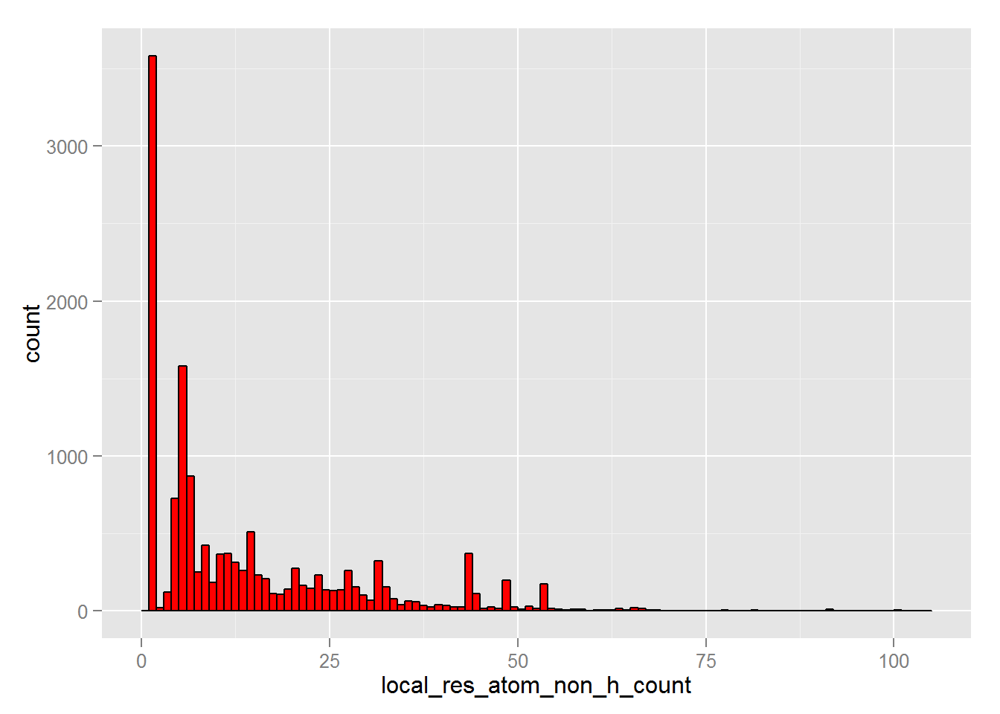
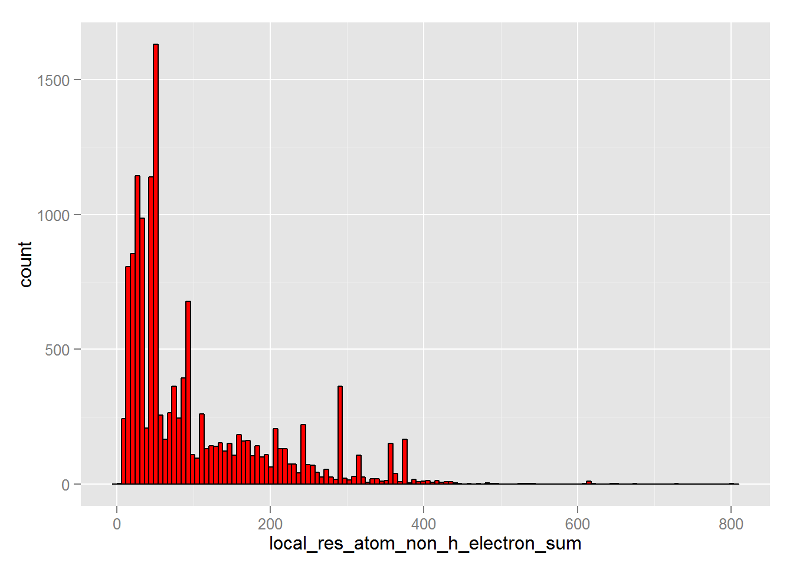
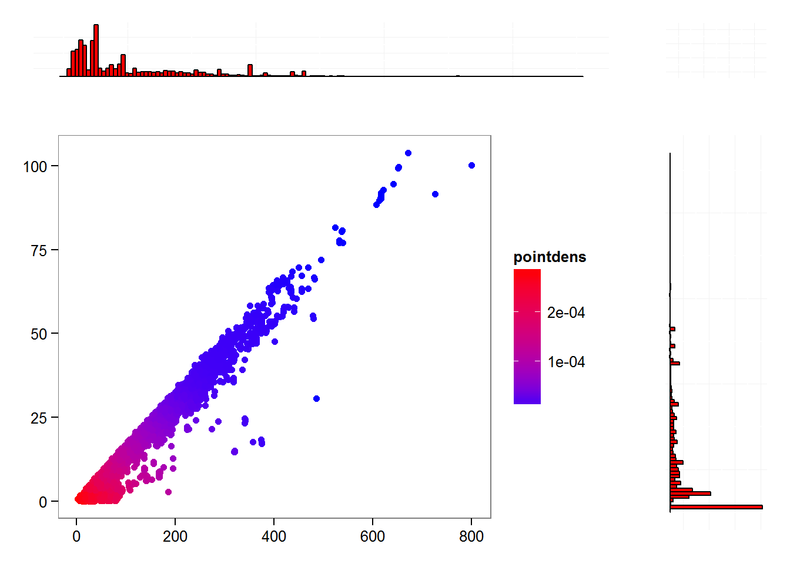

# ZED - raport
Tomasz Kaik  
`r Sys.Date()`  

##Wstęp

bla bla bla 

-----

1. Biblioteki i konfiguracja:

```r
library(MASS)
library(dplyr)
library(knitr)
library(ggplot2)
library(gridExtra)

opts_chunk$set(cache = TRUE)
```

2. Zapewnienie powtarzalności wynikóW:

```r
set.seed(23)
```

3. Wczytanie danych z pliku:

```r
#dane <- read.table("all_summary.txt", header = TRUE, sep = ";", comment.char = "", nrows = 100000)

file <- "all_summary.txt"

# użycie prostej heurystyki do wyznaczenia typów kolumn
header <- read.table(file, header = FALSE, sep = ";", nrows = 1, stringsAsFactors = FALSE)
sample <- read.table(file, header = FALSE, sep = ";", col.names = unlist(header), nrows = 5000, skip = 10000, stringsAsFactors = TRUE)
classes <- sapply(sample, class)
rm(list = c("sample", "header"))

dane <- read.table(file, header = TRUE, sep = ";", comment.char = "", colClasses = classes)

dane <- tbl_df(dane)
```

Liczba wierszy: 40309

4. Usunięcie wierszy z niepożądanymi wartościami zmiennej res_name:

```r
res_name_filter = c('DA','DC','DT', 'DU', 'DG', 'DI','UNK', 'UNX', 'UNL', 'PR', 'PD', 'Y1', 'EU', 'N', '15P', 'UQ', 'PX4', 'NAN')

dane <- dane %>% filter(!(res_name %in% res_name_filter)) 
#%>% filter(!is.na(res_name)) 
```

Liczba wierszy: 40027

5. Usunięcie zduplikowanych par wartości (pdb_code, res_name):

```r
dane <- distinct(dane, pdb_code, res_name)
```

Liczba wierszy: 14132

6. Krótkie podsumowanie wartości w każdej kolumnie:

```r
#lapply(dane, summary)
summary(dane)
```

```
##             title          pdb_code        res_name         res_id     
##  110l BME 901 A:    1   3ag4   :   16   SO4    : 1183   301    :  430  
##  111l CL 173 A :    1   3abl   :   15   ZN     :  849   1      :  424  
##  115l BME 901 A:    1   3abk   :   14   GOL    :  778   501    :  417  
##  115l CL 173 A :    1   2afh   :   11   CA     :  661   401    :  395  
##  123l BME 901 A:    1   3a0b   :   11   MG     :  402   201    :  306  
##  123l CL 173 A :    1   3g6e   :   11   (Other):10021   500    :  228  
##  (Other)       :14126   (Other):14054   NA's   :  238   (Other):11932  
##     chain_id      local_BAa       local_NPa        local_Ra    
##  A      :8630   Min.   : NA     Min.   : NA     Min.   : NA    
##  B      :2905   1st Qu.: NA     1st Qu.: NA     1st Qu.: NA    
##  C      : 795   Median : NA     Median : NA     Median : NA    
##  D      : 552   Mean   :NaN     Mean   :NaN     Mean   :NaN    
##  E      : 221   3rd Qu.: NA     3rd Qu.: NA     3rd Qu.: NA    
##  H      : 153   Max.   : NA     Max.   : NA     Max.   : NA    
##  (Other): 876   NA's   :14132   NA's   :14132   NA's   :14132  
##    local_RGa       local_SRGa      local_CCSa      local_CCPa   
##  Min.   : NA     Min.   : NA     Min.   : NA     Min.   : NA    
##  1st Qu.: NA     1st Qu.: NA     1st Qu.: NA     1st Qu.: NA    
##  Median : NA     Median : NA     Median : NA     Median : NA    
##  Mean   :NaN     Mean   :NaN     Mean   :NaN     Mean   :NaN    
##  3rd Qu.: NA     3rd Qu.: NA     3rd Qu.: NA     3rd Qu.: NA    
##  Max.   : NA     Max.   : NA     Max.   : NA     Max.   : NA    
##  NA's   :14132   NA's   :14132   NA's   :14132   NA's   :14132  
##    local_ZOa       local_ZDa     local_ZD_minus_a local_ZD_plus_a
##  Min.   : NA     Min.   : NA     Min.   : NA      Min.   : NA    
##  1st Qu.: NA     1st Qu.: NA     1st Qu.: NA      1st Qu.: NA    
##  Median : NA     Median : NA     Median : NA      Median : NA    
##  Mean   :NaN     Mean   :NaN     Mean   :NaN      Mean   :NaN    
##  3rd Qu.: NA     3rd Qu.: NA     3rd Qu.: NA      3rd Qu.: NA    
##  Max.   : NA     Max.   : NA     Max.   : NA      Max.   : NA    
##  NA's   :14132   NA's   :14132   NA's   :14132    NA's   :14132  
##  local_res_atom_count local_res_atom_non_h_count
##  Min.   :  1.00       Min.   :  1.00            
##  1st Qu.:  1.00       1st Qu.:  1.00            
##  Median :  7.00       Median :  7.00            
##  Mean   : 13.59       Mean   : 13.43            
##  3rd Qu.: 21.00       3rd Qu.: 20.00            
##  Max.   :178.00       Max.   :104.00            
##                                                 
##  local_res_atom_non_h_occupancy_sum local_res_atom_non_h_electron_sum
##  Min.   :  0.00                     Min.   :  3.0                    
##  1st Qu.:  1.00                     1st Qu.: 30.0                    
##  Median :  7.00                     Median : 55.0                    
##  Mean   : 13.05                     Mean   :101.5                    
##  3rd Qu.: 20.00                     3rd Qu.:145.0                    
##  Max.   :104.00                     Max.   :800.0                    
##                                                                      
##  local_res_atom_non_h_electron_occupancy_sum local_res_atom_C_count
##  Min.   :  0.00                              Min.   : 0.000        
##  1st Qu.: 30.00                              1st Qu.: 0.000        
##  Median : 52.00                              Median : 3.000        
##  Mean   : 98.33                              Mean   : 7.332        
##  3rd Qu.:139.15                              3rd Qu.:10.000        
##  Max.   :800.00                              Max.   :81.000        
##                                                                    
##  local_res_atom_N_count local_res_atom_O_count local_res_atom_S_count
##  Min.   : 0.00          Min.   : 0.000         Min.   :0.0000        
##  1st Qu.: 0.00          1st Qu.: 0.000         1st Qu.:0.0000        
##  Median : 0.00          Median : 3.000         Median :0.0000        
##  Mean   : 1.35          Mean   : 3.817         Mean   :0.2208        
##  3rd Qu.: 2.00          3rd Qu.: 5.000         3rd Qu.:0.0000        
##  Max.   :15.00          Max.   :55.000         Max.   :9.0000        
##                                                                      
##  dict_atom_non_h_count dict_atom_non_h_electron_sum dict_atom_C_count
##  Min.   :  1.00        Min.   :  3.0                Min.   : 0.00    
##  1st Qu.:  1.00        1st Qu.: 30.0                1st Qu.: 0.00    
##  Median :  7.00        Median : 56.0                Median : 3.00    
##  Mean   : 13.74        Mean   :103.8                Mean   : 7.47    
##  3rd Qu.: 21.00        3rd Qu.:151.0                3rd Qu.:10.00    
##  Max.   :128.00        Max.   :866.0                Max.   :81.00    
##  NA's   :19            NA's   :19                   NA's   :19       
##  dict_atom_N_count dict_atom_O_count dict_atom_S_count
##  Min.   : 0.000    Min.   : 0.000    Min.   :0.0000   
##  1st Qu.: 0.000    1st Qu.: 0.000    1st Qu.:0.0000   
##  Median : 0.000    Median : 3.000    Median :0.0000   
##  Mean   : 1.357    Mean   : 3.979    Mean   :0.2213   
##  3rd Qu.: 2.000    3rd Qu.: 6.000    3rd Qu.:0.0000   
##  Max.   :20.000    Max.   :55.000    Max.   :9.0000   
##  NA's   :19        NA's   :19        NA's   :19       
##  part_00_blob_electron_sum part_00_blob_volume_sum part_00_blob_parts
##  Min.   :  0.000           Min.   :   0.00         Min.   :0.0000    
##  1st Qu.:  9.469           1st Qu.:  14.44         1st Qu.:1.0000    
##  Median : 18.614           Median :  27.30         Median :1.0000    
##  Mean   : 31.535           Mean   :  51.45         Mean   :0.9725    
##  3rd Qu.: 41.434           3rd Qu.:  67.06         3rd Qu.:1.0000    
##  Max.   :320.010           Max.   :1467.68         Max.   :3.0000    
##                                                                      
##  part_00_shape_O3    part_00_shape_O4    part_00_shape_O5   
##  Min.   :    24253   Min.   :1.952e+08   Min.   :5.160e+11  
##  1st Qu.:   106958   1st Qu.:2.876e+09   1st Qu.:2.121e+13  
##  Median :   392324   Median :3.374e+10   Median :7.154e+14  
##  Mean   :  3091661   Mean   :1.622e+13   Mean   :1.938e+20  
##  3rd Qu.:  2563883   3rd Qu.:1.258e+12   3rd Qu.:1.241e+17  
##  Max.   :531191023   Max.   :6.478e+16   Max.   :2.263e+24  
##  NA's   :407         NA's   :407         NA's   :407        
##  part_00_shape_FL    part_00_shape_O3_norm part_00_shape_O4_norm
##  Min.   :3.330e+06   Min.   :0.2312        Min.   :0.0178       
##  1st Qu.:4.427e+10   1st Qu.:0.3173        1st Qu.:0.0275       
##  Median :1.747e+12   Median :0.4826        Median :0.0508       
##  Mean   :2.123e+16   Mean   :0.5752        Mean   :0.0782       
##  3rd Qu.:2.287e+14   3rd Qu.:0.7365        3rd Qu.:0.0992       
##  Max.   :1.007e+20   Max.   :2.8594        Max.   :0.8164       
##  NA's   :407         NA's   :407           NA's   :407          
##  part_00_shape_O5_norm part_00_shape_FL_norm part_00_shape_I1   
##  Min.   :0.0005        Min.   :0.0000        Min.   :6.875e+05  
##  1st Qu.:0.0007        1st Qu.:0.0021        1st Qu.:8.630e+06  
##  Median :0.0012        Median :0.0129        Median :6.683e+07  
##  Mean   :0.0026        Mean   :0.0651        Mean   :4.023e+09  
##  3rd Qu.:0.0028        3rd Qu.:0.0521        3rd Qu.:1.197e+09  
##  Max.   :0.0560        Max.   :7.4135        Max.   :2.280e+12  
##  NA's   :407           NA's   :407           NA's   :407        
##  part_00_shape_I2    part_00_shape_I3    part_00_shape_I4   
##  Min.   :1.246e+11   Min.   :9.688e+10   Min.   :1.335e+06  
##  1st Qu.:1.181e+13   1st Qu.:2.797e+13   1st Qu.:2.340e+10  
##  Median :5.855e+14   Median :2.106e+15   Median :1.004e+12  
##  Mean   :1.143e+20   Mean   :6.415e+20   Mean   :1.253e+16  
##  3rd Qu.:1.535e+17   3rd Qu.:7.688e+17   3rd Qu.:1.300e+14  
##  Max.   :9.980e+23   Max.   :3.152e+24   Max.   :5.832e+19  
##  NA's   :407         NA's   :407         NA's   :407        
##  part_00_shape_I5    part_00_shape_I6    part_00_shape_I1_norm
##  Min.   :4.728e+03   Min.   :5.618e+09   Min.   : 0.0637      
##  1st Qu.:5.138e+09   1st Qu.:4.161e+11   1st Qu.: 0.1478      
##  Median :3.677e+11   Median :1.259e+13   Median : 0.3602      
##  Mean   :6.720e+15   Mean   :1.592e+17   Mean   : 0.6958      
##  3rd Qu.:5.116e+13   3rd Qu.:1.647e+15   3rd Qu.: 0.8471      
##  Max.   :3.005e+19   Max.   :5.869e+20   Max.   :14.2814      
##  NA's   :407         NA's   :407         NA's   :407          
##  part_00_shape_I2_norm part_00_shape_I3_norm part_00_shape_I4_norm
##  Min.   : 0.0011       Min.   :  0.0008      Min.   :0.0000       
##  1st Qu.: 0.0037       1st Qu.:  0.0082      1st Qu.:0.0011       
##  Median : 0.0167       Median :  0.0633      Median :0.0074       
##  Mean   : 0.1159       Mean   :  1.0010      Mean   :0.0416       
##  3rd Qu.: 0.0720       3rd Qu.:  0.4041      3rd Qu.:0.0306       
##  Max.   :44.5807       Max.   :179.6831      Max.   :4.1117       
##  NA's   :407           NA's   :407           NA's   :407          
##  part_00_shape_I5_norm part_00_shape_I6_norm part_00_shape_I1_scaled
##  Min.   :0.0000        Min.   : 0.0049       Min.   :0.0001         
##  1st Qu.:0.0002        1st Qu.: 0.0202       1st Qu.:0.0007         
##  Median :0.0026        Median : 0.0873       Median :0.0014         
##  Mean   :0.0260        Mean   : 0.4266       Mean   :0.0022         
##  3rd Qu.:0.0150        3rd Qu.: 0.3408       3rd Qu.:0.0026         
##  Max.   :3.5597        Max.   :32.0411       Max.   :0.0778         
##  NA's   :407           NA's   :407           NA's   :407            
##  part_00_shape_I2_scaled part_00_shape_I3_scaled part_00_shape_I4_scaled
##  Min.   :0.0000          Min.   :0.0000          Min.   :0.0000         
##  1st Qu.:0.0000          1st Qu.:0.0000          1st Qu.:0.0000         
##  Median :0.0000          Median :0.0000          Median :0.0000         
##  Mean   :0.0000          Mean   :0.0000          Mean   :0.0000         
##  3rd Qu.:0.0000          3rd Qu.:0.0000          3rd Qu.:0.0000         
##  Max.   :0.0014          Max.   :0.0056          Max.   :0.0014         
##  NA's   :407             NA's   :407             NA's   :407            
##  part_00_shape_I5_scaled part_00_shape_I6_scaled part_00_shape_M000
##  Min.   :0e+00           Min.   :0               Min.   :  1023    
##  1st Qu.:0e+00           1st Qu.:0               1st Qu.:  1900    
##  Median :0e+00           Median :0               Median :  3580    
##  Mean   :0e+00           Mean   :0               Mean   :  6622    
##  3rd Qu.:0e+00           3rd Qu.:0               3rd Qu.:  8604    
##  Max.   :8e-04           Max.   :0               Max.   :183460    
##  NA's   :407             NA's   :407             NA's   :407       
##  part_00_shape_E3_E1 part_00_shape_E2_E1 part_00_shape_E3_E2
##  Min.   :0.0005      Min.   :0.0142      Min.   :0.0042     
##  1st Qu.:0.0715      1st Qu.:0.1974      1st Qu.:0.3046     
##  Median :0.1328      Median :0.3432      Median :0.5061     
##  Mean   :0.2174      Mean   :0.4061      Mean   :0.5133     
##  3rd Qu.:0.2864      3rd Qu.:0.5983      3rd Qu.:0.7264     
##  Max.   :0.9517      Max.   :0.9949      Max.   :1.0000     
##  NA's   :407         NA's   :407         NA's   :407        
##  part_00_shape_sqrt_E1 part_00_shape_sqrt_E2 part_00_shape_sqrt_E3
##  Min.   : 2.930        Min.   : 1.793        Min.   : 0.498       
##  1st Qu.: 5.594        1st Qu.: 3.546        1st Qu.: 2.654       
##  Median : 8.634        Median : 4.749        Median : 3.275       
##  Mean   :10.851        Mean   : 5.807        Mean   : 3.682       
##  3rd Qu.:14.739        3rd Qu.: 7.444        3rd Qu.: 4.313       
##  Max.   :57.618        Max.   :23.513        Max.   :19.245       
##  NA's   :407           NA's   :407           NA's   :407          
##  part_00_density_O3  part_00_density_O4  part_00_density_O5 
##  Min.   :     1527   Min.   :7.096e+05   Min.   :1.011e+08  
##  1st Qu.:    62839   1st Qu.:1.048e+09   1st Qu.:4.744e+12  
##  Median :   201961   Median :8.933e+09   Median :1.036e+14  
##  Mean   :  1670086   Mean   :3.188e+12   Mean   :4.092e+18  
##  3rd Qu.:  1405891   3rd Qu.:3.835e+11   3rd Qu.:2.108e+16  
##  Max.   :103498612   Max.   :2.493e+15   Max.   :1.713e+22  
##  NA's   :407         NA's   :407         NA's   :407        
##  part_00_density_FL  part_00_density_O3_norm part_00_density_O4_norm
##  Min.   :9.595e+05   Min.   :0.0593          Min.   :0.0012         
##  1st Qu.:1.340e+10   1st Qu.:0.3736          1st Qu.:0.0376         
##  Median :4.992e+11   Median :0.6608          Median :0.0950         
##  Mean   :3.482e+15   Mean   :0.7665          Mean   :0.1466         
##  3rd Qu.:7.100e+13   3rd Qu.:1.0132          3rd Qu.:0.1898         
##  Max.   :4.246e+18   Max.   :6.2210          Max.   :3.2789         
##  NA's   :407         NA's   :407             NA's   :407            
##  part_00_density_O5_norm part_00_density_FL_norm part_00_density_I1 
##  Min.   :0.0000          Min.   : 0.0000         Min.   :6.548e+04  
##  1st Qu.:0.0011          1st Qu.: 0.0033         1st Qu.:4.534e+06  
##  Median :0.0030          Median : 0.0331         Median :3.292e+07  
##  Mean   :0.0071          Mean   : 0.2521         Mean   :2.036e+09  
##  3rd Qu.:0.0074          3rd Qu.: 0.1622         3rd Qu.:6.281e+08  
##  Max.   :0.4408          Max.   :56.1583         Max.   :5.444e+11  
##  NA's   :407             NA's   :407             NA's   :407        
##  part_00_density_I2  part_00_density_I3  part_00_density_I4 
##  Min.   :9.611e+08   Min.   :1.275e+09   Min.   :4.130e+05  
##  1st Qu.:3.276e+12   1st Qu.:7.603e+12   1st Qu.:7.514e+09  
##  Median :1.356e+14   Median :5.501e+14   Median :3.324e+11  
##  Mean   :1.025e+19   Mean   :7.811e+19   Mean   :2.193e+15  
##  3rd Qu.:4.085e+16   3rd Qu.:2.124e+17   3rd Qu.:4.662e+13  
##  Max.   :3.703e+22   Max.   :2.191e+23   Max.   :2.480e+18  
##  NA's   :407         NA's   :407         NA's   :407        
##  part_00_density_I5  part_00_density_I6  part_00_density_I1_norm
##  Min.   :2.366e+04   Min.   :3.899e+07   Min.   : 0.0048        
##  1st Qu.:2.054e+09   1st Qu.:1.222e+11   1st Qu.: 0.2201        
##  Median :1.688e+11   Median :3.315e+12   Median : 0.7094        
##  Mean   :1.334e+15   Mean   :2.463e+16   Mean   : 1.4490        
##  3rd Qu.:2.294e+13   3rd Qu.:4.635e+14   3rd Qu.: 1.6894        
##  Max.   :1.500e+18   Max.   :3.396e+19   Max.   :55.3711        
##  NA's   :407         NA's   :407         NA's   :407            
##  part_00_density_I2_norm part_00_density_I3_norm part_00_density_I4_norm
##  Min.   :  0.0000        Min.   :   0.0000       Min.   : 0.0000        
##  1st Qu.:  0.0084        1st Qu.:   0.0169       1st Qu.: 0.0020        
##  Median :  0.0617        Median :   0.2383       Median : 0.0212        
##  Mean   :  0.6412        Mean   :   6.6229       Mean   : 0.1849        
##  3rd Qu.:  0.2874        3rd Qu.:   1.6383       3rd Qu.: 0.1056        
##  Max.   :671.2784        Max.   :2712.8508       Max.   :54.3712        
##  NA's   :407             NA's   :407             NA's   :407            
##  part_00_density_I5_norm part_00_density_I6_norm part_00_density_I1_scaled
##  Min.   : 0.0000         Min.   :  0.0001        Min.   :0.0000           
##  1st Qu.: 0.0006         1st Qu.:  0.0343        1st Qu.:0.0014           
##  Median : 0.0092         Median :  0.2346        Median :0.0035           
##  Mean   : 0.1401         Mean   :  1.4628        Mean   :0.0078           
##  3rd Qu.: 0.0611         3rd Qu.:  0.9441        3rd Qu.:0.0077           
##  Max.   :53.1798         Max.   :257.4787        Max.   :1.0142           
##  NA's   :407             NA's   :407             NA's   :407              
##  part_00_density_I2_scaled part_00_density_I3_scaled
##  Min.   :0.0000            Min.   :0.0000           
##  1st Qu.:0.0000            1st Qu.:0.0000           
##  Median :0.0000            Median :0.0000           
##  Mean   :0.0000            Mean   :0.0004           
##  3rd Qu.:0.0000            3rd Qu.:0.0000           
##  Max.   :0.0892            Max.   :0.9735           
##  NA's   :407               NA's   :407              
##  part_00_density_I4_scaled part_00_density_I5_scaled
##  Min.   :0.0000            Min.   :0.0000           
##  1st Qu.:0.0000            1st Qu.:0.0000           
##  Median :0.0000            Median :0.0000           
##  Mean   :0.0001            Mean   :0.0001           
##  3rd Qu.:0.0000            3rd Qu.:0.0000           
##  Max.   :0.1136            Max.   :0.1108           
##  NA's   :407               NA's   :407              
##  part_00_density_I6_scaled part_00_density_M000 part_00_density_E3_E1
##  Min.   :0.0000            Min.   :   47        Min.   :0.0007       
##  1st Qu.:0.0000            1st Qu.: 1263        1st Qu.:0.0678       
##  Median :0.0000            Median : 2421        Median :0.1277       
##  Mean   :0.0000            Mean   : 4059        Mean   :0.2206       
##  3rd Qu.:0.0000            3rd Qu.: 5322        3rd Qu.:0.3017       
##  Max.   :0.0036            Max.   :40001        Max.   :0.9577       
##  NA's   :407               NA's   :407          NA's   :407          
##  part_00_density_E2_E1 part_00_density_E3_E2 part_00_density_sqrt_E1
##  Min.   :0.0133        Min.   :0.0052        Min.   : 2.499         
##  1st Qu.:0.1912        1st Qu.:0.2997        1st Qu.: 5.086         
##  Median :0.3387        Median :0.5086        Median : 8.278         
##  Mean   :0.4058        Mean   :0.5151        Mean   :10.400         
##  3rd Qu.:0.6051        3rd Qu.:0.7363        3rd Qu.:14.368         
##  Max.   :0.9973        Max.   :1.0000        Max.   :57.158         
##  NA's   :407           NA's   :407           NA's   :407            
##  part_00_density_sqrt_E2 part_00_density_sqrt_E3 part_01_blob_electron_sum
##  Min.   : 1.769          Min.   : 0.4972         Min.   :  0.000          
##  1st Qu.: 3.263          1st Qu.: 2.4659         1st Qu.:  8.581          
##  Median : 4.407          Median : 3.0316         Median : 17.561          
##  Mean   : 5.487          Mean   : 3.4481         Mean   : 29.751          
##  3rd Qu.: 7.143          3rd Qu.: 4.0015         3rd Qu.: 39.384          
##  Max.   :23.337          Max.   :18.8283         Max.   :308.854          
##  NA's   :407             NA's   :407                                      
##  part_01_blob_volume_sum part_01_blob_parts part_01_shape_O3   
##  Min.   :   0.00         Min.   :0.0000     Min.   :    24186  
##  1st Qu.:  12.77         1st Qu.:1.0000     1st Qu.:    99934  
##  Median :  24.51         Median :1.0000     Median :   371987  
##  Mean   :  46.67         Mean   :0.9522     Mean   :  2894498  
##  3rd Qu.:  61.21         3rd Qu.:1.0000     3rd Qu.:  2444647  
##  Max.   :1364.02         Max.   :3.0000     Max.   :488904295  
##                                             NA's   :1015       
##  part_01_shape_O4    part_01_shape_O5    part_01_shape_FL   
##  Min.   :1.947e+08   Min.   :5.217e+11   Min.   :2.023e+06  
##  1st Qu.:2.480e+09   1st Qu.:1.702e+13   1st Qu.:3.533e+10  
##  Median :3.003e+10   Median :5.893e+14   Median :1.510e+12  
##  Mean   :1.384e+13   Mean   :1.558e+20   Mean   :1.829e+16  
##  3rd Qu.:1.136e+12   3rd Qu.:1.036e+17   3rd Qu.:2.211e+14  
##  Max.   :5.504e+16   Max.   :1.774e+24   Max.   :8.822e+19  
##  NA's   :1015        NA's   :1015        NA's   :1015       
##  part_01_shape_O3_norm part_01_shape_O4_norm part_01_shape_O5_norm
##  Min.   :0.2313        Min.   :0.0178        Min.   :0.0005       
##  1st Qu.:0.3104        1st Qu.:0.0267        1st Qu.:0.0007       
##  Median :0.4898        Median :0.0516        Median :0.0012       
##  Mean   :0.5905        Mean   :0.0823        Mean   :0.0028       
##  3rd Qu.:0.7633        3rd Qu.:0.1046        3rd Qu.:0.0029       
##  Max.   :3.2426        Max.   :0.8686        Max.   :0.0658       
##  NA's   :1015          NA's   :1015          NA's   :1015         
##  part_01_shape_FL_norm part_01_shape_I1    part_01_shape_I2   
##  Min.   :0.0000        Min.   :6.807e+05   Min.   :1.231e+11  
##  1st Qu.:0.0019        1st Qu.:7.759e+06   1st Qu.:9.470e+12  
##  Median :0.0133        Median :6.310e+07   Median :4.979e+14  
##  Mean   :0.0756        Mean   :3.739e+09   Mean   :9.661e+19  
##  3rd Qu.:0.0576        3rd Qu.:1.145e+09   3rd Qu.:1.387e+17  
##  Max.   :8.7118        Max.   :2.080e+12   Max.   :8.316e+23  
##  NA's   :1015          NA's   :1015        NA's   :1015       
##  part_01_shape_I3    part_01_shape_I4    part_01_shape_I5   
##  Min.   :9.354e+10   Min.   :8.184e+05   Min.   :3.360e+03  
##  1st Qu.:2.146e+13   1st Qu.:1.857e+10   1st Qu.:3.874e+09  
##  Median :1.913e+15   Median :8.845e+11   Median :3.127e+11  
##  Mean   :5.336e+20   Mean   :1.094e+16   Mean   :6.034e+15  
##  3rd Qu.:7.039e+17   3rd Qu.:1.258e+14   3rd Qu.:4.840e+13  
##  Max.   :2.328e+24   Max.   :5.101e+19   Max.   :2.620e+19  
##  NA's   :1015        NA's   :1015        NA's   :1015       
##  part_01_shape_I6    part_01_shape_I1_norm part_01_shape_I2_norm
##  Min.   :5.502e+09   Min.   : 0.0637       Min.   : 0.0011      
##  1st Qu.:3.399e+11   1st Qu.: 0.1405       1st Qu.: 0.0034      
##  Median :1.150e+13   Median : 0.3698       Median : 0.0172      
##  Mean   :1.347e+17   Mean   : 0.7492       Mean   : 0.1351      
##  3rd Qu.:1.513e+15   3rd Qu.: 0.9138       3rd Qu.: 0.0810      
##  Max.   :4.918e+20   Max.   :15.7489       Max.   :17.9810      
##  NA's   :1015        NA's   :1015          NA's   :1015         
##  part_01_shape_I3_norm part_01_shape_I4_norm part_01_shape_I5_norm
##  Min.   :  0.0008      Min.   :0.0000        Min.   :0.0000       
##  1st Qu.:  0.0072      1st Qu.:0.0010        1st Qu.:0.0002       
##  Median :  0.0669      Median :0.0077        Median :0.0028       
##  Mean   :  1.2288      Mean   :0.0491        Mean   :0.0315       
##  3rd Qu.:  0.4712      3rd Qu.:0.0344        3rd Qu.:0.0168       
##  Max.   :216.0913      Max.   :5.7801        Max.   :4.1458       
##  NA's   :1015          NA's   :1015          NA's   :1015         
##  part_01_shape_I6_norm part_01_shape_I1_scaled part_01_shape_I2_scaled
##  Min.   : 0.0049       Min.   :0.0001          Min.   :0.0000         
##  1st Qu.: 0.0184       1st Qu.:0.0007          1st Qu.:0.0000         
##  Median : 0.0905       Median :0.0014          Median :0.0000         
##  Mean   : 0.4913       Mean   :0.0024          Mean   :0.0000         
##  3rd Qu.: 0.3852       3rd Qu.:0.0029          3rd Qu.:0.0000         
##  Max.   :35.0370       Max.   :0.0797          Max.   :0.0012         
##  NA's   :1015          NA's   :1015            NA's   :1015           
##  part_01_shape_I3_scaled part_01_shape_I4_scaled part_01_shape_I5_scaled
##  Min.   :0.000           Min.   :0.0000          Min.   :0.000          
##  1st Qu.:0.000           1st Qu.:0.0000          1st Qu.:0.000          
##  Median :0.000           Median :0.0000          Median :0.000          
##  Mean   :0.000           Mean   :0.0000          Mean   :0.000          
##  3rd Qu.:0.000           3rd Qu.:0.0000          3rd Qu.:0.000          
##  Max.   :0.005           Max.   :0.0016          Max.   :0.001          
##  NA's   :1015            NA's   :1015            NA's   :1015           
##  part_01_shape_I6_scaled part_01_shape_M000 part_01_shape_E3_E1
##  Min.   :0               Min.   :  1023     Min.   :0.0005     
##  1st Qu.:0               1st Qu.:  1829     1st Qu.:0.0687     
##  Median :0               Median :  3438     Median :0.1310     
##  Mean   :0               Mean   :  6285     Mean   :0.2203     
##  3rd Qu.:0               3rd Qu.:  8213     3rd Qu.:0.2989     
##  Max.   :0               Max.   :170502     Max.   :0.9550     
##  NA's   :1015            NA's   :1015       NA's   :1015       
##  part_01_shape_E2_E1 part_01_shape_E3_E2 part_01_shape_sqrt_E1
##  Min.   :0.0127      Min.   :0.0044      Min.   : 2.898       
##  1st Qu.:0.1929      1st Qu.:0.2994      1st Qu.: 5.444       
##  Median :0.3406      Median :0.5083      Median : 8.615       
##  Mean   :0.4073      Mean   :0.5139      Mean   :10.825       
##  3rd Qu.:0.6085      3rd Qu.:0.7338      3rd Qu.:14.839       
##  Max.   :0.9933      Max.   :1.0000      Max.   :57.498       
##  NA's   :1015        NA's   :1015        NA's   :1015         
##  part_01_shape_sqrt_E2 part_01_shape_sqrt_E3 part_01_density_O3
##  Min.   : 1.947        Min.   : 0.4978       Min.   :    1038  
##  1st Qu.: 3.499        1st Qu.: 2.6289       1st Qu.:   61609  
##  Median : 4.687        Median : 3.2292       Median :  202072  
##  Mean   : 5.750        Mean   : 3.6288       Mean   : 1627744  
##  3rd Qu.: 7.393        3rd Qu.: 4.2305       3rd Qu.: 1411425  
##  Max.   :23.530        Max.   :19.1324       Max.   :98387452  
##  NA's   :1015          NA's   :1015          NA's   :1015      
##  part_01_density_O4  part_01_density_O5  part_01_density_FL 
##  Min.   :3.280e+05   Min.   :3.182e+07   Min.   :3.230e+05  
##  1st Qu.:1.002e+09   1st Qu.:4.474e+12   1st Qu.:1.122e+10  
##  Median :8.784e+09   Median :9.831e+13   Median :4.894e+11  
##  Mean   :2.936e+12   Mean   :3.562e+18   Mean   :3.237e+15  
##  3rd Qu.:3.754e+11   3rd Qu.:1.981e+16   3rd Qu.:7.614e+13  
##  Max.   :2.257e+15   Max.   :1.476e+22   Max.   :3.925e+18  
##  NA's   :1015        NA's   :1015        NA's   :1015       
##  part_01_density_O3_norm part_01_density_O4_norm part_01_density_O5_norm
##  Min.   :0.0592          Min.   :0.0012          Min.   :0.0000         
##  1st Qu.:0.3578          1st Qu.:0.0353          1st Qu.:0.0010         
##  Median :0.6567          Median :0.0935          Median :0.0029         
##  Mean   :0.7698          Mean   :0.1473          Mean   :0.0071         
##  3rd Qu.:1.0250          3rd Qu.:0.1896          3rd Qu.:0.0073         
##  Max.   :6.8569          Max.   :3.2948          Max.   :0.4961         
##  NA's   :1015            NA's   :1015            NA's   :1015           
##  part_01_density_FL_norm part_01_density_I1  part_01_density_I2 
##  Min.   : 0.0000         Min.   :3.748e+04   Min.   :3.151e+08  
##  1st Qu.: 0.0027         1st Qu.:4.245e+06   1st Qu.:2.887e+12  
##  Median : 0.0320         Median :3.248e+07   Median :1.308e+14  
##  Mean   : 0.2734         Mean   :1.973e+09   Mean   :9.264e+18  
##  3rd Qu.: 0.1652         3rd Qu.:6.229e+08   3rd Qu.:4.167e+16  
##  Max.   :71.1604         Max.   :4.837e+11   Max.   :3.307e+22  
##  NA's   :1015            NA's   :1015        NA's   :1015       
##  part_01_density_I3  part_01_density_I4  part_01_density_I5 
##  Min.   :4.195e+08   Min.   :1.414e+05   Min.   :1.786e+04  
##  1st Qu.:6.328e+12   1st Qu.:6.274e+09   1st Qu.:1.645e+09  
##  Median :5.311e+14   Median :3.206e+11   Median :1.575e+11  
##  Mean   :7.123e+19   Mean   :2.063e+15   Mean   :1.281e+15  
##  3rd Qu.:2.155e+17   3rd Qu.:4.987e+13   3rd Qu.:2.406e+13  
##  Max.   :1.741e+23   Max.   :2.292e+18   Max.   :1.423e+18  
##  NA's   :1015        NA's   :1015        NA's   :1015       
##  part_01_density_I6  part_01_density_I1_norm part_01_density_I2_norm
##  Min.   :1.512e+07   Min.   : 0.0048         Min.   :  0.0000       
##  1st Qu.:1.122e+11   1st Qu.: 0.1991         1st Qu.:  0.0072       
##  Median :3.324e+12   Median : 0.6992         Median :  0.0591       
##  Mean   :2.274e+16   Mean   : 1.4893         Mean   :  0.6688       
##  3rd Qu.:4.685e+14   3rd Qu.: 1.7199         3rd Qu.:  0.2869       
##  Max.   :2.699e+19   Max.   :69.6222         Max.   :249.4129       
##  NA's   :1015        NA's   :1015            NA's   :1015           
##  part_01_density_I3_norm part_01_density_I4_norm part_01_density_I5_norm
##  Min.   :   0.000        Min.   : 0.0000         Min.   : 0.0000        
##  1st Qu.:   0.014        1st Qu.: 0.0015         1st Qu.: 0.0004        
##  Median :   0.234        Median : 0.0207         Median : 0.0089        
##  Mean   :   7.645        Mean   : 0.2013         Mean   : 0.1533        
##  3rd Qu.:   1.696        3rd Qu.: 0.1089         3rd Qu.: 0.0639        
##  Max.   :4234.377        Max.   :69.3275         Max.   :68.1055        
##  NA's   :1015            NA's   :1015            NA's   :1015           
##  part_01_density_I6_norm part_01_density_I1_scaled
##  Min.   :  0.0001        Min.   :0.0000           
##  1st Qu.:  0.0295        1st Qu.:0.0013           
##  Median :  0.2290        Median :0.0035           
##  Mean   :  1.5884        Mean   :0.0079           
##  3rd Qu.:  0.9822        3rd Qu.:0.0078           
##  Max.   :353.0231        Max.   :0.6962           
##  NA's   :1015            NA's   :1015             
##  part_01_density_I2_scaled part_01_density_I3_scaled
##  Min.   :0.0000            Min.   :0.0000           
##  1st Qu.:0.0000            1st Qu.:0.0000           
##  Median :0.0000            Median :0.0000           
##  Mean   :0.0000            Mean   :0.0004           
##  3rd Qu.:0.0000            3rd Qu.:0.0000           
##  Max.   :0.1087            Max.   :0.3068           
##  NA's   :1015              NA's   :1015             
##  part_01_density_I4_scaled part_01_density_I5_scaled
##  Min.   :0.0000            Min.   :0.0000           
##  1st Qu.:0.0000            1st Qu.:0.0000           
##  Median :0.0000            Median :0.0000           
##  Mean   :0.0001            Mean   :0.0001           
##  3rd Qu.:0.0000            3rd Qu.:0.0000           
##  Max.   :0.0309            Max.   :0.0301           
##  NA's   :1015              NA's   :1015             
##  part_01_density_I6_scaled part_01_density_M000 part_01_density_E3_E1
##  Min.   :0.0000            Min.   :   37.76     Min.   :0.0007       
##  1st Qu.:0.0000            1st Qu.: 1279.76     1st Qu.:0.0653       
##  Median :0.0000            Median : 2417.00     Median :0.1259       
##  Mean   :0.0000            Mean   : 4006.64     Mean   :0.2236       
##  3rd Qu.:0.0000            3rd Qu.: 5277.11     3rd Qu.:0.3139       
##  Max.   :0.0052            Max.   :38606.79     Max.   :0.9601       
##  NA's   :1015              NA's   :1015         NA's   :1015         
##  part_01_density_E2_E1 part_01_density_E3_E2 part_01_density_sqrt_E1
##  Min.   :0.0122        Min.   :0.0054        Min.   : 2.496         
##  1st Qu.:0.1865        1st Qu.:0.2938        1st Qu.: 4.912         
##  Median :0.3374        Median :0.5097        Median : 8.306         
##  Mean   :0.4073        Mean   :0.5159        Mean   :10.396         
##  3rd Qu.:0.6152        3rd Qu.:0.7444        3rd Qu.:14.466         
##  Max.   :0.9942        Max.   :1.0000        Max.   :56.999         
##  NA's   :1015          NA's   :1015          NA's   :1015           
##  part_01_density_sqrt_E2 part_01_density_sqrt_E3 part_02_blob_electron_sum
##  Min.   : 1.877          Min.   : 0.4971         Min.   :  0.00           
##  1st Qu.: 3.223          1st Qu.: 2.4489         1st Qu.:  5.98           
##  Median : 4.348          Median : 2.9975         Median : 14.92           
##  Mean   : 5.447          Mean   : 3.4090         Mean   : 25.29           
##  3rd Qu.: 7.099          3rd Qu.: 3.9472         3rd Qu.: 34.14           
##  Max.   :23.302          Max.   :18.7365         Max.   :285.05           
##  NA's   :1015            NA's   :1015                                     
##  part_02_blob_volume_sum part_02_blob_parts part_02_shape_O3   
##  Min.   :   0.000        Min.   :0.0000     Min.   :    24331  
##  1st Qu.:   9.488        1st Qu.:1.0000     1st Qu.:    87509  
##  Median :  18.472        Median :1.0000     Median :   353222  
##  Mean   :  36.283        Mean   :0.8789     Mean   :  2498087  
##  3rd Qu.:  47.706        3rd Qu.:1.0000     3rd Qu.:  2198054  
##  Max.   :1126.792        Max.   :6.0000     Max.   :393595202  
##                                             NA's   :2733       
##  part_02_shape_O4    part_02_shape_O5    part_02_shape_FL   
##  Min.   :1.955e+08   Min.   :5.180e+11   Min.   :2.142e+06  
##  1st Qu.:1.981e+09   1st Qu.:1.221e+13   1st Qu.:2.353e+10  
##  Median :2.632e+10   Median :4.586e+14   Median :1.271e+12  
##  Mean   :9.441e+12   Mean   :9.121e+19   Mean   :1.266e+16  
##  3rd Qu.:9.254e+11   3rd Qu.:7.874e+16   3rd Qu.:1.902e+14  
##  Max.   :3.603e+16   Max.   :9.429e+23   Max.   :6.152e+19  
##  NA's   :2733        NA's   :2733        NA's   :2733       
##  part_02_shape_O3_norm part_02_shape_O4_norm part_02_shape_O5_norm
##  Min.   :0.2312        Min.   :0.0178        Min.   :0.0005       
##  1st Qu.:0.2974        1st Qu.:0.0255        1st Qu.:0.0006       
##  Median :0.5084        Median :0.0541        Median :0.0013       
##  Mean   :0.6297        Mean   :0.0941        Mean   :0.0033       
##  3rd Qu.:0.8274        3rd Qu.:0.1201        3rd Qu.:0.0033       
##  Max.   :4.1657        Max.   :1.2761        Max.   :0.1188       
##  NA's   :2733          NA's   :2733          NA's   :2733         
##  part_02_shape_FL_norm part_02_shape_I1    part_02_shape_I2   
##  Min.   : 0.0000       Min.   :6.937e+05   Min.   :1.254e+11  
##  1st Qu.: 0.0016       1st Qu.:6.300e+06   1st Qu.:6.696e+12  
##  Median : 0.0147       Median :5.957e+07   Median :4.354e+14  
##  Mean   : 0.1094       Mean   :3.159e+09   Mean   :6.363e+19  
##  3rd Qu.: 0.0759       3rd Qu.:1.030e+09   3rd Qu.:1.117e+17  
##  Max.   :15.0771       Max.   :1.635e+12   Max.   :5.176e+23  
##  NA's   :2733          NA's   :2733        NA's   :2733       
##  part_02_shape_I3    part_02_shape_I4    part_02_shape_I5   
##  Min.   :1.013e+11   Min.   :8.662e+05   Min.   :3.121e+03  
##  1st Qu.:1.390e+13   1st Qu.:1.204e+10   1st Qu.:2.229e+09  
##  Median :1.765e+15   Median :7.309e+11   Median :2.667e+11  
##  Mean   :3.286e+20   Mean   :7.812e+15   Mean   :4.583e+15  
##  3rd Qu.:5.691e+17   3rd Qu.:1.103e+14   3rd Qu.:4.242e+13  
##  Max.   :1.283e+24   Max.   :3.555e+19   Max.   :1.823e+19  
##  NA's   :2733        NA's   :2733        NA's   :2733       
##  part_02_shape_I6    part_02_shape_I1_norm part_02_shape_I2_norm
##  Min.   :5.751e+09   Min.   : 0.0637       Min.   : 0.0011      
##  1st Qu.:2.418e+11   1st Qu.: 0.1256       1st Qu.: 0.0030      
##  Median :1.056e+13   Median : 0.3991       Median : 0.0192      
##  Mean   :8.826e+16   Mean   : 0.8958       Mean   : 0.2128      
##  3rd Qu.:1.216e+15   3rd Qu.: 1.0766       3rd Qu.: 0.1077      
##  Max.   :3.091e+20   Max.   :25.9777       Max.   :60.5935      
##  NA's   :2733        NA's   :2733          NA's   :2733         
##  part_02_shape_I3_norm part_02_shape_I4_norm part_02_shape_I5_norm
##  Min.   :  0.0008      Min.   : 0.0000       Min.   : 0.0000      
##  1st Qu.:  0.0053      1st Qu.: 0.0008       1st Qu.: 0.0001      
##  Median :  0.0794      Median : 0.0086       Median : 0.0031      
##  Mean   :  2.0358      Mean   : 0.0736       Mean   : 0.0498      
##  3rd Qu.:  0.6657      3rd Qu.: 0.0462       3rd Qu.: 0.0222      
##  Max.   :617.9170      Max.   :16.9693       Max.   :19.4099      
##  NA's   :2733          NA's   :2733          NA's   :2733         
##  part_02_shape_I6_norm part_02_shape_I1_scaled part_02_shape_I2_scaled
##  Min.   : 0.0049       Min.   :0.0001          Min.   :0.0000         
##  1st Qu.: 0.0154       1st Qu.:0.0007          1st Qu.:0.0000         
##  Median : 0.1038       Median :0.0016          Median :0.0000         
##  Mean   : 0.6871       Mean   :0.0030          Mean   :0.0000         
##  3rd Qu.: 0.5005       3rd Qu.:0.0035          3rd Qu.:0.0000         
##  Max.   :76.7622       Max.   :0.1386          Max.   :0.0017         
##  NA's   :2733          NA's   :2733            NA's   :2733           
##  part_02_shape_I3_scaled part_02_shape_I4_scaled part_02_shape_I5_scaled
##  Min.   :0.0000          Min.   :0.0000          Min.   :0.0000         
##  1st Qu.:0.0000          1st Qu.:0.0000          1st Qu.:0.0000         
##  Median :0.0000          Median :0.0000          Median :0.0000         
##  Mean   :0.0000          Mean   :0.0000          Mean   :0.0000         
##  3rd Qu.:0.0000          3rd Qu.:0.0000          3rd Qu.:0.0000         
##  Max.   :0.0176          Max.   :0.0066          Max.   :0.0076         
##  NA's   :2733            NA's   :2733            NA's   :2733           
##  part_02_shape_I6_scaled part_02_shape_M000 part_02_shape_E3_E1
##  Min.   :0               Min.   :  1023     Min.   :0.0006     
##  1st Qu.:0               1st Qu.:  1721     1st Qu.:0.0625     
##  Median :0               Median :  3199     Median :0.1240     
##  Mean   :0               Mean   :  5623     Mean   :0.2274     
##  3rd Qu.:0               3rd Qu.:  7378     3rd Qu.:0.3368     
##  Max.   :0               Max.   :140849     Max.   :0.9807     
##  NA's   :2733            NA's   :2733       NA's   :2733       
##  part_02_shape_E2_E1 part_02_shape_E3_E2 part_02_shape_sqrt_E1
##  Min.   :0.0138      Min.   :0.0047      Min.   : 2.917       
##  1st Qu.:0.1858      1st Qu.:0.2851      1st Qu.: 5.152       
##  Median :0.3398      Median :0.5108      Median : 8.686       
##  Mean   :0.4111      Mean   :0.5145      Mean   :10.830       
##  3rd Qu.:0.6307      3rd Qu.:0.7479      3rd Qu.:15.036       
##  Max.   :1.0000      Max.   :0.9975      Max.   :57.058       
##  NA's   :2733        NA's   :2733        NA's   :2733         
##  part_02_shape_sqrt_E2 part_02_shape_sqrt_E3 part_02_density_O3
##  Min.   : 1.914        Min.   : 0.4957       Min.   :    4269  
##  1st Qu.: 3.424        1st Qu.: 2.6169       1st Qu.:   60814  
##  Median : 4.593        Median : 3.1510       Median :  217227  
##  Mean   : 5.664        Mean   : 3.5406       Mean   : 1535388  
##  3rd Qu.: 7.290        3rd Qu.: 4.1043       3rd Qu.: 1379860  
##  Max.   :23.104        Max.   :18.8476       Max.   :85505656  
##  NA's   :2733          NA's   :2733          NA's   :2733      
##  part_02_density_O4  part_02_density_O5  part_02_density_FL 
##  Min.   :5.654e+06   Min.   :2.385e+09   Min.   :1.443e+06  
##  1st Qu.:9.935e+08   1st Qu.:4.544e+12   1st Qu.:8.991e+09  
##  Median :9.850e+09   Median :1.054e+14   Median :5.136e+11  
##  Mean   :2.373e+12   Mean   :2.490e+18   Mean   :2.667e+15  
##  3rd Qu.:3.597e+11   3rd Qu.:1.752e+16   3rd Qu.:8.023e+13  
##  Max.   :1.717e+15   Max.   :9.809e+21   Max.   :3.126e+18  
##  NA's   :2733        NA's   :2733        NA's   :2733       
##  part_02_density_O3_norm part_02_density_O4_norm part_02_density_O5_norm
##  Min.   :0.0588          Min.   :0.0011          Min.   :0.0000         
##  1st Qu.:0.3269          1st Qu.:0.0304          1st Qu.:0.0008         
##  Median :0.6472          Median :0.0889          Median :0.0027         
##  Mean   :0.7767          Mean   :0.1502          Mean   :0.0071         
##  3rd Qu.:1.0468          3rd Qu.:0.1909          3rd Qu.:0.0069         
##  Max.   :8.0310          Max.   :5.9281          Max.   :0.7223         
##  NA's   :2733            NA's   :2733            NA's   :2733           
##  part_02_density_FL_norm part_02_density_I1  part_02_density_I2 
##  Min.   :  0.0000        Min.   :1.324e+05   Min.   :3.851e+09  
##  1st Qu.:  0.0017        1st Qu.:3.855e+06   1st Qu.:2.554e+12  
##  Median :  0.0303        Median :3.677e+07   Median :1.554e+14  
##  Mean   :  0.3481        Mean   :1.830e+09   Mean   :7.042e+18  
##  3rd Qu.:  0.1823        3rd Qu.:6.298e+08   3rd Qu.:3.960e+16  
##  Max.   :175.3947        Max.   :3.525e+11   Max.   :2.426e+22  
##  NA's   :2733            NA's   :2733        NA's   :2733       
##  part_02_density_I3  part_02_density_I4  part_02_density_I5 
##  Min.   :4.897e+09   Min.   :6.988e+05   Min.   :1.294e+04  
##  1st Qu.:4.996e+12   1st Qu.:4.610e+09   1st Qu.:1.031e+09  
##  Median :7.150e+14   Median :3.379e+11   Median :1.608e+11  
##  Mean   :5.556e+19   Mean   :1.749e+15   Mean   :1.137e+15  
##  3rd Qu.:2.164e+17   3rd Qu.:5.226e+13   3rd Qu.:2.598e+13  
##  Max.   :8.098e+22   Max.   :1.825e+18   Max.   :1.225e+18  
##  NA's   :2733        NA's   :2733        NA's   :2733       
##  part_02_density_I6  part_02_density_I1_norm part_02_density_I2_norm
##  Min.   :2.080e+08   Min.   : 0.0047         Min.   :  0.0000       
##  1st Qu.:9.700e+10   1st Qu.: 0.1632         1st Qu.:  0.0050       
##  Median :4.074e+12   Median : 0.6657         Median :  0.0525       
##  Mean   :1.846e+16   Mean   : 1.5867         Mean   :  0.8918       
##  3rd Qu.:4.794e+14   3rd Qu.: 1.7974         3rd Qu.:  0.3002       
##  Max.   :1.436e+19   Max.   :93.9830         Max.   :662.4172       
##  NA's   :2733        NA's   :2733            NA's   :2733           
##  part_02_density_I3_norm part_02_density_I4_norm part_02_density_I5_norm
##  Min.   :   0.000        Min.   :  0.0000        Min.   :  0.0000       
##  1st Qu.:   0.009        1st Qu.:  0.0009        1st Qu.:  0.0002       
##  Median :   0.219        Median :  0.0196        Median :  0.0080       
##  Mean   :  10.868        Mean   :  0.2686        Mean   :  0.2157       
##  3rd Qu.:   1.901        3rd Qu.:  0.1243        3rd Qu.:  0.0725       
##  Max.   :8293.848        Max.   :174.6308        Max.   :174.1215       
##  NA's   :2733            NA's   :2733            NA's   :2733           
##  part_02_density_I6_norm part_02_density_I1_scaled
##  Min.   :  0.0001        Min.   :0.0000           
##  1st Qu.:  0.0213        1st Qu.:0.0011           
##  Median :  0.2166        Median :0.0034           
##  Mean   :  1.8945        Mean   :0.0081           
##  3rd Qu.:  1.0608        3rd Qu.:0.0079           
##  Max.   :562.7741        Max.   :0.7774           
##  NA's   :2733            NA's   :2733             
##  part_02_density_I2_scaled part_02_density_I3_scaled
##  Min.   :0.0000            Min.   :0.0000           
##  1st Qu.:0.0000            1st Qu.:0.0000           
##  Median :0.0000            Median :0.0000           
##  Mean   :0.0000            Mean   :0.0005           
##  3rd Qu.:0.0000            3rd Qu.:0.0000           
##  Max.   :0.0311            Max.   :0.5675           
##  NA's   :2733              NA's   :2733             
##  part_02_density_I4_scaled part_02_density_I5_scaled
##  Min.   :0.0000            Min.   :0.0000           
##  1st Qu.:0.0000            1st Qu.:0.0000           
##  Median :0.0000            Median :0.0000           
##  Mean   :0.0001            Mean   :0.0001           
##  3rd Qu.:0.0000            3rd Qu.:0.0000           
##  Max.   :0.0891            Max.   :0.0928           
##  NA's   :2733              NA's   :2733             
##  part_02_density_I6_scaled part_02_density_M000 part_02_density_E3_E1
##  Min.   :0.0000            Min.   :  177.5      Min.   :0.0008       
##  1st Qu.:0.0000            1st Qu.: 1345.6      1st Qu.:0.0602       
##  Median :0.0000            Median : 2471.8      Median :0.1191       
##  Mean   :0.0000            Mean   : 3919.5      Mean   :0.2311       
##  3rd Qu.:0.0000            3rd Qu.: 5181.2      3rd Qu.:0.3548       
##  Max.   :0.0014            Max.   :35631.8      Max.   :0.9870       
##  NA's   :2733              NA's   :2733         NA's   :2733         
##  part_02_density_E2_E1 part_02_density_E3_E2 part_02_density_sqrt_E1
##  Min.   :0.0138        Min.   :0.0058        Min.   : 2.487         
##  1st Qu.:0.1798        1st Qu.:0.2815        1st Qu.: 4.652         
##  Median :0.3397        Median :0.5135        Median : 8.412         
##  Mean   :0.4116        Mean   :0.5172        Mean   :10.432         
##  3rd Qu.:0.6380        3rd Qu.:0.7573        3rd Qu.:14.648         
##  Max.   :1.0000        Max.   :0.9981        Max.   :56.374         
##  NA's   :2733          NA's   :2733          NA's   :2733           
##  part_02_density_sqrt_E2 part_02_density_sqrt_E3 part_03_blob_electron_sum
##  Min.   : 1.857          Min.   : 0.4957         Min.   :  0.0            
##  1st Qu.: 3.168          1st Qu.: 2.4482         1st Qu.:  0.0            
##  Median : 4.310          Median : 2.9366         Median : 12.2            
##  Mean   : 5.387          Mean   : 3.3448         Mean   : 21.1            
##  3rd Qu.: 7.018          3rd Qu.: 3.8449         3rd Qu.: 28.5            
##  Max.   :22.701          Max.   :18.4920         Max.   :259.2            
##  NA's   :2733            NA's   :2733                                     
##  part_03_blob_volume_sum part_03_blob_parts part_03_shape_O3   
##  Min.   :  0.00          Min.   :0.0000     Min.   :    24164  
##  1st Qu.:  0.00          1st Qu.:0.0000     1st Qu.:    80446  
##  Median : 13.93          Median :1.0000     Median :   332182  
##  Mean   : 28.00          Mean   :0.7844     Mean   :  2143093  
##  3rd Qu.: 36.67          3rd Qu.:1.0000     3rd Qu.:  1985591  
##  Max.   :912.68          Max.   :8.0000     Max.   :308821123  
##                                             NA's   :4323       
##  part_03_shape_O4    part_03_shape_O5    part_03_shape_FL   
##  Min.   :1.941e+08   Min.   :5.143e+11   Min.   :6.027e+06  
##  1st Qu.:1.677e+09   1st Qu.:9.703e+12   1st Qu.:1.576e+10  
##  Median :2.274e+10   Median :3.814e+14   Median :1.155e+12  
##  Mean   :6.474e+12   Mean   :5.200e+19   Mean   :9.143e+15  
##  3rd Qu.:7.154e+11   3rd Qu.:4.886e+16   3rd Qu.:1.600e+14  
##  Max.   :2.259e+16   Max.   :4.715e+23   Max.   :4.159e+19  
##  NA's   :4323        NA's   :4323        NA's   :4323       
##  part_03_shape_O3_norm part_03_shape_O4_norm part_03_shape_O5_norm
##  Min.   :0.231         Min.   :0.018         Min.   :0.000        
##  1st Qu.:0.286         1st Qu.:0.024         1st Qu.:0.001        
##  Median :0.523         Median :0.056         Median :0.001        
##  Mean   :0.664         Mean   :0.105         Mean   :0.004        
##  3rd Qu.:0.884         3rd Qu.:0.134         3rd Qu.:0.004        
##  Max.   :4.964         Max.   :2.782         Max.   :0.279        
##  NA's   :4323          NA's   :4323          NA's   :4323         
##  part_03_shape_FL_norm part_03_shape_I1    part_03_shape_I2   
##  Min.   : 0.000        Min.   :6.790e+05   Min.   :1.225e+11  
##  1st Qu.: 0.001        1st Qu.:5.225e+06   1st Qu.:4.915e+12  
##  Median : 0.016        Median :5.614e+07   Median :3.576e+14  
##  Mean   : 0.147        Mean   :2.643e+09   Mean   :4.120e+19  
##  3rd Qu.: 0.097        3rd Qu.:9.385e+08   3rd Qu.:8.713e+16  
##  Max.   :16.600        Max.   :1.252e+12   Max.   :3.069e+23  
##  NA's   :4323          NA's   :4323        NA's   :4323       
##  part_03_shape_I3    part_03_shape_I4    part_03_shape_I5   
##  Min.   :9.315e+10   Min.   :2.433e+06   Min.   :1.301e+03  
##  1st Qu.:9.243e+12   1st Qu.:7.840e+09   1st Qu.:1.139e+09  
##  Median :1.544e+15   Median :6.599e+11   Median :2.269e+11  
##  Mean   :2.049e+20   Mean   :5.802e+15   Mean   :3.575e+15  
##  3rd Qu.:5.017e+17   3rd Qu.:9.193e+13   3rd Qu.:3.750e+13  
##  Max.   :7.404e+23   Max.   :2.404e+19   Max.   :1.234e+19  
##  NA's   :4323        NA's   :4323        NA's   :4323       
##  part_03_shape_I6    part_03_shape_I1_norm part_03_shape_I2_norm
##  Min.   :5.484e+09   Min.   : 0.064        Min.   : 0.001       
##  1st Qu.:1.751e+11   1st Qu.: 0.113        1st Qu.: 0.003       
##  Median :9.433e+12   Median : 0.420        Median : 0.021       
##  Mean   :5.861e+16   Mean   : 1.043        Mean   : 0.320       
##  3rd Qu.:1.022e+15   3rd Qu.: 1.213        3rd Qu.: 0.133       
##  Max.   :1.832e+20   Max.   :27.950        Max.   :87.376       
##  NA's   :4323        NA's   :4323          NA's   :4323         
##  part_03_shape_I3_norm part_03_shape_I4_norm part_03_shape_I5_norm
##  Min.   :  0.001       Min.   : 0.000        Min.   : 0.000       
##  1st Qu.:  0.004       1st Qu.: 0.001        1st Qu.: 0.000       
##  Median :  0.089       Median : 0.009        Median : 0.003       
##  Mean   :  3.088       Mean   : 0.100        Mean   : 0.068       
##  3rd Qu.:  0.881       3rd Qu.: 0.058        3rd Qu.: 0.029       
##  Max.   :627.766       Max.   :12.672        Max.   :11.434       
##  NA's   :4323          NA's   :4323          NA's   :4323         
##  part_03_shape_I6_norm part_03_shape_I1_scaled part_03_shape_I2_scaled
##  Min.   : 0.005        Min.   :0.000           Min.   :0.000          
##  1st Qu.: 0.013        1st Qu.:0.001           1st Qu.:0.000          
##  Median : 0.114        Median :0.002           Median :0.000          
##  Mean   : 0.928        Mean   :0.004           Mean   :0.000          
##  3rd Qu.: 0.610        3rd Qu.:0.004           3rd Qu.:0.000          
##  Max.   :92.899        Max.   :0.117           Max.   :0.002          
##  NA's   :4323          NA's   :4323            NA's   :4323           
##  part_03_shape_I3_scaled part_03_shape_I4_scaled part_03_shape_I5_scaled
##  Min.   :0.00            Min.   :0.000           Min.   :0.000          
##  1st Qu.:0.00            1st Qu.:0.000           1st Qu.:0.000          
##  Median :0.00            Median :0.000           Median :0.000          
##  Mean   :0.00            Mean   :0.000           Mean   :0.000          
##  3rd Qu.:0.00            3rd Qu.:0.000           3rd Qu.:0.000          
##  Max.   :0.01            Max.   :0.004           Max.   :0.003          
##  NA's   :4323            NA's   :4323            NA's   :4323           
##  part_03_shape_I6_scaled part_03_shape_M000 part_03_shape_E3_E1
##  Min.   :0               Min.   :  1023     Min.   :0.001      
##  1st Qu.:0               1st Qu.:  1641     1st Qu.:0.058      
##  Median :0               Median :  2992     Median :0.121      
##  Mean   :0               Mean   :  5042     Mean   :0.236      
##  3rd Qu.:0               3rd Qu.:  6578     3rd Qu.:0.378      
##  Max.   :0               Max.   :114085     Max.   :0.972      
##  NA's   :4323            NA's   :4323       NA's   :4323       
##  part_03_shape_E2_E1 part_03_shape_E3_E2 part_03_shape_sqrt_E1
##  Min.   :0.012       Min.   :0.005       Min.   : 2.884       
##  1st Qu.:0.178       1st Qu.:0.276       1st Qu.: 4.844       
##  Median :0.346       Median :0.518       Median : 8.678       
##  Mean   :0.417       Mean   :0.518       Mean   :10.758       
##  3rd Qu.:0.659       3rd Qu.:0.762       3rd Qu.:15.087       
##  Max.   :1.000       Max.   :0.997       Max.   :56.054       
##  NA's   :4323        NA's   :4323        NA's   :4323         
##  part_03_shape_sqrt_E2 part_03_shape_sqrt_E3 part_03_density_O3
##  Min.   : 1.817        Min.   : 0.493        Min.   :    4027  
##  1st Qu.: 3.364        1st Qu.: 2.599        1st Qu.:   60306  
##  Median : 4.500        Median : 3.088        Median :  228546  
##  Mean   : 5.557        Mean   : 3.458        Mean   : 1416666  
##  3rd Qu.: 7.121        3rd Qu.: 3.971        3rd Qu.: 1320446  
##  Max.   :22.190        Max.   :18.573        Max.   :72213243  
##  NA's   :4323          NA's   :4323          NA's   :4323      
##  part_03_density_O4  part_03_density_O5  part_03_density_FL 
##  Min.   :5.262e+06   Min.   :2.243e+09   Min.   :1.389e+06  
##  1st Qu.:9.973e+08   1st Qu.:4.631e+12   1st Qu.:6.872e+09  
##  Median :1.021e+10   Median :1.089e+14   Median :5.777e+11  
##  Mean   :1.856e+12   Mean   :1.666e+18   Mean   :2.191e+15  
##  3rd Qu.:3.169e+11   3rd Qu.:1.409e+16   3rd Qu.:7.506e+13  
##  Max.   :1.241e+15   Max.   :6.053e+21   Max.   :2.396e+18  
##  NA's   :4323        NA's   :4323        NA's   :4323       
##  part_03_density_O3_norm part_03_density_O4_norm part_03_density_O5_norm
##  Min.   : 0.058          Min.   : 0.001          Min.   :0.000          
##  1st Qu.: 0.297          1st Qu.: 0.025          1st Qu.:0.001          
##  Median : 0.628          Median : 0.084          Median :0.002          
##  Mean   : 0.780          Mean   : 0.153          Mean   :0.007          
##  3rd Qu.: 1.068          3rd Qu.: 0.189          3rd Qu.:0.007          
##  Max.   :13.448          Max.   :19.719          Max.   :2.609          
##  NA's   :4323            NA's   :4323            NA's   :4323           
##  part_03_density_FL_norm part_03_density_I1  part_03_density_I2 
##  Min.   :  0.000         Min.   :1.186e+05   Min.   :3.489e+09  
##  1st Qu.:  0.001         1st Qu.:3.494e+06   1st Qu.:2.266e+12  
##  Median :  0.028         Median :3.763e+07   Median :1.593e+14  
##  Mean   :  0.434         Mean   :1.652e+09   Mean   :5.106e+18  
##  3rd Qu.:  0.193         3rd Qu.:6.024e+08   3rd Qu.:3.541e+16  
##  Max.   :611.380         Max.   :2.923e+11   Max.   :1.683e+22  
##  NA's   :4323            NA's   :4323        NA's   :4323       
##  part_03_density_I3  part_03_density_I4  part_03_density_I5 
##  Min.   :3.239e+09   Min.   :5.853e+05   Min.   :1.301e+04  
##  1st Qu.:3.813e+12   1st Qu.:3.509e+09   1st Qu.:5.793e+08  
##  Median :7.299e+14   Median :3.627e+11   Median :1.751e+11  
##  Mean   :4.232e+19   Mean   :1.487e+15   Mean   :1.019e+15  
##  3rd Qu.:2.111e+17   3rd Qu.:4.923e+13   3rd Qu.:2.523e+13  
##  Max.   :5.210e+22   Max.   :1.399e+18   Max.   :1.016e+18  
##  NA's   :4323        NA's   :4323        NA's   :4323       
##  part_03_density_I6  part_03_density_I1_norm part_03_density_I2_norm
##  Min.   :1.669e+08   Min.   :  0.005         Min.   :   0.000       
##  1st Qu.:8.407e+10   1st Qu.:  0.131         1st Qu.:   0.003       
##  Median :4.446e+12   Median :  0.630         Median :   0.047       
##  Mean   :1.456e+16   Mean   :  1.669         Mean   :   1.234       
##  3rd Qu.:4.485e+14   3rd Qu.:  1.859         3rd Qu.:   0.305       
##  Max.   :9.946e+18   Max.   :276.318         Max.   :2741.695       
##  NA's   :4323        NA's   :4323            NA's   :4323           
##  part_03_density_I3_norm part_03_density_I4_norm part_03_density_I5_norm
##  Min.   :    0.00        Min.   :  0.000         Min.   :  0.000        
##  1st Qu.:    0.01        1st Qu.:  0.001         1st Qu.:  0.000        
##  Median :    0.20        Median :  0.018         Median :  0.008        
##  Mean   :   19.76        Mean   :  0.334         Mean   :  0.268        
##  3rd Qu.:    2.03        3rd Qu.:  0.132         3rd Qu.:  0.079        
##  Max.   :63118.30        Max.   :466.450         Max.   :369.830        
##  NA's   :4323            NA's   :4323            NA's   :4323           
##  part_03_density_I6_norm part_03_density_I1_scaled
##  Min.   :   0.000        Min.   :0.000            
##  1st Qu.:   0.016        1st Qu.:0.001            
##  Median :   0.200        Median :0.003            
##  Mean   :   2.430        Mean   :0.009            
##  3rd Qu.:   1.123        3rd Qu.:0.008            
##  Max.   :2877.496        Max.   :4.533            
##  NA's   :4323            NA's   :4323             
##  part_03_density_I2_scaled part_03_density_I3_scaled
##  Min.   :0.000             Min.   : 0.000           
##  1st Qu.:0.000             1st Qu.: 0.000           
##  Median :0.000             Median : 0.000           
##  Mean   :0.000             Mean   : 0.002           
##  3rd Qu.:0.000             3rd Qu.: 0.000           
##  Max.   :0.738             Max.   :16.988           
##  NA's   :4323              NA's   :4323             
##  part_03_density_I4_scaled part_03_density_I5_scaled
##  Min.   :0.00              Min.   :0.000            
##  1st Qu.:0.00              1st Qu.:0.000            
##  Median :0.00              Median :0.000            
##  Mean   :0.00              Mean   :0.000            
##  3rd Qu.:0.00              3rd Qu.:0.000            
##  Max.   :0.98              Max.   :0.777            
##  NA's   :4323              NA's   :4323             
##  part_03_density_I6_scaled part_03_density_M000 part_03_density_E3_E1
##  Min.   :0.000             Min.   :  168        Min.   :0.001        
##  1st Qu.:0.000             1st Qu.: 1421        1st Qu.:0.057        
##  Median :0.000             Median : 2517        Median :0.117        
##  Mean   :0.000             Mean   : 3800        Mean   :0.240        
##  3rd Qu.:0.000             3rd Qu.: 5018        3rd Qu.:0.400        
##  Max.   :0.013             Max.   :32406        Max.   :0.979        
##  NA's   :4323              NA's   :4323         NA's   :4323         
##  part_03_density_E2_E1 part_03_density_E3_E2 part_03_density_sqrt_E1
##  Min.   :0.011         Min.   :0.006         Min.   : 2.473         
##  1st Qu.:0.173         1st Qu.:0.273         1st Qu.: 4.382         
##  Median :0.347         Median :0.521         Median : 8.473         
##  Mean   :0.418         Mean   :0.522         Mean   :10.377         
##  3rd Qu.:0.667         3rd Qu.:0.773         3rd Qu.:14.673         
##  Max.   :1.000         Max.   :0.999         Max.   :55.183         
##  NA's   :4323          NA's   :4323          NA's   :4323           
##  part_03_density_sqrt_E2 part_03_density_sqrt_E3 part_04_blob_electron_sum
##  Min.   : 1.773          Min.   : 0.494          Min.   :  0.000          
##  1st Qu.: 3.117          1st Qu.: 2.435          1st Qu.:  0.000          
##  Median : 4.238          Median : 2.885          Median :  9.215          
##  Mean   : 5.298          Mean   : 3.279          Mean   : 17.299          
##  3rd Qu.: 6.898          3rd Qu.: 3.738          3rd Qu.: 23.645          
##  Max.   :22.311          Max.   :18.240          Max.   :242.292          
##  NA's   :4323            NA's   :4323                                     
##  part_04_blob_volume_sum part_04_blob_parts part_04_shape_O3   
##  Min.   :  0.0           Min.   :0.0000     Min.   :    24198  
##  1st Qu.:  0.0           1st Qu.:0.0000     1st Qu.:    71079  
##  Median : 10.6           Median :1.0000     Median :   280935  
##  Mean   : 21.4           Mean   :0.6916     Mean   :  1793267  
##  3rd Qu.: 27.2           3rd Qu.:1.0000     3rd Qu.:  1660848  
##  Max.   :734.9           Max.   :6.0000     Max.   :243030424  
##                                             NA's   :5688       
##  part_04_shape_O4    part_04_shape_O5    part_04_shape_FL   
##  Min.   :1.946e+08   Min.   :5.198e+11   Min.   :7.913e+06  
##  1st Qu.:1.326e+09   1st Qu.:6.878e+12   1st Qu.:1.046e+10  
##  Median :1.629e+10   Median :2.224e+14   Median :7.137e+11  
##  Mean   :4.402e+12   Mean   :2.929e+19   Mean   :6.519e+15  
##  3rd Qu.:4.777e+11   3rd Qu.:2.560e+16   3rd Qu.:9.978e+13  
##  Max.   :1.407e+16   Max.   :2.311e+23   Max.   :2.710e+19  
##  NA's   :5688        NA's   :5688        NA's   :5688       
##  part_04_shape_O3_norm part_04_shape_O4_norm part_04_shape_O5_norm
##  Min.   :0.231         Min.   :0.018         Min.   :0.000        
##  1st Qu.:0.279         1st Qu.:0.024         1st Qu.:0.001        
##  Median :0.525         Median :0.056         Median :0.001        
##  Mean   :0.689         Mean   :0.113         Mean   :0.004        
##  3rd Qu.:0.913         3rd Qu.:0.139         3rd Qu.:0.004        
##  Max.   :6.215         Max.   :2.838         Max.   :0.408        
##  NA's   :5688          NA's   :5688          NA's   :5688         
##  part_04_shape_FL_norm part_04_shape_I1    part_04_shape_I2   
##  Min.   : 0.000        Min.   :6.817e+05   Min.   :1.231e+11  
##  1st Qu.: 0.001        1st Qu.:4.357e+06   1st Qu.:3.416e+12  
##  Median : 0.015        Median :4.370e+07   Median :2.246e+14  
##  Mean   : 0.191        Mean   :2.154e+09   Mean   :2.754e+19  
##  3rd Qu.: 0.109        3rd Qu.:7.484e+08   3rd Qu.:5.254e+16  
##  Max.   :50.977        Max.   :9.772e+11   Max.   :1.880e+23  
##  NA's   :5688          NA's   :5688        NA's   :5688       
##  part_04_shape_I3    part_04_shape_I4    part_04_shape_I5   
##  Min.   :9.400e+10   Min.   :3.183e+06   Min.   :3.774e+03  
##  1st Qu.:6.267e+12   1st Qu.:4.954e+09   1st Qu.:6.858e+08  
##  Median :9.829e+14   Median :4.405e+11   Median :1.563e+11  
##  Mean   :1.289e+20   Mean   :4.253e+15   Mean   :2.743e+15  
##  3rd Qu.:3.179e+17   3rd Qu.:6.074e+13   3rd Qu.:2.617e+13  
##  Max.   :4.504e+23   Max.   :1.585e+19   Max.   :8.347e+18  
##  NA's   :5688        NA's   :5688        NA's   :5688       
##  part_04_shape_I6    part_04_shape_I1_norm part_04_shape_I2_norm
##  Min.   :5.528e+09   Min.   : 0.064        Min.   :  0.001      
##  1st Qu.:1.308e+11   1st Qu.: 0.105        1st Qu.:  0.002      
##  Median :6.147e+12   Median : 0.429        Median :  0.021      
##  Mean   :3.912e+16   Mean   : 1.176        Mean   :  0.461      
##  3rd Qu.:6.772e+14   3rd Qu.: 1.309        3rd Qu.:  0.153      
##  Max.   :1.119e+20   Max.   :51.132        Max.   :191.662      
##  NA's   :5688        NA's   :5688          NA's   :5688         
##  part_04_shape_I3_norm part_04_shape_I4_norm part_04_shape_I5_norm
##  Min.   :   0.001      Min.   : 0.000        Min.   : 0.000       
##  1st Qu.:   0.003      1st Qu.: 0.000        1st Qu.: 0.000       
##  Median :   0.091      Median : 0.009        Median : 0.003       
##  Mean   :   5.020      Mean   : 0.136        Mean   : 0.099       
##  3rd Qu.:   1.000      3rd Qu.: 0.069        3rd Qu.: 0.035       
##  Max.   :2122.910      Max.   :50.723        Max.   :50.553       
##  NA's   :5688          NA's   :5688          NA's   :5688         
##  part_04_shape_I6_norm part_04_shape_I1_scaled part_04_shape_I2_scaled
##  Min.   :  0.005       Min.   :0.000           Min.   :0.000          
##  1st Qu.:  0.011       1st Qu.:0.001           1st Qu.:0.000          
##  Median :  0.116       Median :0.002           Median :0.000          
##  Mean   :  1.241       Mean   :0.004           Mean   :0.000          
##  3rd Qu.:  0.675       3rd Qu.:0.005           3rd Qu.:0.000          
##  Max.   :182.251       Max.   :0.199           Max.   :0.004          
##  NA's   :5688          NA's   :5688            NA's   :5688           
##  part_04_shape_I3_scaled part_04_shape_I4_scaled part_04_shape_I5_scaled
##  Min.   :0.000           Min.   :0.000           Min.   :0.000          
##  1st Qu.:0.000           1st Qu.:0.000           1st Qu.:0.000          
##  Median :0.000           Median :0.000           Median :0.000          
##  Mean   :0.000           Mean   :0.000           Mean   :0.000          
##  3rd Qu.:0.000           3rd Qu.:0.000           3rd Qu.:0.000          
##  Max.   :0.031           Max.   :0.008           Max.   :0.008          
##  NA's   :5688            NA's   :5688            NA's   :5688           
##  part_04_shape_I6_scaled part_04_shape_M000 part_04_shape_E3_E1
##  Min.   :0               Min.   : 1023      Min.   :0.001      
##  1st Qu.:0               1st Qu.: 1532      1st Qu.:0.055      
##  Median :0               Median : 2709      Median :0.119      
##  Mean   :0               Mean   : 4477      Mean   :0.242      
##  3rd Qu.:0               3rd Qu.: 5715      3rd Qu.:0.414      
##  Max.   :0               Max.   :91862      Max.   :0.967      
##  NA's   :5688            NA's   :5688       NA's   :5688       
##  part_04_shape_E2_E1 part_04_shape_E3_E2 part_04_shape_sqrt_E1
##  Min.   :0.009       Min.   :0.010       Min.   : 2.869       
##  1st Qu.:0.174       1st Qu.:0.267       1st Qu.: 4.606       
##  Median :0.350       Median :0.527       Median : 8.460       
##  Mean   :0.422       Mean   :0.522       Mean   :10.534       
##  3rd Qu.:0.674       3rd Qu.:0.778       3rd Qu.:14.650       
##  Max.   :1.000       Max.   :1.000       Max.   :50.403       
##  NA's   :5688        NA's   :5688        NA's   :5688         
##  part_04_shape_sqrt_E2 part_04_shape_sqrt_E3 part_04_density_O3
##  Min.   : 1.644        Min.   : 0.496        Min.   :    6632  
##  1st Qu.: 3.294        1st Qu.: 2.562        1st Qu.:   59308  
##  Median : 4.360        Median : 3.012        Median :  208895  
##  Mean   : 5.386        Mean   : 3.353        Mean   : 1256622  
##  3rd Qu.: 6.874        3rd Qu.: 3.811        3rd Qu.: 1199231  
##  Max.   :22.264        Max.   :18.180        Max.   :60618204  
##  NA's   :5688          NA's   :5688          NA's   :5688      
##  part_04_density_O4  part_04_density_O5  part_04_density_FL 
##  Min.   :1.333e+07   Min.   :7.807e+09   Min.   :1.426e+06  
##  1st Qu.:9.687e+08   1st Qu.:4.582e+12   1st Qu.:5.444e+09  
##  Median :8.384e+09   Median :8.358e+13   Median :4.365e+11  
##  Mean   :1.367e+12   Mean   :1.039e+18   Mean   :1.695e+15  
##  3rd Qu.:2.535e+11   3rd Qu.:9.606e+15   3rd Qu.:5.416e+13  
##  Max.   :8.775e+14   Max.   :3.583e+21   Max.   :1.761e+18  
##  NA's   :5688        NA's   :5688        NA's   :5688       
##  part_04_density_O3_norm part_04_density_O4_norm part_04_density_O5_norm
##  Min.   : 0.058          Min.   : 0.001          Min.   :0.000          
##  1st Qu.: 0.275          1st Qu.: 0.022          1st Qu.:0.001          
##  Median : 0.594          Median : 0.076          Median :0.002          
##  Mean   : 0.771          Mean   : 0.148          Mean   :0.007          
##  3rd Qu.: 1.080          3rd Qu.: 0.185          3rd Qu.:0.006          
##  Max.   :14.157          Max.   :10.311          Max.   :2.323          
##  NA's   :5688            NA's   :5688            NA's   :5688           
##  part_04_density_FL_norm part_04_density_I1  part_04_density_I2 
##  Min.   :   0.000        Min.   :2.208e+05   Min.   :1.088e+10  
##  1st Qu.:   0.001        1st Qu.:3.176e+06   1st Qu.:1.856e+12  
##  Median :   0.024        Median :3.302e+07   Median :1.173e+14  
##  Mean   :   0.541        Mean   :1.425e+09   Mean   :3.628e+18  
##  3rd Qu.:   0.198        3rd Qu.:5.172e+08   3rd Qu.:2.475e+16  
##  Max.   :1309.539        Max.   :2.437e+11   Max.   :1.178e+22  
##  NA's   :5688            NA's   :5688        NA's   :5688       
##  part_04_density_I3  part_04_density_I4  part_04_density_I5 
##  Min.   :1.331e+10   Min.   :5.746e+05   Min.   :3.000e+00  
##  1st Qu.:2.981e+12   1st Qu.:2.664e+09   1st Qu.:3.907e+08  
##  Median :6.077e+14   Median :2.828e+11   Median :1.362e+11  
##  Mean   :3.046e+19   Mean   :1.206e+15   Mean   :8.804e+14  
##  3rd Qu.:1.516e+17   3rd Qu.:3.561e+13   3rd Qu.:1.979e+13  
##  Max.   :3.483e+22   Max.   :1.037e+18   Max.   :7.782e+17  
##  NA's   :5688        NA's   :5688        NA's   :5688       
##  part_04_density_I6  part_04_density_I1_norm part_04_density_I2_norm
##  Min.   :5.871e+08   Min.   :  0.005         Min.   :   0.000       
##  1st Qu.:7.490e+10   1st Qu.:  0.111         1st Qu.:   0.002       
##  Median :3.757e+12   Median :  0.569         Median :   0.040       
##  Mean   :1.084e+16   Mean   :  1.688         Mean   :   1.227       
##  3rd Qu.:3.399e+14   3rd Qu.:  1.916         3rd Qu.:   0.292       
##  Max.   :6.932e+18   Max.   :327.414         Max.   :2492.875       
##  NA's   :5688        NA's   :5688            NA's   :5688           
##  part_04_density_I3_norm part_04_density_I4_norm part_04_density_I5_norm
##  Min.   :     0.00       Min.   :   0.000        Min.   :   0.000       
##  1st Qu.:     0.00       1st Qu.:   0.000        1st Qu.:   0.000       
##  Median :     0.16       Median :   0.015        Median :   0.006       
##  Mean   :    25.74       Mean   :   0.456        Mean   :   0.400       
##  3rd Qu.:     2.22       3rd Qu.:   0.136        3rd Qu.:   0.085       
##  Max.   :103155.64       Max.   :1303.359        Max.   :1299.239       
##  NA's   :5688            NA's   :5688            NA's   :5688           
##  part_04_density_I6_norm part_04_density_I1_scaled
##  Min.   :   0.000        Min.   :0.000            
##  1st Qu.:   0.012        1st Qu.:0.001            
##  Median :   0.172        Median :0.003            
##  Mean   :   2.607        Mean   :0.008            
##  3rd Qu.:   1.187        3rd Qu.:0.008            
##  Max.   :3605.319        Max.   :2.772            
##  NA's   :5688            NA's   :5688             
##  part_04_density_I2_scaled part_04_density_I3_scaled
##  Min.   :0.000             Min.   :0.000            
##  1st Qu.:0.000             1st Qu.:0.000            
##  Median :0.000             Median :0.000            
##  Mean   :0.000             Mean   :0.001            
##  3rd Qu.:0.000             3rd Qu.:0.000            
##  Max.   :0.035             Max.   :7.392            
##  NA's   :5688              NA's   :5688             
##  part_04_density_I4_scaled part_04_density_I5_scaled
##  Min.   :0.000             Min.   :0.000            
##  1st Qu.:0.000             1st Qu.:0.000            
##  Median :0.000             Median :0.000            
##  Mean   :0.000             Mean   :0.000            
##  3rd Qu.:0.000             3rd Qu.:0.000            
##  Max.   :1.015             Max.   :1.012            
##  NA's   :5688              NA's   :5688             
##  part_04_density_I6_scaled part_04_density_M000 part_04_density_E3_E1
##  Min.   :0.000             Min.   :  260.4      Min.   :0.001        
##  1st Qu.:0.000             1st Qu.: 1439.6      1st Qu.:0.054        
##  Median :0.000             Median : 2479.6      Median :0.114        
##  Mean   :0.000             Mean   : 3618.9      Mean   :0.246        
##  3rd Qu.:0.000             3rd Qu.: 4716.6      3rd Qu.:0.431        
##  Max.   :0.002             Max.   :30286.4      Max.   :0.977        
##  NA's   :5688              NA's   :5688         NA's   :5688         
##  part_04_density_E2_E1 part_04_density_E3_E2 part_04_density_sqrt_E1
##  Min.   :0.008         Min.   :0.011         Min.   : 2.577         
##  1st Qu.:0.168         1st Qu.:0.265         1st Qu.: 4.201         
##  Median :0.348         Median :0.533         Median : 8.245         
##  Mean   :0.423         Mean   :0.526         Mean   :10.167         
##  3rd Qu.:0.681         3rd Qu.:0.785         3rd Qu.:14.332         
##  Max.   :1.000         Max.   :1.000         Max.   :49.514         
##  NA's   :5688          NA's   :5688          NA's   :5688           
##  part_04_density_sqrt_E2 part_04_density_sqrt_E3 part_05_blob_electron_sum
##  Min.   : 1.617          Min.   : 0.497          Min.   :  0.000          
##  1st Qu.: 3.066          1st Qu.: 2.413          1st Qu.:  0.000          
##  Median : 4.104          Median : 2.825          Median :  3.495          
##  Mean   : 5.141          Mean   : 3.188          Mean   : 13.862          
##  3rd Qu.: 6.642          3rd Qu.: 3.601          3rd Qu.: 19.464          
##  Max.   :22.358          Max.   :17.884          Max.   :240.712          
##  NA's   :5688            NA's   :5688                                     
##  part_05_blob_volume_sum part_05_blob_parts part_05_shape_O3   
##  Min.   :  0.000         Min.   :0.00       Min.   :    24236  
##  1st Qu.:  0.000         1st Qu.:0.00       1st Qu.:    63638  
##  Median :  8.224         Median :1.00       Median :   235095  
##  Mean   : 16.100         Mean   :0.59       Mean   :  1489327  
##  3rd Qu.: 19.824         3rd Qu.:1.00       3rd Qu.:  1371273  
##  Max.   :573.448         Max.   :6.00       Max.   :184531954  
##                                             NA's   :7026       
##  part_05_shape_O4    part_05_shape_O5    part_05_shape_FL   
##  Min.   :1.956e+08   Min.   :5.224e+11   Min.   :4.696e+06  
##  1st Qu.:1.119e+09   1st Qu.:5.454e+12   1st Qu.:7.214e+09  
##  Median :1.149e+10   Median :1.206e+14   Median :4.385e+11  
##  Mean   :2.966e+12   Mean   :1.528e+19   Mean   :4.724e+15  
##  3rd Qu.:3.140e+11   3rd Qu.:1.314e+16   3rd Qu.:5.502e+13  
##  Max.   :8.164e+15   Max.   :1.012e+23   Max.   :1.692e+19  
##  NA's   :7026        NA's   :7026        NA's   :7026       
##  part_05_shape_O3_norm part_05_shape_O4_norm part_05_shape_O5_norm
##  Min.   :0.231         Min.   :0.018         Min.   :0.000        
##  1st Qu.:0.273         1st Qu.:0.023         1st Qu.:0.001        
##  Median :0.516         Median :0.053         Median :0.001        
##  Mean   :0.699         Mean   :0.116         Mean   :0.004        
##  3rd Qu.:0.921         3rd Qu.:0.139         3rd Qu.:0.004        
##  Max.   :7.021         Max.   :3.351         Max.   :0.373        
##  NA's   :7026          NA's   :7026          NA's   :7026         
##  part_05_shape_FL_norm part_05_shape_I1    part_05_shape_I2   
##  Min.   :  0.000       Min.   :6.861e+05   Min.   :1.254e+11  
##  1st Qu.:  0.001       1st Qu.:3.620e+06   1st Qu.:2.433e+12  
##  Median :  0.014       Median :3.362e+07   Median :1.342e+14  
##  Mean   :  0.253       Mean   :1.726e+09   Mean   :1.838e+19  
##  3rd Qu.:  0.116       3rd Qu.:5.617e+08   3rd Qu.:2.766e+16  
##  Max.   :193.305       Max.   :7.452e+11   Max.   :1.104e+23  
##  NA's   :7026          NA's   :7026        NA's   :7026       
##  part_05_shape_I3    part_05_shape_I4    part_05_shape_I5   
##  Min.   :9.477e+10   Min.   :1.895e+06   Min.   :5.507e+03  
##  1st Qu.:4.051e+12   1st Qu.:3.319e+09   1st Qu.:3.608e+08  
##  Median :5.714e+14   Median :2.675e+11   Median :9.867e+10  
##  Mean   :8.501e+19   Mean   :3.188e+15   Mean   :2.164e+15  
##  3rd Qu.:1.793e+17   3rd Qu.:3.384e+13   3rd Qu.:1.651e+13  
##  Max.   :2.633e+23   Max.   :1.011e+19   Max.   :5.568e+18  
##  NA's   :7026        NA's   :7026        NA's   :7026       
##  part_05_shape_I6    part_05_shape_I1_norm part_05_shape_I2_norm
##  Min.   :5.553e+09   Min.   : 0.064        Min.   : 0.001       
##  1st Qu.:9.492e+10   1st Qu.: 0.099        1st Qu.: 0.002       
##  Median :4.056e+12   Median : 0.406        Median : 0.019       
##  Mean   :2.655e+16   Mean   : 1.268        Mean   : 0.495       
##  3rd Qu.:4.296e+14   3rd Qu.: 1.350        3rd Qu.: 0.161       
##  Max.   :6.424e+19   Max.   :84.196        Max.   :88.967       
##  NA's   :7026        NA's   :7026          NA's   :7026         
##  part_05_shape_I3_norm part_05_shape_I4_norm part_05_shape_I5_norm
##  Min.   :   0.001      Min.   :  0.000       Min.   :  0.000      
##  1st Qu.:   0.003      1st Qu.:  0.000       1st Qu.:  0.000      
##  Median :   0.081      Median :  0.008       Median :  0.003      
##  Mean   :   7.081      Mean   :  0.193       Mean   :  0.153      
##  3rd Qu.:   1.109      3rd Qu.:  0.074       3rd Qu.:  0.039      
##  Max.   :6898.659      Max.   :192.202       Max.   :191.467      
##  NA's   :7026          NA's   :7026          NA's   :7026         
##  part_05_shape_I6_norm part_05_shape_I1_scaled part_05_shape_I2_scaled
##  Min.   :  0.005       Min.   :0.000           Min.   :0.000          
##  1st Qu.:  0.010       1st Qu.:0.001           1st Qu.:0.000          
##  Median :  0.108       Median :0.002           Median :0.000          
##  Mean   :  1.495       Mean   :0.005           Mean   :0.000          
##  3rd Qu.:  0.710       3rd Qu.:0.005           3rd Qu.:0.000          
##  Max.   :462.156       Max.   :0.354           Max.   :0.002          
##  NA's   :7026          NA's   :7026            NA's   :7026           
##  part_05_shape_I3_scaled part_05_shape_I4_scaled part_05_shape_I5_scaled
##  Min.   :0.000           Min.   :0.000           Min.   :0.000          
##  1st Qu.:0.000           1st Qu.:0.000           1st Qu.:0.000          
##  Median :0.000           Median :0.000           Median :0.000          
##  Mean   :0.000           Mean   :0.000           Mean   :0.000          
##  3rd Qu.:0.000           3rd Qu.:0.000           3rd Qu.:0.000          
##  Max.   :0.122           Max.   :0.052           Max.   :0.052          
##  NA's   :7026            NA's   :7026            NA's   :7026           
##  part_05_shape_I6_scaled part_05_shape_M000 part_05_shape_E3_E1
##  Min.   :0               Min.   : 1023      Min.   :0.001      
##  1st Qu.:0               1st Qu.: 1461      1st Qu.:0.054      
##  Median :0               Median : 2462      Median :0.121      
##  Mean   :0               Mean   : 4002      Mean   :0.251      
##  3rd Qu.:0               3rd Qu.: 5064      3rd Qu.:0.455      
##  Max.   :0               Max.   :71681      Max.   :0.972      
##  NA's   :7026            NA's   :7026       NA's   :7026       
##  part_05_shape_E2_E1 part_05_shape_E3_E2 part_05_shape_sqrt_E1
##  Min.   :0.008       Min.   :0.011       Min.   : 2.866       
##  1st Qu.:0.169       1st Qu.:0.273       1st Qu.: 4.408       
##  Median :0.350       Median :0.548       Median : 8.105       
##  Mean   :0.427       Mean   :0.532       Mean   :10.218       
##  3rd Qu.:0.694       3rd Qu.:0.791       3rd Qu.:14.138       
##  Max.   :1.000       Max.   :1.000       Max.   :41.957       
##  NA's   :7026        NA's   :7026        NA's   :7026         
##  part_05_shape_sqrt_E2 part_05_shape_sqrt_E3 part_05_density_O3
##  Min.   : 2.056        Min.   : 0.496        Min.   :    6155  
##  1st Qu.: 3.226        1st Qu.: 2.530        1st Qu.:   58067  
##  Median : 4.177        Median : 2.942        Median :  191922  
##  Mean   : 5.179        Mean   : 3.254        Mean   : 1092621  
##  3rd Qu.: 6.550        3rd Qu.: 3.655        3rd Qu.: 1031112  
##  Max.   :22.471        Max.   :17.579        Max.   :49064625  
##  NA's   :7026          NA's   :7026          NA's   :7026      
##  part_05_density_O4  part_05_density_O5  part_05_density_FL 
##  Min.   :1.161e+07   Min.   :6.600e+09   Min.   :8.006e+05  
##  1st Qu.:9.551e+08   1st Qu.:4.472e+12   1st Qu.:4.431e+09  
##  Median :7.194e+09   Median :6.487e+13   Median :3.234e+11  
##  Mean   :9.870e+11   Mean   :6.227e+17   Mean   :1.339e+15  
##  3rd Qu.:1.790e+11   3rd Qu.:5.742e+15   3rd Qu.:3.455e+13  
##  Max.   :5.773e+14   Max.   :1.892e+21   Max.   :1.231e+18  
##  NA's   :7026        NA's   :7026        NA's   :7026       
##  part_05_density_O3_norm part_05_density_O4_norm part_05_density_O5_norm
##  Min.   : 0.058          Min.   :0.001           Min.   :0.000          
##  1st Qu.: 0.253          1st Qu.:0.019           1st Qu.:0.000          
##  Median : 0.545          Median :0.066           Median :0.002          
##  Mean   : 0.753          Mean   :0.141           Mean   :0.006          
##  3rd Qu.: 1.052          3rd Qu.:0.176           3rd Qu.:0.006          
##  Max.   :19.611          Max.   :6.290           Max.   :0.719          
##  NA's   :7026            NA's   :7026            NA's   :7026           
##  part_05_density_FL_norm part_05_density_I1  part_05_density_I2 
##  Min.   :   0.000        Min.   :1.955e+05   Min.   :9.552e+09  
##  1st Qu.:   0.001        1st Qu.:2.854e+06   1st Qu.:1.644e+12  
##  Median :   0.017        Median :2.862e+07   Median :8.374e+13  
##  Mean   :   1.045        Mean   :1.196e+09   Mean   :2.495e+18  
##  3rd Qu.:   0.191        3rd Qu.:3.961e+08   3rd Qu.:1.451e+16  
##  Max.   :4345.452        Max.   :1.979e+11   Max.   :7.841e+21  
##  NA's   :7026            NA's   :7026        NA's   :7026       
##  part_05_density_I3  part_05_density_I4  part_05_density_I5 
##  Min.   :8.451e+09   Min.   :3.227e+05   Min.   :8.210e+02  
##  1st Qu.:2.343e+12   1st Qu.:2.080e+09   1st Qu.:2.396e+08  
##  Median :4.300e+14   Median :2.165e+11   Median :1.037e+11  
##  Mean   :2.148e+19   Mean   :9.911e+14   Mean   :7.593e+14  
##  3rd Qu.:9.160e+16   3rd Qu.:2.328e+13   3rd Qu.:1.350e+13  
##  Max.   :2.082e+22   Max.   :7.361e+17   Max.   :6.431e+17  
##  NA's   :7026        NA's   :7026        NA's   :7026       
##  part_05_density_I6  part_05_density_I1_norm part_05_density_I2_norm
##  Min.   :4.207e+08   Min.   :  0.005         Min.   :  0.000        
##  1st Qu.:6.389e+10   1st Qu.:  0.094         1st Qu.:  0.002        
##  Median :3.022e+12   Median :  0.481         Median :  0.030        
##  Mean   :7.930e+15   Mean   :  1.737         Mean   :  0.956        
##  3rd Qu.:2.183e+14   3rd Qu.:  1.817         3rd Qu.:  0.266        
##  Max.   :4.524e+18   Max.   :662.334         Max.   :473.929        
##  NA's   :7026        NA's   :7026            NA's   :7026           
##  part_05_density_I3_norm part_05_density_I4_norm part_05_density_I5_norm
##  Min.   :     0.0        Min.   :   0.000        Min.   :   0.000       
##  1st Qu.:     0.0        1st Qu.:   0.000        1st Qu.:   0.000       
##  Median :     0.1        Median :   0.011        Median :   0.005       
##  Mean   :    73.8        Mean   :   0.958        Mean   :   0.900       
##  3rd Qu.:     2.1        3rd Qu.:   0.136        3rd Qu.:   0.089       
##  Max.   :427358.8        Max.   :4322.121        Max.   :4306.567       
##  NA's   :7026            NA's   :7026            NA's   :7026           
##  part_05_density_I6_norm part_05_density_I1_scaled
##  Min.   :    0.000       Min.   :0.000            
##  1st Qu.:    0.009       1st Qu.:0.001            
##  Median :    0.129       Median :0.003            
##  Mean   :    3.705       Mean   :0.009            
##  3rd Qu.:    1.124       3rd Qu.:0.008            
##  Max.   :10158.080       Max.   :7.758            
##  NA's   :7026            NA's   :7026             
##  part_05_density_I2_scaled part_05_density_I3_scaled
##  Min.   :0.000             Min.   : 0.000           
##  1st Qu.:0.000             1st Qu.: 0.000           
##  Median :0.000             Median : 0.000           
##  Mean   :0.000             Mean   : 0.009           
##  3rd Qu.:0.000             3rd Qu.: 0.000           
##  Max.   :0.016             Max.   :58.633           
##  NA's   :7026              NA's   :7026             
##  part_05_density_I4_scaled part_05_density_I5_scaled
##  Min.   :0.000             Min.   :0.000            
##  1st Qu.:0.000             1st Qu.:0.000            
##  Median :0.000             Median :0.000            
##  Mean   :0.001             Mean   :0.001            
##  3rd Qu.:0.000             3rd Qu.:0.000            
##  Max.   :5.479             Max.   :5.459            
##  NA's   :7026              NA's   :7026             
##  part_05_density_I6_scaled part_05_density_M000 part_05_density_E3_E1
##  Min.   :0.000             Min.   :  234.8      Min.   :0.001        
##  1st Qu.:0.000             1st Qu.: 1473.5      1st Qu.:0.053        
##  Median :0.000             Median : 2418.0      Median :0.117        
##  Mean   :0.000             Mean   : 3446.0      Mean   :0.256        
##  3rd Qu.:0.000             3rd Qu.: 4449.9      3rd Qu.:0.468        
##  Max.   :0.016             Max.   :30089.0      Max.   :0.982        
##  NA's   :7026              NA's   :7026         NA's   :7026         
##  part_05_density_E2_E1 part_05_density_E3_E2 part_05_density_sqrt_E1
##  Min.   :0.008         Min.   :0.013         Min.   : 2.538         
##  1st Qu.:0.163         1st Qu.:0.271         1st Qu.: 4.032         
##  Median :0.351         Median :0.556         Median : 7.926         
##  Mean   :0.428         Mean   :0.537         Mean   : 9.854         
##  3rd Qu.:0.697         3rd Qu.:0.799         3rd Qu.:13.871         
##  Max.   :1.000         Max.   :1.000         Max.   :41.755         
##  NA's   :7026          NA's   :7026          NA's   :7026           
##  part_05_density_sqrt_E2 part_05_density_sqrt_E3 part_06_blob_electron_sum
##  Min.   : 1.980          Min.   : 0.496          Min.   :  0.00           
##  1st Qu.: 3.000          1st Qu.: 2.393          1st Qu.:  0.00           
##  Median : 3.941          Median : 2.760          Median :  0.00           
##  Mean   : 4.944          Mean   : 3.097          Mean   : 10.88           
##  3rd Qu.: 6.336          3rd Qu.: 3.466          3rd Qu.: 15.80           
##  Max.   :22.507          Max.   :17.352          Max.   :238.48           
##  NA's   :7026            NA's   :7026                                     
##  part_06_blob_volume_sum part_06_blob_parts part_06_shape_O3   
##  Min.   :  0.00          Min.   :0.0000     Min.   :    24358  
##  1st Qu.:  0.00          1st Qu.:0.0000     1st Qu.:    57285  
##  Median :  0.00          Median :0.0000     Median :   185677  
##  Mean   : 11.94          Mean   :0.4852     Mean   :  1222842  
##  3rd Qu.: 14.36          3rd Qu.:1.0000     3rd Qu.:  1107271  
##  Max.   :450.09          Max.   :6.0000     Max.   :141422172  
##                                             NA's   :8280       
##  part_06_shape_O4    part_06_shape_O5    part_06_shape_FL   
##  Min.   :1.971e+08   Min.   :5.177e+11   Min.   :7.396e+06  
##  1st Qu.:9.262e+08   1st Qu.:4.274e+12   1st Qu.:4.645e+09  
##  Median :7.099e+09   Median :6.726e+13   Median :2.095e+11  
##  Mean   :2.019e+12   Mean   :8.302e+18   Mean   :3.378e+15  
##  3rd Qu.:2.027e+11   3rd Qu.:7.000e+15   3rd Qu.:3.081e+13  
##  Max.   :4.800e+15   Max.   :4.536e+22   Max.   :1.039e+19  
##  NA's   :8280        NA's   :8280        NA's   :8280       
##  part_06_shape_O3_norm part_06_shape_O4_norm part_06_shape_O5_norm
##  Min.   : 0.231        Min.   :0.018         Min.   :0.000        
##  1st Qu.: 0.266        1st Qu.:0.022         1st Qu.:0.001        
##  Median : 0.485        Median :0.048         Median :0.001        
##  Mean   : 0.687        Mean   :0.112         Mean   :0.004        
##  3rd Qu.: 0.883        3rd Qu.:0.130         3rd Qu.:0.003        
##  Max.   :12.078        Max.   :2.802         Max.   :0.231        
##  NA's   :8280          NA's   :8280          NA's   :8280         
##  part_06_shape_FL_norm part_06_shape_I1    part_06_shape_I2   
##  Min.   : 0.000        Min.   :6.850e+05   Min.   :1.250e+11  
##  1st Qu.: 0.001        1st Qu.:2.981e+06   1st Qu.:1.764e+12  
##  Median : 0.010        Median :2.342e+07   Median :6.457e+13  
##  Mean   : 0.278        Mean   :1.350e+09   Mean   :1.269e+19  
##  3rd Qu.: 0.105        3rd Qu.:3.914e+08   3rd Qu.:1.424e+16  
##  Max.   :93.727        Max.   :5.683e+11   Max.   :6.499e+22  
##  NA's   :8280          NA's   :8280        NA's   :8280       
##  part_06_shape_I3    part_06_shape_I4    part_06_shape_I5   
##  Min.   :9.408e+10   Min.   :2.975e+06   Min.   :4.763e+03  
##  1st Qu.:2.516e+12   1st Qu.:2.130e+09   1st Qu.:2.076e+08  
##  Median :2.739e+14   Median :1.217e+11   Median :4.539e+10  
##  Mean   :5.687e+19   Mean   :2.295e+15   Mean   :1.573e+15  
##  3rd Qu.:8.976e+16   3rd Qu.:1.922e+13   3rd Qu.:9.001e+12  
##  Max.   :1.532e+23   Max.   :6.245e+18   Max.   :3.483e+18  
##  NA's   :8280        NA's   :8280        NA's   :8280       
##  part_06_shape_I6    part_06_shape_I1_norm part_06_shape_I2_norm
##  Min.   :5.566e+09   Min.   :  0.064       Min.   :   0.001     
##  1st Qu.:6.809e+10   1st Qu.:  0.093       1st Qu.:   0.002     
##  Median :2.319e+12   Median :  0.353       Median :   0.014     
##  Mean   :1.828e+16   Mean   :  1.299       Mean   :   1.250     
##  3rd Qu.:2.430e+14   3rd Qu.:  1.261       3rd Qu.:   0.133     
##  Max.   :3.737e+19   Max.   :157.219       Max.   :3703.779     
##  NA's   :8280        NA's   :8280          NA's   :8280         
##  part_06_shape_I3_norm part_06_shape_I4_norm part_06_shape_I5_norm
##  Min.   :    0.001     Min.   :  0.000       Min.   :  0.000      
##  1st Qu.:    0.002     1st Qu.:  0.000       1st Qu.:  0.000      
##  Median :    0.061     Median :  0.006       Median :  0.002      
##  Mean   :   12.227     Mean   :  0.224       Mean   :  0.187      
##  3rd Qu.:    0.979     3rd Qu.:  0.068       3rd Qu.:  0.038      
##  Max.   :23597.343     Max.   :116.724       Max.   :132.056      
##  NA's   :8280          NA's   :8280          NA's   :8280         
##  part_06_shape_I6_norm part_06_shape_I1_scaled part_06_shape_I2_scaled
##  Min.   :   0.005      Min.   :0.000           Min.   :0.000          
##  1st Qu.:   0.009      1st Qu.:0.001           1st Qu.:0.000          
##  Median :   0.090      Median :0.002           Median :0.000          
##  Mean   :   1.879      Mean   :0.005           Mean   :0.000          
##  3rd Qu.:   0.652      3rd Qu.:0.005           3rd Qu.:0.000          
##  Max.   :1460.896      Max.   :0.886           Max.   :0.118          
##  NA's   :8280          NA's   :8280            NA's   :8280           
##  part_06_shape_I3_scaled part_06_shape_I4_scaled part_06_shape_I5_scaled
##  Min.   :0.000           Min.   :0.00            Min.   :0.000          
##  1st Qu.:0.000           1st Qu.:0.00            1st Qu.:0.000          
##  Median :0.000           Median :0.00            Median :0.000          
##  Mean   :0.000           Mean   :0.00            Mean   :0.000          
##  3rd Qu.:0.000           3rd Qu.:0.00            3rd Qu.:0.000          
##  Max.   :0.749           Max.   :0.03            Max.   :0.031          
##  NA's   :8280            NA's   :8280            NA's   :8280           
##  part_06_shape_I6_scaled part_06_shape_M000 part_06_shape_E3_E1
##  Min.   :0               Min.   : 1023      Min.   :0.001      
##  1st Qu.:0               1st Qu.: 1401      1st Qu.:0.056      
##  Median :0               Median : 2232      Median :0.129      
##  Mean   :0               Mean   : 3606      Mean   :0.266      
##  3rd Qu.:0               3rd Qu.: 4507      3rd Qu.:0.495      
##  Max.   :0               Max.   :56261      Max.   :0.973      
##  NA's   :8280            NA's   :8280       NA's   :8280       
##  part_06_shape_E2_E1 part_06_shape_E3_E2 part_06_shape_sqrt_E1
##  Min.   :0.008       Min.   :0.012       Min.   : 2.853       
##  1st Qu.:0.166       1st Qu.:0.287       1st Qu.: 4.190       
##  Median :0.370       Median :0.585       Median : 7.658       
##  Mean   :0.437       Mean   :0.550       Mean   : 9.751       
##  3rd Qu.:0.715       3rd Qu.:0.808       3rd Qu.:13.334       
##  Max.   :1.000       Max.   :1.000       Max.   :46.014       
##  NA's   :8280        NA's   :8280        NA's   :8280         
##  part_06_shape_sqrt_E2 part_06_shape_sqrt_E3 part_06_density_O3
##  Min.   : 2.037        Min.   : 0.496        Min.   :    6900  
##  1st Qu.: 3.164        1st Qu.: 2.517        1st Qu.:   56014  
##  Median : 3.950        Median : 2.899        Median :  165427  
##  Mean   : 4.941        Mean   : 3.170        Mean   :  926558  
##  3rd Qu.: 6.186        3rd Qu.: 3.528        3rd Qu.:  866913  
##  Max.   :22.362        Max.   :17.225        Max.   :39694362  
##  NA's   :8280          NA's   :8280          NA's   :8280      
##  part_06_density_O4  part_06_density_O5  part_06_density_FL 
##  Min.   :1.522e+07   Min.   :1.075e+10   Min.   :2.231e+06  
##  1st Qu.:9.081e+08   1st Qu.:4.089e+12   1st Qu.:3.213e+09  
##  Median :5.518e+09   Median :4.585e+13   Median :1.829e+11  
##  Mean   :6.708e+11   Mean   :3.182e+17   Mean   :9.803e+14  
##  3rd Qu.:1.323e+11   3rd Qu.:3.651e+15   3rd Qu.:2.025e+13  
##  Max.   :3.776e+14   Max.   :9.941e+20   Max.   :8.397e+17  
##  NA's   :8280        NA's   :8280        NA's   :8280       
##  part_06_density_O3_norm part_06_density_O4_norm part_06_density_O5_norm
##  Min.   : 0.057          Min.   :0.001           Min.   :0.000          
##  1st Qu.: 0.234          1st Qu.:0.017           1st Qu.:0.000          
##  Median : 0.475          Median :0.051           Median :0.001          
##  Mean   : 0.717          Mean   :0.129           Mean   :0.005          
##  3rd Qu.: 1.002          3rd Qu.:0.162           3rd Qu.:0.005          
##  Max.   :17.590          Max.   :6.303           Max.   :0.983          
##  NA's   :8280            NA's   :8280            NA's   :8280           
##  part_06_density_FL_norm part_06_density_I1  part_06_density_I2 
##  Min.   :  0.000         Min.   :2.044e+05   Min.   :1.033e+10  
##  1st Qu.:  0.000         1st Qu.:2.507e+06   1st Qu.:1.371e+12  
##  Median :  0.009         Median :2.158e+07   Median :4.817e+13  
##  Mean   :  0.478         Mean   :9.550e+08   Mean   :1.601e+18  
##  3rd Qu.:  0.171         3rd Qu.:2.906e+08   3rd Qu.:8.087e+15  
##  Max.   :274.406         Max.   :1.595e+11   Max.   :5.145e+21  
##  NA's   :8280            NA's   :8280        NA's   :8280       
##  part_06_density_I3  part_06_density_I4  part_06_density_I5 
##  Min.   :1.034e+10   Min.   :8.939e+05   Min.   :2.507e+03  
##  1st Qu.:1.719e+12   1st Qu.:1.521e+09   1st Qu.:1.409e+08  
##  Median :2.463e+14   Median :1.245e+11   Median :5.890e+10  
##  Mean   :1.355e+19   Mean   :7.529e+14   Mean   :6.013e+14  
##  3rd Qu.:4.935e+16   3rd Qu.:1.365e+13   3rd Qu.:7.566e+12  
##  Max.   :1.208e+22   Max.   :5.500e+17   Max.   :5.643e+17  
##  NA's   :8280        NA's   :8280        NA's   :8280       
##  part_06_density_I6  part_06_density_I1_norm part_06_density_I2_norm
##  Min.   :5.106e+08   Min.   :  0.004         Min.   :    0.000      
##  1st Qu.:5.238e+10   1st Qu.:  0.080         1st Qu.:    0.001      
##  Median :1.962e+12   Median :  0.357         Median :    0.017      
##  Mean   :5.339e+15   Mean   :  1.628         Mean   :    3.869      
##  3rd Qu.:1.366e+14   3rd Qu.:  1.708         3rd Qu.:    0.224      
##  Max.   :2.939e+18   Max.   :337.296         Max.   :17045.143      
##  NA's   :8280        NA's   :8280            NA's   :8280           
##  part_06_density_I3_norm part_06_density_I4_norm part_06_density_I5_norm
##  Min.   :     0.00       Min.   :  0.000         Min.   :  0.000        
##  1st Qu.:     0.00       1st Qu.:  0.000         1st Qu.:  0.000        
##  Median :     0.06       Median :  0.006         Median :  0.003        
##  Mean   :    31.36       Mean   :  0.415         Mean   :  0.372        
##  3rd Qu.:     1.79       3rd Qu.:  0.129         3rd Qu.:  0.076        
##  Max.   :108788.98       Max.   :285.981         Max.   :293.698        
##  NA's   :8280            NA's   :8280            NA's   :8280           
##  part_06_density_I6_norm part_06_density_I1_scaled
##  Min.   :   0.000        Min.   :0.000            
##  1st Qu.:   0.007        1st Qu.:0.001            
##  Median :   0.085        Median :0.002            
##  Mean   :   2.996        Mean   :0.008            
##  3rd Qu.:   0.981        3rd Qu.:0.008            
##  Max.   :4567.181        Max.   :2.779            
##  NA's   :8280            NA's   :8280             
##  part_06_density_I2_scaled part_06_density_I3_scaled
##  Min.   :0.000             Min.   :0.000            
##  1st Qu.:0.000             1st Qu.:0.000            
##  Median :0.000             Median :0.000            
##  Mean   :0.000             Mean   :0.002            
##  3rd Qu.:0.000             3rd Qu.:0.000            
##  Max.   :1.157             Max.   :7.385            
##  NA's   :8280              NA's   :8280             
##  part_06_density_I4_scaled part_06_density_I5_scaled
##  Min.   :0.000             Min.   :0.00             
##  1st Qu.:0.000             1st Qu.:0.00             
##  Median :0.000             Median :0.00             
##  Mean   :0.000             Mean   :0.00             
##  3rd Qu.:0.000             3rd Qu.:0.00             
##  Max.   :0.214             Max.   :0.22             
##  NA's   :8280              NA's   :8280             
##  part_06_density_I6_scaled part_06_density_M000 part_06_density_E3_E1
##  Min.   :0.000             Min.   :  292.1      Min.   :0.001        
##  1st Qu.:0.000             1st Qu.: 1485.3      1st Qu.:0.056        
##  Median :0.000             Median : 2389.9      Median :0.126        
##  Mean   :0.000             Mean   : 3285.4      Mean   :0.271        
##  3rd Qu.:0.000             3rd Qu.: 4279.1      3rd Qu.:0.511        
##  Max.   :0.003             Max.   :29809.5      Max.   :0.973        
##  NA's   :8280              NA's   :8280         NA's   :8280         
##  part_06_density_E2_E1 part_06_density_E3_E2 part_06_density_sqrt_E1
##  Min.   :0.007         Min.   :0.014         Min.   : 2.523         
##  1st Qu.:0.162         1st Qu.:0.288         1st Qu.: 3.841         
##  Median :0.372         Median :0.594         Median : 7.482         
##  Mean   :0.439         Mean   :0.555         Mean   : 9.395         
##  3rd Qu.:0.721         3rd Qu.:0.816         3rd Qu.:13.031         
##  Max.   :1.000         Max.   :1.000         Max.   :45.925         
##  NA's   :8280          NA's   :8280          NA's   :8280           
##  part_06_density_sqrt_E2 part_06_density_sqrt_E3 part_07_blob_electron_sum
##  Min.   : 1.955          Min.   : 0.496          Min.   :  0.000          
##  1st Qu.: 2.954          1st Qu.: 2.384          1st Qu.:  0.000          
##  Median : 3.700          Median : 2.717          Median :  0.000          
##  Mean   : 4.716          Mean   : 3.018          Mean   :  8.499          
##  3rd Qu.: 5.983          3rd Qu.: 3.340          3rd Qu.: 12.412          
##  Max.   :22.399          Max.   :17.016          Max.   :236.349          
##  NA's   :8280            NA's   :8280                                     
##  part_07_blob_volume_sum part_07_blob_parts part_07_shape_O3   
##  Min.   :  0.000         Min.   :0.0000     Min.   :    24313  
##  1st Qu.:  0.000         1st Qu.:0.0000     1st Qu.:    51008  
##  Median :  0.000         Median :0.0000     Median :   150813  
##  Mean   :  8.825         Mean   :0.3972     Mean   :   980603  
##  3rd Qu.: 10.976         3rd Qu.:1.0000     3rd Qu.:   814855  
##  Max.   :348.256         Max.   :7.0000     Max.   :103908616  
##                                             NA's   :9341       
##  part_07_shape_O4    part_07_shape_O5    part_07_shape_FL   
##  Min.   :1.960e+08   Min.   :5.149e+11   Min.   :5.901e+06  
##  1st Qu.:7.495e+08   1st Qu.:3.256e+12   1st Qu.:2.976e+09  
##  Median :4.832e+09   Median :3.949e+13   Median :8.898e+10  
##  Mean   :1.345e+12   Mean   :4.072e+18   Mean   :2.389e+15  
##  3rd Qu.:1.176e+11   3rd Qu.:3.385e+15   3rd Qu.:1.206e+13  
##  Max.   :2.597e+15   Max.   :1.792e+22   Max.   :5.927e+18  
##  NA's   :9341        NA's   :9341        NA's   :9341       
##  part_07_shape_O3_norm part_07_shape_O4_norm part_07_shape_O5_norm
##  Min.   :0.231         Min.   :0.018         Min.   :0.000        
##  1st Qu.:0.259         1st Qu.:0.021         1st Qu.:0.001        
##  Median :0.441         Median :0.042         Median :0.001        
##  Mean   :0.650         Mean   :0.103         Mean   :0.004        
##  3rd Qu.:0.801         3rd Qu.:0.114         3rd Qu.:0.003        
##  Max.   :7.413         Max.   :3.909         Max.   :0.214        
##  NA's   :9341          NA's   :9341          NA's   :9341         
##  part_07_shape_FL_norm part_07_shape_I1    part_07_shape_I2   
##  Min.   :  0.000       Min.   :6.911e+05   Min.   :1.255e+11  
##  1st Qu.:  0.000       1st Qu.:2.419e+06   1st Qu.:1.272e+12  
##  Median :  0.006       Median :1.700e+07   Median :3.448e+13  
##  Mean   :  0.315       Mean   :1.037e+09   Mean   :8.459e+18  
##  3rd Qu.:  0.080       3rd Qu.:2.398e+08   3rd Qu.:5.767e+15  
##  Max.   :394.221       Max.   :4.166e+11   Max.   :3.557e+22  
##  NA's   :9341          NA's   :9341        NA's   :9341       
##  part_07_shape_I3    part_07_shape_I4    part_07_shape_I5   
##  Min.   :9.856e+10   Min.   :2.436e+06   Min.   :2.860e+03  
##  1st Qu.:1.559e+12   1st Qu.:1.351e+09   1st Qu.:1.110e+08  
##  Median :1.447e+14   Median :5.238e+10   Median :2.114e+10  
##  Mean   :3.897e+19   Mean   :1.649e+15   Mean   :1.156e+15  
##  3rd Qu.:3.260e+16   3rd Qu.:7.591e+12   3rd Qu.:3.179e+12  
##  Max.   :8.263e+22   Max.   :3.604e+18   Max.   :2.055e+18  
##  NA's   :9341        NA's   :9341        NA's   :9341       
##  part_07_shape_I6    part_07_shape_I1_norm part_07_shape_I2_norm
##  Min.   :5.679e+09   Min.   :  0.064       Min.   :  0.001      
##  1st Qu.:4.633e+10   1st Qu.:  0.087       1st Qu.:  0.002      
##  Median :1.353e+12   Median :  0.298       Median :  0.010      
##  Mean   :1.262e+16   Mean   :  1.182       Mean   :  0.447      
##  3rd Qu.:1.042e+14   3rd Qu.:  1.050       3rd Qu.:  0.095      
##  Max.   :1.999e+19   Max.   :117.872       Max.   :109.662      
##  NA's   :9341        NA's   :9341          NA's   :9341         
##  part_07_shape_I3_norm part_07_shape_I4_norm part_07_shape_I5_norm
##  Min.   :    0.001     Min.   :  0.000       Min.   :  0.000      
##  1st Qu.:    0.002     1st Qu.:  0.000       1st Qu.:  0.000      
##  Median :    0.043     Median :  0.003       Median :  0.001      
##  Mean   :    9.429     Mean   :  0.263       Mean   :  0.229      
##  3rd Qu.:    0.639     3rd Qu.:  0.053       3rd Qu.:  0.026      
##  Max.   :13570.728     Max.   :405.549       Max.   :413.101      
##  NA's   :9341          NA's   :9341          NA's   :9341         
##  part_07_shape_I6_norm part_07_shape_I1_scaled part_07_shape_I2_scaled
##  Min.   :  0.005       Min.   :0.000           Min.   :0.000          
##  1st Qu.:  0.008       1st Qu.:0.001           1st Qu.:0.000          
##  Median :  0.067       Median :0.002           Median :0.000          
##  Mean   :  1.570       Mean   :0.005           Mean   :0.000          
##  3rd Qu.:  0.471       3rd Qu.:0.005           3rd Qu.:0.000          
##  Max.   :611.524       Max.   :0.445           Max.   :0.002          
##  NA's   :9341          NA's   :9341            NA's   :9341           
##  part_07_shape_I3_scaled part_07_shape_I4_scaled part_07_shape_I5_scaled
##  Min.   :0.000           Min.   :0.000           Min.   :0.000          
##  1st Qu.:0.000           1st Qu.:0.000           1st Qu.:0.000          
##  Median :0.000           Median :0.000           Median :0.000          
##  Mean   :0.000           Mean   :0.000           Mean   :0.000          
##  3rd Qu.:0.000           3rd Qu.:0.000           3rd Qu.:0.000          
##  Max.   :0.193           Max.   :0.094           Max.   :0.096          
##  NA's   :9341            NA's   :9341            NA's   :9341           
##  part_07_shape_I6_scaled part_07_shape_M000 part_07_shape_E3_E1
##  Min.   :0               Min.   : 1023      Min.   :0.006      
##  1st Qu.:0               1st Qu.: 1348      1st Qu.:0.061      
##  Median :0               Median : 2070      Median :0.145      
##  Mean   :0               Mean   : 3254      Mean   :0.285      
##  3rd Qu.:0               3rd Qu.: 4013      3rd Qu.:0.537      
##  Max.   :0               Max.   :43532      Max.   :0.972      
##  NA's   :9341            NA's   :9341       NA's   :9341       
##  part_07_shape_E2_E1 part_07_shape_E3_E2 part_07_shape_sqrt_E1
##  Min.   :0.007       Min.   :0.018       Min.   : 2.930       
##  1st Qu.:0.171       1st Qu.:0.321       1st Qu.: 3.990       
##  Median :0.394       Median :0.637       Median : 7.263       
##  Mean   :0.451       Mean   :0.577       Mean   : 9.133       
##  3rd Qu.:0.740       3rd Qu.:0.826       3rd Qu.:11.845       
##  Max.   :1.000       Max.   :1.000       Max.   :42.733       
##  NA's   :9341        NA's   :9341        NA's   :9341         
##  part_07_shape_sqrt_E2 part_07_shape_sqrt_E3 part_07_density_O3
##  Min.   : 1.947        Min.   : 1.077        Min.   :    7722  
##  1st Qu.: 3.089        1st Qu.: 2.522        1st Qu.:   53459  
##  Median : 3.706        Median : 2.857        Median :  144521  
##  Mean   : 4.684        Mean   : 3.096        Mean   :  761473  
##  3rd Qu.: 5.824        3rd Qu.: 3.387        3rd Qu.:  690176  
##  Max.   :22.266        Max.   :16.773        Max.   :30747979  
##  NA's   :9341          NA's   :9341          NA's   :9341      
##  part_07_density_O4  part_07_density_O5  part_07_density_FL 
##  Min.   :1.917e+07   Min.   :1.546e+10   Min.   :2.261e+06  
##  1st Qu.:8.456e+08   1st Qu.:3.990e+12   1st Qu.:2.255e+09  
##  Median :4.340e+09   Median :3.527e+13   Median :9.948e+10  
##  Mean   :4.467e+11   Mean   :1.706e+17   Mean   :6.972e+14  
##  3rd Qu.:8.212e+10   3rd Qu.:1.911e+15   3rd Qu.:9.179e+12  
##  Max.   :2.265e+14   Max.   :4.576e+20   Max.   :5.324e+17  
##  NA's   :9341        NA's   :9341        NA's   :9341       
##  part_07_density_O3_norm part_07_density_O4_norm part_07_density_O5_norm
##  Min.   :0.057           Min.   :0.001           Min.   :0.000          
##  1st Qu.:0.220           1st Qu.:0.015           1st Qu.:0.000          
##  Median :0.414           Median :0.040           Median :0.001          
##  Mean   :0.659           Mean   :0.114           Mean   :0.005          
##  3rd Qu.:0.903           3rd Qu.:0.139           3rd Qu.:0.004          
##  Max.   :8.417           Max.   :8.882           Max.   :1.425          
##  NA's   :9341            NA's   :9341            NA's   :9341           
##  part_07_density_FL_norm part_07_density_I1  part_07_density_I2 
##  Min.   :  0.000         Min.   :2.348e+05   Min.   :1.442e+10  
##  1st Qu.:  0.000         1st Qu.:2.225e+06   1st Qu.:1.118e+12  
##  Median :  0.004         Median :1.634e+07   Median :2.840e+13  
##  Mean   :  0.406         Mean   :7.320e+08   Mean   :1.082e+18  
##  3rd Qu.:  0.127         3rd Qu.:1.923e+08   3rd Qu.:3.656e+15  
##  Max.   :246.942         Max.   :1.233e+11   Max.   :3.127e+21  
##  NA's   :9341            NA's   :9341        NA's   :9341       
##  part_07_density_I3  part_07_density_I4  part_07_density_I5 
##  Min.   :1.161e+10   Min.   :9.168e+05   Min.   :6.445e+03  
##  1st Qu.:1.272e+12   1st Qu.:1.056e+09   1st Qu.:8.450e+07  
##  Median :1.462e+14   Median :6.826e+10   Median :3.280e+10  
##  Mean   :9.105e+18   Mean   :5.415e+14   Mean   :4.377e+14  
##  3rd Qu.:2.131e+16   3rd Qu.:5.996e+12   3rd Qu.:3.316e+12  
##  Max.   :7.267e+21   Max.   :3.467e+17   Max.   :3.558e+17  
##  NA's   :9341        NA's   :9341        NA's   :9341       
##  part_07_density_I6  part_07_density_I1_norm part_07_density_I2_norm
##  Min.   :6.453e+08   Min.   : 0.004          Min.   :  0.000        
##  1st Qu.:4.341e+10   1st Qu.: 0.069          1st Qu.:  0.001        
##  Median :1.242e+12   Median : 0.255          Median :  0.009        
##  Mean   :3.615e+15   Mean   : 1.407          Mean   :  0.689        
##  3rd Qu.:6.995e+13   3rd Qu.: 1.407          3rd Qu.:  0.158        
##  Max.   :1.752e+18   Max.   :83.135          Max.   :282.797        
##  NA's   :9341        NA's   :9341            NA's   :9341           
##  part_07_density_I3_norm part_07_density_I4_norm part_07_density_I5_norm
##  Min.   :   0.000        Min.   :  0.000         Min.   :  0.000        
##  1st Qu.:   0.001        1st Qu.:  0.000         1st Qu.:  0.000        
##  Median :   0.029        Median :  0.003         Median :  0.001        
##  Mean   :  11.904        Mean   :  0.343         Mean   :  0.300        
##  3rd Qu.:   1.187        3rd Qu.:  0.091         3rd Qu.:  0.054        
##  Max.   :6814.175        Max.   :257.105         Max.   :263.880        
##  NA's   :9341            NA's   :9341            NA's   :9341           
##  part_07_density_I6_norm part_07_density_I1_scaled
##  Min.   :  0.000         Min.   :0.000            
##  1st Qu.:  0.006         1st Qu.:0.000            
##  Median :  0.052         Median :0.002            
##  Mean   :  2.001         Mean   :0.007            
##  3rd Qu.:  0.741         3rd Qu.:0.007            
##  Max.   :417.867         Max.   :0.656            
##  NA's   :9341            NA's   :9341             
##  part_07_density_I2_scaled part_07_density_I3_scaled
##  Min.   :0.000             Min.   :0.000            
##  1st Qu.:0.000             1st Qu.:0.000            
##  Median :0.000             Median :0.000            
##  Mean   :0.000             Mean   :0.000            
##  3rd Qu.:0.000             3rd Qu.:0.000            
##  Max.   :0.023             Max.   :0.387            
##  NA's   :9341              NA's   :9341             
##  part_07_density_I4_scaled part_07_density_I5_scaled
##  Min.   :0.000             Min.   :0.000            
##  1st Qu.:0.000             1st Qu.:0.000            
##  Median :0.000             Median :0.000            
##  Mean   :0.000             Mean   :0.000            
##  3rd Qu.:0.000             3rd Qu.:0.000            
##  Max.   :0.042             Max.   :0.044            
##  NA's   :9341              NA's   :9341             
##  part_07_density_I6_scaled part_07_density_M000 part_07_density_E3_E1
##  Min.   :0                 Min.   :  291.9      Min.   :0.005        
##  1st Qu.:0                 1st Qu.: 1511.6      1st Qu.:0.061        
##  Median :0                 Median : 2363.1      Median :0.140        
##  Mean   :0                 Mean   : 3133.6      Mean   :0.290        
##  3rd Qu.:0                 3rd Qu.: 4036.0      3rd Qu.:0.554        
##  Max.   :0                 Max.   :29543.7      Max.   :0.967        
##  NA's   :9341              NA's   :9341         NA's   :9341         
##  part_07_density_E2_E1 part_07_density_E3_E2 part_07_density_sqrt_E1
##  Min.   :0.007         Min.   :0.018         Min.   : 2.610         
##  1st Qu.:0.165         1st Qu.:0.318         1st Qu.: 3.670         
##  Median :0.400         Median :0.654         Median : 7.036         
##  Mean   :0.453         Mean   :0.582         Mean   : 8.797         
##  3rd Qu.:0.747         3rd Qu.:0.834         3rd Qu.:11.634         
##  Max.   :1.000         Max.   :1.000         Max.   :41.685         
##  NA's   :9341          NA's   :9341          NA's   :9341           
##  part_07_density_sqrt_E2 part_07_density_sqrt_E3 part_08_blob_electron_sum
##  Min.   : 1.921          Min.   : 1.063          Min.   :  0.000          
##  1st Qu.: 2.887          1st Qu.: 2.384          1st Qu.:  0.000          
##  Median : 3.471          Median : 2.681          Median :  0.000          
##  Mean   : 4.464          Mean   : 2.948          Mean   :  6.594          
##  3rd Qu.: 5.615          3rd Qu.: 3.204          3rd Qu.:  8.015          
##  Max.   :22.301          Max.   :16.576          Max.   :234.397          
##  NA's   :9341            NA's   :9341                                     
##  part_08_blob_volume_sum part_08_blob_parts part_08_shape_O3  
##  Min.   :  0.000         Min.   :0.0000     Min.   :   24284  
##  1st Qu.:  0.000         1st Qu.:0.0000     1st Qu.:   46145  
##  Median :  0.000         Median :0.0000     Median :  127679  
##  Mean   :  6.491         Mean   :0.3167     Mean   :  770168  
##  3rd Qu.:  8.848         3rd Qu.:1.0000     3rd Qu.:  572611  
##  Max.   :316.040         Max.   :6.0000     Max.   :73090459  
##                                             NA's   :10246     
##  part_08_shape_O4    part_08_shape_O5    part_08_shape_FL   
##  Min.   :1.955e+08   Min.   :5.167e+11   Min.   :4.143e+06  
##  1st Qu.:6.309e+08   1st Qu.:2.522e+12   1st Qu.:1.987e+09  
##  Median :3.534e+09   Median :2.584e+13   Median :4.158e+10  
##  Mean   :8.672e+11   Mean   :1.746e+18   Mean   :1.586e+15  
##  3rd Qu.:6.305e+10   3rd Qu.:1.417e+15   3rd Qu.:4.757e+12  
##  Max.   :1.261e+15   Max.   :5.981e+21   Max.   :3.113e+18  
##  NA's   :10246       NA's   :10246       NA's   :10246      
##  part_08_shape_O3_norm part_08_shape_O4_norm part_08_shape_O5_norm
##  Min.   :0.231         Min.   :0.018         Min.   :0.000        
##  1st Qu.:0.255         1st Qu.:0.021         1st Qu.:0.001        
##  Median :0.407         Median :0.036         Median :0.001        
##  Mean   :0.599         Mean   :0.088         Mean   :0.003        
##  3rd Qu.:0.703         3rd Qu.:0.089         3rd Qu.:0.002        
##  Max.   :4.457         Max.   :2.474         Max.   :0.286        
##  NA's   :10246         NA's   :10246         NA's   :10246        
##  part_08_shape_FL_norm part_08_shape_I1    part_08_shape_I2   
##  Min.   : 0.000        Min.   :6.883e+05   Min.   :1.246e+11  
##  1st Qu.: 0.000        1st Qu.:2.023e+06   1st Qu.:9.101e+11  
##  Median : 0.003        Median :1.275e+07   Median :1.843e+13  
##  Mean   : 0.201        Mean   :7.658e+08   Mean   :5.362e+18  
##  3rd Qu.: 0.052        3rd Qu.:1.303e+08   3rd Qu.:1.804e+15  
##  Max.   :29.382        Max.   :2.967e+11   Max.   :1.823e+22  
##  NA's   :10246         NA's   :10246       NA's   :10246      
##  part_08_shape_I3    part_08_shape_I4    part_08_shape_I5   
##  Min.   :9.780e+10   Min.   :1.767e+06   Min.   :5.470e+02  
##  1st Qu.:1.081e+12   1st Qu.:8.812e+08   1st Qu.:6.662e+07  
##  Median :8.248e+13   Median :2.365e+10   Median :9.899e+09  
##  Mean   :2.466e+19   Mean   :1.111e+15   Mean   :7.948e+14  
##  3rd Qu.:8.163e+15   3rd Qu.:2.646e+12   3rd Qu.:1.042e+12  
##  Max.   :4.243e+22   Max.   :1.930e+18   Max.   :1.141e+18  
##  NA's   :10246       NA's   :10246       NA's   :10246      
##  part_08_shape_I6    part_08_shape_I1_norm part_08_shape_I2_norm
##  Min.   :5.625e+09   Min.   : 0.064        Min.   : 0.001       
##  1st Qu.:3.486e+10   1st Qu.: 0.082        1st Qu.: 0.002       
##  Median :8.806e+11   Median : 0.254        Median : 0.008       
##  Mean   :8.283e+15   Mean   : 0.996        Mean   : 0.314       
##  3rd Qu.:3.926e+13   3rd Qu.: 0.809        3rd Qu.: 0.056       
##  Max.   :1.002e+19   Max.   :26.949        Max.   :49.871       
##  NA's   :10246       NA's   :10246         NA's   :10246        
##  part_08_shape_I3_norm part_08_shape_I4_norm part_08_shape_I5_norm
##  Min.   :  0.001       Min.   : 0.000        Min.   : 0.000       
##  1st Qu.:  0.002       1st Qu.: 0.000        1st Qu.: 0.000       
##  Median :  0.031       Median : 0.002        Median : 0.001       
##  Mean   :  5.072       Mean   : 0.157        Mean   : 0.128       
##  3rd Qu.:  0.372       3rd Qu.: 0.032        3rd Qu.: 0.017       
##  Max.   :638.793       Max.   :17.530        Max.   :14.218       
##  NA's   :10246         NA's   :10246         NA's   :10246        
##  part_08_shape_I6_norm part_08_shape_I1_scaled part_08_shape_I2_scaled
##  Min.   : 0.005        Min.   :0.000           Min.   :0.000          
##  1st Qu.: 0.007        1st Qu.:0.001           1st Qu.:0.000          
##  Median : 0.052        Median :0.001           Median :0.000          
##  Mean   : 1.152        Mean   :0.004           Mean   :0.000          
##  3rd Qu.: 0.319        3rd Qu.:0.004           3rd Qu.:0.000          
##  Max.   :92.492        Max.   :0.123           Max.   :0.001          
##  NA's   :10246         NA's   :10246           NA's   :10246          
##  part_08_shape_I3_scaled part_08_shape_I4_scaled part_08_shape_I5_scaled
##  Min.   :0.000           Min.   :0.000           Min.   :0.000          
##  1st Qu.:0.000           1st Qu.:0.000           1st Qu.:0.000          
##  Median :0.000           Median :0.000           Median :0.000          
##  Mean   :0.000           Mean   :0.000           Mean   :0.000          
##  3rd Qu.:0.000           3rd Qu.:0.000           3rd Qu.:0.000          
##  Max.   :0.014           Max.   :0.005           Max.   :0.004          
##  NA's   :10246           NA's   :10246           NA's   :10246          
##  part_08_shape_I6_scaled part_08_shape_M000 part_08_shape_E3_E1
##  Min.   :0               Min.   : 1023      Min.   :0.005      
##  1st Qu.:0               1st Qu.: 1298      1st Qu.:0.071      
##  Median :0               Median : 1916      Median :0.158      
##  Mean   :0               Mean   : 2951      Mean   :0.302      
##  3rd Qu.:0               3rd Qu.: 3556      3rd Qu.:0.566      
##  Max.   :0               Max.   :39505      Max.   :0.970      
##  NA's   :10246           NA's   :10246      NA's   :10246      
##  part_08_shape_E2_E1 part_08_shape_E3_E2 part_08_shape_sqrt_E1
##  Min.   :0.010       Min.   :0.020       Min.   : 2.942       
##  1st Qu.:0.170       1st Qu.:0.371       1st Qu.: 3.840       
##  Median :0.414       Median :0.684       Median : 6.899       
##  Mean   :0.462       Mean   :0.604       Mean   : 8.469       
##  3rd Qu.:0.758       3rd Qu.:0.838       3rd Qu.:10.520       
##  Max.   :1.000       Max.   :1.000       Max.   :42.058       
##  NA's   :10246       NA's   :10246       NA's   :10246        
##  part_08_shape_sqrt_E2 part_08_shape_sqrt_E3 part_08_density_O3
##  Min.   : 2.154        Min.   : 1.051        Min.   :    6023  
##  1st Qu.: 3.024        1st Qu.: 2.518        1st Qu.:   52102  
##  Median : 3.489        Median : 2.817        Median :  127405  
##  Mean   : 4.391        Mean   : 3.013        Mean   :  607846  
##  3rd Qu.: 5.438        3rd Qu.: 3.241        3rd Qu.:  522346  
##  Max.   :21.703        Max.   :16.344        Max.   :23214720  
##  NA's   :10246         NA's   :10246         NA's   :10246     
##  part_08_density_O4  part_08_density_O5  part_08_density_FL 
##  Min.   :1.180e+07   Min.   :7.555e+09   Min.   :1.376e+06  
##  1st Qu.:8.038e+08   1st Qu.:3.678e+12   1st Qu.:1.671e+09  
##  Median :3.506e+09   Median :2.632e+13   Median :5.500e+10  
##  Mean   :2.916e+11   Mean   :8.687e+16   Mean   :4.451e+14  
##  3rd Qu.:4.874e+10   3rd Qu.:9.783e+14   3rd Qu.:4.184e+12  
##  Max.   :1.215e+14   Max.   :1.769e+20   Max.   :3.087e+17  
##  NA's   :10246       NA's   :10246       NA's   :10246      
##  part_08_density_O3_norm part_08_density_O4_norm part_08_density_O5_norm
##  Min.   :0.057           Min.   :0.001           Min.   :0.000          
##  1st Qu.:0.211           1st Qu.:0.013           1st Qu.:0.000          
##  Median :0.371           Median :0.030           Median :0.001          
##  Mean   :0.596           Mean   :0.097           Mean   :0.004          
##  3rd Qu.:0.754           3rd Qu.:0.099           3rd Qu.:0.003          
##  Max.   :7.025           Max.   :6.600           Max.   :2.241          
##  NA's   :10246           NA's   :10246           NA's   :10246          
##  part_08_density_FL_norm part_08_density_I1  part_08_density_I2 
##  Min.   : 0.000          Min.   :1.750e+05   Min.   :7.599e+09  
##  1st Qu.: 0.000          1st Qu.:2.021e+06   1st Qu.:9.610e+11  
##  Median : 0.002          Median :1.319e+07   Median :1.688e+13  
##  Mean   : 0.321          Mean   :5.321e+08   Mean   :7.080e+17  
##  3rd Qu.: 0.065          3rd Qu.:1.118e+08   3rd Qu.:1.395e+15  
##  Max.   :42.231          Max.   :9.229e+10   Max.   :1.767e+21  
##  NA's   :10246           NA's   :10246       NA's   :10246      
##  part_08_density_I3  part_08_density_I4  part_08_density_I5 
##  Min.   :7.022e+09   Min.   :5.570e+05   Min.   :8.525e+03  
##  1st Qu.:1.025e+12   1st Qu.:7.524e+08   1st Qu.:5.455e+07  
##  Median :9.255e+13   Median :3.616e+10   Median :1.775e+10  
##  Mean   :5.720e+18   Mean   :3.426e+14   Mean   :2.742e+14  
##  3rd Qu.:5.903e+15   3rd Qu.:2.501e+12   3rd Qu.:1.071e+12  
##  Max.   :4.120e+21   Max.   :2.388e+17   Max.   :2.438e+17  
##  NA's   :10246       NA's   :10246       NA's   :10246      
##  part_08_density_I6  part_08_density_I1_norm part_08_density_I2_norm
##  Min.   :3.736e+08   Min.   : 0.004          Min.   :  0.000        
##  1st Qu.:3.837e+10   1st Qu.: 0.062          1st Qu.:  0.001        
##  Median :8.919e+11   Median : 0.198          Median :  0.005        
##  Mean   :2.388e+15   Mean   : 1.205          Mean   :  0.627        
##  3rd Qu.:2.916e+13   3rd Qu.: 0.982          3rd Qu.:  0.077        
##  Max.   :9.872e+17   Max.   :56.246          Max.   :474.557        
##  NA's   :10246       NA's   :10246           NA's   :10246          
##  part_08_density_I3_norm part_08_density_I4_norm part_08_density_I5_norm
##  Min.   :   0.000        Min.   : 0.000          Min.   : 0.000         
##  1st Qu.:   0.001        1st Qu.: 0.000          1st Qu.: 0.000         
##  Median :   0.017        Median : 0.001          Median : 0.001         
##  Mean   :   8.923        Mean   : 0.262          Mean   : 0.223         
##  3rd Qu.:   0.550        3rd Qu.: 0.047          3rd Qu.: 0.026         
##  Max.   :2820.646        Max.   :40.636          Max.   :39.572         
##  NA's   :10246           NA's   :10246           NA's   :10246          
##  part_08_density_I6_norm part_08_density_I1_scaled
##  Min.   :  0.000         Min.   :0.000            
##  1st Qu.:  0.005         1st Qu.:0.000            
##  Median :  0.037         Median :0.001            
##  Mean   :  1.636         Mean   :0.006            
##  3rd Qu.:  0.410         3rd Qu.:0.005            
##  Max.   :250.787         Max.   :0.532            
##  NA's   :10246           NA's   :10246            
##  part_08_density_I2_scaled part_08_density_I3_scaled
##  Min.   :0.000             Min.   :0.000            
##  1st Qu.:0.000             1st Qu.:0.000            
##  Median :0.000             Median :0.000            
##  Mean   :0.000             Mean   :0.000            
##  3rd Qu.:0.000             3rd Qu.:0.000            
##  Max.   :0.013             Max.   :0.252            
##  NA's   :10246             NA's   :10246            
##  part_08_density_I4_scaled part_08_density_I5_scaled
##  Min.   :0.000             Min.   :0.00             
##  1st Qu.:0.000             1st Qu.:0.00             
##  Median :0.000             Median :0.00             
##  Mean   :0.000             Mean   :0.00             
##  3rd Qu.:0.000             3rd Qu.:0.00             
##  Max.   :0.011             Max.   :0.01             
##  NA's   :10246             NA's   :10246            
##  part_08_density_I6_scaled part_08_density_M000 part_08_density_E3_E1
##  Min.   :0                 Min.   :  256.5      Min.   :0.004        
##  1st Qu.:0                 1st Qu.: 1531.5      1st Qu.:0.071        
##  Median :0                 Median : 2328.1      Median :0.156        
##  Mean   :0                 Mean   : 2997.7      Mean   :0.306        
##  3rd Qu.:0                 3rd Qu.: 3776.1      3rd Qu.:0.584        
##  Max.   :0                 Max.   :29299.6      Max.   :0.971        
##  NA's   :10246             NA's   :10246        NA's   :10246        
##  part_08_density_E2_E1 part_08_density_E3_E2 part_08_density_sqrt_E1
##  Min.   :0.010         Min.   :0.020         Min.   : 2.620         
##  1st Qu.:0.162         1st Qu.:0.369         1st Qu.: 3.547         
##  Median :0.421         Median :0.700         Median : 6.616         
##  Mean   :0.463         Mean   :0.610         Mean   : 8.159         
##  3rd Qu.:0.761         3rd Qu.:0.846         3rd Qu.:10.263         
##  Max.   :1.000         Max.   :1.000         Max.   :41.788         
##  NA's   :10246         NA's   :10246         NA's   :10246          
##  part_08_density_sqrt_E2 part_08_density_sqrt_E3 part_09_blob_electron_sum
##  Min.   : 2.106          Min.   : 1.041          Min.   :  0.000          
##  1st Qu.: 2.827          1st Qu.: 2.378          1st Qu.:  0.000          
##  Median : 3.275          Median : 2.650          Median :  0.000          
##  Mean   : 4.179          Mean   : 2.866          Mean   :  5.125          
##  3rd Qu.: 5.200          3rd Qu.: 3.063          3rd Qu.:  0.000          
##  Max.   :21.761          Max.   :16.156          Max.   :232.159          
##  NA's   :10246           NA's   :10246                                    
##  part_09_blob_volume_sum part_09_blob_parts part_09_shape_O3  
##  Min.   :  0.000         Min.   :0.0000     Min.   :   24584  
##  1st Qu.:  0.000         1st Qu.:0.0000     1st Qu.:   43744  
##  Median :  0.000         Median :0.0000     Median :  116713  
##  Mean   :  4.805         Mean   :0.2491     Mean   :  615842  
##  3rd Qu.:  0.000         3rd Qu.:0.0000     3rd Qu.:  407467  
##  Max.   :283.688         Max.   :4.0000     Max.   :48013563  
##                                             NA's   :11011     
##  part_09_shape_O4    part_09_shape_O5    part_09_shape_FL   
##  Min.   :1.970e+08   Min.   :5.129e+11   Min.   :4.052e+06  
##  1st Qu.:5.732e+08   1st Qu.:2.284e+12   1st Qu.:1.446e+09  
##  Median :2.822e+09   Median :1.990e+13   Median :2.428e+10  
##  Mean   :5.264e+11   Mean   :5.428e+17   Mean   :1.288e+15  
##  3rd Qu.:3.338e+10   3rd Qu.:6.203e+14   3rd Qu.:2.083e+12  
##  Max.   :5.045e+14   Max.   :1.345e+21   Max.   :2.072e+18  
##  NA's   :11011       NA's   :11011       NA's   :11011      
##  part_09_shape_O3_norm part_09_shape_O4_norm part_09_shape_O5_norm
##  Min.   :0.231         Min.   :0.018         Min.   :0.000        
##  1st Qu.:0.251         1st Qu.:0.020         1st Qu.:0.001        
##  Median :0.392         Median :0.034         Median :0.001        
##  Mean   :0.564         Mean   :0.077         Mean   :0.003        
##  3rd Qu.:0.620         3rd Qu.:0.072         3rd Qu.:0.002        
##  Max.   :6.653         Max.   :2.235         Max.   :0.397        
##  NA's   :11011         NA's   :11011         NA's   :11011        
##  part_09_shape_FL_norm part_09_shape_I1    part_09_shape_I2   
##  Min.   : 0.000        Min.   :7.117e+05   Min.   :1.303e+11  
##  1st Qu.: 0.000        1st Qu.:1.885e+06   1st Qu.:8.044e+11  
##  Median : 0.002        Median :1.118e+07   Median :1.360e+13  
##  Mean   : 0.197        Mean   :5.785e+08   Mean   :3.064e+18  
##  3rd Qu.: 0.033        3rd Qu.:7.534e+07   3rd Qu.:6.485e+14  
##  Max.   :63.114        Max.   :1.992e+11   Max.   :8.237e+21  
##  NA's   :11011         NA's   :11011       NA's   :11011      
##  part_09_shape_I3    part_09_shape_I4    part_09_shape_I5   
##  Min.   :1.047e+11   Min.   :1.669e+06   Min.   :3.899e+03  
##  1st Qu.:8.956e+11   1st Qu.:6.424e+08   1st Qu.:4.822e+07  
##  Median :6.380e+13   Median :1.480e+10   Median :5.684e+09  
##  Mean   :1.607e+19   Mean   :8.853e+14   Mean   :6.166e+14  
##  3rd Qu.:2.948e+15   3rd Qu.:1.143e+12   3rd Qu.:3.898e+11  
##  Max.   :2.055e+22   Max.   :1.195e+18   Max.   :7.140e+17  
##  NA's   :11011       NA's   :11011       NA's   :11011      
##  part_09_shape_I6    part_09_shape_I1_norm part_09_shape_I2_norm
##  Min.   :5.953e+09   Min.   : 0.064        Min.   :  0.001      
##  1st Qu.:3.039e+10   1st Qu.: 0.080        1st Qu.:  0.002      
##  Median :7.004e+11   Median : 0.234        Median :  0.006      
##  Mean   :5.382e+15   Mean   : 0.908        Mean   :  0.327      
##  3rd Qu.:1.651e+13   3rd Qu.: 0.593        3rd Qu.:  0.036      
##  Max.   :4.573e+18   Max.   :54.351        Max.   :115.524      
##  NA's   :11011       NA's   :11011         NA's   :11011        
##  part_09_shape_I3_norm part_09_shape_I4_norm part_09_shape_I5_norm
##  Min.   :   0.001      Min.   : 0.000        Min.   : 0.000       
##  1st Qu.:   0.002      1st Qu.: 0.000        1st Qu.: 0.000       
##  Median :   0.027      Median : 0.001        Median : 0.000       
##  Mean   :   6.447      Mean   : 0.167        Mean   : 0.147       
##  3rd Qu.:   0.198      3rd Qu.: 0.019        3rd Qu.: 0.009       
##  Max.   :2704.378      Max.   :58.872        Max.   :56.045       
##  NA's   :11011         NA's   :11011         NA's   :11011        
##  part_09_shape_I6_norm part_09_shape_I1_scaled part_09_shape_I2_scaled
##  Min.   :  0.005       Min.   :0.000           Min.   :0.000          
##  1st Qu.:  0.007       1st Qu.:0.001           1st Qu.:0.000          
##  Median :  0.046       Median :0.001           Median :0.000          
##  Mean   :  1.216       Mean   :0.004           Mean   :0.000          
##  3rd Qu.:  0.198       3rd Qu.:0.003           3rd Qu.:0.000          
##  Max.   :304.055       Max.   :0.273           Max.   :0.003          
##  NA's   :11011         NA's   :11011           NA's   :11011          
##  part_09_shape_I3_scaled part_09_shape_I4_scaled part_09_shape_I5_scaled
##  Min.   :0.000           Min.   :0.000           Min.   :0.00           
##  1st Qu.:0.000           1st Qu.:0.000           1st Qu.:0.00           
##  Median :0.000           Median :0.000           Median :0.00           
##  Mean   :0.000           Mean   :0.000           Mean   :0.00           
##  3rd Qu.:0.000           3rd Qu.:0.000           3rd Qu.:0.00           
##  Max.   :0.068           Max.   :0.021           Max.   :0.02           
##  NA's   :11011           NA's   :11011           NA's   :11011          
##  part_09_shape_I6_scaled part_09_shape_M000 part_09_shape_E3_E1
##  Min.   :0               Min.   : 1023      Min.   :0.004      
##  1st Qu.:0               1st Qu.: 1283      1st Qu.:0.083      
##  Median :0               Median : 1847      Median :0.167      
##  Mean   :0               Mean   : 2720      Mean   :0.314      
##  3rd Qu.:0               3rd Qu.: 3176      3rd Qu.:0.586      
##  Max.   :0               Max.   :35461      Max.   :0.972      
##  NA's   :11011           NA's   :11011      NA's   :11011      
##  part_09_shape_E2_E1 part_09_shape_E3_E2 part_09_shape_sqrt_E1
##  Min.   :0.011       Min.   :0.025       Min.   : 2.949       
##  1st Qu.:0.164       1st Qu.:0.415       1st Qu.: 3.771       
##  Median :0.413       Median :0.722       Median : 6.706       
##  Mean   :0.464       Mean   :0.631       Mean   : 7.959       
##  3rd Qu.:0.769       3rd Qu.:0.853       3rd Qu.: 9.419       
##  Max.   :0.993       Max.   :1.000       Max.   :42.217       
##  NA's   :11011       NA's   :11011       NA's   :11011        
##  part_09_shape_sqrt_E2 part_09_shape_sqrt_E3 part_09_density_O3
##  Min.   : 2.144        Min.   : 1.060        Min.   :    7987  
##  1st Qu.: 2.979        1st Qu.: 2.513        1st Qu.:   50807  
##  Median : 3.360        Median : 2.773        Median :  124612  
##  Mean   : 4.151        Mean   : 2.954        Mean   :  498566  
##  3rd Qu.: 4.989        3rd Qu.: 3.140        3rd Qu.:  389669  
##  Max.   :21.431        Max.   :14.392        Max.   :20363317  
##  NA's   :11011         NA's   :11011         NA's   :11011     
##  part_09_density_O4  part_09_density_O5  part_09_density_FL 
##  Min.   :2.102e+07   Min.   :1.388e+10   Min.   :1.586e+06  
##  1st Qu.:7.782e+08   1st Qu.:3.589e+12   1st Qu.:1.327e+09  
##  Median :3.209e+09   Median :2.297e+13   Median :3.406e+10  
##  Mean   :1.960e+11   Mean   :4.007e+16   Mean   :3.507e+14  
##  3rd Qu.:3.000e+10   3rd Qu.:4.772e+14   3rd Qu.:1.779e+12  
##  Max.   :5.384e+13   Max.   :4.668e+19   Max.   :2.211e+17  
##  NA's   :11011       NA's   :11011       NA's   :11011      
##  part_09_density_O3_norm part_09_density_O4_norm part_09_density_O5_norm
##  Min.   : 0.056          Min.   : 0.001          Min.   :0.000          
##  1st Qu.: 0.205          1st Qu.: 0.013          1st Qu.:0.000          
##  Median : 0.347          Median : 0.026          Median :0.001          
##  Mean   : 0.550          Mean   : 0.085          Mean   :0.004          
##  3rd Qu.: 0.608          3rd Qu.: 0.074          3rd Qu.:0.002          
##  Max.   :10.189          Max.   :10.013          Max.   :3.744          
##  NA's   :11011           NA's   :11011           NA's   :11011          
##  part_09_density_FL_norm part_09_density_I1  part_09_density_I2 
##  Min.   :  0.000         Min.   :2.621e+05   Min.   :1.642e+10  
##  1st Qu.:  0.000         1st Qu.:1.936e+06   1st Qu.:8.855e+11  
##  Median :  0.001         Median :1.204e+07   Median :1.361e+13  
##  Mean   :  0.349         Mean   :4.013e+08   Mean   :4.416e+17  
##  3rd Qu.:  0.032         3rd Qu.:6.932e+07   3rd Qu.:5.867e+14  
##  Max.   :116.909         Max.   :6.505e+10   Max.   :8.788e+20  
##  NA's   :11011           NA's   :11011       NA's   :11011      
##  part_09_density_I3  part_09_density_I4  part_09_density_I5 
##  Min.   :1.529e+10   Min.   :6.442e+05   Min.   :1.606e+04  
##  1st Qu.:9.161e+11   1st Qu.:6.017e+08   1st Qu.:4.189e+07  
##  Median :7.942e+13   Median :2.196e+10   Median :1.126e+10  
##  Mean   :4.001e+18   Mean   :2.741e+14   Mean   :2.230e+14  
##  3rd Qu.:2.249e+15   3rd Qu.:1.103e+12   3rd Qu.:4.860e+11  
##  Max.   :2.193e+21   Max.   :2.102e+17   Max.   :2.170e+17  
##  NA's   :11011       NA's   :11011       NA's   :11011      
##  part_09_density_I6  part_09_density_I1_norm part_09_density_I2_norm
##  Min.   :7.249e+08   Min.   :  0.004         Min.   :   0.000       
##  1st Qu.:3.637e+10   1st Qu.:  0.058         1st Qu.:   0.001       
##  Median :7.923e+11   Median :  0.175         Median :   0.004       
##  Mean   :1.661e+15   Mean   :  1.116         Mean   :   1.051       
##  3rd Qu.:1.376e+13   3rd Qu.:  0.583         3rd Qu.:   0.038       
##  Max.   :6.758e+17   Max.   :117.167         Max.   :1321.551       
##  NA's   :11011       NA's   :11011           NA's   :11011          
##  part_09_density_I3_norm part_09_density_I4_norm part_09_density_I5_norm
##  Min.   :    0.000       Min.   : 0.000          Min.   : 0.000         
##  1st Qu.:    0.001       1st Qu.: 0.000          1st Qu.: 0.000         
##  Median :    0.014       Median : 0.001          Median : 0.000         
##  Mean   :   14.992       Mean   : 0.297          Mean   : 0.262         
##  3rd Qu.:    0.192       3rd Qu.: 0.020          3rd Qu.: 0.011         
##  Max.   :12642.835       Max.   :67.944          Max.   :54.022         
##  NA's   :11011           NA's   :11011           NA's   :11011          
##  part_09_density_I6_norm part_09_density_I1_scaled
##  Min.   :  0.000         Min.   :0.000            
##  1st Qu.:  0.004         1st Qu.:0.000            
##  Median :  0.030         Median :0.001            
##  Mean   :  1.927         Mean   :0.006            
##  3rd Qu.:  0.195         3rd Qu.:0.004            
##  Max.   :767.723         Max.   :1.550            
##  NA's   :11011           NA's   :11011            
##  part_09_density_I2_scaled part_09_density_I3_scaled
##  Min.   :0.000             Min.   :0.000            
##  1st Qu.:0.000             1st Qu.:0.000            
##  Median :0.000             Median :0.000            
##  Mean   :0.000             Mean   :0.001            
##  3rd Qu.:0.000             3rd Qu.:0.000            
##  Max.   :0.109             Max.   :2.212            
##  NA's   :11011             NA's   :11011            
##  part_09_density_I4_scaled part_09_density_I5_scaled
##  Min.   :0.000             Min.   :0.000            
##  1st Qu.:0.000             1st Qu.:0.000            
##  Median :0.000             Median :0.000            
##  Mean   :0.000             Mean   :0.000            
##  3rd Qu.:0.000             3rd Qu.:0.000            
##  Max.   :0.043             Max.   :0.053            
##  NA's   :11011             NA's   :11011            
##  part_09_density_I6_scaled part_09_density_M000 part_09_density_E3_E1
##  Min.   :0.000             Min.   :  297.4      Min.   :0.004        
##  1st Qu.:0.000             1st Qu.: 1565.5      1st Qu.:0.082        
##  Median :0.000             Median : 2294.0      Median :0.166        
##  Mean   :0.000             Mean   : 2900.9      Mean   :0.318        
##  3rd Qu.:0.000             3rd Qu.: 3583.6      3rd Qu.:0.599        
##  Max.   :0.002             Max.   :29019.9      Max.   :0.973        
##  NA's   :11011             NA's   :11011        NA's   :11011        
##  part_09_density_E2_E1 part_09_density_E3_E2 part_09_density_sqrt_E1
##  Min.   :0.010         Min.   :0.025         Min.   : 2.598         
##  1st Qu.:0.156         1st Qu.:0.416         1st Qu.: 3.502         
##  Median :0.422         Median :0.734         Median : 6.407         
##  Mean   :0.465         Mean   :0.637         Mean   : 7.671         
##  3rd Qu.:0.773         3rd Qu.:0.859         3rd Qu.: 9.171         
##  Max.   :0.999         Max.   :1.000         Max.   :41.755         
##  NA's   :11011         NA's   :11011         NA's   :11011          
##  part_09_density_sqrt_E2 part_09_density_sqrt_E3  local_volume     
##  Min.   : 2.108          Min.   : 1.045          Min.   :   64.77  
##  1st Qu.: 2.793          1st Qu.: 2.379          1st Qu.:  222.94  
##  Median : 3.166          Median : 2.618          Median :  414.56  
##  Mean   : 3.948          Mean   : 2.810          Mean   :  937.24  
##  3rd Qu.: 4.796          3rd Qu.: 2.962          3rd Qu.: 1140.48  
##  Max.   :21.493          Max.   :14.349          Max.   :20509.63  
##  NA's   :11011           NA's   :11011                             
##  local_electrons     local_mean        local_std        local_min
##  Min.   :  0.000   Min.   :0.00000   Min.   :0.0000   Min.   :0  
##  1st Qu.:  9.469   1st Qu.:0.02630   1st Qu.:0.1127   1st Qu.:0  
##  Median : 18.614   Median :0.03704   Median :0.1532   Median :0  
##  Mean   : 31.535   Mean   :0.04484   Mean   :0.1815   Mean   :0  
##  3rd Qu.: 41.434   3rd Qu.:0.05407   3rd Qu.:0.2123   3rd Qu.:0  
##  Max.   :320.010   Max.   :0.51469   Max.   :1.7125   Max.   :0  
##                                                                  
##    local_max      local_skewness    local_parts        fo_col     
##  Min.   : 0.000   Min.   :0.0000   Min.   :0.0000   DELFWT:14132  
##  1st Qu.: 0.819   1st Qu.:0.1811   1st Qu.:1.0000                 
##  Median : 1.281   Median :0.2529   Median :1.0000                 
##  Mean   : 1.690   Mean   :0.3039   Mean   :0.9725                 
##  3rd Qu.: 2.098   3rd Qu.:0.3560   3rd Qu.:1.0000                 
##  Max.   :14.225   Max.   :2.8667   Max.   :3.0000                 
##                                                                   
##      fc_col      weight_col       grid_space  solvent_radius
##  PHDELWT:14132   Mode:logical   Min.   :0.2   Min.   :1.9   
##                  NA's:14132     1st Qu.:0.2   1st Qu.:1.9   
##                                 Median :0.2   Median :1.9   
##                                 Mean   :0.2   Mean   :1.9   
##                                 3rd Qu.:0.2   3rd Qu.:1.9   
##                                 Max.   :0.2   Max.   :1.9   
##                                                             
##  solvent_opening_radius resolution_max_limit   resolution   
##  Min.   :1.4            Min.   :2            Min.   :0.800  
##  1st Qu.:1.4            1st Qu.:2            1st Qu.:1.800  
##  Median :1.4            Median :2            Median :2.040  
##  Mean   :1.4            Mean   :2            Mean   :2.128  
##  3rd Qu.:1.4            3rd Qu.:2            3rd Qu.:2.401  
##  Max.   :1.4            Max.   :2            Max.   :4.601  
##                                                             
##   TwoFoFc_mean         TwoFoFc_std       TwoFoFc_square_std 
##  Min.   :-2.992e-06   Min.   :0.009962   Min.   :0.0003424  
##  1st Qu.:-7.560e-11   1st Qu.:0.209427   1st Qu.:0.1013822  
##  Median : 1.046e-10   Median :0.273372   Median :0.1720145  
##  Mean   :-7.000e-11   Mean   :0.275025   Mean   :0.1927164  
##  3rd Qu.: 4.709e-10   3rd Qu.:0.337722   3rd Qu.:0.2628045  
##  Max.   : 1.245e-06   Max.   :0.635689   Max.   :1.2013200  
##                                                             
##   TwoFoFc_min       TwoFoFc_max         Fo_mean          
##  Min.   :-2.3692   Min.   : 0.2245   Min.   :-3.028e-06  
##  1st Qu.:-1.1336   1st Qu.: 1.7394   1st Qu.:-6.600e-11  
##  Median :-0.9347   Median : 2.5344   Median : 1.430e-10  
##  Mean   :-0.9678   Mean   : 2.7854   Mean   : 2.942e-09  
##  3rd Qu.:-0.7773   3rd Qu.: 3.4233   3rd Qu.: 6.750e-10  
##  Max.   :-0.1770   Max.   :16.1506   Max.   : 1.078e-05  
##                                                          
##      Fo_std        Fo_square_std          Fo_min            Fo_max       
##  Min.   :0.01847   Min.   :0.003589   Min.   :-3.3935   Min.   : 0.2999  
##  1st Qu.:0.20189   1st Qu.:0.103773   1st Qu.:-1.0312   1st Qu.: 1.6707  
##  Median :0.26292   Median :0.177083   Median :-0.8379   Median : 2.4168  
##  Mean   :0.26458   Mean   :0.197404   Mean   :-0.8724   Mean   : 2.5077  
##  3rd Qu.:0.32442   3rd Qu.:0.269623   3rd Qu.:-0.6866   3rd Qu.: 3.1626  
##  Max.   :0.54304   Max.   :5.386880   Max.   :-0.1863   Max.   :47.9604  
##                                                                          
##    FoFc_mean             FoFc_std        FoFc_square_std    
##  Min.   :-2.206e-06   Min.   :0.009009   Min.   :0.0001201  
##  1st Qu.:-1.104e-10   1st Qu.:0.099798   1st Qu.:0.0220144  
##  Median : 6.200e-12   Median :0.130447   Median :0.0413683  
##  Mean   :-5.264e-10   Mean   :0.133948   Mean   :0.0575110  
##  3rd Qu.: 1.301e-10   3rd Qu.:0.164254   3rd Qu.:0.0715205  
##  Max.   : 1.388e-06   Max.   :0.430955   Max.   :1.6430900  
##                                                             
##     FoFc_min            FoFc_max           Fc_mean          
##  Min.   :-26.24490   Min.   : 0.07625   Min.   :-7.867e-07  
##  1st Qu.: -0.89931   1st Qu.: 1.29550   1st Qu.:-3.450e-11  
##  Median : -0.71010   Median : 1.93808   Median : 1.402e-10  
##  Mean   : -0.75040   Mean   : 2.38074   Mean   : 4.934e-10  
##  3rd Qu.: -0.55303   3rd Qu.: 2.95817   3rd Qu.: 4.920e-10  
##  Max.   : -0.07612   Max.   :13.36110   Max.   : 1.299e-06  
##                                                             
##      Fc_std         Fc_square_std          Fc_min            Fc_max       
##  Min.   :0.005332   Min.   :0.000403   Min.   :-3.2550   Min.   : 0.2407  
##  1st Qu.:0.188691   1st Qu.:0.094683   1st Qu.:-0.9041   1st Qu.: 1.5904  
##  Median :0.245466   Median :0.163666   Median :-0.7254   Median : 2.3201  
##  Mean   :0.247163   Mean   :0.182585   Mean   :-0.7575   Mean   : 2.4045  
##  3rd Qu.:0.304156   3rd Qu.:0.251224   3rd Qu.:-0.5877   3rd Qu.: 3.0455  
##  Max.   :0.516563   Max.   :4.222430   Max.   :-0.1056   Max.   :42.3955  
##                                                                           
##  solvent_mask_count void_mask_count    modeled_mask_count solvent_ratio   
##  Min.   :       0   Min.   :    5472   Min.   :   15008   Min.   :0.0000  
##  1st Qu.:  303069   1st Qu.:  316088   1st Qu.:  522748   1st Qu.:0.2312  
##  Median :  717445   Median :  514708   Median :  885746   Median :0.3320  
##  Mean   : 1615555   Mean   :  745313   Mean   : 1369266   Mean   :0.3389  
##  3rd Qu.: 1632553   3rd Qu.:  847645   3rd Qu.: 1577760   3rd Qu.:0.4363  
##  Max.   :75081554   Max.   :14297165   Max.   :27645380   Max.   :0.9915  
##                                                                           
##  TwoFoFc_bulk_mean  TwoFoFc_bulk_std  TwoFoFc_void_mean   
##  Min.   :-0.30666   Min.   :0.00930   Min.   :-0.2850280  
##  1st Qu.:-0.00873   1st Qu.:0.08642   1st Qu.:-0.1686900  
##  Median :-0.00457   Median :0.11254   Median :-0.1453470  
##  Mean   :-0.00593   Mean   :0.11494   Mean   :-0.1417209  
##  3rd Qu.:-0.00172   3rd Qu.:0.14024   3rd Qu.:-0.1177243  
##  Max.   : 0.06003   Max.   :0.30144   Max.   :-0.0006912  
##  NA's   :77         NA's   :77                            
##  TwoFoFc_void_std  TwoFoFc_modeled_mean TwoFoFc_modeled_std
##  Min.   :0.02783   Min.   :6.595e-05    Min.   :0.03485    
##  1st Qu.:0.16439   1st Qu.:7.875e-02    1st Qu.:0.28159    
##  Median :0.19674   Median :8.654e-02    Median :0.35584    
##  Mean   :0.19472   Mean   :8.550e-02    Mean   :0.35322    
##  3rd Qu.:0.22674   3rd Qu.:9.420e-02    3rd Qu.:0.42618    
##  Max.   :0.36990   Max.   :3.068e-01    Max.   :0.70524    
##                                                            
##   Fo_bulk_mean       Fo_bulk_std       Fo_void_mean       Fo_void_std     
##  Min.   :-0.08705   Min.   :0.01120   Min.   :-0.24222   Min.   :0.03827  
##  1st Qu.:-0.00762   1st Qu.:0.05653   1st Qu.:-0.15855   1st Qu.:0.14448  
##  Median :-0.00383   Median :0.07331   Median :-0.13823   Median :0.17009  
##  Mean   :-0.00488   Mean   :0.07565   Mean   :-0.13486   Mean   :0.16813  
##  3rd Qu.:-0.00113   3rd Qu.:0.09062   3rd Qu.:-0.11395   3rd Qu.:0.19424  
##  Max.   : 0.05589   Max.   :0.30466   Max.   : 0.01291   Max.   :0.33391  
##  NA's   :77         NA's   :77                                            
##  Fo_modeled_mean     Fo_modeled_std    FoFc_bulk_mean    
##  Min.   :-0.003379   Min.   :0.05494   Min.   :-0.08982  
##  1st Qu.: 0.073746   1st Qu.:0.28148   1st Qu.:-0.00317  
##  Median : 0.082145   Median :0.35579   Median :-0.00132  
##  Mean   : 0.081655   Mean   :0.35238   Mean   :-0.00190  
##  3rd Qu.: 0.091062   3rd Qu.:0.42462   3rd Qu.:-0.00012  
##  Max.   : 0.249921   Max.   :0.67106   Max.   : 0.12699  
##                                        NA's   :77        
##  FoFc_bulk_std     FoFc_void_mean      FoFc_void_std    
##  Min.   :0.00893   Min.   :-0.095296   Min.   :0.01336  
##  1st Qu.:0.08416   1st Qu.:-0.028594   1st Qu.:0.10356  
##  Median :0.10912   Median :-0.018357   Median :0.13054  
##  Mean   :0.11144   Mean   :-0.018502   Mean   :0.13226  
##  3rd Qu.:0.13623   3rd Qu.:-0.007293   3rd Qu.:0.15861  
##  Max.   :0.30686   Max.   : 0.058075   Max.   :0.33255  
##  NA's   :77                                             
##  FoFc_modeled_mean  FoFc_modeled_std   Fc_bulk_mean       Fc_bulk_std     
##  Min.   :-0.11559   Min.   :0.01705   Min.   :-0.21683   Min.   :0.00345  
##  1st Qu.: 0.00600   1st Qu.:0.11254   1st Qu.:-0.00675   1st Qu.:0.03232  
##  Median : 0.01149   Median :0.14498   Median :-0.00305   Median :0.04169  
##  Mean   : 0.01071   Mean   :0.14801   Mean   :-0.00403   Mean   :0.04446  
##  3rd Qu.: 0.01579   3rd Qu.:0.17967   3rd Qu.:-0.00043   3rd Qu.:0.05314  
##  Max.   : 0.04754   Max.   :0.46476   Max.   : 0.04670   Max.   :0.17221  
##                                       NA's   :77         NA's   :77       
##   Fc_void_mean        Fc_void_std      Fc_modeled_mean    
##  Min.   :-0.239831   Min.   :0.01529   Min.   :-0.005495  
##  1st Qu.:-0.143829   1st Qu.:0.12733   1st Qu.: 0.066065  
##  Median :-0.126363   Median :0.15054   Median : 0.074527  
##  Mean   :-0.123219   Mean   :0.14792   Mean   : 0.074781  
##  3rd Qu.:-0.106279   3rd Qu.:0.17112   3rd Qu.: 0.084687  
##  Max.   : 0.007429   Max.   :0.27081   Max.   : 0.259225  
##                                                           
##  Fc_modeled_std    TwoFoFc_void_fit_binormal_mean1
##  Min.   :0.02092   Min.   :-0.66520               
##  1st Qu.:0.26695   1st Qu.:-0.33681               
##  Median :0.33948   Median :-0.30237               
##  Mean   :0.33536   Mean   :-0.28451               
##  3rd Qu.:0.40525   3rd Qu.:-0.23695               
##  Max.   :0.61432   Max.   : 0.09531               
##                    NA's   :139                    
##  TwoFoFc_void_fit_binormal_std1 TwoFoFc_void_fit_binormal_mean2
##  Min.   :0.01075                Min.   :0.000e+00              
##  1st Qu.:0.12728                1st Qu.:0.000e+00              
##  Median :0.14707                Median :0.000e+00              
##  Mean   :0.15577                Mean   :1.348e+73              
##  3rd Qu.:0.17675                3rd Qu.:0.000e+00              
##  Max.   :0.39516                Max.   :1.886e+77              
##  NA's   :139                    NA's   :139                    
##  TwoFoFc_void_fit_binormal_std2 TwoFoFc_void_fit_binormal_scale
##  Min.   :0.000e+00              Min.   :-11.2668               
##  1st Qu.:0.000e+00              1st Qu.:  0.3844               
##  Median :0.000e+00              Median :  0.4401               
##  Mean   :6.825e+71              Mean   :  0.4472               
##  3rd Qu.:0.000e+00              3rd Qu.:  0.5041               
##  Max.   :9.550e+75              Max.   :  0.9943               
##  NA's   :139                    NA's   :139                    
##  TwoFoFc_solvent_fit_normal_mean TwoFoFc_solvent_fit_normal_std
##  Min.   :-0.31511                Min.   :0.00918               
##  1st Qu.:-0.00788                1st Qu.:0.08475               
##  Median :-0.00367                Median :0.11066               
##  Mean   :-0.00524                Mean   :0.11325               
##  3rd Qu.:-0.00096                3rd Qu.:0.13851               
##  Max.   : 0.06219                Max.   :0.30440               
##  NA's   :77                      NA's   :77                    
##  part_step_FoFc_std_min part_step_FoFc_std_max part_step_FoFc_std_step
##  Min.   :2.5            Min.   :7.1            Min.   :0.5            
##  1st Qu.:2.5            1st Qu.:7.1            1st Qu.:0.5            
##  Median :2.5            Median :7.1            Median :0.5            
##  Mean   :2.5            Mean   :7.1            Mean   :0.5            
##  3rd Qu.:2.5            3rd Qu.:7.1            3rd Qu.:0.5            
##  Max.   :2.5            Max.   :7.1            Max.   :0.5            
## 
```
Z powyższego podsumowania widać, że istnieją kolumny zawierające wyłącznie wartości puste (NA). Zostaną teraz wyświetlone i usunięte ze zbioru:

```r
colnames(dane)[colSums(is.na(dane)) == nrow(dane)]
```

```
##  [1] "local_BAa"        "local_NPa"        "local_Ra"        
##  [4] "local_RGa"        "local_SRGa"       "local_CCSa"      
##  [7] "local_CCPa"       "local_ZOa"        "local_ZDa"       
## [10] "local_ZD_minus_a" "local_ZD_plus_a"  "weight_col"
```

```r
dane <- dane[,colSums(is.na(dane)) < nrow(dane)]
```

7. Korelacja między zmiennymi:

```r
#TODO
```

8. Liczba przykładów dla każdej z klas:

```r
table(dane$res_name)
```

```
## 
##  006  010  017  01K  027  02P  031  03P  03Q  03R  043  048  04C  04L  056 
##    1    1    3    1    1    1    1    1    1    1    1    1    1    1    1 
##  057  05B  065  06W  074  07V  085  08B  08E  08Q  08R  091  098  09B  09M 
##    1    1    1    1    1    1    1    1    1    2    1    1    1    1    1 
##  09N  0AF  0B3  0BB  0BT  0C2  0C5  0DJ  0ET  0F9  0FN  0FQ  0FX  0G1  0G6 
##    1    3    1    1    1    1    1    1    1    1    1    1    1    1    4 
##  0GE  0H6  0HH  0HV  0IW  0J5  0JJ  0JK  0JO  0K1  0KH  0L6  0LB  0LG  0LI 
##    1    1    1    1    1    1    1    1    1    1    1    1    1    1    1 
##  0LJ  0LL  0LM  0M8  0ME  0MO  0MR  0N3  0N6  0NH  0NQ  0O4  0OC  0OJ  0OQ 
##    1    1    1    1    1    2    1    1    1    1    1    1    1    1    1 
##  0OU  0QA  0QE  0QK  0RF  0RQ  0RS  0S7  0SC  0SV  0T4  0TD  0TR  0TU  0UL 
##    1    1    1    1    1    1    1    1    1    1    1    1    1    1    1 
##  0VE  0VH  0WH  0WN  0WO  0WU  0WZ  0Y4  0ZS  10E  10L  117  11E  11H  11M 
##    1    1    1    1    1    1    1    1    1    1    1    1    1    1    1 
##  11O  11S  126  128  12F  12P  12V  13C  13P  13U  140  144  149  14D  14H 
##    1    1    1    2    1    4    1    1    2    1    1    2    2    1    1 
##  14Q  14W  14Z  15H  15P  15R  16B  16H  16L  17J  17L  182  188  189  18A 
##    1    1    1    1    0    1    1    1    1    1    1    1    1    1    1 
##  18F  18H  18O  198  19E  19G  19J  19Q  19T  1A4  1AC  1BB  1BI  1BK  1BO 
##    1    1    1    1    1    1    1    1    1    1    1    1    1    1    3 
##  1BQ  1BS  1BX  1CA  1CI  1CO  1CP  1CS  1DF  1DP  1DQ  1DZ  1E8  1EO  1ET 
##    1    1    1    2    1    1    1    1    1    1    1    1    1    1    1 
##  1EU  1F2  1FL  1FZ  1G5  1GP  1H3  1HW  1JD  1KG  1KX  1LG  1M8  1MA  1MF 
##    1    1    1    1    1    2    1    1    1    1    1    1    1    2    1 
##  1MH  1MY  1N1  1N4  1NK  1NT  1O6  1P0  1PE  1PG  1PR  1PS  1PV  1QK  1QN 
##    1    1    4    1    1    1    1    1   34    3    1    1    1    1    1 
##  1QO  1QZ  1RC  1RH  1RO  1RS  1RY  1SB  1SM  1SS  1TB  1TL  1TY  1U8  1V1 
##    1    1    1    1    1    1    1    1    1    1    1    1    1    1    1 
##  1VK  1VY  1WH  1WO  1WX  1YX  200  21P  21Q  21U  23Q  23R  246  24I  24M 
##    1    1    1    1    1    1    1    1    1    1    1    1    1    1    1 
##  24P  24X  24Z  250  25A  25E  25H  25P  25R  25U  263  265  27U  285  28C 
##    1    1    1    2    1    1    1    1    1    1    1    1    1    1    1 
##  28D  28F  29N  29Q  29X  2A2  2AD  2AK  2AL  2AM  2AN  2B4  2BA  2BO  2BP 
##    1    1    1    1    1    1    1    1    2    1    2    1    1    1    1 
##  2BR  2CD  2CK  2CL  2CS  2CV  2D0  2D2  2D3  2DA  2DB  2DE  2DT  2FA  2FY 
##    1    1    1    1    1    2    1    1    1    2    1    1    4    1    1 
##  2FZ  2G0  2GE  2GP  2HC  2HF  2HP  2ID  2IP  2J8  2JR  2JZ  2K1  2KD  2KJ 
##    1    1    1    3    1    1    5    1    1    1    1    1    1    1    1 
##  2KK  2LC  2LJ  2M8  2MG  2MR  2NC  2NF  2OB  2OK  2OO  2OP  2OT  2OU  2OX 
##    1    1    1    1    1    1    6    1    1    1    1    2    1    1    1 
##  2PE  2PG  2Q4  2QB  2QG  2SB  2ST  2TS  2TW  2UJ  2UZ  2VR  2WQ  2XA  2XE 
##    4    2    1    1    1    1    1    1    1    1    1    1    1    1    1 
##  2XS  2XY  2Y1  2YH  2YR  2ZT  2ZV  312  313  31J  31U  321  32G  332  334 
##    1    1    1    1    1    1    1    1    1    1    1    1    1    1    1 
##  33C  33F  344  34H  34I  357  35I  361  364  37D  388  38G  38R  38T  393 
##    1    1    1    1    1    1    1    1    1    1    1    1    1    1    1 
##  394  398  39K  3A2  3AB  3AD  3BC  3BE  3BM  3BV  3BZ  3CM  3CN  3CO  3CU 
##    1    1    1    1    1    1    1    1    1    1    1    1    3    3    1 
##  3D1  3D8  3DG  3DH  3DR  3E1  3E5  3EB  3EY  3F8  3FE  3FN  3FV  3FX  3GB 
##    1    1    1    1    7    1    1    1    1    1    1    1    1    1    1 
##  3GP  3GQ  3GW  3HC  3HX  3J7  3J9  3JN  3JR  3JY  3LZ  3M2  3M4  3MC  3MI 
##    1    1    1    1    2    1    1    1    1    1    1    1    1    1    1 
##  3MS  3N6  3NG  3NM  3NS  3NU  3NY  3O4  3OB  3OD  3PD  3PG  3PI  3PS  3PT 
##    1    1    1    1    1    1    1    1    1    1    1    2    1    1    1 
##  3QC  3RA  3RS  3S2  3SA  3SD  3SL  3SZ  3T9  3TL  3TR  3U1  3UN  3V0  3VB 
##    1    1    1    1    1    1    1    1    1    3    2    1    1    1    1 
##  3WD  3WP  3WR  3XD  3XU  3Z3  3Z8  3ZB  405  406  408  40A  40B  40C  40G 
##    1    1    1    1    1    1    1    1    1    1    1    1    1    1    1 
##  40T  40U  416  426  428  42K  42Z  431  444  447  451  452  48T  4A3  4AW 
##    1    1    1    1    1    1    1    1    1    1    1    1    1    1    1 
##  4BF  4BT  4BZ  4C0  4CC  4CM  4CQ  4CS  4DB  4FF  4FJ  4FY  4FZ  4G5  4HD 
##    1    1    1    1    1    1    1    1    1    1    1    1    1    1    1 
##  4HN  4HY  4IP  4KA  4MO  4NP  4OC  4PI  4SB  4SP  4SU  4TT  4UB  509  513 
##    1    1    2    1    2    2    1    1    1    1    1    1    1    1    1 
##  518  523  52A  52B  52P  52X  534  53I  53J  53V  552  569  57D  581  585 
##    1    1    1    1    1    1    1    1    1    1    1    1    1    1    1 
##  596  598  59A  59W  5AD  5B1  5B2  5BA  5BU  5CM  5DR  5EL  5FC  5FD  5FE 
##    1    1    1    1    1    1    1    1    4    9    1    1    1    1    1 
##  5FU  5GF  5GP  5H4  5HE  5HK  5IU  5MA  5MC  5MU  5MY  5NB  5NH  5P3  5P8 
##    2    1    6    1    1    1    3    1    1    4    2    1    1    1    1 
##  5PA  5RP  5SE  5YL  611  614  626  647  64T  64U  65B  675  678  680  6A5 
##    1    1    1    1    1    1    1    1    2    1    1    1    1    1    1 
##  6AS  6CF  6CN  6CW  6DJ  6HK  6IA  6MA  6MO  6MZ  6NA  6OB  6OC  6OG  6P3 
##    1    1    1    1    1    1    1    1    1    1    1    1    1    5    1 
##  6PC  6PG  6PL  6QM  6T6  6TG  75A  76V  770  780  78M  78N  79X  79Z  7A5 
##    1    1    1    1    1    1    1    1    1    1    1    1    1    1    1 
##  7CP  7DA  7DE  7DR  7HA  7MD  7ME  7PQ  7RG  7X3  7X4  7X5  7X6  7YG  801 
##    1    1    1    1    1    1    1    1    1    1    1    1    1    1    1 
##  809  815  81R  824  839  845  861  879  880  88W  897  8AR  8CX  8DA  8HG 
##    1    1    1    1    1    1    1    1    1    1    1    1    1    1    1 
##  8ME  8OG  8PH  8UP  92G  92P  935  93N  942  99B  9DP  9MR  9MX  9NE  9PA 
##    1   14    1    1    1    1    1    1    1    1    1    1    1    1    1 
##  9RA  A09  A12  A14  A1R  A22  A23  A26  A2G  A2M  A2P  A3P  A3T  A48  A49 
##    1    1    1    1    2    1    5    1   10    3    2    5    1    1    1 
##  A5M  A5P  A60  A6J  A6M  A8B  A8S  A9U  AA1  AAA  AAL  AB1  AB2  ABA  ABB 
##    1    3    1    1    1    1    5    1    1    1    1    2    1   13    1 
##  ABG  ABJ  ABN  AC2  ACD  ACE  ACH  ACM  ACN  ACO  ACP  ACR  ACT  ACV  ACY 
##    1    2    2    1    3   26    1    1    1   13    9    2  167    1   36 
##  AD9  ADA  ADE  ADK  ADN  ADP  ADX  AEI  AEJ  AES   AF  AF3  AFR  AG0  AG2 
##    2    2    7    1   12  138    1    1    1    1    1    1    1    1    3 
##  AG6  AG7  AGD  AGG  AGL  AGS  AGT  AHB  AHR  AHU  AIA  AIB  AIG  AIQ  AIS 
##    1    2    1    1    1    5    1    1    1    1    1    1    1    1    1 
##  AJD  AKG  AKH  AKR  ALC  ALF  ALQ  ALY  AM2  AM7  AME  AMF  AMG  AMI  AMP 
##    1    4    1    2    3    2    1   13    2    1    3    1    1    1   38 
##  AMQ  AMZ  AN2  ANK  ANO  ANP  ANQ  ANU  AOC  AOE  AOV  AP5  APC  APJ  APR 
##    1    1    1    2    1   36    1    1    1    1    1    4   14    2    4 
##  AQH  AQM  AR6  ARB  ARD  ARF  ARS  AS0  AS1  ASA  ASC  ASD  ASJ  ASO  ASV 
##    1    1    1    3    1    1    4    2    1    1    2    2    3    2    1 
##  ASX  AT1  AT2  AT3  ATG  ATM  ATP  ATR  ATV   AU  AV2  AVC  AVN  AVU  AVW 
##    2    1    2    2    2    4  106    1    1    9    1    1    1    1    1 
##  AVX  AX2  AX5  AXA  AXD  AXX  AYA  AYH  AZ5  AZA  AZI  AZX  AZZ  B12  B13 
##    1    1    1    1    1    1    1    1    1    4    4    1    1    7    1 
##  B1R  B27  B2A  B2P  B3E  B3L  B3N  B3P  B3Q  B3Y  B41  B4P  B5F  B5S  B60 
##    1    1    1    1    2    1    1    3    1    1    1    3    1    1    1 
##  B73  B78  B7G  B85  B86  B93   BA  BA3  BAL  BAM  BAP  BAT  BAV  BB0  BB6 
##    1    1    1    1    1    1   11    1    1    1    1    1    1    1    1 
##  BB9  BBL  BBQ  BBZ  BC2  BC6  BCB  BCD  BCL  BCN  BCO  BCR  BCT  BCZ  BD6 
##    1    1    1    1    1    1    2    3    8    4    2    2    5    2    1 
##  BDB  BDE  BDP  BDW  BDX  BE1  BE2  BEB  BEI  BEM  BEN  BER  BES  BEZ  BFD 
##    1    1    5    1    1    1    1    1    1    1   17    1    1   10    2 
##  BFG  BG6  BGC  BGM  BGU  BGV  BH9  BHB  BHE  BHF  BHG  BHO  BI1  BI4  BI8 
##    1    1   39    1    1    1    1    1    1    1    6    1    1    1    1 
##  BIK  BIL  BIO  BJA  BK5  BLA  BLK  BLL  BLS  BM4  BMA  BME  BMP  BMQ  BMT 
##    1    2    1    1    1    4    1    1    1    1   36   67    3    2    2 
##  BMU  BNG  BNL  BNZ  BO2  BO3  BOG  BOU  BP1  BPB  BPH  BPU  BPY  BQN   BR 
##    2    1    1    3    2    2   40    1    1    2    8    1    1    1   32 
##  BR8  BRH  BRK  BRL  BRU  BRV  BSA  BSF  BSH  BSM  BT5  BTB  BTI  BTK  BTM 
##    1    1    1    1   10    1    1    1    1    1    1    8    3    1    1 
##  BTN  BTQ  BTS  BTX  BU1  BU3  BU4  BUD  BUM  BV5  BVD  BX3  BX7  BXA  BXB 
##   14    1    1    1    3    3    1    1    1    1    1    1    1    1    1 
##  BXY  BZ2  BZ3  BZ5  BZB  BZG  BZH  C0R  C0T  C12  C15  C17  C1E  C1P  C1X 
##    1    1    1    1    1    1    1    1    1    2    1    1    1    1    1 
##  C27  C28  C2C  C2E  C2F  C2G  C2O  C38  C42  C46  C5P  C6B  C6L  C70  C8C 
##    1    1    1    6    5    1    3    1    1    1    9    1    1    1    1 
##  C8E  C9M   CA  CA2  CA8  CAC  CAD  CAF  CAM  CAO  CAP  CAQ  CAS  CAZ  CB3 
##   11    1  661    1    1   16    6    3    5    1    3    2    7    2    5 
##  CB4  CB7  CB8  CBD  CBE  CBH  CBI  CBK  CBQ  CBR  CBY  CCC  CCD  CCL  CCQ 
##    1    1    1    1    2    1    2    1    1    1    1    7    1    1    1 
##  CCS   CD  CDL  CDM  CDP  CE1  CE5  CEE  CEF  CER  CF2  CFA  CFN  CFQ  CFV 
##    3   81    9    1    4    1    2    1    1    1    1    1    2    1    1 
##  CFZ  CGU  CH1  CHD  CHL  CHT  CHV  CIR  CIT  CJC  CK5  CK7   CL  CL6  CL7 
##    1    3    1    4    1    2    1    5   56    1    1    1  400    1    1 
##  CLA  CLF  CLR  CLY  CM0  CM5  CMA  CMC  CME  CMJ  CMP  CMT  CNC  CNH  CNT 
##    3    4    2    1    1    1    1    1   30    1    5    1    2    1    1 
##   CO  CO3  CO4  CO8  COA  COB  COC  COF  COH  COU   CP  CP3  CPQ  CPS  CPT 
##   61    7    1    2   35    1    1    1    4    1    4    1    1    3    5 
##  CQ2  CQU   CR  CR2  CR4  CR7  CR8  CRF  CRN  CRO  CRQ  CRS   CS  CSD  CSF 
##    1    1    1    7    1    2    3    1    1   15    2    2    7   35    2 
##  CSO  CSS  CSU  CSX  CSZ  CT0  CT4  CTE  CTM  CTN  CTO  CTP  CTT  CTZ   CU 
##   28    7    1    9    1    1    1    1    1    1    2   11    4    1  104 
##  CU1  CUA  CUO  CX2  CXG  CXM  CXS  CXT  CY3  CY8  CYC  CYR  CZH  D09  D10 
##    9    9    1    2    1    4    4    1    1    1    4    1    2    1    2 
##  D15  D1C  D1D  D1S  D1T  D30  D3M  D3T  D3Y  D42  D44  D46  D4M  D5M  D80 
##    2    1    1    1    1    1    1    3    1    1    1    1    1    1    1 
##  D87  DAH  DAK  DAL  DAN  DAO  DAP  DAQ  DAR  DAS  DAU  DB8  DBJ  DBR  DC8 
##    1    1    1    8    3    2    1    1    1    1    2    1    1    1    1 
##  DCE  DCM  DCP  DCQ  DCR  DCS  DCT  DCZ  DDE  DDG  DDR  DDY  DDZ  DE3  DEP 
##    2    2    7    2    1    1    1    1    3    3    1    1    1    1    3 
##  DEX  DFP  DGA  DGD  DGJ  DGL  DGP  DGT  DH2  DHB  DHC  DHE  DHF  DHK  DHT 
##    2    1    2    2    1    1    1    5    1    1    2    7    1    1    6 
##  DHY   DI  DIF  DIH  DIL  DIO  DIX  DJK  DKD  DKI  DKT  DLG  DLI  DLY  DM2 
##    1    0    1    1    1   13    1    1    1    2    1    1    1    2    1 
##  DMA  DME  DMG  DMS  DMU  DNB  DND  DNP  DOC  DOO  DOT  DP2  DPD  DPN  DPO 
##    3    1    1   42    6    1    1    1   11    1    1    1    1    1    2 
##  DPR  DPX  DQH  DQO  DQR  DR4  DRX  DSC  DSD  DSG  DSN  DST  DSU  DT5  DTD 
##    2    1    1    1    1    1    1    1    1    1    2    1    1    1    4 
##  DTM  DTP  DTT  DTU  DTV  DTZ   DU  DU3  DUD  DUP  DUR  DUT  DVP  DWD  DWF 
##    1   10   16    2    2    1    0    1    1    4    1    4    1    1    1 
##  DXC  DXP  DZE  DZO  E20  E36  E3O  E4H  E5G  EAA  EAX  EBP  ECC  ECH  EDA 
##    4    2    1    1    1    1    1    1    1    3    1    2    1    1    1 
##  EDO  EDT  EDV  EEA  EEE  EF3  EFG  EFT  EFZ  EGD  EIC  EIP  EK4  EK5  EMC 
##  274    2    1    1    1    1    1    1    1    1    1    1    1    1    3 
##  EME  EMF  EMT  ENO  ENP  EOH  EOL  EP1  EPA  EPB  EPD  EPE  EPH  EPZ  ERB 
##    1    1    1    1    1    4    1    1    1    1    1   72    3    1    1 
##  ERM  ERT  ERY  ESA  ESI  EST   ET  ET1  ETF  ETM  ETS  ETX   EU  EUG  EV2 
##    1    1    1    1    1    1    2    1    2    2    1    1    0    1    1 
##  EV4  EVJ  EWW  F01  F09  F12  F2I  F2Y  F3S  F42  F47  F4S  F6P  F6R  F76 
##    1    1    1    1    3    1    1    1   14    2    1    1    9    1    1 
##  F89  F9F  F9J  FAD  FAH  FAP  FAQ  FBO  FBP  FCE  FCL  FCN  FCO  FCT  FD1 
##    1    1    1  157    1    1    1    1    5    1    1    1    2    1    1 
##  FDA  FDG  FDP  FDR   FE  FE2  FEA  FEO  FER  FES  FFX  FG5  FGH  FGP  FHO 
##    3    1    1    1  120   52    1    3    1   35    1    1    1    1    1 
##  FHP  FHU  FID  FII  FIP  FJP  FK5  FK9  FKP  FLA  FLC  FLF  FLW  FMB  FME 
##    1    1    1    1    1    1    2    1    1    1   26    1    1    1    8 
##  FMN  FMP  FMR  FMT  FNR  FNU  FO1  FOA  FOL  FOM  FON  FOS  FP1  FPF  FPM 
##   73    1    2   34    3    1    3    1    5    1    1    1    1    1    1 
##  FPQ  FRU  FRV  FS9  FSC  FSK  FSL  FSO  FT0  FT1  FTR  FTY  FUC  FUL  FUM 
##    1    2    1    1    1    1    1    1    1    1    1    1   27    2    1 
##  FVQ  FWD  FWF  FXN  FYN  FZN  G00  G07  G16  G18  G1C  G1P  G2F  G2P  G38 
##    1    1    2    1    1    1    1    1    1    1    1    1    1    2    1 
##  G39  G3B  G3E  G3G  G3H  G3P  G3R  G3X  G4M  G4P  G6D  G6P  G75  G7P  G85 
##    2    1    1    1    2    3    1    1    1    2    2    3    2    1    2 
##  G9D  GA2  GA4  GA9  GAA  GAI  GAL  GAU  GAX   GB  GBL  GBN  GBX  GC2  GCD 
##    1    1    1    1    1    3   32    1    1    2    1    1    3    1    2 
##  GCP  GCS   GD  GD9  GDD  GDP  GDS  GDU  GEQ  GER  GFB  GG4  GGV  GH3  GI2 
##    3    1    3    1    1   55    1    1    1    1    1    1    1    2    1 
##  GIC  GK1  GLA  GLC  GLF  GLJ  GLP  GLX  GLZ  GM6  GMH  GMP  GN1  GNG  GNH 
##    1    1    6   46    1    1    3    1    1    1    1    4    1    1    2 
##  GNP  GOA  GOL  GOX  GP0  GP1  GP7  GPA  GPF  GPJ  GPP  GPU  GRB  GRG  GS8 
##   41    1  778    1    1    1    1    1    1    2    6    1    1    2    1 
##  GSB  GSF  GSH  GSP  GSW  GTB  GTC  GTG  GTP  GTR  GTT  GTX  GUA  GUN  GVE 
##    1    1   16    7    5    2    1    1   37    1    5    5    1    4    1 
##  GW9  GWH  GWJ  GYC  GYN  GYS  H02  H06  H13  H16  H1L  H1S  H2S  H2U  H4B 
##    1    1    1    1    1    3    1    1    1    1    1    1    1    2   27 
##  H4W  H57  H5S  H5U  H9K  HA3  HA5  HAH  HAM  HAN  HAO  HAR  HAS  HBA  HBB 
##    1    1    1    1    1    1    1    1    1    1    1    1    3    2    1 
##  HBP  HBQ  HC4  HCA  HCI  HCS  HD1  HDB  HDD  HDE  HDS  HE3  HEA  HEC  HED 
##    1    1    6    2    2    1    1    1    4    1    1    1    4   32   12 
##  HEM  HEX  HEZ  HFT   HG  HGB  HGI  HHA  HHG  HHS  HI3  HI5  HIC  HKA  HLT 
##  296    1    8    1   34    1    1    2    1    1    1    1    7    1    1 
##  HMD  HMT   HO  HOC  HP7  HPA  HPH  HQY  HR7  HRD  HRG  HS4  HSX   HT  HTG 
##    1    1    3    1    1    2    1    1    1    1    1    1    1    1    2 
##  HTI  HTL  HTO  HUP  HW9  HXJ  HY0  HYG  HYP  I13  I1H  I1S  I22  I2H  I3K 
##    1    1    2    1    1    1    2    1    6    1    1    1    1    1    1 
##  I3P  I5I  I5U  I6P  I76  IAB  IAC  IAS  IBN  ICE  ICS  ICT  ID2  IDS  IFM 
##    2    1    1    1    1    1    1    4    1    1    1    2    1    6    1 
##  IH5  IHE  IHH  IHJ  IHM  IHP  IK2  IL2  ILO  IM2  IM9  IMD  IMI  IMN  IMO 
##    1    1    1    1    1    7    1    1    2    1    1   25    1    1    2 
##  IMP  IND  INE  INI  INS  IOB  IOD  IOP  IP2  IP9  IPA  IPD  IPE  IPH  IPT 
##    7    1    1    1    2    1   49    1    1    1   21    1    4    5    1 
##  IQO  IQX  IR4  IRE  IRG  ISF  ISL  ISN  ITA  ITT  IUM  IVA  IVU  IW3  IW6 
##    1    1    1    1    1    1    1    1    1    1    1    1    1    1    1 
##  IXM  IYZ  IZ3  IZ5  IZA  J07  J21  J2T  J3Z  J72  JAK  JAN  JAO  JB1  JB2 
##    2    1    1    1    2    1    1    1    1    1    1    1    1    1    1 
##  JE2  JEF  JFK  JG1  JG3  JGZ  JHG  JHM  JI2  JK1  JK3  JLS  JM2  JNO  JPJ 
##    1    1    1    1    1    1    1    1    2    1    1    1    1    1    1 
##  JRO  JRS  JS4  JZ2  JZI  JZN  JZS    K  K03  K11  K17  K2Q  K4F  K55  K83 
##    1    1    1    1    1    1    1  119    1    1    1    1    1    1    1 
##  KAB  KAI  KAP  KBI  KCX  KD0  KDA  KDE  KDI  KDO  KGC  KI1  KJ8  KJZ  KLI 
##    1    6    2    1   21    2    1    1    1    2    1    1    1    1    1 
##  KMB  KN3  KNA  KPI   KR  KRL  KRW  KTC  KTP  KWS  KWT  KWZ  KYS  KYT  L1R 
##    1    2    1    3    2    1    1    1    1    1    1    1    1    1    1 
##  L20  L21  L2C  L2P  L3P  LA2  LA6  LA8  LAC  LAE  LAG  LAI  LAR  LAT  LAZ 
##    1    1    1    2    1    1    1    1    1    1    1    1    1    5    1 
##  LBT  LBV  LC0  LC2  LDA  LDN  LDT  LE2  LFA  LFC  LGJ  LHG   LI  LI1  LIV 
##    4    1    1    1   10    1    4    1    1    1    1    3    2    2    1 
##  LJH  LK0  LL3  LL9  LLO  LLP  LLT  LM2  LMA  LMB  LMR  LMS  LMT  LMU  LN6 
##    1    1    1    1    1   22    1    1    2    1    2    1   16    2    1 
##  LNP  LNR  LNV  LOC  LP4  LP5  LP6  LPA  LPM  LPN  LPQ  LPR  LRD  LRG  LS4 
##    1    1    1    2    1    1    1    2    1    1    1    2    1    1    1 
##  LSR  LT2   LU  LWW  LX9  LYA  LZ7  LZ8  LZC  LZD  LZJ  LZP  LZS  M06  M0E 
##    1    1    1    1    1    1    1    1    1    1    1    1    1    1    1 
##  M0N  M0Z  M23  M27  M2F  M2P  M2T  M3I  M3L  M3S  M42  M6D  M77  M7G  M7K 
##    1    1    1    1    1    1    1    1   12    1    1    1    1    2    1 
##  M7P  M7S  M7U  M87  MA4  MA5  MA6  MA7  MAA  MAE  MAG  MAL  MAN  MAP  MAR 
##    1    1    1    1    3    1    1    2    2    2    1   19   62    1    1 
##  MAU  MAY  MBB  MBG  MBN  MBO  MCA  MDF  MDL  MDO  MDS  MDX  ME2  ME5  ME6 
##    1    1    1    1    3    7    1    1    1    2    1    1    3    1    1 
##  MEF  MEN  MER  MES  MEV  MF4  MFR  MFT   MG  MG7  MGD  MGE  MGM  MGO  MGT 
##    1    2    1   79    1    2    1    1  402    1    1    1    1    1    1 
##  MGX  MH4  MHO  MI1  MI2  MI6  MIA  MIS  MIY  MJI  MK1  MK3  MK5  MK8  ML0 
##    1    1    3    1    1    1    1    2    3    3    1    1    1    1    1 
##  ML2  ML5  MLA  MLD  MLE  MLG  MLI  MLR  MLT  MLY  MLZ  MMC  MME  MMP  MMY 
##    1    1   11    1    5    1   23    2    4   22   11    3    1    1    1 
##   MN  MN0  MN3  MNA  MNB  MNR  MNU  MO7  MOG  MOM  MOO  MOS  MOW  MPD  MPG 
##  182    1    1    1    1    1    1    1    1    1    4    2    1   55    2 
##  MPO  MPR  MPZ  MQ7  MQ9  MQU  MR1  MRC  MRD  MRG  MS0  MT9  MTA  MTE  MTH 
##    4    1    1    1    1    1    1    1   27    5    1    1    4    1    1 
##  MTL  MTN  MTT  MTX  MTY  MU1  MUG  MUU  MVA  MVI  MXC  MYA  MYE  MYR  MYU 
##    1    2    3   10    2    1    1    1    4    1    1    2    1    4    1 
##  MYY    N  N11  N1C  N1M  N22  N2A  N2P  N2Y  N32  N4D  N4I  N5M  N5P  N6G 
##    1    0    1    1    1    1    1    1    1    1    1    1    1    1    1 
##  N7I  N7R  N8E  NA1  NAA  NAD  NAG  NAI  NAL  NAP  NAR  NB8  NBB  NBG  NBQ 
##    3    1    3    1    2   80  396   16    1   86    1    1    2    1    1 
##  NBZ  NC3  NC8  NC9  NCD  NCN  NCO  NDB  NDD  NDG  NDP  NDS  NDY  NEA  NEP 
##    1    1    1    1    1    2   15    1    1   23   61    2    1    1    1 
##  NEQ  NEU  NFG  NFM  NFQ  NFW  NFZ  NG1  NGA  NGF  NGT  NH2  NH4  NHE  NHT 
##    1    1    1    1    1    1    1    1    3    1    5    2    2   13    1 
##   NI  NI7  NIA  NII  NIO  NJQ   NK  NK8  NKN  NKP  NKQ  NLC  NLE  NLG  NLP 
##   76    1    1    1    3    1    1    1    1    1    1    1    9    1    1 
##  NM7  NMN  NMY  NNB  NO2  NO3  NOB  NOJ  NON  NPB  NPO  NPS  NPV  NPW  NQG 
##    1    1    1    1    2   28    1    2    1    1    3    1    1    1    1 
##  NRQ  NS5  NSC  NSS  NT2  NTM  NTO  NTP  NUD  NUP  NUT  NVP  NXC  NXL  NXN 
##   10    2    1    1    1    1    1    1    1    1    1    3    2    1    1 
##  NXP  NXU  NXZ  NYM  NYS  NZT  O09  O13  O2C  O7M  O8H  O92  OA1  OAA  OAN 
##    1    1    1    1    1    1    1    1    2    1    1    1    1    2    1 
##  OAR  OAS  OBI  OBN  OC9  OCE  OCQ  OCR  OCS  OCY  ODK  ODR  OEC  OEM  OEU 
##    1    1    1    1    1    1    1    1   17    3    1    1    1    1    1 
##  OFM  OHH  OHI  OHT  OIL  OIO  OLA  OLC  OLP  OMG  OMT  OMX  OMY  OOP  OP1 
##    1    1    1    3    1    1    2    5    2    2    1    1    1    1    1 
##  OPC  ORO  ORP   OS  OSE  OXL  OXM  OXN  OXY  OXZ    P  P22  P23  P27  P2Q 
##    1    3    2    1    1    2    3    1    3    2    2    3    1    1    1 
##  P33  P34  P38  P39  P3J  P41  P47  P4C  P4L  P4O  P5A  P6G  P6L  P7A  P86 
##    1    3    1    1    1    1    1    3    1    2    1   28    1    1    1 
##  P9C  P9G  PA5  PA7  PAF  PAI  PAL  PAN  PAO  PAP  PAR  PAU   PB  PBE  PBZ 
##    1    1    3    1    4    1    1    1    1    2    4    1    2    1    1 
##   PC  PC0  PC1  PCA  PCD  PCF  PCG  PCJ  PCP  PCR  PCW   PD  PDA  PE3  PE4 
##    2    1    3   40    1    2    2    1    1    1    1    0    1    2    8 
##  PE8  PEB  PEE  PEF  PEG  PEK  PEP  PEU  PEY  PF8  PFB  PFD  PFF  PFU  PFY 
##    1    1    4    1   90    3    7    2    1    1    1    1    1    1    1 
##  PG0  PG4  PG5  PG6  PGA  PGE  PGH  PGO  PGP  PGR  PGV  PH2  PH7  PHB  PHD 
##    2   67    3    4    5   48    1    2    1    2    5    1    1    1    3 
##  PHI  PHK  PHO  PHS  PI7  PID  PII  PIN  PIO  PIV  PIW  PIZ  PJ7  PK1  PLC 
##    2    1    1    2    1    1    1    1    2    1    1    1    1    1    4 
##  PLG  PLL  PLM  PLP  PLR  PLZ  PM2  PM3  PMB  PMJ  PMM  PMP  PNK  PNM  PNN 
##    1    1   19   59    2    1    1    1    3    1    1    4    1    2    2 
##  PNS  PNT  PNU  PNW  PNX  PNY  PO3  PO4  POA  POL  POP  POV  POY  PPS  PPU 
##    1    1    2    1    1    1    3  301    1    3   18    1    1    2    1 
##  PPV  PQ0  PQ9   PR  PRF  PRL  PRM  PRP  PRZ  PS9  PSC  PSG  PSU   PT  PT1 
##    4    1    1    0    2    1    1    2    1    1    3    1    5    9    1 
##  PT6  PTD  PTR  PTY  PU1  PU2  PU4  PUT  PVS  PX4  PXG  PXL  PXM  PXT  PYC 
##    2    1   29    2    1    1    1    1    1    0    1    1    1    1    1 
##  PYN  PYR  PYZ  PZ1  PZX  Q7U  QAP  QEI  QH3  QJ8  QK0  QMN  QN7  QPA  QPT 
##    1    8    1    1    1    1    1    2    1    1    1    1    1    1    1 
##  QQY  QSI  QUS  R18  R4A  R4L  R57  R8D  R8E  RAJ  RAL  RAM  RAP  RAR  RAS 
##    1    2    1    3    1    1    1    1    1    1    1    2    1    1    1 
##   RB  RBF  RBZ  RC1  RCA  RCO  RDA  RDC  RDI  REA  REN  RET  RFQ  RGP  RH3 
##    3    3    2    1    1    1    1    2    1    1    1   10    1    1    1 
##  RH9  RIB  RIE  RIO  RIS  RIT  RJP  RLI  RLL  RLP  RMA  RML  RMO  RO8  ROC 
##    1    2    1    1    2    2    1    1    1    1    1    1    1    1    4 
##  ROP  RP4  RPF  RPR  RR8  RRC  RRG  RT7  RTZ   RU  RU7  RUM  RUT  RWY  RXC 
##    1    1    1    1    1    1    1    1    1    1    1    1    1    1    1 
##  RXP  S0C  S0N  S12  S20  S2C  S3H  S3P  S47  S79  S9L  SAC  SAG  SAH  SAL 
##    1    1    1    1    1    1    1    4    1    1    5    3    1   54    1 
##  SAM  SAP  SAR  SAY   SB  SB4  SBE  SBI  SBT  SCH  SCN  SCQ  SCR  SCS  SDP 
##   25    1    2    1    1    1    1    1    1    3   17    1    2    1    1 
##  SDS  SEB  SEE  SEK  SEP  SES  SET  SF4  SFF  SFG  SGA  SGC  SGM  SGN  SHF 
##    1    1    1    1   61    1    1   49    1    3    1    3    5    7    1 
##  SHG  SHY  SI3  SIA  SIN  SK4  SKM  SKZ  SL6  SLB  SLC  SLI  SLL  SLU   SM 
##    1    1    1   24   11    1    2    1    1    3    1    1    2    1    2 
##  SM2  SMA  SMC  SME  SMM  SMQ  SMT  SN0  SNC  SNE  SNF  SNL  SNN  SO1  SO2 
##    1    1    2    4    1    1    1    1    5    1    1    1    3    1    1 
##  SO3  SO4  SOA  SOG  SOP  SOR  SPD  SPM  SPN  SPO  SPX  SQD  SQO   SR  SRA 
##    1 1183    1    1    1    1    2    3    3    1    1    1    2    9    1 
##  SRM  SRT  SRX  SRY  ST4  ST8  STA  STE  STI  STL  STN  STR  STU  STZ  SUA 
##    8    5    1    2    1    1    3    3    2    1    1    1    5    1    1 
##  SUC  SUE  SUG  SUJ  SUO  SUR  SVE  SW2  SW4  SWA  SWG  SX0  SXE  SXI  SXM 
##   17    1    1    1    1    1    1    1    1    1    1    1    1    1    1 
##  SYC  SYM  SYR  SYY  SZH  T04  T05  T23  T25   T3  T3A  T3C  T3P  T3Q  T44 
##    1    1    1    1    1    1    1    1    1    1    1    1    1    1    4 
##  T50  T5C  T6A  T6Q  T95  T9T  TAC  TAD  TAF  TAK  TAM  TAR  TAT  TAU   TB 
##    1    1    1    1    1    1    1    2    1    2    6    5    1    4    1 
##  TBA  TBN  TBU  TBY  TCB  TCE  TCG  TCL  TD9  TDB  TDH  TDL  TDP  TDR  TDY 
##    2    1    2    1    1    2    1    3    1    1    1    1    2    1    1 
##  TEO  TES  TFA  TFE  TFO  TFP  TFX  TG1  TGL  TGT  TH5  THC  THF  THG  THH 
##    2    5    2    1    1    2    1    2    3    1    1    1    1    1    1 
##  THJ  THM  THP  TIZ   TL  TLA  TLM  TLN  TM1  TMF  TMP  TMQ  TMZ  TNE  TNL 
##    2    2   10    1    5   21    1    1    1    1    5    1    1    1    1 
##  TOE  TOP  TOU  TOX  TP8  TP9  TPO  TPP  TPQ  TPS  TQQ  TQX  TR1  TR3  TR4 
##    1    3    1    1    1    1   50   11    4    1    1    1    1    1    1 
##  TR5  TR7  TRD  TRE  TRH  TRO  TRQ  TRS  TSC  TSH  TT1  TTB  TTD  TTP  TX2 
##    1    1    1    2    2    1    4   63    1    1    1    1    3    6    2 
##  TX4  TYD  TYK  TYM  TYS  TYY  TZ4  TZ5  TZE  TZM  U10  U1S  U21  U2F  U2P 
##    1    4    1    1   12    1    1    1    1    1    7    1    1    2    1 
##  U31  U5P  UA1  UAP  UBD  UBS  UC1  UCL  UCM  UD1  UD5  UDP  UDT  UDX  UF2 
##    1    7    1    2    1    1    2    1    1    3    1   30    1    1    1 
##  UFG  UFR  UFT  UGA  UI2  ULA  UM3  UMA  UMP  UMQ  UMS  UNK  UNL  UNU  UNX 
##    1    2    1    1    1    1    1    1   16    5    2    0    0    1    0 
##  UP3  UPG  UPX   UQ  UQ1  UQ2  UQ5  UR3  URA  URC  URD  URE  URF  URN  US2 
##    1    8    1    0    1    2    1    2    2    1    1    4    2    1    1 
##  UTP  UW2  UXH  V10  V1N  V55  VAP  VD2  VDO  VDX  VET  VG5  VGD  VGP  VHH 
##    7    1    1    1    1    1    1    1    1    1    1    1    1    1    1 
##  VIB  VIV  VJP  VME  VN4  VNL  VO4  VPR  VRB  VSC  VV7  VX6  W05  W7C  WA2 
##    1    1    1    1    1    1    7    1    1    1    1    1    1    1    1 
##  WF4  WLM  WM9  WO4  WO5  WOE  WRA  WUB  X01  X05  X0B  X0T  X1S  X21  X2F 
##    1    1    1    3    1    1    1    1    1    1    1    1    1    1    1 
##  X8D  XAN  XAP  XAV  XC2  XCC  XCN  XCP  XDS   XE  XFE  XFM  XFN  XG4  XI2 
##    1    2    1    1    1    1    1    3    1    7    1    1    2    3    1 
##  XJG  XK0  XK9  XL3  XLX  XMM  XMP  XNI  XPC  XPE  XPL  XPR  XQI  XQK  XRA 
##    1    1    1    1    1    1    3    1    2    2    1    1    1    1    1 
##  XTF  XUL  XVE  XXA  XXH  XY3  XYA  XYD  XYG  XYL  XYP  XYS  Y19  Y1N  Y1Z 
##    1    2    1    1    3    1    1    1    1    1   11    6    1    1    1 
##  Y27   YB  YBY  YCM  YHX  YI1  YIX  YLA  YLO  YM4  YM6  YNM  YRO  YS2  YT3 
##    1    6    1    7    1    1    1    1    1    1    1    2    1    1    4 
##  YVQ  YYY  Z12  Z34  Z3R  Z74  Z76  Z80  Z82  Z84  Z85  Z8B  Z90  Z92  Z98 
##    1    1    1    1    1    1    1    1    1    1    1    1    1    1    1 
##  ZAA  ZAE  ZDR  ZEA  ZID  ZIO  ZIP  ZLD  ZMA  ZMG  ZMR   ZN  ZOL  ZOO  ZPE 
##    1    1    1    1    1    1    2    2    1    1    3  849    2    1    1 
##  ZPG  ZSC  ZSN  ZST  ZU4  ZW3  ZX0  ZYM  ZYV  ZYZ  ZZ0 
##    1    1    1    4    1    1    1    1    1    1    1
```
Dodatkowo istnieje 238 obserwacji bez przypisanej klasy.

9. Rozkład liczby atomów (local_res_atom_non_h_count) i elektronów (local_res_atom_non_h_electron_sum):

```r
hist_atom <- ggplot(dane, aes(x=local_res_atom_non_h_count)) + geom_histogram(binwidth=1, fill="red", colour="black")
hist_atom
```

 

```r
hist_electron <- ggplot(dane, aes(x=local_res_atom_non_h_electron_sum)) + geom_histogram(binwidth=6, fill="red", colour="black")
hist_electron
```

 

10. Próba odtworzenia wykresu:

```r
theme_clear <- theme(axis.ticks=element_blank(), 
            panel.background=element_blank(), 
            axis.text.x=element_blank(), axis.text.y=element_blank(),           
            axis.title.x=element_blank(), axis.title.y=element_blank())

empty <- ggplot() + geom_point(aes(1,1), colour='white') + theme_clear

# density calc (source: http://stackoverflow.com/a/16206373)
x <- dane$local_res_atom_non_h_electron_sum
y <- dane$local_res_atom_non_h_count
dens <- kde2d(x,y)
gr <-data.frame(with(dens, expand.grid(x,y)), as.vector(dens$z))
names(gr) <- c("xgr", "ygr", "zgr")
mod <- loess(zgr~xgr*ygr, data=gr)
dane$pointdens <- predict(mod, newdata=data.frame(xgr=x, ygr=y))

scatter <- ggplot(dane, aes(x=x,y=y,color=pointdens)) + geom_point(position=position_jitter(w = 0.9, h = 0.9)) + scale_colour_gradientn(colours = c('blue','red'), guide = FALSE) + theme_bw() + theme(panel.grid.minor=element_blank(), panel.grid.major=element_blank(), axis.title.x=element_blank(), axis.title.y=element_blank(),panel.background=element_rect(fill='white',colour='black'))

grid.arrange(
  hist_electron + theme_clear, empty, scatter, hist_atom + coord_flip() + theme_clear,
  ncol=2, nrow=2,widths=c(4,1), heights=c(1,4))
```

 

11.1. 10 klas z największą niezgodnością liczby atomów:

```r
dane %>% mutate(diff_atom = abs(local_res_atom_non_h_count - dict_atom_non_h_count)) %>% dplyr::select(res_name,diff_atom) %>% arrange(desc(diff_atom)) %>% distinct(res_name) %>% head(10)
```

```
## Source: local data frame [10 x 2]
## 
##    res_name diff_atom
##      (fctr)     (dbl)
## 1       PEU        69
## 2       CDL        60
## 3       PC1        43
## 4       CPQ        33
## 5       PEE        33
## 6       VV7        33
## 7       PE3        33
## 8       3TL        33
## 9       JEF        33
## 10      M0E        32
```
11.2. 10 klas z największą niezgodnością liczby elektronów:

```r
dane %>% mutate(diff_electron = abs(local_res_atom_non_h_electron_sum - dict_atom_non_h_electron_sum)) %>% dplyr::select(res_name,diff_electron) %>% arrange(desc(diff_electron)) %>% distinct(res_name) %>% head(10)
```

```
## Source: local data frame [10 x 2]
## 
##    res_name diff_electron
##      (fctr)         (dbl)
## 1       PEU           460
## 2       CDL           360
## 3       PC1           284
## 4       CPQ           225
## 5       PEE           224
## 6       VV7           224
## 7       PE3           222
## 8       B4P           220
## 9       JEF           213
## 10      3TL           211
```


